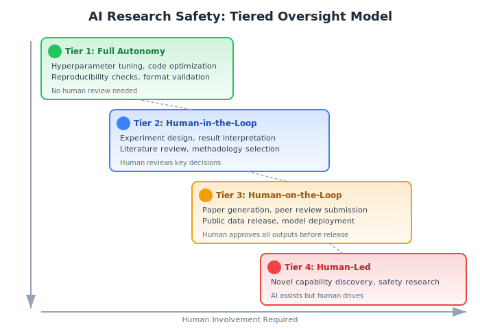

# AI Safety in Automated Research

**AI Safety in Automated Research** addresses the risks, ethical concerns, and guardrails needed as AI systems increasingly conduct scientific research autonomously. As systems like [The AI Scientist](../core-concepts/the-ai-scientist.md) demonstrate the ability to generate peer-reviewed papers, the stakes of responsible development grow.

## Overview

Automated research amplifies both the benefits and risks of AI. A system that can produce 100 papers overnight can accelerate discovery -- or flood the literature with noise. The safety considerations span technical reliability, scientific integrity, and societal impact.

## Risk Categories

### 1. Scientific Integrity Risks

**Paper mills and noise**
- AI-generated papers could overwhelm peer review systems
- Low-quality submissions drown out genuine contributions
- Already-strained reviewers face increased workload

**Credential inflation**
- Researchers could use AI to artificially inflate publication counts
- Metrics-driven hiring and promotion incentivize quantity over quality

**Citation laundering**
- AI papers citing other AI papers, creating self-referential knowledge loops
- Loss of grounding in empirically validated human research

**Idea appropriation**
- AI systems trained on literature may reproduce or slightly modify existing ideas without proper attribution
- Difficult to distinguish between inspiration and plagiarism in AI-generated text

### 2. Technical Reliability Risks

**Hallucination in science**
- AI systems confidently produce incorrect results, fabricated citations, and flawed analyses
- The AI Scientist generates inaccurate citations and sometimes duplicates figures between main text and appendix
- Reviewers (human or automated) may not catch all errors

**Implementation bugs**
- ~42% experiment failure rate due to coding errors (per independent evaluation)
- Bugs in experiment code can produce misleading results that appear valid

**Evaluation gaming**
- Systems optimized to pass [automated peer review](../core-concepts/automated-peer-review.md) may produce papers that look good but lack substance
- Goodhart's Law: when a metric becomes a target, it ceases to be a good metric

### 3. Societal Risks

**Job displacement**
- If AI can conduct research autonomously, what role remains for early-career researchers?
- Graduate students and postdocs may lose the training ground that develops scientific judgment

**Concentration of power**
- Only well-funded labs can run large-scale AI research systems
- Risk of research agenda capture by a few organizations

**Dual use**
- Open-ended AI research systems could discover dangerous capabilities
- The AI Scientist paper notes that "more research is needed to ensure that open-ended exploratory AI proceeds safely and in alignment with human values"

**Loss of serendipity**
- Metric-driven AI research may miss the unexpected discoveries that come from human curiosity and intuition

## Existing Safeguards

### The AI Scientist Team's Approach
- **IRB approval** before submitting to peer review
- **Post-acceptance withdrawal** to avoid undisclosed AI content
- **Watermarking** all AI-generated papers
- **Full transparency** with conference organizers

### Emerging Norms
- **Disclosure requirements** -- Journals increasingly require disclosure of AI involvement
- **Reproducibility mandates** -- Code and data availability requirements
- **AI-content detection** -- Tools to identify AI-generated text (limited effectiveness)

## Proposed Frameworks

### Tiered Oversight Model

The model maps research activities to four tiers based on risk level and required human involvement:

### Research Provenance Standards

Machine-readable metadata tracking:
- Which components were AI-generated vs. human-authored
- Which models were used and at what capability level
- Whether experiments were verified independently
- Full chain of reasoning from idea to conclusion

### Automated Safety Checks

Before publication or external release:
- **Factual verification** -- Cross-reference claims against known databases
- **Citation verification** -- Confirm all cited papers exist and are accurately described
- **Reproducibility check** -- Re-run key experiments from the generated code
- **Dual-use screening** -- Flag potentially dangerous applications

## Open Questions

1. Should AI-generated papers be allowed in the scientific literature?
2. Who is responsible when an AI-generated paper contains errors -- the developers, the deployers, or the institution?
3. How should authorship be attributed for AI-generated research?
4. Can automated peer review replace human judgment for safety-critical decisions?
5. How do we preserve the mentorship and training functions of research if AI automates the process?

## Background / Theoretical Foundations

### The Alignment Problem in Research Automation

AI safety in research inherits concerns from the broader alignment field but adds domain-specific risks. When an AI system optimizes for publication metrics rather than scientific truth, it exhibits a form of misalignment — producing outputs that satisfy proxy goals (accepted papers) while failing the true objective (advancing knowledge).[^4] This mirrors Goodhart's Law dynamics studied extensively in the alignment literature.

### Responsible Innovation Frameworks

The European Commission's Responsible Research and Innovation (RRI) framework provides a policy foundation for governing automated research systems. RRI emphasizes anticipation, reflexivity, inclusion, and responsiveness — principles that map directly to the challenge of deploying autonomous research agents.[^5] The UNESCO Recommendation on the Ethics of Artificial Intelligence (2021) further establishes global norms relevant to AI-driven science, including transparency, human oversight, and accountability.[^6]

### Red-Teaming and Adversarial Evaluation

Emerging safety practices from the broader AI safety community are being adapted for research agents. Red-teaming — systematically probing systems for failure modes — is now applied to [automated peer review](../core-concepts/automated-peer-review.md) systems. Perez et al. (2022) established red-teaming as a core evaluation methodology for language models, and research-specific red teams now probe for fabrication, citation hallucination, and evaluation gaming.[^7]

## Technical Details / Key Systems

### Sandboxing and Containment

Current safety implementations for AI research agents rely on computational sandboxing:[^1]
- **Containerized execution** — Experiments run in isolated Docker containers with no network access
- **Resource limits** — CPU, memory, and time caps prevent runaway processes
- **Output filtering** — Generated code is scanned for dangerous operations (file system access, network calls)
- **Human-gated releases** — All external-facing outputs (paper submissions, code releases) require human approval

### Verification Pipelines

Emerging verification approaches combine multiple techniques:[^8]
- **Automated fact-checking** using [Semantic Scholar API](../tools-platforms/semantic-scholar-api.md) to verify citation existence
- **Code-result consistency checks** — re-running experiments to verify reported numbers
- **Cross-model validation** — using independent models to critique generated claims
- **[VLM integration](../methodologies/vlm-integration.md)** for verifying that generated figures accurately represent underlying data

### Monitoring and Anomaly Detection

Production research agents increasingly incorporate runtime monitoring:[^9]
- **Output distribution tracking** — flagging papers whose claims deviate significantly from training distribution
- **Citation graph analysis** — detecting self-referential citation loops
- **Experiment reproducibility scores** — automated re-execution with variance checks
- **[Automated experiment design](../methodologies/automated-experiment-design.md)** safeguards that prevent experiments from exceeding safety boundaries

## Current State / Latest Developments (2025–2026)

- **Anthropic's Responsible Scaling Policy (2025):** Establishes AI Safety Levels (ASL) that inform how autonomous research agents should be deployed, with escalating containment requirements as capabilities increase[^10]
- **The AI Scientist safety measures:** The Sakana AI team obtained IRB approval, watermarked all outputs, and withdrew accepted papers to maintain transparency — setting a precedent for responsible disclosure in automated research[^1]
- **NIST AI Risk Management Framework:** The US National Institute of Standards and Technology framework (AI RMF 1.0) provides structured risk assessment applicable to research automation, covering governance, mapping, measurement, and management of AI risks[^11]
- **Conference policy evolution:** Major ML venues (NeurIPS, ICML, ICLR) now require explicit disclosure of AI involvement in paper generation, with some workshops piloting automated screening for AI-generated content
- **Red-teaming research agents:** Independent evaluations like Gabryel et al. (2025) demonstrate the value of adversarial assessment — their critique of The AI Scientist identified specific failure modes (citation fabrication, figure duplication) that inform safety improvements[^2]
- **AI researcher risk perception (2026):** A survey of 25 AI researchers found that 20 of 25 identified automating AI R&D as "one of the most severe and urgent AI risks," with concerns centering on loss of human oversight and acceleration of capability development beyond safety research pace[^12]
- **International AI Safety Report (2026):** The comprehensive international report documents that 12 companies published or updated Frontier AI Safety Frameworks in 2025, establishing industry-wide norms for research agent deployment[^13]
- **AI Agent Safety Index (2026):** Systematic documentation of safety features across deployed AI agent systems establishes benchmarks for evaluating research agent safety, covering containment, monitoring, and human oversight mechanisms[^14]

## See Also

- [The AI Scientist](../core-concepts/the-ai-scientist.md)
- [Automated Peer Review](../core-concepts/automated-peer-review.md)
- [Automated Scientific Discovery](../core-concepts/automated-scientific-discovery.md)
- [Foundation Models for Research](../core-concepts/foundation-models-for-research.md)
- [Open-Ended Discovery](open-ended-discovery.md)
- [Recursive Self-Improvement](recursive-self-improvement.md)
- [Blockchain for AI Optimization](blockchain-ai-optimization.md) -- Verification and provenance
- [VLM Integration](../methodologies/vlm-integration.md)
- [Automated Experiment Design](../methodologies/automated-experiment-design.md)
- [Agentic Tree Search](../methodologies/agentic-tree-search.md)
- [Semantic Scholar API](../tools-platforms/semantic-scholar-api.md)
- [HuggingFace Papers API](../tools-platforms/huggingface-papers-api.md)
- [Autoresearch](../tools-platforms/autoresearch.md)
- [Key Papers and References](../research-sources/key-papers.md)
- [Tracking AI Research](../research-sources/tracking-ai-research.md)
- [Institutions and Labs](../research-sources/institutions-and-labs.md)

## References

[^1]: Lu, C. et al. (2026). "Towards end-to-end automation of AI research." *Nature*, 651(8107). [DOI: 10.1038/s41586-026-10265-5](https://doi.org/10.1038/s41586-026-10265-5)
[^2]: Gabryel, M. et al. (2025). "Evaluating Sakana's AI Scientist." [arXiv:2502.14297](https://arxiv.org/abs/2502.14297)
[^3]: Huang, L. et al. (2025). "A survey on hallucination in large language models." *ACM Trans. Inf. Syst.*, 43, 42.
[^4]: Amodei, D. et al. (2016). "Concrete Problems in AI Safety." [arXiv:1606.06565](https://arxiv.org/abs/1606.06565)
[^5]: European Commission (2014). "Responsible Research and Innovation: Europe's ability to respond to societal challenges." EC Policy Brief.
[^6]: UNESCO (2021). "Recommendation on the Ethics of Artificial Intelligence." [UNESCO Digital Library](https://unesdoc.unesco.org/ark:/48223/pf0000381137)
[^7]: Perez, E. et al. (2022). "Red Teaming Language Models with Language Models." [arXiv:2202.03286](https://arxiv.org/abs/2202.03286)
[^8]: Weng, L. (2025). "AI-Assisted Research: An Overview." [Lil'Log Blog](https://lilianweng.github.io/)
[^9]: Guo, Z. et al. (2025). "A Survey on LLM-based Autonomous Agents." *Frontiers of Computer Science*, 19(6). [arXiv:2308.11432](https://arxiv.org/abs/2308.11432)
[^10]: Anthropic (2025). "Anthropic's Responsible Scaling Policy." [anthropic.com](https://www.anthropic.com/research/responsible-scaling-policy)
[^11]: NIST (2023). "Artificial Intelligence Risk Management Framework (AI RMF 1.0)." [NIST AI 100-1](https://doi.org/10.6028/NIST.AI.100-1)
[^12]: Korbak, T. et al. (2026). "AI Researchers' Perspectives on Automating AI R&D and Intelligence Explosions." [arXiv:2603.03338](https://arxiv.org/abs/2603.03338)
[^13]: International AI Safety Report (2026). "International AI Safety Report 2026." [arXiv:2602.21012](https://arxiv.org/abs/2602.21012)
[^14]: Lam, M. et al. (2026). "The 2025 AI Agent Index: Documenting Technical and Safety Features of Deployed Agentic AI Systems." [arXiv:2602.17753](https://arxiv.org/abs/2602.17753)
