# Cross-Cutting Connections: Simulation, Recursion, and Commerce

## Overview

This article maps the deep structural connections between three emerging research areas -- [predictive simulation learning](predictive-simulation-learning.md), [recursive self-improvement](recursive-self-improvement.md), and [AI for e-commerce learning](ai-ecommerce-learning.md) -- and explains how they collectively advance the use of AI to improve real-world learning. Rather than treating these as isolated fields, the article identifies over 70 specific connections showing how simulation, recursion, and commerce form a mutually reinforcing triad: simulation provides safe environments for recursive improvement, recursion makes both simulation and commerce systems better over time, and commerce supplies the fast feedback loops and economic incentives that validate advances in the other two. The practical implication is a new generation of AI-assisted learning systems that can teach any subject more effectively by combining predictive practice, self-improving tutoring, and personalized content delivery.

## Background / Theoretical Foundations

The connections documented here arise from a shared computational substrate: the **predict → act → observe → update** loop. Each of the three research areas implements this loop differently (world model prediction vs. self-modification vs. recommendation), but the mathematical structure is the same -- a partially observable decision process where an agent reduces uncertainty through interaction. The key technical mechanisms bridging the three areas include: (1) world models as sandbox environments for safe recursive improvement, (2) self-distillation as a domain-agnostic improvement operator, (3) multi-agent architectures that combine specialized simulation, recursion, and commerce agents, and (4) scaffolded withdrawal as the universal design pattern for building lasting capability rather than dependency.

### The Foresight Gap: Why Integration Is Harder Than It Looks

A critical empirical finding from January 2026 reveals that simply *having* a world model and *using* it effectively are very different things. Qian et al. (2026) tested whether vision-language model agents could leverage generative world models as external simulators for planning.[^87] The results expose a "foresight gap" that applies across all three domains:

- **Underutilization:** Agents invoke simulation in fewer than 1% of situations where it would be beneficial
- **Misapplication:** ~15% of the time, agents misuse predicted outcomes when simulations are generated
- **Performance degradation:** Results occasionally worsen (up to 5%) when simulation tools are available or mandatory

The bottleneck is not the quality of the world model but the agent's **metacognitive capacity** to decide *when* to simulate, *how* to interpret predicted outcomes, and *how* to integrate foresight into downstream reasoning. This finding has direct implications for the cross-cutting framework:

| Domain | Foresight Gap Manifestation | Mitigation Strategy |
|--------|---------------------------|---------------------|
| **Simulation** | Agents with access to world models still plan naively | Train agents on *when to simulate*, not just *how to simulate* ([Imagine-then-Plan](https://arxiv.org/abs/2601.08955), Guo et al., 2026) |
| **Recursion** | Self-improving agents don't test modifications in sandbox before deploying | Embed simulation-verified recursion as a mandatory step ([Connection 1](#connection-1-simulation-enables-safe-recursion)) |
| **Commerce** | Shopping agents with demand forecast models still make impulsive recommendations | Design agentic commerce workflows that *require* simulation before action ([Solicit-Then-Suggest](#connection-8-information-gain-as-the-universal-learning-currency)) |

This gap explains why the theoretical promise of the unified predict-act-observe-update loop (below) often fails in practice: the loop requires metacognitive orchestration, not just component capability. The ICLR 2026 Workshop on Recursive Self-Improvement identifies this orchestration as a key open problem.[^71]

## Technical Details

## The Unified Learning Loop

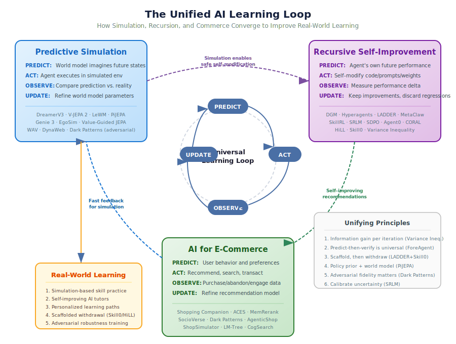

*Diagram: The three research areas -- predictive simulation, recursive self-improvement, and AI for e-commerce -- share the same predict-act-observe-update loop. Advances in one domain transfer to the others, and all three converge on improving real-world learning. Key unifying principles (right) emerged from April 2026 research.*

All three areas share a common structure: **predict → act → observe → update → repeat**. What differs is the domain and what gets updated:

| Area | What is predicted | What is updated | Feedback signal |
|------|-------------------|-----------------|-----------------|
| Predictive simulation | Future environment states | World model parameters | Prediction error |
| Recursive self-improvement | Agent's own future performance | Agent code/prompts/weights | Task performance delta |
| E-commerce AI | User behavior and preferences | Recommendation model | Purchase/engagement data |

This shared loop means advances in one area often transfer to the others. A better world model architecture from robotics research can improve demand forecasting in e-commerce; a recursive self-improvement technique from coding agents can make shopping assistants that evolve their recommendation strategies.

## Connection 1: Simulation Enables Safe Recursion

Recursive self-improvement is powerful but risky -- a self-modifying agent could degrade its own capabilities. Predictive simulation provides a safety mechanism: the agent can **simulate the effects of a proposed self-modification** before committing to it.

**Example chain:**
1. A shopping agent considers modifying its recommendation algorithm (recursive improvement)
2. It simulates how the new algorithm would perform on historical user data (predictive simulation)
3. Only if simulated performance improves does it deploy the change (verified recursion)

This pattern appears in the Darwin Godel Machine (Zhang et al., 2025)[^1], where agent variants are evaluated in sandbox environments before replacing the current version.

## Connection 2: E-Commerce as a Natural Lab for AI Learning

E-commerce provides an ideal environment for studying AI learning because:

- **Fast feedback loops** -- Unlike scientific research (months for peer review) or robotics (physical constraints), e-commerce offers near-instant behavioral feedback
- **Rich data** -- Every click, search, and purchase is logged
- **Clear metrics** -- Revenue, conversion rate, and customer satisfaction are measurable
- **High stakes** -- Real economic consequences incentivize robust methods

This makes e-commerce a natural testbed for both predictive simulation (demand forecasting, customer journey modeling) and recursive self-improvement (recommendation systems that learn from each interaction).

## Connection 3: Scaffolded Learning Across Domains

The LADDER framework (Simonds & Yoshiyama, 2025)[^2] -- which recursively generates simpler problem variants to build toward mastery -- has analogues in both simulation and commerce:

- **In simulation:** Curriculum learning in ZeroSearch (Sun et al., 2025)[^3] gradually increases search difficulty, mirroring scaffolded instruction
- **In e-commerce:** Adaptive switching (Saini et al., 2026)[^4] adjusts recommendation complexity based on user experience level -- newcomers get broad suggestions, experts get precise optimization

All three implement the same educational principle: **meet learners where they are and gradually increase challenge**.

## Connection 4: Metacognition as the Unifying Principle

Liu & van der Schaar's metacognition framework (2025)[^5] -- requiring self-awareness, planning, and evaluation -- applies across all three areas:

| Metacognitive Component | Simulation | Recursion | E-Commerce |
|------------------------|------------|-----------|------------|
| **Self-knowledge** | How accurate is my world model? | What am I good/bad at? | What does this user actually want? |
| **Planning** | Which simulations to run next? | Which self-modification to try? | Which recommendation strategy to use? |
| **Evaluation** | Did my prediction match reality? | Did the modification help? | Did the user buy/engage? |

Systems that implement all three metacognitive components outperform those that don't -- whether they're predicting physics, improving code, or recommending products.

## Implications for AI-Assisted Human Learning

The convergence of these research areas points toward a new generation of educational AI:

### 1. Simulation-Based Skill Practice
World models (DreamerV3, V-JEPA 2) enable risk-free practice environments for complex skills -- from surgery to supply chain management. The learner practices in simulation, and the simulation quality recursively improves based on real-world outcomes.

### 2. Self-Improving Tutors
Recursive self-improvement techniques (DGM, Hyperagents, LADDER) can power tutoring systems that get better with every student interaction. The tutor's pedagogy evolves, not just its content knowledge.

### 3. Personalized Learning Commerce
E-commerce personalization techniques (Shopping Companion, adaptive switching) translate directly to educational content recommendation -- matching learners with the right materials at the right difficulty level.

### 4. Predictive Assessment
Rather than testing what a student knows after the fact, predictive models can simulate a student's knowledge trajectory and intervene proactively -- identifying misconceptions before they calcify.

## Connection 5: Efficient World Models Accelerate Recursive Commerce

The March 2026 release of LeWorldModel (LeWM)[^6] creates a direct bridge between all three research areas. LeWM's 48× speedup in planning (compared to foundation-model-based world models) means that the simulation-verified recursion loop described in Connection 1 becomes practical at interactive speeds:

1. An e-commerce agent proposes a new recommendation strategy (recursive improvement)
2. It simulates customer responses using a LeWM-style world model trained on purchase behavior (predictive simulation, now 48× faster)
3. It evaluates simulated outcomes and iterates (recursive loop completes in seconds, not minutes)
4. Only strategies that pass simulation testing are deployed to real users (safe recursion in commerce)

This efficiency gain is particularly significant for e-commerce, where real-time adaptation is essential -- customer behavior shifts rapidly during sales events, product launches, and seasonal changes. Previously, simulation-based evaluation was too slow for these fast cycles.

## Connection 6: Multi-Agent Architectures Unify All Three

The ProductResearch framework (Wang et al., 2026)[^7] demonstrates how multi-agent architectures naturally combine simulation, recursion, and commerce:

- **Simulation:** The User Agent simulates customer intent from behavioral histories
- **Recursion:** The Supervisor Agent iteratively refines research quality through reflective internalization
- **Commerce:** The Research Agent produces actionable product research reports

This mirrors the multi-agent Moodle ITS architecture (2026)[^8] in education, where an RL Meta-Agent dynamically orchestrates specialized tutoring agents. The structural similarity suggests a **general pattern**: complex learning tasks (whether shopping or studying) benefit from multiple specialized agents that recursively improve through simulated interactions before engaging with real users.

## Connection 7: From Agentic Commerce to Agentic Education

The Gartner prediction that 60% of brands will use agentic AI for one-to-one customer interactions by 2028 has a direct educational parallel. The same technologies powering personalized shopping (memory-augmented agents, adaptive difficulty switching, social graph recommendations) are the building blocks of next-generation adaptive tutoring:

| E-Commerce Capability | Educational Equivalent |
|----------------------|----------------------|
| Shopping Companion's preference memory | Student knowledge state tracking |
| ProductResearch's multi-agent research | Multi-perspective tutoring (explainer, questioner, evaluator) |
| Adaptive switching (cold-start → expert) | Zone of proximal development adaptation |
| Social graph recommendations | Peer learning networks and collaborative filtering for study materials |
| Genie 3 virtual storefronts | Interactive learning simulations generated from text |

This mapping is not metaphorical -- the underlying architectures are increasingly identical, differing only in training data and reward signals.

## Connection 8: Information Gain as the Universal Learning Currency

A striking convergence in March-April 2026 research is the emergence of **information gain** as a unifying principle across all three domains:

- **In recursive self-improvement:** Liu et al. (2026) prove that self-play only produces sustainable improvement when each iteration increases learnable information gain.[^11] Without this condition, self-play stagnates -- the system churns without learning.
- **In e-commerce:** Cao & Hu's Solicit-Then-Suggest model (2026) frames agentic purchasing as optimizing information about user preferences, with inquiry depth and product variety as substitute channels for reducing uncertainty.[^12]
- **In simulation:** The World Action Verifier (WAV, April 2026) exploits information asymmetry between forward prediction and inverse verification -- verification provides more learnable signal per compute unit than generation.[^13]

The mathematical structure is shared: each system must maximize the ratio of useful new information to computational cost per learning cycle. This suggests a **general law of AI learning efficiency**: systems that explicitly optimize for information gain per iteration outperform those that simply maximize iterations.

**Implication for education:** This unifying principle suggests that the quality of a learning interaction matters more than its quantity. A tutoring system should select the exercise that maximizes the student's information gain (fills the largest knowledge gap) rather than simply assigning more exercises. The GASP framework (Jana et al., 2026) operationalizes this by generating problems calibrated to the student's frontier of ability.[^14]

## Connection 9: Dreaming About Commerce -- Simulation as Training Ground for Agents

Two March 2026 systems create a direct pipeline from simulation to commerce:

1. **DynaWeb** (Ding et al., 2026) trains web agents through "dreamed" web interactions using an LLM-based world model, improving WebArena success by 4.3 percentage points.[^15]
2. **ShopSimulator** (Wang et al., 2026) provides a dedicated e-commerce simulation environment where RL-trained shopping agents substantially outperform SFT-only agents.[^16]

Together, these suggest a complete training pipeline: first pre-train agents in *imagined* web environments (DynaWeb), then fine-tune in *realistic e-commerce* simulations (ShopSimulator), and finally deploy to real platforms. Each stage provides progressively more expensive but more realistic feedback, creating a simulation curriculum that mirrors the scaffolded difficulty progression in [LADDER](recursive-self-improvement.md) and [GASP](recursive-self-improvement.md).

**Implication for education:** The same staged simulation approach could train educational AI: first in imagined tutoring scenarios, then in realistic student simulations, and finally with real students. Each stage reduces the cost-per-mistake while increasing realism.

## Connection 10: Compact Memory Bridges Recursion and Commerce

MemRerank (Peng et al., 2026) and MemAPO (Liang et al., 2026) independently discover the same architectural principle: **compact, distilled memory outperforms raw history replay** for both product recommendation and prompt optimization.

- MemRerank distills purchase histories into query-independent preference signals (10.6pp accuracy gain)
- MemAPO distills reasoning trajectories into reusable strategy templates (57.2% cost reduction)

Both systems maintain dual memory (success patterns + failure patterns) and both improve through recursive refinement of these memories. This convergence suggests that effective learning -- whether commercial or cognitive -- requires forming abstractions from experience rather than memorizing episodes.

**Implication for education:** Students who form abstract principles from practice problems ("I see the pattern: when X, apply Y") outperform those who memorize specific solutions. AI tutoring systems should help students build these abstractions explicitly, perhaps by maintaining visible "strategy libraries" that grow and refine with practice.

## Connection 11: Self-Distillation Bridges All Three Domains

Two April 2026 papers independently discover that combining self-teaching with external verification produces better learning than either alone:

- **SDPO** (Hübotter et al., 2026) uses the model's ability to retrospectively identify its own mistakes as a dense self-teaching signal, achieving 4× faster convergence on competitive programming.[^17]
- **Self-Distilled RLVR** (Yang et al., 2026) shows that pure self-distillation creates information leakage, and combining it with verified rewards produces stable, superior training.[^18]

This self-distillation + verification pattern maps across all three domains:

| Domain | Self-Distillation (Internal Signal) | Verification (External Signal) |
|--------|-------------------------------------|-------------------------------|
| **Simulation** | World model predicts next state | Real observation corrects prediction |
| **Recursion** | Agent identifies own errors in-context | Benchmark/test verifies improvement |
| **Commerce** | Agent infers user preferences from history | Purchase/abandon signal confirms |

The implication: optimal learning in any domain requires both introspective self-assessment and external ground truth. Systems that rely only on self-assessment drift (information leakage); systems that rely only on external rewards learn slowly (sparse signal). The combination is strictly superior.

**For education:** This validates the "study-then-test" cycle. A student who reviews their own reasoning (self-distillation) and then checks against correct answers (verification) learns faster than one who only does either. AI tutors should structure interactions to include both phases -- self-explanation followed by targeted feedback.

## Connection 12: Overtraining + Test-Time Compute Redefines the Learning Budget

Roberts et al.'s T² scaling laws (April 2026) reveal that when you account for both training and inference costs, the optimal strategy is to **overtrain on fundamentals and invest more compute at test time**.[^19] This finding reshapes how we think about resource allocation across all three domains:

- **In simulation:** Overtrain the world model on diverse environments (more training data than "optimal"), then invest more compute in planning at deployment. VLA-MBPO's branched rollout[^20] is exactly this -- overlearned dynamics + careful test-time exploration.
- **In recursion:** Build deeply overlearned base capabilities, then amplify them with recursive test-time strategies (TRT, RSA). The recursive systems that achieve 100% on AIME are precisely small-ish models with massive test-time compute.
- **In commerce:** Overtrain recommendation models on broad behavioral data, then invest in real-time personalization at serving time. This explains why AIGQ's two-stage architecture (broad pre-training → focused query generation) outperforms end-to-end approaches.

### Learning Application: Overlearn Fundamentals, Then Practice Carefully

**Learning application:** T² scaling is the mathematical formalization of "drill fundamentals deeply, then practice applying them carefully." A student who over-learns basic algebra (overtraining) and then spends more time reasoning through novel word problems (test-time compute) outperforms one who splits study time "optimally" between concepts and practice.

## Connection 13: Code World Models Extend Simulation to Software Domains

The InCoder-32B-Thinking code world model (Yang et al., April 2026) extends predictive simulation from physical environments into the domain of software execution.[^21] This creates a new bridge between simulation-based learning and recursive self-improvement:

- **Simulation → Code:** The ICWM predicts compilation and execution outcomes before running code, just as DreamerV3 predicts physical dynamics before acting
- **Recursion → Code:** A self-improving coding agent can use code world models to evaluate proposed code changes in "imagination" before committing them -- the same simulation-verified recursion pattern from Connection 1, applied to software
- **Commerce → Code:** E-commerce platforms built on complex software stacks (recommendation engines, search systems, payment flows) can use code world models to predict the impact of software changes before deployment, reducing outage risk

This connects to AgenticRS-Architecture's AutoTrain agent, which reproduces and evaluates models from research papers. A code world model could predict whether a proposed model architecture will train successfully before allocating expensive GPU resources -- saving both time and compute.

**For education:** Code world models are a natural teaching tool. Students learning to program could receive instant predictive feedback ("this loop will cause an infinite recursion because...") without waiting for compilation. This transforms programming education from a trial-and-error process into a predict-and-verify process, building deeper causal understanding of how code behaves.

## Connection 14: From Skill Chunking to Compositional Learning

SkillRL's recursive skill discovery (Chojecki et al., 2026) and RWML's self-supervised world modeling (Yu et al., 2026) reveal a shared pattern: **learning becomes more efficient when organized hierarchically**.[^22]

- SkillRL decomposes behavior into reusable skills and recursively composes them
- RWML builds environment understanding through semantic prediction rather than token-level matching
- AgenticRS-Architecture decomposes the recommendation lifecycle into specialized agents (AutoTrain, AutoFeature, AutoPerf)

All three discover that breaking complex tasks into meaningful units and then composing those units yields better learning than end-to-end optimization. This mirrors a foundational principle in education: chunking -- where novices learn individual concepts, then compose them into procedures, then compose procedures into strategies.

**For education:** An AI tutoring system should explicitly teach at multiple levels of abstraction simultaneously. Rather than only drilling individual facts or only teaching high-level strategies, the most effective approach (as demonstrated by these systems) is to recursively build from atomic skills to composed competencies, with the composition itself being a learnable skill.

## Connection 15: Closing the Loop -- LLM Tutors That Optimize for Learning Outcomes

Scarlatos et al. (AIED 2025) demonstrate that LLM-based tutors can be trained to maximize *student learning outcomes* rather than just fluency or pedagogical appearance.[^23] This result connects all three domains:

- **Simulation:** The tutor uses an LLM-based student model to *simulate* how a student will respond to each candidate tutoring utterance -- predictive simulation applied to education
- **Recursion:** The generate → evaluate → optimize loop is recursive self-improvement applied to teaching effectiveness
- **Commerce:** The preference optimization training (DPO) is architecturally identical to how recommendation systems learn from implicit feedback -- the student's correctness signal plays the role of the purchase signal

This paper is the most direct evidence that the converging research threads tracked in this wiki -- world models, recursive improvement, and agentic learning -- can be unified into systems that measurably improve human learning. The optimized tutor doesn't just *know* more; it causes students to *learn* more, which is the ultimate goal of AI-assisted education.

## Connection 16: Imagination as a Universal Self-Improvement Mechanism

A striking April 2026 convergence: multiple independent research groups discover that **learning through imagination** -- generating simulated experiences and training on them -- outperforms learning from real experience alone, across very different domains.

- **In robotics:** RISE (Yang et al., 2026) improves robot policies by +35-45% through imagined rollouts in a compositional world model, without additional physical trials.[^24] The robot "imagines" diverse manipulation scenarios and learns from them.
- **In traffic simulation:** AutoWorld (Pourkeshavatz et al., 2026) trains world models from unlabeled LiDAR data and achieves first place on the WOSAC realism benchmark through self-supervised imagination.[^25]
- **In coding:** SICA (Robeyns et al., 2025) improves from 17% to 53% on SWE-bench by "imagining" code changes through LLM reflection before committing edits.[^26]
- **In commerce:** DynaWeb trains shopping agents through "dreamed" web interactions,[^15] and ShopSimulator provides imagined storefronts for RL training.[^16]

The shared principle: **imagination reduces the cost-per-learning-cycle by orders of magnitude**. Physical robot trials, real website interactions, and live code execution are expensive; imagined equivalents are cheap. This cost reduction makes recursive improvement practical -- agents can iterate thousands of times in imagination for the cost of a single real trial.

### Learning Application: Mental Rehearsal Before Action

**Learning application:** This validates the pedagogical power of mental rehearsal and thought experiments. A student who "imagines" solving a problem before attempting it (visualization, prediction, planning) learns more efficiently than one who jumps straight to execution. AI tutoring systems should explicitly incorporate imagination phases -- "what do you think will happen?" -- before action phases, mirroring how RISE, AutoWorld, and SICA achieve their gains.

## Connection 17: Memory Architecture as the Bridge Between Session and Lifetime Learning

Three April 2026 systems independently converge on hierarchical memory as the key to persistent personalization:

- **HMO** (Liu et al., 2026) organizes agent memory into three tiers (primary cache, secondary priority, global archive) driven by an evolving user persona.[^27]
- **MemRerank** (Peng et al., 2026) distills purchase history into compact preference signals.[^7]
- **MemAPO** (Liang et al., 2026) maintains dual memory of success strategies and error patterns for prompt optimization.[^12]

These represent points on a spectrum from compact (MemRerank) to structured (MemAPO) to hierarchical (HMO). The common insight: raw interaction history is too noisy for effective learning; what matters is the **abstraction** -- compact representations that capture patterns rather than episodes.

This connects to a fundamental distinction in learning science: episodic memory (remembering specific events) vs. semantic memory (understanding concepts). All three systems effectively convert episodic memories into semantic knowledge -- and all three show that this conversion is what enables transfer and generalization.

**For education:** The most effective learning tools should help students convert their practice episodes into reusable conceptual knowledge. A tutoring system that says "you've solved 47 problems" (episodic) is less effective than one that says "you've mastered the chain rule but struggle with integration by parts" (semantic). HMO's persona-driven redistribution suggests that the right abstraction changes as the learner develops -- early learners need different memory structures than advanced ones.

## Connection 18: Synthetic Environments as Universal Training Grounds

A convergence across April 2026 research reveals that **programmatically generated synthetic environments** are replacing both hand-crafted simulations and LLM-hallucinated worlds as the preferred training substrate:

- **Agent World Model (AWM)** (Wang et al., 2026) generates 1,000 code-driven environments with databases, averaging 35 tools each, for general agent training.[^28]
- **ShopSimulator** (Wang et al., 2026) provides a dedicated e-commerce simulation for shopping agent RL training.[^16]
- **DynaWeb** (Ding et al., 2026) creates "dreamed" web environments via LLM-based world models.[^15]
- **Simulating Novice Students** (Song et al., 2026) uses machine unlearning to create synthetic novice learners for teaching practice.[^29]

The shared trajectory: training environments are becoming *auto-generated, domain-specific, and verifiable*. AWM's code-driven approach with database-backed state ensures reliable cause-and-effect (unlike pure LLM simulation), while ShopSimulator and DynaWeb specialize this for commerce and web tasks respectively. Song et al. extend the principle to education -- the "environment" being simulated is a student's knowledge state.

**For education:** This convergence suggests that the next generation of educational simulations won't be hand-crafted by instructional designers. Instead, AI will generate diverse, reliable practice environments on demand: simulated patients for medical students (with database-backed physiological states), simulated businesses for MBA students (with consistent financial models), and simulated novice peers for learning-by-teaching exercises. The key insight from AWM is that code-driven environments with accessible state are superior to LLM-simulated environments for learning -- because learners need consistent cause-and-effect, not plausible-sounding but inconsistent responses.

## Connection 19: Scaffolded Withdrawal as a Universal Learning Principle

Three independent systems converge on the same learning principle from different directions: **the best way to build autonomous competence is to progressively remove support**:

- **Skill0** (Lu et al., 2026) starts with full skill descriptions and progressively withdraws them as the agent internalizes capabilities, using on-policy evaluation to decide what to remove.[^30]
- **LADDER** (Simonds & Yoshiyama, 2025) recursively generates simpler problem variants to build toward mastery of hard problems -- progressive difficulty *addition* as the complement of progressive support *removal*.[^2]
- **GASP** (Jana et al., 2026) generates problems calibrated to the learner's frontier, gradually closing the gap to target difficulty -- controlled challenge *increase*.[^14]

Together, these define a complete scaffolding theory with three operations:
1. **Add support, then remove it** (Skill0): start with training wheels, take them off
2. **Reduce difficulty, then increase it** (LADDER): start easy, build toward hard
3. **Calibrate to the frontier** (GASP): always work at the edge of current ability

The three operations are complementary and can be combined: a tutoring system could simultaneously reduce problem difficulty (LADDER), provide skill scaffolds (Skill0), and calibrate both to the learner's zone of proximal development (GASP). This triple-scaffolding approach has no direct analogue in current educational AI but is fully supported by the underlying architectures.

**For education:** Vygotsky's zone of proximal development (ZPD) is now computationally implementable through three independent mechanisms. An AI tutor could use LADDER to generate problems at the right difficulty, Skill0's withdrawal mechanism to fade hints and scaffolds, and GASP's calibration to ensure the learner is always working productively at their frontier. The recursive nature of all three (evaluate → adjust → evaluate again) means the scaffolding continuously adapts as the learner grows.

## Connection 20: The Complete Scaffolding Stack -- From Hints to Simulation

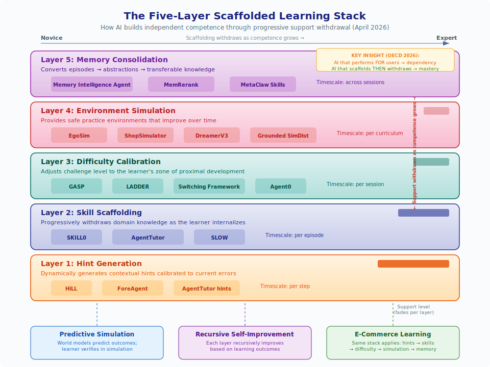

*Diagram: The five-layer scaffolded learning stack showing how AI builds independent competence through progressive support withdrawal. Each layer operates on a different timescale and fades as the learner internalizes capability. The same architecture applies across predictive simulation, recursive self-improvement, and e-commerce learning.*

April 2026 research completes a five-layer scaffolding architecture that spans all three domains:

1. **Hint layer** (HiLL, Xia et al., 2026): Dynamically generates contextual hints calibrated to current errors, with measurable "hint reliance" that decreases as competence grows.[^31]
2. **Skill layer** (Skill0, Lu et al., 2026): Progressively withdraws skill context as the agent internalizes capabilities.[^30]
3. **Difficulty layer** (GASP + LADDER): Calibrates problem difficulty to the learner's frontier.[^14]
4. **Environment layer** (EgoSim, Hao et al., 2026): Provides first-person simulated environments for practice.[^32]

Each layer operates on a different timescale: hints change per-step, skills fade per-episode, difficulty adjusts per-session, and environments evolve per-curriculum. Together they form a complete adaptive learning stack that mirrors how human expertise develops -- from receiving hints on individual steps, through internalizing procedures, to tackling harder challenges, to practicing in diverse environments.

**The cross-domain bridge:** This stack applies identically to commerce and education:
- A shopping agent learning to navigate e-commerce receives hints on individual actions (HiLL), internalizes shopping procedures (Skill0), faces progressively complex shopping tasks (GASP), and practices in simulated storefronts (ShopSimulator)
- A medical student receives hints during diagnosis (HiLL), internalizes diagnostic procedures (Skill0), faces progressively complex cases (LADDER), and practices in first-person patient simulations (EgoSim)

## Connection 21: Population-Based Improvement Outperforms Individual Recursion

CORAL (Qu et al., 2026) achieves 3-10× higher improvement rates through multi-agent collaborative evolution compared to single-agent recursive systems.[^33] This finding reshapes the landscape across all three domains:

- **In recursion:** The DGM/Hyperagent paradigm (single agent modifying itself) is superseded by populations of agents that share discoveries through persistent memory. The improvement comes not from better individual iteration but from diversity of approaches and knowledge transfer.
- **In simulation:** Multiple world models trained from different perspectives (Social-JEPA's independently trained agents developing compatible representations) suggests that ensemble world models may produce better predictions than any single model.
- **In commerce:** Multi-agent recommender architectures (AgenticRS-Architecture, Multi-Agent Video Recommenders) already implement this pattern -- specialized agents that independently improve and share insights.

**For education:** This validates collaborative learning at a fundamental level. A classroom of students who share insights outperforms a single student studying 3-10× longer. AI tutoring systems should facilitate structured knowledge-sharing between independent learning threads rather than optimizing a single learning pathway.

## Connection 22: AI Literacy as a Prerequisite for AI-Mediated Commerce

LLMimic (Fan et al., 2026) shows that humans who understand how LLMs work become measurably less susceptible to AI persuasion (p<0.05) and more truthful in recommendation scenarios.[^34] This creates a direct link between recursive self-improvement research and e-commerce consumer protection:

- Consumers who understand [position bias in AI shopping agents](ai-ecommerce-learning.md#aces-auditing-ai-shopping-agent-behavior) (ACES) can critically evaluate AI recommendations
- Understanding [self-distillation](recursive-self-improvement.md#self-distillation-policy-optimization-sdpo-learning-from-your-own-mistakes) helps consumers recognize when AI systems are optimizing for engagement rather than satisfaction
- Knowledge of [recursive improvement loops](recursive-self-improvement.md) reveals how recommendation systems evolve to exploit behavioral patterns

This suggests that AI literacy education is not just a nice-to-have but a practical necessity for participating in AI-mediated commerce. The recursive connection: teaching people about AI makes them better at interacting with AI, which generates better training data for AI systems, which produces better AI.

## Connection 23: The Variance Inequality Unifies All Three Domains

Chojecki's GVU (Generator-Verifier-Updater) operator theory (December 2025) provides the first mathematical framework that unifies self-improvement across simulation, recursion, and commerce.[^35] The Variance Inequality states that self-improvement is stable only when the combined signal from generation and verification exceeds noise and curvature -- and critically, that **strengthening the verifier** is more effective than strengthening the generator.

Formally, for a system with generator $G$ and verifier $V$ operating on parameter space $\theta$, the Variance Inequality states that self-improvement is stable when:

$$\text{Var}[V(\theta)] + \text{Cov}[G(\theta), V(\theta)] > \text{Noise}(\theta) + \kappa \cdot \text{Curv}(\theta)$$

where $\kappa$ is a curvature constant reflecting the complexity of the loss landscape.[^35] The critical insight is the asymmetry: strengthening $V$ (the verifier) simultaneously reduces noise *and* increases the useful covariance term, while strengthening $G$ (the generator) alone increases variance without necessarily increasing signal. This explains why verification-heavy approaches (RLVR, test-driven development, A/B testing) consistently outperform generation-heavy approaches (more training data, larger models, more recommendations) across all three domains.

This principle manifests identically across all three domains:

| Domain | Generator $G$ | Verifier $V$ | Variance Inequality Applied |
|--------|-----------|----------|----------------------------|
| **Simulation** | World model predicts next state | Real observation checks prediction | Simulation quality improves faster by improving observation accuracy than prediction fidelity |
| **Recursion** | Agent generates improved code/prompts | Benchmark evaluates improvement | Invest in better evaluation, not just more generation attempts |
| **Commerce** | Recommendation system suggests products | Purchase/abandon signal verifies | Better conversion tracking outperforms better recommendation algorithms |

The practical implication is quantifiable: RSIR (Zhang et al., 2026) shows that adding fidelity-controlled verification to a recursive recommendation loop acts as an implicit regularizer -- the verifier's rejection of low-fidelity synthetic data prevents the generator from drifting, exactly as the inequality predicts.[^52] Similarly, WAV's (April 2026) forward-inverse asymmetry exploits the fact that inverse verification provides more learnable signal per compute unit than forward generation -- the verifier side of the inequality dominates.[^13]

The "Second Law of AGI Dynamics" -- that entropy (hallucination) increases unless verification signal dominates noise -- explains why [recommendation systems drift](ai-ecommerce-learning.md#cross-cutting-themes), why [world models accumulate compounding errors](predictive-simulation-learning.md#challenges), and why [self-play stagnates](recursive-self-improvement.md#when-does-self-play-actually-work). The solution in all three cases is the same: strengthen the verification loop.

### Learning Application: Verification Before Generation

**Learning application:** This provides a theoretical basis for formative assessment. Students who generate answers without checking them (weak verifier) will not improve. The Variance Inequality prescribes the remedy: teach verification skills (self-checking, peer review, test-driven development) before investing in generative capacity (more practice problems).

## Connection 24: Social World Models Bridge Simulation and Commerce

SocioVerse (Zhang et al., April 2026) introduces *social* world models -- predicting how populations of people respond to events, policies, and market changes -- powered by 10 million real-world user profiles.[^36] This creates a new class of connection between simulation and commerce:

- **Simulation → Commerce:** Instead of simulating physics or game mechanics, SocioVerse simulates *consumer behavior at population scale*. A retailer can "imagine" market reactions to a new product before launching it, exactly as DreamerV3 imagines physical consequences before acting.
- **Commerce → Education:** Business students can test market hypotheses against demographically calibrated populations, receiving realistic feedback on strategies that would take months and millions of dollars to test in the real world.
- **Recursion → Social Simulation:** The social world model itself can be recursively improved by comparing simulated predictions with actual market outcomes, creating a self-correcting market intelligence system.

This fills a gap identified in previous connections: [DynaWeb](#connection-9-dreaming-about-commerce----simulation-as-training-ground-for-agents) and [ShopSimulator](#connection-9-dreaming-about-commerce----simulation-as-training-ground-for-agents) simulate individual shopping interactions, but SocioVerse simulates *market-level* responses -- moving from micro to macro simulation.

## Connection 25: Empirical Validation -- The RCT Evidence

Kestin et al.'s RCT (Scientific Reports, 2025) provides the first rigorous causal evidence that the predict-verify-adapt learning loop -- the common structure underlying all three research areas -- produces measurably superior learning outcomes (0.73--1.3 SD effect size) compared to traditional active learning.[^37]

This result validates the entire theoretical framework of this wiki:

1. **Simulation works for learning:** Students using the AI tutor (which simulates personalized problem sequences) outperformed those in active learning classrooms
2. **Recursion works for teaching:** The AI tutor's effectiveness comes from its ability to adapt instruction based on each student's responses -- a recursive improvement loop
3. **Fast feedback loops (the commerce model) drive learning:** The AI tutor provides instant feedback, mirroring the tight feedback loops that make e-commerce AI effective

The 70% improvement in completion rates and 15% reduction in dropout suggest that the engagement benefits of personalized simulation-based learning are as important as the cognitive benefits.

## Connection 26: Metric Validity Bridges Evaluation Across All Three Domains

Two independent April 2026 findings reveal that **the metrics we optimize for often diverge from the outcomes we actually want**, and this divergence is predictable:

- **In commerce:** Chen et al.'s Criterion Validity study (2026) shows that LLM-as-judge dialogue quality scores have unequal predictive value for actual business conversion -- some evaluation dimensions predict outcomes, others don't, and equally-weighted composites underperform their strongest components.[^38]
- **In recursion:** Xu et al.'s Metric Freedom study (2026) shows that whether skill distillation helps or hurts depends entirely on the evaluation metric, not the task -- "rigid" metrics (low Metric Freedom) benefit from distillation, while "free" metrics do not.[^39]

Together, these results formalize a problem that spans all three domains:

| Domain | Metric Used | Actual Goal | The Gap |
|--------|------------|-------------|---------|
| **Commerce** | Dialogue quality rubric | Customer conversion | Some rubric dimensions predict conversion; others are noise |
| **Simulation** | Visual fidelity | Task transfer | High visual quality ≠ accurate dynamics ([World-in-World](predictive-simulation-learning.md#quality-of-simulation-what-actually-matters)) |
| **Recursion** | Benchmark score | Generalizable improvement | Rigid benchmarks mislead about broad capability |
| **Education** | Pedagogical rubric | Student learning gains | High-rated tutoring ≠ effective learning |

The solution in both papers is the same: **test metrics against outcomes before optimizing them**. Chen et al. call this "criterion validity testing"; Xu et al. operationalize it as "Metric Freedom" scoring. For education, this means every tutoring metric (engagement time, question quality, scaffolding appropriateness) should be validated against actual learning gains before being used as an optimization target.

This connects to the [Variance Inequality](#connection-23-the-variance-inequality-unifies-all-three-domains): strengthening the verifier requires that the verifier measures the right thing. A strong verifier with invalid metrics produces confident but misguided optimization.

## Connection 27: Full-Stack AI Self-Improvement Reaches All Three Domains

ASI-Evolve (Xu et al., March 2026) demonstrates recursive self-improvement across the entire AI development stack -- architecture design, data curation, and RL algorithm design -- with transfer to non-AI domains.[^40] This creates a new class of cross-domain connection:

- **Simulation:** ASI-Evolve could optimize world model architectures and training procedures, discovering more efficient simulation approaches than human researchers (paralleling how [Omni-SimpleMem](ai-ecommerce-learning.md#omni-simplemem-lifelong-memory-for-persistent-commerce-agents) discovered better memory architectures through automated research)
- **Recursion:** ASI-Evolve is the most general form of recursive self-improvement yet demonstrated -- it improves the *tools of improvement itself*. The DGM/Hyperagent paradigm modifies agent code; ASI-Evolve modifies the neural architectures, data pipelines, and training algorithms beneath the agent
- **Commerce:** The data curation improvements (3.96pp average) could directly enhance e-commerce recommendation model training, while RL algorithm improvements could benefit the reinforcement learning loops in [ShopSimulator](ai-ecommerce-learning.md#shopsimulator-rl-training-ground-for-shopping-agents) and [AgenticRS-Architecture](ai-ecommerce-learning.md#agenticrs-architecture-self-improving-recommender-lifecycle)

**For education:** ASI-Evolve points toward a future where educational AI platforms don't just improve their teaching -- they improve the machine learning infrastructure underlying their teaching. A tutoring platform could automatically discover better student modeling architectures, more efficient training curricula, and more effective reinforcement learning algorithms for pedagogical optimization, creating a compounding advantage that human-designed systems cannot match.

## Connection 28: Embodied World Models Complete the Observation-to-Action Pipeline

Three March-April 2026 systems create a continuous pipeline from observation to action through predictive simulation:

1. **V-JEPA 2** learns world models from watching video (observation)
2. **LOME** predicts manipulation outcomes from an egocentric viewpoint conditioned on actions (prediction)
3. **EgoSim** generates first-person interactive simulations (practice)

Together, these form a complete embodied learning cycle: observe → predict → practice → refine. This cycle mirrors the apprenticeship model of learning: a student watches a master craftsperson, develops a mental model of the physical process, practices in a safe environment, and refines through experience. The addition of LOME (action-conditioned prediction with physical realism like liquid dynamics) bridges the gap between passive observation models and interactive simulation, enabling *informed* practice where the learner can predict outcomes before acting.

**For commerce:** This pipeline applies directly to physical commerce operations -- warehouse management, retail merchandising, product quality inspection. Workers could observe expert procedures (V-JEPA 2), preview manipulation outcomes in augmented reality (LOME), and practice in simulated environments (EgoSim) before performing real operations.

## Connection 29: The Dreamer-JEPA Convergence Creates a Unified Simulation-Recursion Stack

Three March 2026 papers (Dreamer-CDP, R2-Dreamer, NE-Dreamer) independently merge the Dreamer and JEPA world model families, while SWIRL (Qiu et al., 2026) demonstrates that world models can self-improve by discovering latent actions without supervision.[^41] Together, these create a unified stack:

1. **Efficient world models** (Dreamer-JEPA): Learn environment dynamics in compact embedding space (no pixel reconstruction), training 1.59× faster
2. **Self-improving dynamics** (SWIRL): World models discover their own action representations and recursively improve through forward-inverse learning loops
3. **Dense robotic transfer** (V-JEPA 2.1): The same architecture produces representations directly useful for real-world manipulation (+20pp grasping)

This stack connects all three core domains:
- **Simulation:** Reconstruction-free world models focus compute on dynamics understanding
- **Recursion:** SWIRL's forward-inverse alternation is a self-improvement loop at the world model level -- the model recursively refines both its predictions and its action representations
- **Commerce:** Efficient world models make real-time simulation of customer behavior, supply chain dynamics, and market responses practical for commerce applications where latency matters

**For education:** The Dreamer-JEPA convergence means simulation-based learning can be both faster and more focused on what matters. A physics simulation doesn't need to render beautiful visuals (reconstruction) -- it needs to model dynamics accurately (embedding prediction). This architectural insight could halve the computational cost of educational simulations while improving their pedagogical value.

## Connection 30: Predict-Then-Verify as a Universal Learning Paradigm

ForeAgent (Zheng et al., January 2026) introduces a predict-then-verify loop for ML agents that achieves 6× convergence acceleration by predicting which solutions will work before executing them.[^42] This paradigm -- predict cheaply, verify selectively -- manifests identically across all three domains and connects directly to real-world skill learning:

| Domain | Predict (Cheap) | Verify (Selective) | Speedup |
|--------|-----------------|-------------------|---------|
| **Simulation** | World model predicts next state | Execute only promising actions | DreamerV3: 150+ tasks mastered via imagination |
| **Recursion** | Agent predicts modification outcome | Test only predicted-good modifications | ForeAgent: 6× faster convergence |
| **Commerce** | Forecast customer response to campaign | Run A/B test only on predicted winners | Foresight Learning: outperforms GPT-5 on supply chain |
| **Education** | Predict which exercise maximizes learning | Assign only the highest-gain activities | CoTutor: optimal knowledge tracing via prediction |

The unifying insight: in every domain, the cost of prediction is orders of magnitude lower than the cost of execution. A world model "imagines" physics cheaply; training runs are expensive. A student "thinks through" a problem cheaply; working through every practice problem is expensive. Systems that exploit this asymmetry learn faster.

**For education:** This provides the theoretical basis for "strategic practice" -- the well-established finding that deliberate, selective practice outperforms exhaustive practice. An AI tutor built on predict-then-verify principles would not assign the most problems; it would assign the *most informative* problems, predicting which exercise will produce the largest knowledge gain for each student. This connects the [WAV framework's](predictive-simulation-learning.md) forward-inverse asymmetry to the [Variance Inequality's](#connection-23-the-variance-inequality-unifies-all-three-domains) verification emphasis: in the predict-then-verify loop, the verification step *is* the learning signal.

## Connection 31: Guided Exploration Bridges Policy Learning and Simulation

PiJEPA (Chahe & Zhou, March 2026) and Value-Guided JEPA (Destrade et al., 2026) independently demonstrate that **combining learned policies with world model planning produces better outcomes than either alone** -- and that the way representations are structured determines planning effectiveness.[^55][^56]

This creates a three-stage learning architecture that maps across all three domains:

| Stage | Simulation | Recursion | Commerce |
|-------|-----------|-----------|----------|
| **1. Learn policy prior** | Navigation policy from demonstrations | Base LLM capabilities from pretraining | Recommendation model from behavioral data |
| **2. Structure representations** | Value-guided embedding space | Goal-oriented prompt structure | Preference-structured user profiles ([MemRerank](ai-ecommerce-learning.md)) |
| **3. Plan in world model** | MPPI planning in JEPA latent space | Recursive context management ([SRLM](recursive-self-improvement.md)) | Simulated customer response prediction ([SocioVerse](#connection-24-social-world-models-bridge-simulation-and-commerce)) |

The key insight: **undirected planning in even the best world model is inefficient** -- you need a policy prior (rough intuition about what to do) and goal-structured representations (knowledge organized by relevance) to make simulation-based learning practical.

**For education:** This formalizes the pedagogical principle of "activate prior knowledge before exploration." A student thrown into an open-ended simulation without preparation (no policy prior) will explore inefficiently. One who first develops basic competence through guided instruction (policy learning), then organizes their knowledge by goal relevance (value-guided representations), and finally explores complex scenarios (world model planning) follows the optimal learning trajectory. This three-stage pattern unifies [Skill0's](recursive-self-improvement.md) scaffolded withdrawal, [GASP's](recursive-self-improvement.md) frontier calibration, and [PiJEPA's](predictive-simulation-learning.md#pijepa-policy-guided-world-model-planning) warm-started planning into a coherent curriculum design principle.

## Connection 32: Adversarial Robustness as the Missing Dimension of Simulation Fidelity

The Dark Patterns study (Ersoy et al., IEEE S&P 2026) reveals that AI agents trained in clean environments are systematically vulnerable to manipulation -- a 41% susceptibility rate across e-commerce, streaming, and news platforms.[^57] Combined with [ClawArena's](predictive-simulation-learning.md) finding that belief revision strategy (not just revision frequency) determines performance in dynamic environments, this creates a new dimension of simulation quality:

Previous simulation quality frameworks focused on:
1. **Visual fidelity** (World-in-World benchmark)
2. **Dynamic accuracy** (action-conditioned prediction)
3. **Long-horizon consistency** (WildWorld, YC-Bench)

The dark patterns finding adds a fourth requirement:
4. **Adversarial fidelity** -- simulations must include realistic deceptive elements to train robust agents

This connects across all three domains:
- **Simulation:** World models that only predict honest environments produce fragile agents. [DynaWeb's](predictive-simulation-learning.md) dreamed web environments and [ShopSimulator's](ai-ecommerce-learning.md) e-commerce simulations should include dark patterns to produce realistic training
- **Recursion:** Self-improving agents that optimize against clean benchmarks may develop strategies that fail in adversarial real-world settings. [SAHOO's](recursive-self-improvement.md) safety guardrails should be extended to include adversarial robustness checks
- **Commerce:** Shopping agents deployed without adversarial training are a consumer protection liability. [ACES's](ai-ecommerce-learning.md) bias audit framework should be complemented by dark pattern susceptibility testing

**For education:** This has a direct and practical implication: **educational simulations that present only idealized scenarios produce students who cannot handle real-world complexity**. A business student trained on clean e-commerce simulations will fail when encountering real marketplaces with misleading reviews, fake urgency timers, and manipulative pricing. Medical students trained on textbook cases struggle with ambiguous presentations. The solution is the same in all domains: include adversarial elements in training simulations, calibrated to gradually increase in sophistication -- combining [LADDER's](recursive-self-improvement.md) progressive difficulty with adversarial content.

## Connection 33: Uncertainty-Aware Recursion Completes the Self-Improvement Stack

SRLM (Self-Reflective Program Search for Long Context, March 2026) adds uncertainty awareness to Recursive Language Models, yielding 22% improvement by leveraging self-consistency, reasoning trace length, and verbalized confidence as intrinsic quality signals.[^58] This fills a critical gap in the recursive self-improvement stack:

| Layer | System | What It Adds | Without It |
|-------|--------|-------------|-----------|
| **Generate** | RLMs, DGM, Hyperagents | Diverse candidate solutions | No candidates to evaluate |
| **Verify** | Benchmarks, RLVR, WAV | External correctness signal | Drift without ground truth |
| **Calibrate** | **SRLM** | Internal confidence estimation | Can't prioritize verification effort |

The calibration layer is the missing piece: without knowing *which* recursive outputs are uncertain, verification resources are wasted on already-correct outputs. SRLM's intrinsic signals (self-consistency, trace length, verbalized confidence) enable selective verification -- checking only the outputs the system is least sure about.

This connects to the [Variance Inequality](#connection-23-the-variance-inequality-unifies-all-three-domains): strengthening the verifier helps, but *directing* verification toward uncertain outputs helps more. SRLM operationalizes this by converting the agent's uncertainty into a verification priority signal.

**For education:** This formalizes "metacognitive monitoring" -- the ability to judge one's own understanding. Students who can accurately identify what they know vs. what they're uncertain about study more efficiently (they focus on gaps rather than reviewing mastered material). AI tutors built on SRLM principles could teach this metacognitive skill by modeling the self-reflection process explicitly: "I'm uncertain about this answer because my two approaches gave different results -- let me verify this specific step."

## Connection 34: Learning Architecture as a Cross-Domain Bridge

The A4L architecture (Goel et al., 2025) creates bidirectional feedback loops between learners, teachers, and AI agents for personalized education at scale.[^43] This architectural pattern -- multi-stakeholder feedback with shared data infrastructure -- is structurally identical to what powers the most successful systems across all three domains:

- **In simulation:** SWIRL's forward-inverse alternation creates a bidirectional loop between prediction and action discovery
- **In recursion:** CORAL's multi-agent evolution creates a bidirectional loop between individual agent improvement and collective knowledge sharing
- **In commerce:** AgenticRS-Architecture creates a bidirectional loop between AutoTrain, AutoFeature, and AutoPerf agents via a shared coordination layer

A4L generalizes this pattern: effective learning systems require not just agent-to-user feedback, but multi-stakeholder feedback where data flows between all participants. For commerce-to-education transfer, this means a shopping platform's recommendation improvements should inform educational content recommendation, and vice versa -- the underlying personalization infrastructure is shared.

## Connection 35: The OECD Scaffolding-Dependency Principle Unifies Design Across All Three Domains

The OECD Digital Education Outlook 2026 reports a Türkiye experiment that crystallizes a design principle spanning simulation, recursion, and commerce:[^44] students using standard GPT-4 improved 48% during use but performed **17% worse** after removal, while a tutoring-designed version yielded 127% improvement during use with better post-removal retention. The lesson: **AI that performs *for* the user creates dependency; AI that scaffolds *then withdraws* builds independent capability.**

This principle manifests identically across all three domains:

| Domain | Dependency-Creating Design | Scaffolding-Then-Withdrawal Design |
|--------|---------------------------|-------------------------------------|
| **Simulation** | World model that gives optimal actions directly | World model that lets learner predict, then reveals outcome ([DreamerV3](predictive-simulation-learning.md)) |
| **Recursion** | Self-improving system that replaces human judgment | System that augments human judgment and fades support ([Skill0](predictive-simulation-learning.md), [HiLL](recursive-self-improvement.md)) |
| **Commerce** | Shopping agent that just buys for the user | Agent that teaches preference articulation then automates ([Solicit-Then-Suggest](ai-ecommerce-learning.md)) |

The OECD finding also provides the first international policy-level validation that the scaffolded withdrawal architecture identified in [Connection 19](#connection-19-scaffolded-withdrawal-as-a-universal-learning-principle) is not merely theoretically sound but empirically necessary. The 17% performance degradation without scaffolded design represents the cost of violating the [Variance Inequality's](#connection-23-the-variance-inequality-unifies-all-three-domains) prescription: the students' "verifier" (their own understanding) was never strengthened because the AI did all the "generation."

**For education:** This is the strongest policy recommendation emerging from the wiki's research synthesis: every AI learning system -- whether tutoring, simulation, or commerce training -- must be evaluated on **post-withdrawal performance**, not during-use performance. An AI shopping tutor that makes students great at shopping *with* AI assistance but helpless without it has failed. The OECD evidence, combined with the four-layer scaffolding stack ([Connection 20](#connection-20-the-complete-scaffolding-stack----from-hints-to-simulation)), provides a complete design framework: scaffold at all four layers (hint, skill, difficulty, environment), measure scaffolding dependency at each layer ([HiLL's](recursive-self-improvement.md) hint reliance metric), and optimize for the post-withdrawal outcome.

## Connection 36: Game Worlds as the Next Educational Simulation Frontier

WildWorld (Li et al., March 2026) provides 108 million frames with 450+ distinct actions and explicit state annotations from *Monster Hunter: Wilds*.[^45] Combined with [SocioVerse's](#connection-24-social-world-models-bridge-simulation-and-commerce) social simulation and [ShopSimulator's](ai-ecommerce-learning.md#shopsimulator-rl-training-ground-for-shopping-agents) commerce simulation, this creates a three-tier simulation hierarchy spanning all three domains:

1. **Physical simulation** (WildWorld, DreamerV3): Learning action-consequence dynamics in rich environments
2. **Social simulation** (SocioVerse): Learning how populations respond to decisions
3. **Economic simulation** (ShopSimulator, AgenticShop): Learning market dynamics and consumer behavior

Together, these tiers enable a new class of integrated educational simulation where a business student could: practice strategic decision-making in a game-like environment (WildWorld-style), test how their decisions affect consumer populations (SocioVerse-style), and optimize their commercial execution (ShopSimulator-style) -- all within a single learning trajectory.

WildWorld's explicit state annotations (skeletons, world state, camera poses, depth maps) also address a key limitation identified in [Connection 18](#connection-18-synthetic-environments-as-universal-training-grounds): LLM-simulated environments lack consistent cause-and-effect. Game engines provide the state consistency that educational simulations require, while the 108M-frame dataset scale enables training world models rich enough for complex interactive learning.

## Connection 37: Zero-Data Self-Evolution Closes the Bootstrap Gap

Agent0 (Zhang et al., 2025; ICLR 2026 RSI Workshop Oral) demonstrates that capable AI agents can be bootstrapped from *zero* human-curated data through co-evolutionary self-play between a curriculum agent and an executor agent.[^46] This finding reshapes the economics of all three domains:

- **In simulation:** Agent0's co-evolutionary loop could generate training curricula for world models without expensive human trajectory collection. Combined with [SWIRL's](predictive-simulation-learning.md#swirl-self-improving-world-models-without-action-labels) action-label-free world modeling, this eliminates two major bottlenecks: neither labeled actions nor curated training tasks are needed.
- **In recursion:** Agent0 is the most extreme form of self-bootstrapping yet demonstrated. While [DGM](recursive-self-improvement.md#darwin-godel-machine-dgm) starts from a functional agent and improves it, and [LADDER](recursive-self-improvement.md#ladder-recursive-problem-decomposition) starts from existing problems and simplifies them, Agent0 starts from *nothing* and builds capability through pure self-play. The 18% math and 24% general reasoning improvements without any external data demonstrate that the curriculum itself can be self-generated.
- **In commerce:** An Agent0-style system could bootstrap e-commerce shopping expertise from scratch -- the curriculum agent generates increasingly complex shopping scenarios while the executor learns to handle them, without requiring expensive human shopping demonstrations. Combined with [ShopSimulator's](ai-ecommerce-learning.md#shopsimulator-rl-training-ground-for-shopping-agents) simulation environment, this suggests a fully automated pipeline: Agent0 generates curricula → ShopSimulator provides environments → the shopping agent evolves without human supervision.

**For education:** Agent0 provides the theoretical proof-of-concept for fully self-bootstrapping tutoring systems. A curriculum-generating agent could create personalized learning sequences for any domain, while a teaching agent learns to deliver them effectively -- all without pre-existing educational content. This doesn't replace human-designed curricula but could supplement them, particularly in underserved domains where expert-curated content doesn't exist. The co-evolutionary dynamic (curriculum ↔ execution) also models the ideal teacher-student relationship: the teacher generates challenges calibrated to the student's frontier, and both improve together.

## Connection 38: Open-Source Platforms Bridge Theory and Practice

Open TutorAI (El Hajji et al., 2026) provides the first open-source implementation that concretely demonstrates how [agentic commerce architectures transfer to education](ai-ecommerce-learning.md#open-tutorai-from-commerce-personalization-to-learning-platforms) (Connection 7).[^47] The platform's architecture -- preference profiling, adaptive dialogue, multi-stakeholder interfaces, learning analytics -- is structurally identical to the agentic shopping frameworks described throughout this wiki:

| Commerce Component | Open TutorAI Equivalent | Shared Architecture |
|---|---|---|
| [Shopping Companion's](ai-ecommerce-learning.md) preference memory | Learner goal/preference profiling | Structured onboarding → persistent profile |
| [ProductResearch's](ai-ecommerce-learning.md) multi-agent research | RAG-based content retrieval + LLM tutoring | Document retrieval → synthesis → personalized delivery |
| [MemRerank's](ai-ecommerce-learning.md) compact representations | Learning analytics dashboards | Behavioral data → compact insights → actionable feedback |
| [A4L's](ai-ecommerce-learning.md) multi-stakeholder feedback | Learner/educator/parent interfaces | Bidirectional data flow between all participants |

Open TutorAI adds an element absent from most commerce platforms: **immersive 3D avatars** for multimodal interaction. This suggests that while commerce architectures provide the structural backbone for educational AI, the educational application may require additional engagement modalities -- a finding consistent with [Kestin et al.'s](predictive-simulation-learning.md#empirical-validation-ai-tutoring-outperforms-active-learning) RCT showing that engagement improvements are as important as cognitive improvements in AI tutoring.

**For education and commerce:** Open TutorAI as an open-source platform enables practitioners to experiment with the complete agentic architecture stack without proprietary infrastructure. Organizations investing in agentic commerce can test whether their personalization infrastructure (memory, retrieval, analytics) transfers to educational applications with minimal modification -- and vice versa. This practical transferability validates the theoretical claim that the same [unified learning loop](#the-unified-learning-loop) (predict → act → observe → update) drives both commerce and education.

## Connection 39: The Illusion of Understanding Bridges All Three Domains

Taneja, Singh & Goel (April 2026) discovered that text-only conversational AI creates an "illusion of understanding" -- students rate it as more engaging than textbook search but score *lower* on post-tests.[^48] Only multimodal AI (text + images) achieved genuine learning gains. This finding connects to the [OECD scaffolding-dependency result](#connection-35-the-oecd-scaffolding-dependency-principle-unifies-design-across-all-three-domains) and creates a new cross-cutting principle: **engagement is not learning, and the gap between them varies by modality.**

This illusion manifests across all three domains:

| Domain | Illusion | Reality |
|--------|----------|---------|
| **Simulation** | Text-based world descriptions feel informative | Visual/interactive simulations produce better transfer ([DIAMOND](predictive-simulation-learning.md)) |
| **Recursion** | Chain-of-thought looks like reasoning | Models may commit to answers before reasoning ([Therefore I am](recursive-self-improvement.md)) |
| **Commerce** | Conversational shopping feels personalized | Visual comparison tools may produce better decisions ([AgenticShop](ai-ecommerce-learning.md)) |

The unifying insight is that **fluent output is not evidence of deep processing** -- whether the "learner" is a student, a self-improving agent, or a shopper. Effective systems in all three domains must measure *outcomes* (post-test scores, task performance, purchase satisfaction) rather than relying on *process signals* (engagement, conversation quality, reasoning traces). This strengthens [Connection 32's](#connection-35-the-oecd-scaffolding-dependency-principle-unifies-design-across-all-three-domains) design principle: evaluate on post-withdrawal performance, not during-use experience.

## Connection 40: Bidirectional Memory as the Universal Knowledge Architecture

The Memory Intelligence Agent (Qiao et al., April 2026) introduces **bidirectional conversion between episodic and semantic memory** -- non-parametric search trajectories compress into parametric knowledge, and parametric knowledge generates new search strategies.[^49] This architecture unifies memory systems across all three domains:

| Domain | Episodic (Non-Parametric) | Semantic (Parametric) | Bidirectional Value |
|--------|---------------------------|----------------------|---------------------|
| **Simulation** | Specific simulation trajectories | Generalized world model | Past simulations inform model; model suggests new simulations to run |
| **Recursion** | Individual self-improvement attempts | Meta-strategies for improvement | Failed attempts teach general principles; principles guide new attempts |
| **Commerce** | Purchase histories, browsing sessions | Preference profiles, taste models | Specific purchases refine taste; taste models predict needs |

MIA's RL-coordinated conversion between memory types provides the mechanism that was missing from earlier systems: [Shopping Companion](ai-ecommerce-learning.md) stores episodic purchase memory; [MemRerank](ai-ecommerce-learning.md) creates compact semantic representations; but neither converts bidirectionally. [MetaClaw's](recursive-self-improvement.md) skill library accumulates episodic solutions; but MIA shows how to systematically *compress* episodes into transferable principles and then *generate* new targeted episodes from those principles.

**For education:** MIA operationalizes the educational concept of **knowledge consolidation** -- the process by which a student's specific problem-solving experiences (episodic: "I solved this integral using substitution") become general mathematical intuition (semantic: "substitution works when I see composed functions"). An AI tutor with bidirectional memory could both diagnose where a student's semantic understanding has gaps (by testing episodic recall) and generate targeted practice problems (new episodes designed to strengthen specific semantic knowledge). This completes the [four-layer scaffolding stack](#connection-20-the-complete-scaffolding-stack----from-hints-to-simulation) with a memory layer: **hint → skill → difficulty → environment → memory consolidation**.

## Connection 41: The Knowledge Creation Paradox Threatens All Three Feedback Loops

Sun (April 2026) identifies a systemic risk that spans all three domains: **AI that improves individual performance can degrade the collective knowledge that sustains it**.[^50] The "flow margin" (users solve problems privately) and "resolution margin" (contributing becomes less worthwhile) create self-undermining feedback loops.

This paradox affects each domain's learning loop:

- **Simulation:** If AI-generated simulations replace human-designed training scenarios, the expertise needed to design good simulations atrophies. An organization that outsources all training scenario design to AI may lose the institutional knowledge needed to evaluate whether AI-generated scenarios are valid. [WildWorld's](predictive-simulation-learning.md) game-derived data partially mitigates this -- game developers maintain scenario design expertise independently of AI.
- **Recursion:** Self-improving agents that operate autonomously produce fewer human-interpretable artifacts. If [Darwin Godel Machine](recursive-self-improvement.md) autonomously improves a codebase, the human developers' understanding of that codebase erodes -- they become dependent on the AI to explain its own modifications. [GrandCode's](recursive-self-improvement.md) competitive programming success demonstrates this: if AI consistently beats humans in programming contests, the incentive for humans to develop those skills diminishes.
- **Commerce:** AI shopping agents that bypass product reviews (solving purchase decisions privately) reduce the review ecosystem that trains better agents. [Collusive pricing](ai-ecommerce-learning.md) adds a second threat: if AI pricing agents converge on similar strategies, the market diversity that produces useful price signals decreases.

**Design implication:** All three domains need **knowledge externalization requirements** -- mechanisms that force AI systems to contribute back to shared knowledge as a side effect of operation. A shopping agent should summarize its reasoning into a public review; a self-improving agent should document its modifications in human-readable form; a simulation system should export its learned world models in formats that human designers can inspect and build upon.

## Connection 42: The Sim-Distill-Adapt Pipeline (Simulation → Recursion → Commerce)

Three independent 2026 papers converge on a unified pipeline for transferring AI capability from simulation to real-world application:

1. **SimDist** ([Levy et al., 2026](predictive-simulation-learning.md#simulation-distillation-bridging-sim-to-real-for-world-models)) shows that world model *structure* transfers from simulation to reality even when surface details differ -- reducing real-world adaptation to short-horizon calibration rather than full relearning.

2. **RSIR** ([Zhang et al., 2026](recursive-self-improvement.md#rsir-can-recommender-systems-teach-themselves)) shows that recommendation models can recursively self-improve by generating, filtering, and retraining on synthetic interaction data -- overcoming data sparsity without external supervision.

3. **Valid Student Simulation** ([Yuan et al., 2026](predictive-simulation-learning.md#valid-student-simulation-the-competence-paradox)) provides the theoretical framework (Epistemic State Specification) for simulating learners with realistic imperfections rather than idealized behavior.

**The combined pipeline:** Train a world model in simulation (SimDist), recursively improve it using self-generated data with fidelity control (RSIR), then deploy it with epistemic fidelity constraints so it models real users realistically (Valid Student Simulation). For e-commerce, this means: (1) build a simulation of consumer behavior using product catalog data, (2) recursively improve the simulation's accuracy through self-play, (3) constrain the simulation to exhibit realistic biases and decision patterns. The result is a population-scale consumer simulation (extending [SocioVerse's](ai-ecommerce-learning.md#socioverse-simulating-consumer-populations-at-scale) 10 million profiles) that accurately models how real customers -- with their systematic biases, incomplete knowledge, and evolving preferences -- would respond to product changes, marketing campaigns, or pricing strategies.

**For education:** The same pipeline creates personalized learning simulations: (1) simulate a domain environment cheaply (SimDist), (2) recursively improve the simulation using learner interaction data (RSIR), (3) ensure the simulated student model exhibits realistic misconceptions and learning trajectories (ESS from Valid Student Simulation). A chemistry tutoring system could simulate both the lab environment (predictive simulation) and the student's evolving understanding (student simulation), recursively improving both models through each tutoring interaction.

## Connection 43: Recursive Language Models Unify Context Management Across Domains

[Recursive Language Models](recursive-self-improvement.md#recursive-language-models-context-management-as-self-improvement) (Prime Intellect, 2026) reveal that effective AI agents in *all three domains* face the same bottleneck: managing context across long horizons. RLMs solve this by having the model actively delegate, decompose, and recurse rather than consuming context passively.

- **In simulation:** World models must maintain state consistency across long episodes. RLMs suggest that rather than expanding context windows, agents should learn to *manage* simulation state through structured delegation -- maintaining a compact working representation while offloading details to external memory (paralleling [RWML's](predictive-simulation-learning.md#rwml-reinforcement-learning-for-world-model-training) embedding-based rather than token-level prediction).
- **In self-improvement:** Recursive reasoning (as in [TRT](#test-time-recursive-thinking-trt) and [RSA](#recursive-self-aggregation-rsa)) is inherently a context management problem. RLMs formalize when to think directly vs. when to recurse, providing the meta-cognitive framework that [Hyperagents'](#hyperagents) self-modification and [MetaClaw's](#metaclaw-continual-meta-learning-with-skill-evolution) skill evolution need for efficient operation.
- **In commerce:** Shopping research across multiple products and platforms generates enormous context. An RLM-powered shopping agent could delegate product comparisons to sub-agents, maintain a compact preference summary in working context, and recurse on complex multi-criteria decisions -- directly addressing [AgenticShop's](ai-ecommerce-learning.md#agenticshop-benchmarking-personalized-product-curation-www-2026) finding that open-web curation overwhelms current agents.

**Cross-cutting principle:** The shift from "bigger context" to "smarter context management" applies equally to educational simulations (maintaining multi-session learner state), self-improving agents (tracking improvement history without context overflow), and commerce (managing cross-platform product research). RLMs provide the architectural pattern; domain-specific implementations inherit the recursive delegation strategy.

## Connection 44: Continual Meta-Learning Bridges Session-to-Lifetime Improvement

MetaClaw (2026) introduces a production-viable framework for continual meta-learning that jointly evolves a base LLM policy and a growing library of reusable behavioral skills.[^59] The two-mechanism design (skill-driven fast adaptation + opportunistic policy optimization during idle periods) creates a bridge between the three core domains:

- **Simulation → MetaClaw:** Fast adaptation from failure analysis mirrors how world models update from prediction errors. When a simulation-trained agent encounters a real-world failure, MetaClaw's skill synthesis can immediately create a corrective behavior (analogous to SimDist's rapid sim-to-real adaptation), while the base model updates offline to prevent future failures.
- **Recursion → MetaClaw:** MetaClaw completes the skill development lifecycle first outlined across SkillRL (discovery), Skill0 (internalization), and now MetaClaw (continual evolution). Unlike one-shot recursive improvement systems (DGM, Hyperagents), MetaClaw operates continuously in production -- the agent never stops improving, synthesizing new skills from each interaction and deepening base capabilities during downtime.
- **Commerce → MetaClaw:** A commerce agent powered by MetaClaw would develop domain-specific shopping skills (price comparison heuristics, brand quality patterns, seasonal awareness) through accumulated failure analysis, while deepening its base capability through RL during quiet periods. Combined with [MemRerank's](ai-ecommerce-learning.md) compact preference memory and [Shopping Companion's](ai-ecommerce-learning.md) long-term user modeling, MetaClaw adds the missing dimension: the agent doesn't just remember the user -- it gets *smarter at shopping* over time.

**For education:** MetaClaw models the realistic trajectory of teacher expertise development. Experienced teachers don't just accumulate content knowledge -- they build a repertoire of pedagogical micro-skills (handling confused students, calibrating difficulty in real-time, recognizing common misconceptions) that evolve through daily practice. The "zero downtime" skill synthesis mirrors how teachers develop new strategies *during* class, not just between semesters. An AI tutor built on MetaClaw principles would improve its teaching *while teaching*, creating a fundamentally different learning curve from systems that require offline retraining.

## Connection 45: Efficiency as the Enabler of Educational Equity

The comprehensive survey on video generation as world simulation (He et al., 2026)[^60] catalogs efficiency techniques that collectively make simulation-based learning deployable at scale:

| Efficiency Technique | Speedup | Educational Implication |
|---|---|---|
| WorldCache (heterogeneous token caching) | 3.7× | Real-time educational simulations on standard hardware |
| Linear attention (O(N) complexity) | 10-50× for long sequences | Extended learning sessions without computational degradation |
| Token merging/pruning | 2-4× | Running simulations on mobile devices and classroom hardware |
| Quantization (FP4/INT4) | 2-8× | Deploying world models on edge devices in under-resourced schools |

This creates a new cross-cutting connection: **efficiency techniques from video generation directly enable the democratization of simulation-based learning** across all three domains:

- **Simulation:** LeWM trains on a single GPU; combined with WorldCache and quantization, educational world models could run on consumer laptops. This eliminates the cloud-compute barrier that currently restricts simulation-based learning to well-funded institutions.
- **Recursion:** SKILL0's efficient context management (<0.5k tokens per step) means recursive tutoring doesn't require large context windows -- affordable models can implement the full scaffolded withdrawal framework.
- **Commerce:** GigaWorld-Policy's 9× inference speedup means e-commerce simulation training can run at interactive speeds on standard business hardware, making simulation-based commerce education accessible to small businesses and community colleges.

**For education:** This connection addresses the equity dimension that previous connections overlooked. If simulation-based learning requires cloud GPUs, it benefits only wealthy institutions. The April 2026 efficiency frontier makes classroom-deployable educational simulations realistic -- a development as important for educational access as the original availability of textbooks. The combination of [LeWM's](predictive-simulation-learning.md) small model size, SKILL0's efficient scaffolding, and video generation efficiency techniques creates a complete stack for resource-constrained educational deployment.

## Connection 46: Standardized World Model Definitions Enable Cross-Domain Composability

OpenWorldLib (Zeng et al., April 2026) introduces the first standardized definition and modular API for world models, with six composable modules (Operator, Reasoning, Synthesis, Representation, Memory, Pipeline).[^61] This standardization creates a new class of cross-domain connection: **components built for one domain become plug-and-play for others**.

| Module | Simulation Use | Recursion Use | Commerce Use |
|--------|---------------|---------------|--------------|
| **Operator** | Process physics inputs | Parse self-improvement feedback | Handle product data streams |
| **Reasoning** | Spatial/causal inference | Meta-cognitive evaluation | Customer intent interpretation |
| **Synthesis** | Generate environment frames | Generate improved code/prompts | Generate product recommendations |
| **Memory** | Track simulation history | Store improvement trajectories | Maintain user preference profiles |

The critical distinction OpenWorldLib makes -- that text-to-video generation is *not* a world model because it lacks interaction and perception -- directly impacts educational simulation design. Many current "AI learning environments" use generative video or chat without action conditioning, meaning students can watch but not act. OpenWorldLib's taxonomy provides a principled test: if the system doesn't change state in response to student actions, it's not simulation-based learning.

**For education:** OpenWorldLib's modular architecture means a physics simulation (Synthesis + Representation), a tutoring dialogue system (Reasoning + Memory), and a commerce training platform (Operator + Pipeline) could share components and interoperate. A student practicing supply chain management could interact with a physical warehouse simulation (Synthesis) while an intelligent tutor (Reasoning) adapts instruction and a preference model (Memory) tracks their learning trajectory -- all using standardized interfaces. This composability lowers the barrier to creating domain-specific educational simulations from scratch.

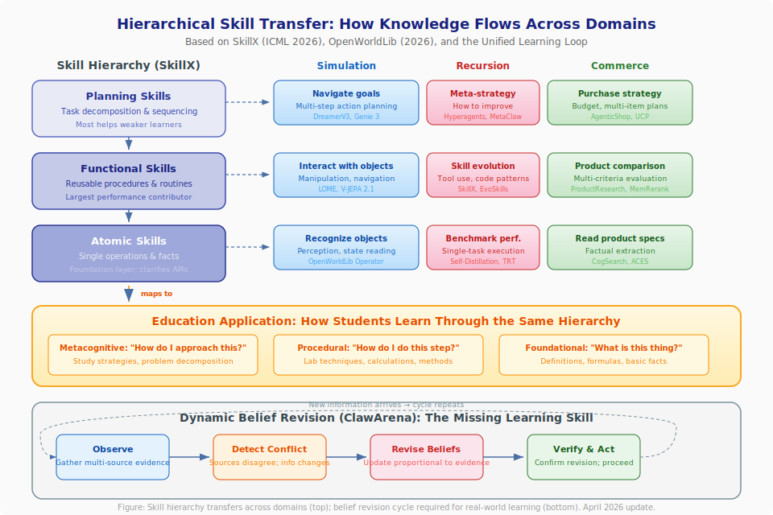

*Diagram: How skills organized at three levels (planning, functional, atomic) transfer across simulation, recursion, and commerce domains -- and map directly to educational practice. Below: the dynamic belief revision cycle that ClawArena (April 2026) identifies as the missing learning skill across all three domains.*

## Connection 47: Hierarchical Skill Transfer Bridges Agent Learning and Human Learning

SkillX (Yu et al., ICML 2026) demonstrates that agent experience organized into three hierarchical levels -- planning skills, functional skills, and atomic skills -- transfers far more effectively than raw trajectories or monolithic workflows.[^62] This finding creates a direct bridge between how AI agents and human learners organize knowledge:

| Skill Level | AI Agent | Human Learner | Educational Design |
|-------------|----------|---------------|-------------------|
| **Planning** | Task decomposition sequences | Study strategies, problem-solving approaches | Metacognitive instruction |
| **Functional** | Reusable tool-based subroutines | Domain procedures (lab techniques, calculation methods) | Procedural teaching |
| **Atomic** | Single-tool invocation patterns | Factual recall, basic operations | Foundational drills |

The finding that functional skills contribute most to performance, while planning skills most help weaker agents, has a direct educational parallel: intermediate procedures (solving equations, writing paragraphs, debugging code) produce the largest learning gains, while strategic skills (how to approach a problem, how to organize an essay) most help struggling students.

**Cross-domain implications:**
- **Simulation → Skills:** World model training could be organized around SkillX's hierarchy: atomic perceptual skills (recognizing objects), functional interaction skills (manipulating objects), and planning skills (achieving goals through multi-step action sequences)
- **Commerce → Skills:** Shopping expertise decomposes identically: atomic skills (reading product specs), functional skills (comparing products across criteria), planning skills (optimizing a multi-item purchase within budget constraints)
- **Recursion → Skills:** Self-improving agents could organize their improvement attempts hierarchically, targeting the level most likely to yield gains -- just as SkillX's exploratory expansion targets under-explored capabilities

## Connection 48: Evolving Information Environments Demand Dynamic Belief Revision Across All Domains

ClawArena (Ji et al., April 2026) reveals that AI agents operating in environments where information evolves during the task require fundamentally different capabilities than those in static settings.[^63] The benchmark's three coupled challenges -- multi-source conflict reasoning, dynamic belief revision, and implicit personalization -- apply identically across all three domains:

| Challenge | Simulation | Recursion | Commerce |
|-----------|-----------|-----------|----------|
| **Multi-source conflict** | Conflicting sensor readings in physical simulation | Contradictory benchmark results across evaluation settings | Conflicting product reviews from different sources |
| **Dynamic belief revision** | World model must update when physics violate expectations | Self-improving agent must abandon strategies that stop working | Shopping agent must revise recommendations when prices/availability change |
| **Implicit personalization** | Simulation calibrates to specific user's physical capabilities | Agent infers learning style from correction patterns | Agent infers preferences from corrections, not explicit statements |

ClawArena's finding that *update strategy* matters more than update frequency connects directly to the [Variance Inequality](#connection-23-the-variance-inequality-unifies-all-three-domains): effective belief revision requires a strong verifier that distinguishes genuine new information from noise. Agents that revise on every update (weak filtering) perform worse than those that revise strategically (strong verification).

**For education:** ClawArena formalizes the most important learning skill that no current benchmark tests: **changing your mind correctly**. A student who holds onto a misconception despite contradicting evidence fails at belief revision; one who abandons correct beliefs at the first sign of conflicting information fails at evidential reasoning. The ideal learner -- and the ideal AI agent -- maintains calibrated uncertainty, seeks clarifying evidence, and revises beliefs proportionally to evidence strength. This skill is equally critical in commerce (revising purchase decisions), simulation (updating mental models), and recursion (knowing when to abandon a failing strategy).

## The Observation-Based Recursive Learning Pipeline

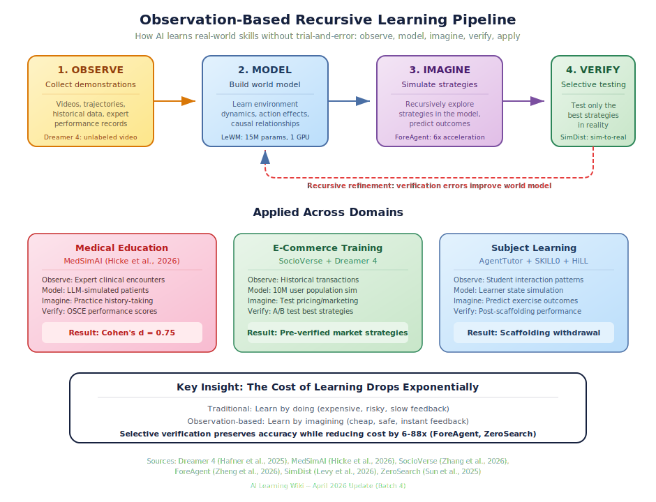

*Diagram: The five-phase pipeline -- observe, model, imagine, verify, apply -- shows how AI learns real-world skills without trial-and-error. Applied examples from medical education (MedSimAI), e-commerce (SocioVerse + Dreamer 4), and subject learning (AgentTutor + SKILL0). Recursive refinement flows from verification errors back to the world model.*

## Connection 49: Observation-Based Recursion Unifies All Three Domains

Dreamer 4 (Hafner et al., 2025) demonstrates that agents can develop complex, long-horizon skills purely from offline observation -- replacing "act in the environment" with "imagine in the world model."[^64] This observation-based recursion pattern applies identically across all three domains:

| Domain | Traditional Recursion (Expensive) | Observation-Based Recursion (Cheap) |
|--------|----------------------------------|-------------------------------------|
| **Simulation** | Train world model → act in environment → observe results → update model | Train world model from video → imagine outcomes → verify selectively |
| **Recursion** | Attempt task → evaluate result → modify agent → repeat | Observe demonstrations → build mental model → imagine strategies → verify best ones |
| **Commerce** | Deploy recommendation → observe purchases → update model → repeat | Observe historical transactions → simulate customer responses → deploy pre-verified strategies |

The cost reduction is dramatic: Dreamer 4 obtains diamonds in Minecraft (20,000+ sequential actions) without *any* environment interaction. Applied to commerce, this means a recommendation agent could be trained entirely on historical shopping data, with [SocioVerse's](ai-ecommerce-learning.md#socioverse-simulating-consumer-populations-at-scale) population simulation providing the imagination environment. For education, it means students could develop skills through [MedSimAI-style](predictive-simulation-learning.md#medsim-ai-simulation-based-deliberate-practice-in-medical-education) simulated practice before any real-world interaction -- with the simulation itself recursively improving from accumulated interaction data.

## Connection 50: Professional Simulation Training Validates the Entire Stack

MedSimAI's multi-institutional trial (Hicke et al., 2026) provides the first large-scale evidence that the full simulation-recursion-application stack works in professional training:[^65]

1. **Simulation:** AI-simulated patient encounters replace expensive standardized-patient sessions
2. **Recursion:** 59.5% of students voluntarily repeated practice (recursive improvement through self-motivated iteration)
3. **Application:** Real OSCE scores improved (Cohen's d = 0.75) -- the simulation-trained skills transferred to actual clinical performance

This evidence chain validates what the three pages of this wiki have argued theoretically: predictive simulation provides the training environment, recursive self-improvement provides the learning mechanism, and measurable real-world outcomes (whether clinical scores, commerce conversions, or learning assessments) provide the verification signal.

The divergent results across institutions, however, add a critical nuance: the stack requires institutional context calibration. A recursive improvement system that works at Institution A may fail at Institution B -- not because the algorithm is wrong, but because the deployment context (instructor engagement, student demographics, integration with existing curriculum) differs. This is the human analog of the [sim-to-real gap](predictive-simulation-learning.md#simulation-distillation-bridging-sim-to-real-for-world-models): even validated simulations require real-world adaptation.

## Connection 51: The ITS Review Reveals What 15 Years of Tutoring Gets Wrong

The comprehensive ITS review (Zerkouk et al., 2025) analyzing 15 years of intelligent tutoring research reveals a pattern that explains *why* the simulation-recursion-commerce stack matters:[^66]

- **Student modeling is the weakest component** -- most systems use shallow representations
- **Adaptive feedback timing matters more than quantity** -- echoing [OECD evidence](predictive-simulation-learning.md#oecd-evidence-pedagogical-design-determines-whether-ai-simulation-helps-or-harms) that *how* AI interacts matters more than *whether* it does
- **Simulation integration lacks evaluation standards** -- matching [OpenWorldLib's](predictive-simulation-learning.md#openworldlib-a-unified-definition-and-codebase-for-world-models) contribution of standardized definitions

Each gap maps to a specific area of this wiki:
- Student modeling → [Valid Student Simulation](predictive-simulation-learning.md#valid-student-simulation-the-competence-paradox) + [SLOW](recursive-self-improvement.md#slow-strategic-logical-inference-workspace-for-cognitive-adaptation-in-ai-tutoring) address this with epistemic fidelity and transparent cognitive modeling
- Feedback timing → [HiLL](recursive-self-improvement.md#hill-learning-to-hint-for-reinforcement-learning) + [Skill0](recursive-self-improvement.md#skill0-in-context-agentic-rl-for-skill-internalization) formalize adaptive scaffolding withdrawal
- Evaluation standards → [OpenWorldLib](predictive-simulation-learning.md#openworldlib-a-unified-definition-and-codebase-for-world-models) + [Criterion Validity](ai-ecommerce-learning.md#criterion-validity-of-llm-as-judge-for-conversational-commerce) provide the missing frameworks

The review's finding that STEM subjects show the most consistent ITS effectiveness connects to the predict-then-verify paradigm: STEM domains have objective verification (the answer is right or wrong), which makes the recursion loop tight. Commerce and creative domains require the more nuanced verification approaches described in [Connection 26](#connection-26-metric-validity-bridges-evaluation-across-all-three-domains).

## Connection 52: Classroom Simulation Completes the Educational Simulation Stack

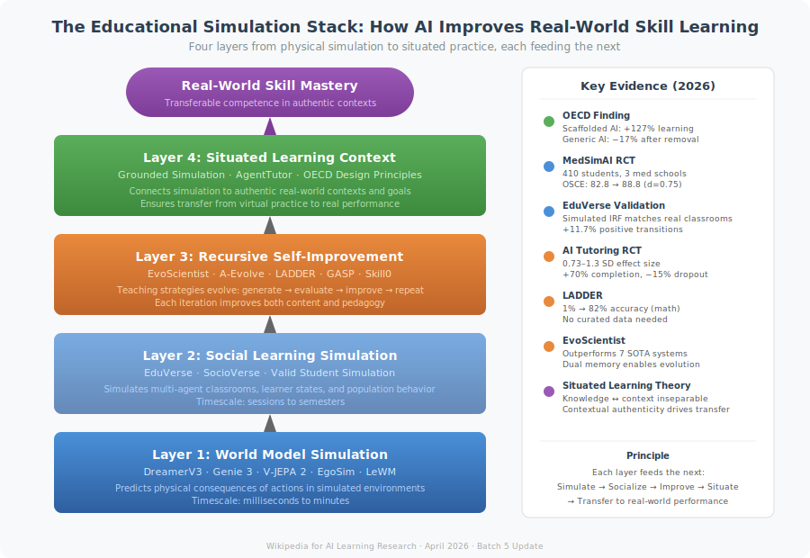

*Diagram: The four-layer educational simulation stack showing how AI builds real-world skill mastery. Physical world models (Layer 1) feed social learning simulation (Layer 2), which is recursively improved (Layer 3) and grounded in authentic contexts (Layer 4). Key 2026 evidence validates each layer. The same stack applies to commerce training, medical education, and any domain where skills must transfer from simulation to reality.*

EduVerse (Ma et al., 2025) fills a critical missing layer in the simulation-based learning architecture. Previous systems simulated physical environments (DreamerV3, Genie 3), individual learners (Valid Student Simulation), and market populations (SocioVerse). EduVerse simulates the *social learning environment itself* -- a classroom where multiple agents interact, influence each other, and develop over time.[^67]

This creates a complete simulation stack for education:

| Layer | System | What is simulated | Timescale |
|-------|--------|-------------------|-----------|
| **Physical environment** | DreamerV3, Genie 3 | Objects, physics, spaces | Seconds to minutes |
| **Individual learner** | Valid Student Simulation | One student's knowledge state | Per-interaction |
| **Classroom dynamics** | EduVerse | Multi-agent social learning | Per-session to semester |
| **Market/population** | SocioVerse | Population-level behavior | Days to months |

The CIE (Cognition-Interaction-Evolution) architecture is structurally parallel to the recursive self-improvement loop: agents maintain consistent internal states (cognition), interact with their environment (interaction), and develop over time (evolution). The 11.7% positive transition rate across sessions demonstrates that simulated learning environments can capture longitudinal development -- the same compounding improvement that makes [recursive self-improvement](recursive-self-improvement.md) powerful.

**For education:** A teacher could now test a new pedagogical intervention at every level: simulate physical demonstrations (Genie 3), predict individual student responses (Valid Student Simulation), model classroom dynamics (EduVerse), and forecast market demand for resulting skills (SocioVerse). This end-to-end simulation capability transforms educational research from slow, expensive field trials to rapid, iterative design cycles.

## Connection 53: Evolving Research Agents Bridge Self-Improvement and Scientific Discovery

EvoScientist (Chen et al., 2026) and A-Evolve (April 2026) independently demonstrate that recursive self-improvement can be operationalized for real-world knowledge creation -- one for scientific research, one for software development.[^68]

The structural parallel is precise:

| Component | EvoScientist | A-Evolve | Educational Analogue |
|-----------|-------------|----------|---------------------|
| **Memory** | Ideation + Experimentation memories | Git-versioned workspace | Study notes + practice logs |
| **Improvement loop** | Research → Evaluate → Evolve | Solve → Observe → Evolve → Gate → Reload | Learn → Test → Reflect → Adapt |
| **Safety mechanism** | Evolution Manager filters infeasible ideas | Gate stage validates before deployment | Teacher reviews before advancing |
| **Traceability** | Memory provenance tracking | Git-native checkpoints (evo-1, evo-2) | Learning portfolio with timestamps |

The convergence of these systems reveals a general pattern: **effective recursive improvement requires both dual memory (what to try / what worked) and gated deployment (verify before committing)**. EvoScientist's ideation-experimentation memory split mirrors [MemAPO's](#connection-10-compact-memory-bridges-recursion-and-commerce) success-failure memory; A-Evolve's Gate stage mirrors [SAHOO's](recursive-self-improvement.md#sahoo-safety-guardrails-for-recursive-improvement) alignment guardrails.

**For education:** The dual-memory + gated-deployment pattern could power tutoring systems that maintain separate libraries of teaching strategies (ideation memory) and verified student outcomes (experimentation memory), with a gating mechanism that ensures new strategies are validated against learning metrics before being deployed broadly. A-Evolve's Git-native audit trail addresses a critical accountability requirement: when a tutoring system changes its approach, educators and administrators need to know *what changed, when, and why* -- and be able to roll back if outcomes deteriorate.

## Connection 54: Situated Learning Theory Provides the Pedagogical Foundation

The "Connecting Education with Reality" framework (2026) provides the theoretical bridge that explains *why* the simulation-recursion-commerce stack works for learning.[^69] Situated learning theory holds that knowledge is inseparable from the context in which it is used. This reframes the world model paradigm: the goal is not just predictive accuracy but *contextual authenticity*.

This principle connects the three domains:

- **Simulation:** [Grounded world models](predictive-simulation-learning.md#grounding-world-models-in-real-cities) that simulate specific real places (not generic environments) produce more transferable learning because knowledge is situated in authentic contexts
- **Recursion:** [EvoScientist's](recursive-self-improvement.md#evoscientist-self-evolving-multi-agent-research-through-persistent-memory) persistent memory situates each research iteration in the context of prior discoveries -- knowledge accumulates in context rather than being generated de novo each time
- **Commerce:** [ShopSimulator](ai-ecommerce-learning.md#shopsimulator-rl-training-ground-for-shopping-agents) and [AgenticShop](ai-ecommerce-learning.md#agenticshop-benchmarking-agentic-product-curation) succeed precisely because they test agents in realistic shopping contexts rather than abstract benchmarks

The OECD's finding that AI tutoring designed with pedagogical scaffolding produced 127% improvement while generic AI access produced dependency (-17% after removal) is the definitive evidence: *context-aware design* (situated) outperforms *context-free access* (unsituated) by a factor of 7 or more.

**For education:** Every educational simulation should be evaluated on contextual authenticity, not just technical accuracy. A physics simulation calibrated to equipment available in the student's actual lab produces more transferable learning than one with perfect physics but unfamiliar apparatus. This connects to [EduVerse's](predictive-simulation-learning.md#eduverse-multi-agent-classroom-simulation-with-human-in-the-loop) customizable classroom configurations: the simulation is valuable precisely because it can be configured to match the specific school, class size, and student demographics of the real learning environment.

## Connection 55: The Predict-Improve-Apply Cycle Formalizes How AI Helps Humans Learn for Real-World Application

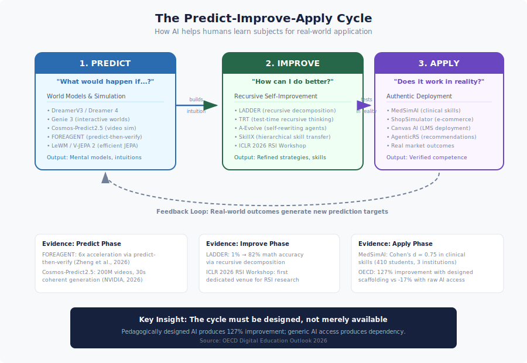

*Diagram: The three-phase cycle showing how simulation, recursion, and commerce domains work together to help humans learn subjects for real-world application. Each phase uses specific AI techniques and feeds its outputs into the next phase, creating a compounding learning loop.*

Across the systems documented in this wiki, a general three-phase cycle has emerged that describes how AI can accelerate human learning of any subject for practical application:

| Phase | Core Question | Key Technique | Example Systems |
|-------|--------------|---------------|-----------------|
| **Predict** | "What would happen if...?" | World models, simulation | DreamerV3, Genie 3, Cosmos-Predict2.5, LeWM, FOREAGENT |
| **Improve** | "How can I do better?" | Recursive self-improvement | LADDER, SPELL, TRT, A-Evolve, SkillX, ICLR 2026 RSI Workshop |
| **Apply** | "Does it work in reality?" | Authentic deployment + feedback | ShopSimulator, AgenticRS, MedSimAI, Canvas AI Teaching Agent |

The cycle is not linear but recursive: each application generates new prediction targets (edge cases, failures, surprising outcomes), which drive new simulation needs, which enable new improvement cycles. This matches the [OECD evidence](predictive-simulation-learning.md#oecd-evidence-pedagogical-design-determines-whether-ai-simulation-helps-or-harms) that pedagogically designed AI produces 127% improvement while generic AI access produces dependency: the cycle must be *designed*, not merely available.

**Evidence chain:**
- **Predict:** FOREAGENT achieves 6× acceleration by predicting ML experiment outcomes before executing them[^42]; Cosmos-Predict2.5 generates 30-second coherent world simulations from text[^70]
- **Improve:** The ICLR 2026 RSI Workshop identifies six dimensions of self-improvement (what, when, how, where, safety, evaluation) that apply across all domains[^71]; LADDER improves math accuracy from 1% to 82% through recursive problem decomposition[^2]
- **Apply:** MedSimAI demonstrates Cohen's d = 0.75 improvement in real clinical skills[^65]; the [learning-commerce loop](ai-ecommerce-learning.md#the-learning-commerce-loop-how-subject-mastery-transfers-to-real-world-application) shows how commerce provides authentic assessment

**For education:** The Predict-Improve-Apply cycle provides a concrete framework for designing AI-enhanced learning experiences in any domain. A chemistry teacher could use simulation (Predict) to let students explore reactions safely, recursive problem generation (Improve) to create personalized practice sets that adapt to each student's weaknesses, and real lab experiments (Apply) to verify that simulated understanding transfers. The cycle also applies to professional development: a business analyst could simulate market scenarios (Predict), recursively refine their analytical models (Improve), and test predictions against actual market outcomes (Apply).

## Connection 56: Agentic Education Workflows Complete the Multi-Agent Learning Architecture

Kamalov et al.'s (2026) analysis of agentic AI workflows in education[^72] provides the architectural glue that connects the specialized systems across all three domains. Their four agentic patterns (reflection, planning, tool use, multi-agent collaboration) correspond to specific capabilities documented across the three main wiki articles:

- **Reflection** enables the recursive self-improvement loop: TRT[^73], SLOW[^74], and RSA all implement reflection as the mechanism for self-correction
- **Planning** bridges simulation and application: WKM uses world models for planning; PiJEPA uses policy priors; the [Solicit-Then-Suggest model](ai-ecommerce-learning.md#solicit-then-suggest-the-economics-of-agentic-purchasing) formalizes inquiry planning in commerce
- **Tool use** connects agents to simulation environments: Genie 3 generates interactive worlds; CUWM predicts software states; ShopSimulator provides commerce sandboxes
- **Multi-agent collaboration** scales beyond single-agent limitations: EduVerse simulates classrooms; EvoScientist coordinates research agents; AgenticRS-Architecture coordinates recommendation agents

The finding that multi-agent evaluation produces more consistent results than single-model assessment reinforces the [educational simulation stack](cross-cutting-connections.md#connection-52-classroom-simulation-completes-the-educational-simulation-stack): complex learning requires multiple specialized components working in coordination, not a single monolithic system. This architectural insight applies equally to e-commerce (where [ProductResearch](ai-ecommerce-learning.md#productresearch-deep-research-agents-for-shopping) uses three specialized agents) and scientific research (where [EvoScientist](recursive-self-improvement.md#evoscientist-self-evolving-multi-agent-research-through-persistent-memory) uses three evolving agents).

*Diagram: The four-phase pipeline showing how LLM-simulated environments collapse simulation creation from months of engineering to minutes of description. Describe a scenario in natural language → LLM simulates environment responses → RL trains agents inside the simulation → adapt to reality with biosensory feedback. Recursive improvement flows deployment outcomes back to scenario refinement. Domain examples show medical, commerce, and subject mastery applications.*

## Connection 57: LLM-Simulated Environments Eliminate the Environment Engineering Bottleneck

Simia (Li et al., 2025) demonstrates that LLMs can generate realistic environment feedback for agent training without any access to actual testbed data or APIs -- matching GPT-4o performance and approaching o4-mini on agent benchmarks.[^75] Combined with [World-Gymnast's](predictive-simulation-learning.md#world-gymnast-rl-training-inside-learned-world-models) finding that RL inside learned world models outperforms physical simulation by 2×, this creates a fundamental shift across all three domains:

| Domain | Old Approach (Expensive) | New Approach (LLM-Simulated) |
|--------|--------------------------|------------------------------|
| **Simulation** | Build physics engine, calibrate parameters, validate against reality | Describe the domain; LLM simulates environmental responses |
| **Recursion** | Create benchmark environments for self-improvement testing | LLM generates diverse test scenarios from natural language descriptions |
| **Commerce** | Build mock e-commerce platforms with scripted behavior | LLM simulates realistic customer responses, market dynamics, and competitor actions |

The key insight: **the bottleneck for simulation-based learning has shifted from environment engineering to scenario description**. A teacher who wants a "clinical pharmacology interaction scenario" or "supply chain disruption in semiconductor manufacturing" need not build custom software -- they describe it, and the LLM simulates it at sufficient fidelity for meaningful training.

**For education:** This democratization effect extends the [efficiency-as-equity argument](#connection-45-efficiency-as-the-enabler-of-educational-equity) to simulation content creation. Previously, creating educational simulations required both computational resources (addressed by LeWM, WorldCache) *and* domain engineering (addressed by Simia). With both barriers falling, the remaining constraint is pedagogical design quality -- precisely the domain where the [OECD evidence](predictive-simulation-learning.md#oecd-evidence-pedagogical-design-determines-whether-ai-simulation-helps-or-harms) shows the largest impact. The implication: invest in pedagogical design, not simulation engineering.

## Connection 58: Biosensory Feedback Adds the Missing Dimension to the Predict-Verify Loop

[GuideAI](predictive-simulation-learning.md#guideai-biosensory-feedback-closes-the-learner-state-gap) (Shukla et al., IUI 2026) introduces real-time physiological monitoring (eye gaze, heart rate, posture) into AI tutoring, demonstrating significant learning gains from adapting content based on the learner's *body* as well as their *answers*.[^76] This adds a new dimension to the predict-act-observe-update loop that connects all three domains:

Previous versions of the loop predicted and observed *task-level* signals (correct answers, purchase decisions, environment states). GuideAI adds *learner-level* signals that are invisible to task-only observation:

| Signal | What It Reveals | Impact on Learning Loop |
|--------|----------------|------------------------|
| **Eye gaze** | Attention allocation, confusion points | Predict *where* learner will struggle before they answer incorrectly |
| **Heart rate** | Cognitive load, stress, engagement | Predict *when* to simplify or challenge |
| **Posture** | Fatigue, disengagement | Predict *whether* continued practice will be productive |

**Cross-domain implications:**
- **Simulation:** A flight training simulator that detects elevated stress could automatically simplify the scenario -- not because the trainee is performing poorly, but because physiological signals predict imminent cognitive overload
- **Recursion:** Self-improving tutors could use biosensory signals as additional reward signals, optimizing not just for correct answers but for learning states (engaged attention, appropriate challenge level)
- **Commerce:** Customer service training simulations could monitor trainee stress during difficult customer interactions, calibrating scenario difficulty to build resilience gradually

**For education:** GuideAI's contribution is recognizing that the learner is not a disembodied reasoner but a physical being whose cognitive capacity fluctuates with physiological state. This bridges the [four-layer scaffolding stack](#connection-20-the-complete-scaffolding-stack----from-hints-to-simulation) with embodied cognition: effective scaffolding must account for not just what the learner knows (epistemic state) but how the learner *feels* (physiological state). Combined with [PRISM's](recursive-self-improvement.md#prism-personalized-skill-mastery-through-generative-ai) emotion-aware instruction and [Valid Student Simulation's](predictive-simulation-learning.md#valid-student-simulation-the-competence-paradox) epistemic modeling, this suggests a three-dimensional learner model: knowledge state × affective state × physiological state.

## Connection 59: AI-Generated Scientific Discovery Closes the Knowledge Creation Loop

[AI Scientist v2](recursive-self-improvement.md#ai-scientist-v2-first-ai-generated-peer-reviewed-scientific-paper) (Yamada et al., 2025) achieved the first AI-generated paper to pass peer review, while [RLVR-World](predictive-simulation-learning.md#rlvr-world-training-world-models-with-verifiable-rewards) (NeurIPS 2025) shows that world models trained with verifiable rewards outperform those trained with standard objectives.[^77] Together, these create a new cross-cutting pattern: **AI systems that generate verifiable new knowledge accelerate the improvement of all three domains simultaneously**.

The knowledge creation loop:
1. **Generate hypothesis** (AI Scientist v2's agentic tree search explores research directions)
2. **Build world model** (RLVR-World trains models optimized for task-relevant prediction, not just visual fidelity)
3. **Verify in simulation** (World-Gymnast tests policies inside learned world models, achieving 18× improvement over supervised learning)
4. **Transfer to reality** ([SimDist](predictive-simulation-learning.md#simulation-distillation-bridging-sim-to-real-for-world-models) bridges the sim-to-real gap efficiently)
5. **Publish findings** (AI Scientist v2 writes the paper; peer review provides verification)
6. **Feed back into research** (Discoveries improve the next generation of world models and training methods)

This loop is fully recursive and self-accelerating: better world models enable better simulated experiments, which produce better scientific findings, which improve world model training methods. The [Variance Inequality](recursive-self-improvement.md#the-variance-inequality-a-unified-theory-of-self-improvement) predicts that this loop will be stable as long as the verification step (peer review, experimental validation) remains strong relative to the generation step (hypothesis creation, paper writing).

**For education:** This connection reveals that the same AI systems teaching students can simultaneously advance the knowledge being taught. A chemistry tutoring system built on RLVR-World-style world models doesn't just simulate known chemistry -- it could discover new reaction pathways through simulated experimentation (AI Scientist v2 pattern), verify them against known chemistry (verifiable rewards), and incorporate validated discoveries into the curriculum. The student isn't just learning chemistry as it existed when the textbook was written -- they're learning chemistry that includes discoveries made by the teaching system itself. This is the ultimate expression of the [Predict-Improve-Apply cycle](#connection-55-the-predict-improve-apply-cycle-formalizes-how-ai-helps-humans-learn-for-real-world-application): prediction generates new knowledge, improvement refines it, and application validates it in real-world contexts.

## Open Questions

1. **Can recursive improvement in one domain transfer to another?** Can a self-improving math tutor's meta-strategies improve a self-improving coding assistant? The ICLR 2026 Workshop's ACE paper suggests yes -- strategic data selection principles transfer across domains.[^9] CORAL's 3-10× gains through multi-agent evolution suggest that cross-domain transfer may be more effective than within-domain iteration.
2. **What are the limits of simulation for learning?** When does simulated practice plateau, and when is real-world experience irreplaceable? Genie 3's ~minute consistency limit provides a concrete boundary -- current world models support focused exploration but not extended immersive practice. YC-Bench's year-long text-based simulations suggest that modality matters: text simulations can sustain longer horizons than visual ones.
3. **How do we prevent AI shopping agents from optimizing for purchases rather than user satisfaction?** The feedback loop incentivizes conversion, not genuine value. LLMimic's finding that AI-literate consumers make better decisions suggests a complementary approach: educate users alongside improving agents.
4. **Can metacognitive AI teach metacognitive skills to humans?** If an AI system "learns how to learn," can it articulate and teach that skill? SLOW's transparent reasoning workspace makes a system's pedagogical metacognition inspectable, suggesting the answer may be yes.
5. **Will efficient world models democratize simulation-based learning?** LeWM's 15M-parameter, single-GPU approach suggests that simulation-based education may not require cloud-scale infrastructure -- EgoSim's smartphone-based data capture reinforces this democratization trajectory.
6. **How should we govern agentic AI in both commerce and education?** As AI agents become more autonomous in shopping and tutoring, who is responsible when an agent makes a poor recommendation -- one that wastes money or teaches incorrectly? InterruptBench's finding that agents handle mid-task changes poorly adds urgency.
7. **Is the four-layer scaffolding stack (Connection 20) necessary and sufficient?** Can we prove that all four layers are needed for optimal learning, or are some redundant in certain domains?

## Connection 60: Test-Time Learning as the Convergence Point

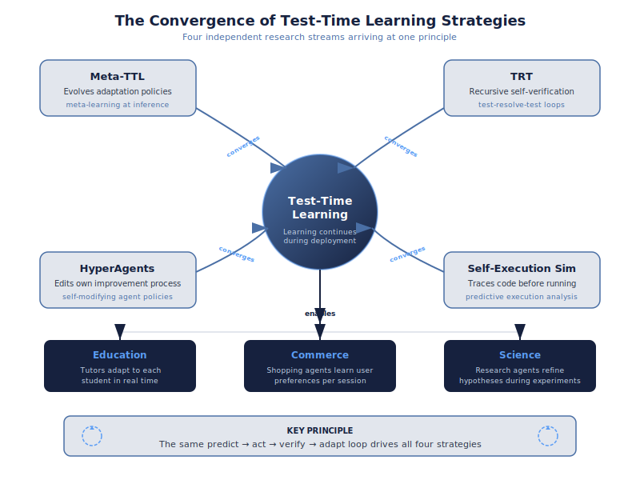

*Diagram: Four independent research streams -- Meta-TTL, TRT, HyperAgents, and Self-Execution Simulation -- converge on the principle that effective AI systems continue learning during deployment, not just during training. The predict → act → verify → adapt loop unifies all four approaches.*

A striking April 2026 convergence: multiple independent research groups discover that **continuing to learn at deployment time** produces dramatically better outcomes than static trained models, across all three wiki domains:

- **Meta-TTL** (Lou et al., 2026) learns *how to adapt* through bi-level optimization -- the adaptation policy itself is optimized by evolutionary search over diverse tasks.[^78]
- **TRT** (Zhuang et al., 2026) achieves 100% on AIME math competition through recursive self-verification at inference time -- no retraining needed.[^73]
- **HyperAgents** (Zhang et al., ICLR 2026) edit their own improvement mechanism, creating agents that improve *how they improve* during operation.[^79]
- **Self-Execution Simulation** (Maimon et al., 2026) traces code execution mentally before running it, catching errors through simulation rather than execution.[^80]

The unifying principle: **the predict → act → verify → adapt loop that drives training also drives deployment**. The distinction between "training" and "inference" is dissolving -- the most capable systems treat every interaction as a learning opportunity.

**For education:** This convergence validates the pedagogical principle that *assessment is learning*. When a student takes a test, they're not just being evaluated -- they're actively learning through the predict-verify cycle. AI tutoring systems should exploit this by designing assessments that maximize learning (test-enhanced learning), not just measure it. The OECD evidence that tutoring-designed AI produces 127% improvement while standard AI produces dependency[^44] is explained by this convergence: tutoring-designed systems maintain the learning loop during interaction, while standard systems short-circuit it by providing direct answers.

**For commerce:** Shopping agents that continue to learn within a single session (adapting to the user's evolving preferences in real time) outperform those that rely solely on pre-trained models. [Shopping Companion's](ai-ecommerce-learning.md#shopping-companion-memory-augmented-assistance) memory-augmented architecture is an implicit implementation of session-level test-time learning.

## Connection 61: Unified World Model Definitions Enable Cross-Domain Transfer

OpenWorldLib's (Zeng et al., April 2026) unified definition of world models -- "centered on perception, equipped with interaction and long-term memory" -- provides a formal bridge between simulation, recursion, and commerce.[^61] Under this definition:

- **Simulation systems** (DreamerV3, V-JEPA 2, Genie 3) are world models that predict physical states
- **Recursive systems** (Hyperagents, LADDER, SDPO) are world models that predict their own future capabilities
- **Commerce systems** (Shopping Companion, MemRerank, SocioVerse) are world models that predict user behavior

All three require the same three capabilities: perception of current state, interaction with the environment, and long-term memory of past experiences. The unified definition means that architectural innovations in any one domain (e.g., [LeWM's](predictive-simulation-learning.md#leworldmodel-stable-jepa-from-pixels) efficient JEPA training) can be transferred to the others -- efficient physical world models can become efficient preference models or efficient self-models.

**For education:** A unified world model for learning would perceive the student's current state (knowledge, affect, engagement), interact through instruction, and maintain long-term memory of the learning trajectory. OpenWorldLib's framework suggests that the same architectures powering robotic world models could power student models -- with perception replacing visual sensing with learning analytics, interaction replacing physical actions with pedagogical moves, and memory replacing spatial state with knowledge state.

## Connection 62: AI-Agent School Bridges Physical and Educational Simulation

Jin et al.'s AI-Agent School (EMNLP 2025) introduces world models for classrooms -- simulating teacher-student interactions, learning dynamics, and pedagogical strategies with dual memory architecture.[^81] This creates a new connection in the wiki's three-domain framework:

| Physical World Models | Educational World Models | Commerce World Models |
|---|---|---|
| Predict physics (DreamerV3) | Predict learning (AI-Agent School) | Predict purchases (Shopping Companion) |
| Simulate environments (Genie 3) | Simulate classrooms (AI-Agent School) | Simulate markets (SocioVerse) |
| Train robots (V-JEPA 2) | Train tutors (Scarlatos et al.) | Train shopping agents (ShopSimulator) |

The dual memory architecture (experience + knowledge) maps across all three: robots store trajectories + dynamics knowledge; tutors store interactions + pedagogical knowledge; shopping agents store purchase history + preference models. AI-Agent School's "experience-reflection-optimization" cycle is the same [recursive self-improvement](recursive-self-improvement.md) loop that powers [DGM](recursive-self-improvement.md#darwin-godel-machine-dgm) in coding and [AgenticRS-Architecture](ai-ecommerce-learning.md#agenticrs-architecture-self-improving-recommender-lifecycle) in commerce.

## Connection 63: Conversational RL Unifies Commerce Dialogue and Tutoring Dialogue

The convergence of conversational product recommendation (via RL) with AI tutoring dialogue reveals that the same reinforcement learning framework optimizes both shopping conversations and teaching conversations:[^82]

- **In commerce:** RL agents learn when to ask clarifying questions, when to present options, and when to close -- optimizing for conversion
- **In education:** RL tutors learn when to ask diagnostic questions, when to present explanations, and when to test -- optimizing for learning gains (Scarlatos et al.)
- **The shared structure:** Both are partially observable MDPs where the agent must reduce uncertainty about a hidden state (user preferences / student knowledge) through strategic questioning

Cao & Hu's Solicit-Then-Suggest model[^12] provides the mathematical foundation: inquiry depth and response variety are substitutes in reducing uncertainty, whether the uncertainty is about what product the customer wants or what concept the student misunderstands. The RL training signal differs (purchase vs. correct response) but the policy optimization problem is isomorphic.

**For applied learning:** A student learning sales conversation skills could train against the same RL framework that optimizes real shopping agents, with the reward signal shifted from conversion to pedagogical metrics. The conversational strategies that work for product recommendation (targeted questioning, adaptive presentation, uncertainty reduction) are precisely the Socratic method strategies that effective tutors use.

## Connection 64: LLM-Guided Curricula Bridge All Three Domains

Alasti et al.'s LLM-Guided Curriculum Learning[^83] reveals that large language models can serve as universal *curriculum designers* across simulation, recursion, and commerce training:

- **In simulation:** The LLM observes an RL agent's performance in a simulated environment and dynamically sequences the introduction of new actions/concepts, achieving 74% training acceleration
- **In recursion:** The curriculum itself is a form of recursive improvement -- the LLM meta-learns an effective teaching strategy by observing the agent's learning trajectory, then adapts the curriculum based on observed progress
- **In commerce:** The same approach could power adaptive onboarding for e-commerce platforms -- an LLM observing a new seller's listing behavior could progressively introduce advanced features (pricing strategies, ad tools, analytics) based on observed competency

The unifying principle is **adaptive sequencing**: an LLM acts as a pedagogical layer that sits between the learner and the environment, deciding *what to introduce next* based on observed readiness. This is structurally identical across domains -- the only difference is what's being sequenced (game actions, programming skills, or commerce tools). Combined with [SKILL0's](recursive-self-improvement.md#skill0-in-context-agentic-rl-for-skill-internalization) scaffolded withdrawal and [LADDER's](recursive-self-improvement.md#ladder-recursive-problem-decomposition) difficulty decomposition, LLM-guided curricula complete a trio of automated pedagogical strategies that work across all three wiki domains.

## Connection 65: PerFusion Shows Simulation-to-Commerce is a Direct Pipeline

Alibaba's PerFusion system[^84] demonstrates the most literal form of the simulation-commerce connection: **AI simulates products that don't yet exist, tests them against predicted customer preferences, and only manufactures the ones that pass**. This "sell it before you make it" paradigm collapses the traditional product development cycle:

| Traditional Pipeline | PerFusion Pipeline | Educational Parallel |
|---|---|---|
| Design → Prototype → Photograph → List → Sell → Measure | Simulate → Predict preference → List → Sell → Manufacture | Simulate concept → Predict understanding → Teach → Assess → Refine |

The 13% CTR improvement and 7.9% return rate decrease demonstrate that AI-simulated products *better match* customer needs than human-designed ones -- the simulation isn't just cheaper, it's *more effective*. This validates the core thesis of [predictive simulation learning](predictive-simulation-learning.md): systems that simulate outcomes before acting achieve better results than those that act and then observe.

**For applied learning:** PerFusion is the ideal case study for teaching the simulation-based decision-making paradigm. A business student who understands why "simulate first, then commit" produces 13% better conversion rates has internalized the same principle that makes [DreamerV3](predictive-simulation-learning.md#dreamerv3-general-world-model-agent) outperform model-free agents and [MedSimAI](predictive-simulation-learning.md#medsmai-simulation-based-deliberate-practice-in-medical-education) improve clinical skills. The principle transfers across domains: *predict before you act, whether you're designing a product, diagnosing a patient, or solving an engineering problem*.

## Connection 66: Skill Extraction Parallels Across Scientific, Educational, and Commercial Domains

SkillFoundry's[^85] automated skill mining from scientific resources creates a surprising three-way parallel with educational and commercial skill extraction:

| Domain | Skill Source | Extraction Method | Validation | Transfer Target |
|---|---|---|---|---|
| **Science** (SkillFoundry) | Papers, APIs, notebooks, repos | Knowledge tree mining + contract extraction | Closed-loop execution testing | Scientific agents |
| **Education** (SkillX, SKILL0) | Agent trajectories, expert demonstrations | Hierarchical decomposition + RL internalization | Student performance gains | Tutoring agents |
| **Commerce** (AgenticRS, Shopping Companion) | Purchase histories, browsing patterns | Preference distillation + memory extraction | Conversion/satisfaction metrics | Shopping agents |

The shared pattern: all three domains benefit from converting *unstructured experience* into *structured, reusable skills* through automated extraction and validation. SkillFoundry's 71.1% novelty rate (skills that human curators missed) suggests that automated extraction discovers implicit competencies across all domains -- commerce skills that sales manuals don't explicitly name, educational strategies that teaching guides don't codify, and scientific techniques buried in supplementary materials.

**For applied learning:** The convergence suggests a unified "skill extraction engine" architecture that could mine skills from any domain's resources, organize them hierarchically, and make them available for both AI agents and human learners. A student studying e-commerce could benefit from SkillFoundry-style mining of industry reports, competitor analyses, and case studies -- automatically extracting actionable skills that no single textbook teaches.

## Connection 67: The Simulation Stack Expands from Physical to Digital to Social

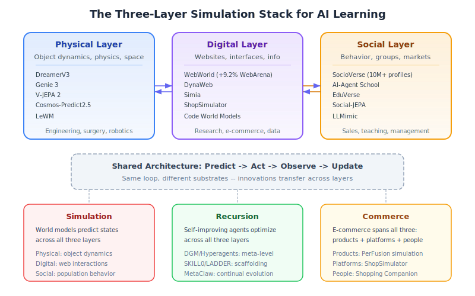

*Diagram: Simulation-based learning now operates across three complementary layers -- physical (DreamerV3, Genie 3), digital (WebWorld, DynaWeb), and social (SocioVerse, AI-Agent School). Each layer addresses a different class of real-world skills, and the layers compose: a business student can simulate product dynamics (physical), test e-commerce strategies (digital), and predict market response (social) within a unified learning trajectory.*

The emergence of [WebWorld](predictive-simulation-learning.md#webworld-large-scale-open-web-world-model) (Xiao et al., February 2026) completes a three-layer simulation stack that spans all three wiki domains:[^86]

| Layer | Systems | What is Simulated | Real-World Skills |
|-------|---------|-------------------|-------------------|
| **Physical** | DreamerV3, Genie 3, V-JEPA 2, Cosmos-Predict2.5 | Object dynamics, spatial navigation, physics | Engineering, surgery, laboratory work |
| **Digital** | WebWorld, DynaWeb, Simia, ShopSimulator | Websites, interfaces, information navigation | Research, digital commerce, data analysis |
| **Social** | SocioVerse, AI-Agent School, EduVerse | Human behavior, group dynamics, market response | Sales, teaching, management, policy-making |

This three-layer architecture creates a direct bridge across the wiki's core domains:

- **Simulation:** Physical world models (DreamerV3) learn dynamics; digital world models (WebWorld) learn information structure; social world models (SocioVerse) learn behavioral patterns. Each layer uses the same predict-act-observe architecture but operates on different substrates.
- **Recursion:** Self-improving agents can now recursively improve across all three layers. A [Hyperagent](recursive-self-improvement.md#hyperagents) that modifies its own improvement mechanism could optimize physical manipulation, web navigation, and social interaction using the same meta-learning framework.
- **Commerce:** E-commerce sits at the intersection of all three layers -- physical products, digital storefronts, and social purchasing behavior. [Shopping Companion's](ai-ecommerce-learning.md#shopping-companion-memory-augmented-assistance) memory-augmented architecture implicitly spans all three: product knowledge (physical), website navigation (digital), and preference modeling (social).

**For education:** The three-layer stack means simulation-based learning can now address the full spectrum of modern professional skills. A business student's curriculum could progress through: (1) understanding product properties and supply chains (physical simulation), (2) navigating e-commerce platforms, analyzing data, and managing digital tools (digital simulation via WebWorld), and (3) predicting customer behavior and market dynamics (social simulation via SocioVerse). WebWorld's finding that skills transfer across digital domains (+9.2% on WebArena with cross-domain transfer to code and gaming) suggests that digital simulation skills are broadly portable -- a student who learns effective information navigation in one context carries that skill to others.

## Current State / Latest Developments

As of April 2026, cross-cutting research between simulation, recursion, and commerce is accelerating rapidly:

- **The ICLR 2026 Workshop on Recursive Self-Improvement** (Rio de Janeiro, April 26-27) is the first dedicated academic workshop on RSI, organizing contributions around five lenses: change targets, temporal regime, mechanisms, operating contexts, and evidence of improvement.[^71] Workshop papers demonstrate RSI transfer across domains, including vision-grounded code refinement (17.8% improvement) and agentic context engineering.

- **The Foresight Gap** has been empirically quantified for the first time. Qian et al. (2026) show that agents invoke available world models in <1% of beneficial situations,[^87] establishing that metacognitive orchestration -- not component capability -- is the binding constraint on cross-domain integration.

- **Solicit-Then-Suggest** (Cao & Hu, March 2026) provides the first formal economic model of agentic purchasing, proving that strategic inquiry and product variety are mathematical substitutes for reducing uncertainty.[^12] This finding transfers directly to educational dialogue design.

- **Test-time Recursive Thinking** (Zhuang et al., February 2026) achieves 100% on AIME-25/24 through inference-time self-improvement without external feedback,[^73] demonstrating that the training/inference distinction is dissolving -- the most capable systems treat every interaction as a learning opportunity.

- **Efficiency breakthroughs** (LeWM, WorldCache, token merging) have made simulation-based learning deployable on consumer hardware, shifting the equity equation for educational AI.

- **World models are now formally recognized as recommendation evaluation engines.** AlignUSER (Bougie et al., January 2026) formalizes recommender evaluation as next-state prediction,[^89] LLM-as-a-Judge (Bonin et al., November 2025) uses pairwise preference reasoning over slates,[^90] and Graph World Model (Feng et al., July 2025) unifies recommendation and planning under a single architecture.[^91] This convergence establishes that every recommender system is implicitly a world model of user preferences.

- **Self-improving recommendation systems have moved from theory to practice.** RSIR (Zhang et al., February 2026) demonstrates model-agnostic recursive self-improvement for recommenders with fidelity control,[^52] while MoRE (Qin et al., RecSys 2025) applies iterative meta-reflection to recommendation reasoning,[^92] and MemRec (Chen et al., January 2026) introduces collaborative memory graphs for cross-user knowledge sharing.[^93]

- **AI agent consumer biases are structurally emergent, not just inherited.** ABxLab (Cherep et al., ICLR 2026) shows that AI shopping agents develop systematic biases from environmental structure even without human bias training,[^94] while Chu et al.'s (2025) multi-agent consumer simulation reveals emergent word-of-mouth and social influence dynamics.[^95] SAHOO (Sahoo et al., ICLR 2026 RSI Workshop) provides alignment monitoring frameworks to detect and control drift during recursive improvement.[^96]

## Limitations / Challenges

Despite the 71 documented connections, several fundamental challenges limit the practical integration of simulation, recursion, and commerce for learning:

1. **The Foresight Gap is unsolved.** Even when all three capabilities are available, agents and learners struggle to orchestrate them effectively. The <1% simulation invocation rate[^87] suggests that metacognitive integration is far harder than building individual components. Imagine-then-Plan[^88] offers a partial solution via adaptive lookahead, but general-purpose metacognitive orchestration remains open.

2. **Cross-domain transfer is unproven at scale.** While individual connections are well-documented, no system has demonstrated the full Predict-Improve-Apply cycle across all three domains simultaneously in a deployed educational setting. MedSimAI[^65] validates single-domain simulation-to-practice transfer, but multi-domain integration remains theoretical. The ICLR 2026 RSI Workshop's ACE paper[^9] provides initial evidence that strategic data selection principles transfer across domains.

3. **Metric validity threatens recursive improvement loops.** Chen et al.'s criterion validity study[^38] and Xu et al.'s metric freedom analysis[^39] show that optimization metrics often diverge from actual outcomes, meaning self-improving systems may optimize for the wrong thing. This is especially dangerous when loops span domains -- a commerce metric used to evaluate educational engagement could drive harmful optimization.

4. **The knowledge creation paradox is unresolved.** Sun (2026)[^50] shows that AI systems that improve individual performance may degrade collective knowledge production. No current architecture includes effective "knowledge externalization requirements" that force AI systems to contribute back to shared knowledge.

5. **Simulation fidelity vs. adversarial realism trade-off.** Ersoy et al.[^57] identify that simulations must include deceptive elements for robust training (41% agent susceptibility to dark patterns), but overly adversarial simulations may cause learned helplessness in students -- the calibration is domain-dependent and poorly understood.

6. **Scaffold dependency risk.** The OECD evidence[^44] shows 17% performance degradation when AI support is removed without scaffolded withdrawal design. Architectures like Skill0[^30], LADDER[^2], and GASP[^14] address this, but their long-term efficacy in educational settings beyond controlled trials is unknown.

## Connection 68: The Foresight Gap Reveals the Meta-Skill All Three Domains Need

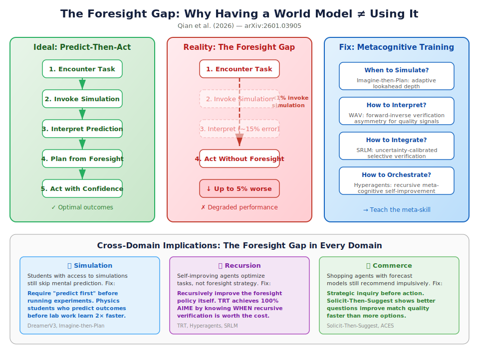

*Diagram: The foresight gap -- the disconnect between having simulation capability and actually using it effectively. Left: the ideal predict-then-act loop. Right: what actually happens (agents skip simulation, misinterpret predictions, or degrade performance with simulation). The gap is closed by metacognitive training that teaches agents when and how to simulate.*

Qian et al.'s "Current Agents Fail to Leverage World Model as Tool for Foresight" (January 2026)[^87] combined with Guo et al.'s "Imagine-then-Plan" (January 2026)[^88] reveal a fundamental cross-cutting challenge: **the ability to use simulation strategically is itself a learnable skill that must be explicitly trained**.

This finding reframes the entire wiki's thesis. Previous connections assumed that building better world models, better recursion mechanisms, and better commerce systems would automatically produce better learning. The foresight gap shows that **integration is the real bottleneck** -- an agent (or learner) with access to all three capabilities but no skill in orchestrating them will underperform one with weaker capabilities but better integration.

The Imagine-then-Plan framework addresses this by training agents to adaptively decide *how far ahead* to simulate based on task demands, dynamically adjusting lookahead depth. This adaptive foresight connects across domains:

- **Simulation → Education:** Students who learn *when* to use mental simulation (predicting outcomes before acting) outperform those who either always or never simulate. Physics students benefit from predicting experimental outcomes before running experiments, but over-reliance on mental simulation without execution produces the same "[illusion of understanding](#connection-39-the-illusion-of-understanding-bridges-all-three-domains)" identified in Connection 39.

- **Recursion → Education:** Self-improving systems that recursively refine their *foresight policy* (not just their task performance) achieve faster convergence. TRT's 100% AIME accuracy[^73] comes partly from knowing when recursive verification is worth the compute cost. For students, this translates to metacognitive calibration: knowing when to double-check your work (high-stakes, uncertain) vs. when to trust your first answer (routine, confident).

- **Commerce → Education:** The [Solicit-Then-Suggest](#connection-8-information-gain-as-the-universal-learning-currency) model's finding that "asking better questions improves match quality at a significantly faster rate than offering more options" is the commerce analog of the foresight gap: strategic inquiry (simulation of customer needs) outperforms brute-force recommendation (acting without prediction). For business students, this teaches that market research (simulation) before product launch (action) has increasing returns -- but only if the research is strategically designed.

**The meta-skill:** The foresight gap identifies a fourth capability beyond predict, improve, and apply: **orchestrate** -- knowing when to invoke each capability and how to combine their outputs. This meta-skill is what distinguishes expert practitioners from competent ones in every domain. An AI tutoring system that teaches not just domain knowledge but *when to simulate, when to self-improve, and when to apply* would produce learners who are fundamentally more adaptable than those trained only on domain content.

## Connection 69: World Models as Recommendation Evaluation Engines

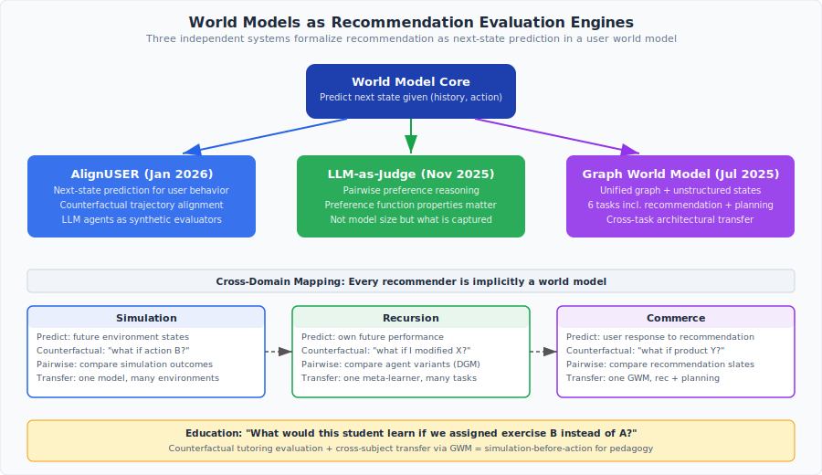

*Diagram: Three independent 2025-2026 systems formalize recommendation as a world-modeling problem. AlignUSER treats user behavior as next-state prediction and trains LLM agents via counterfactual trajectories. LLM-as-a-Judge evaluates recommendation slates through pairwise preference reasoning. Graph World Model (GWM) unifies recommendation, graph prediction, and planning under a single world-model architecture. Together, they establish that every recommender system is implicitly a world model of user preferences -- and that making this explicit yields better evaluation, better alignment, and cross-task transfer.*

Three independent 2025-2026 papers converge on the insight that **recommendation systems are world models of user preferences** -- and that making this connection explicit produces dramatically better evaluation and alignment:

1. **AlignUSER** (Bougie et al., January 2026) formalizes recommender evaluation as a next-state-prediction task: given a user's interaction history $h_t$ and a recommended item $a_t$, the world model predicts the user's next state $s_{t+1}$ (engagement level, preference shift, satisfaction).[^89] The key innovation is training LLM agents on *counterfactual* trajectories -- "what would this user have done if we had recommended item B instead of A?" -- using the same forward-inverse learning loop that powers [SWIRL](predictive-simulation-learning.md#swirl-self-improving-world-models-without-action-labels) and [WAV](#connection-8-information-gain-as-the-universal-learning-currency) in physical world models.

2. **LLM-as-a-Judge for Slate Recommendation** (Bonin et al., November 2025) investigates whether LLMs can serve as world models of user preferences through pairwise reasoning over recommendation slates.[^90] The finding that task performance correlates with specific properties of the preference function captured by the LLM -- not with model size or general capability -- connects directly to the [Metric Freedom](#connection-26-metric-validity-bridges-evaluation-across-all-three-domains) finding: what matters is *what* the model captures about preferences, not *how large* the model is.

3. **Graph World Model (GWM)** (Feng et al., July 2025) demonstrates that a single world-model architecture handling both unstructured and graph-structured states can match or outperform domain-specific baselines across six tasks including recommendation, graph prediction, and planning.[^91] This is the most general evidence that world model architectures transfer across domains -- a GWM trained on physical dynamics can be repurposed for user behavior prediction with minimal modification.

**Cross-domain implications:**

| Insight | Simulation | Recursion | Commerce |
|---------|-----------|-----------|----------|
| **Next-state prediction** | Predict physics | Predict own improvement | Predict user response |
| **Counterfactual trajectories** | "What if I took action B?" | "What if I modified module X?" | "What if I recommended product Y?" |
| **Pairwise preference** | Compare simulation outcomes | Compare agent variants (DGM) | Compare recommendation slates |
| **Cross-task transfer** | One model handles multiple environments | One meta-learner improves across tasks | One GWM handles recommendation + planning |

### Learning Application: Counterfactual Tutoring Evaluation

**Learning application:** AlignUSER's counterfactual training directly applies to tutoring: "What would this student have learned if we had assigned exercise B instead of exercise A?" A tutoring system that models student learning as next-state prediction in a user world model could evaluate pedagogical strategies *before* deploying them -- the same simulation-before-action principle that powers [MedSimAI](predictive-simulation-learning.md#medsim-ai-simulation-based-deliberate-practice-in-medical-education) and [PerFusion](#connection-65-perfusion-shows-simulation-to-commerce-is-a-direct-pipeline). GWM's cross-task transfer suggests that a world model trained on one educational domain (mathematics) could partially transfer to another (physics) -- reducing the cold-start problem for new subject areas.

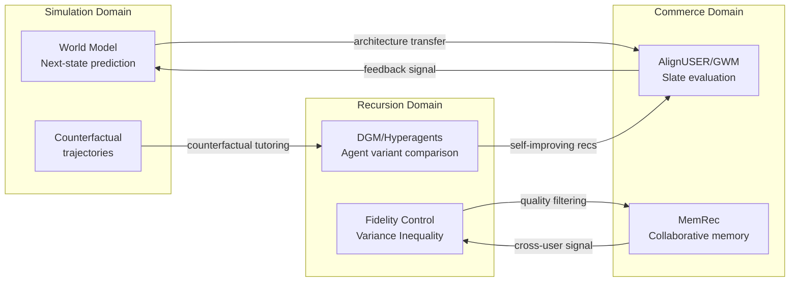

## Connection 70: Self-Improving Recommenders Close the Recursion-Commerce Loop

The emergence of explicitly self-improving recommendation systems in 2025-2026 demonstrates that recursive self-improvement is not just a theoretical framework but a practical engineering paradigm for commerce:

1. **RSIR** (Zhang et al., February 2026) is the most complete implementation: a recommendation model bootstraps its own training data by generating plausible user interaction sequences, filtering them through a fidelity-control mechanism that enforces consistency with the user's approximate preference manifold, and retraining a successor model on the enriched dataset.[^52] The mathematical analysis shows that fidelity control acts as an implicit regularizer -- preventing the same collapse that the [Variance Inequality](#connection-23-the-variance-inequality-unifies-all-three-domains) predicts when generators run without verification. RSIR achieves consistent improvement across multiple recommendation architectures (SASRec, BERT4Rec, GRU4Rec), demonstrating model-agnostic recursive improvement.

2. **MoRE** (Qin et al., RecSys 2025 Spotlight) applies recursive improvement at the reasoning level: a meta-reflector evaluates the impact of different reflection strategies on recommendation quality through iterative refinement, effectively implementing [SDPO's](#connection-11-self-distillation-bridges-all-three-domains) self-distillation principle within a commercial recommendation pipeline.[^92]

3. **MemRec** (Chen et al., January 2026) introduces collaborative memory-augmented recommendation where a dedicated memory agent maintains a dynamic collaborative memory graph, synthesizing high-signal context from cross-user patterns.[^93] The decoupling of reasoning from memory management mirrors the [RLM architecture](#connection-43-recursive-language-models-unify-context-management-across-domains) -- specialized sub-agents handle different aspects of the learning loop.

The convergence of these three systems reveals a complete self-improvement stack for commerce:

| Layer | System | Function | Self-Improvement Mechanism |
|-------|--------|----------|---------------------------|
| **Data** | RSIR | Synthetic training data generation | Fidelity-filtered recursive expansion |
| **Reasoning** | MoRE | Reflection strategy selection | Meta-reflector iterative refinement |
| **Memory** | MemRec | Cross-user knowledge sharing | Dynamic graph construction from collaborative signals |

### Learning Application: Self-Improving Tutoring Stack

**Learning application:** This three-layer self-improvement stack transfers directly to tutoring. A self-improving tutor could: (1) generate synthetic student interaction data to overcome the scarcity of real tutoring transcripts (RSIR layer), (2) recursively refine its pedagogical reasoning strategies through meta-reflection (MoRE layer), and (3) maintain a collaborative memory of successful teaching approaches shared across students (MemRec layer). The fidelity control mechanism is particularly important for education: synthetic student data must exhibit realistic misconceptions and learning trajectories ([Valid Student Simulation](predictive-simulation-learning.md#valid-student-simulation-the-competence-paradox)), not idealized behavior.

## Connection 71: AI Agent Consumer Behavior Reveals Systematic Biases Across All Three Domains

ABxLab (Cherep et al., ICLR 2026) introduces a controlled experimental framework for probing AI agent decision-making in realistic shopping environments -- and discovers that **AI agents are strongly biased choosers whose decisions shift predictably in response to price framing, ratings, and psychological nudges**, even without human cognitive constraints.[^94] Combined with Chu et al.'s (2025) LLM-based multi-agent consumer behavior simulation[^95], this creates a new cross-cutting insight: **the biases that AI agents exhibit in commerce are structural, not inherited from training data alone**.

This finding has implications across all three domains:

- **Simulation:** World models trained on human-generated data inherit human biases. But ABxLab shows that *even agents without explicit human bias training* develop systematic decision biases from the structure of the environment (e.g., position effects, anchoring). This means simulation environments must account for emergent agent biases, not just injected human biases -- extending the [adversarial fidelity](#connection-32-adversarial-robustness-as-the-missing-dimension-of-simulation-fidelity) requirement.

- **Recursion:** Self-improving agents that use their own outputs as training signals ([RSIR](#connection-70-self-improving-recommenders-close-the-recursion-commerce-loop), [SDPO](#connection-11-self-distillation-bridges-all-three-domains)) risk amplifying these structural biases through recursive feedback. The Variance Inequality's verification requirement becomes critical: the verifier must detect and correct for agent biases, not just task errors. SAHOO's (Sahoo et al., ICLR 2026 RSI Workshop) alignment monitoring framework explicitly addresses this by tracking alignment drift during recursive improvement.[^96]

- **Commerce:** The McKinsey projection that AI agents could mediate $3-5 trillion in global consumer commerce by 2030 makes these biases an economic and regulatory concern. Chu et al.'s multi-agent consumer simulation shows that emergent purchasing dynamics (word-of-mouth effects, social influence cascades) arise from agent interactions without being explicitly programmed -- paralleling [SocioVerse's](#connection-24-social-world-models-bridge-simulation-and-commerce) population-level dynamics but at the mechanism level.

### Learning Application: Teaching Critical Thinking Through AI Agent Bias

**Learning application:** ABxLab's finding that AI agents are susceptible to the same persuasive techniques that affect humans -- price anchoring, urgency framing, social proof -- has a direct pedagogical application. Students learning critical thinking could use ABxLab-style controlled experiments to *observe* how AI agents make biased decisions, then predict and test interventions. This makes abstract concepts like cognitive bias tangible and testable. Combined with [LLMimic's](#connection-22-ai-literacy-as-a-prerequisite-for-ai-mediated-commerce) finding that AI literacy reduces susceptibility to AI persuasion, this suggests a curriculum where students first study AI agent biases, then apply that understanding to recognize and resist the same biases in their own decision-making -- a concrete instance of the [Predict-Improve-Apply cycle](#connection-55-the-predict-improve-apply-cycle-formalizes-how-ai-helps-humans-learn-for-real-world-application).

## See Also

- [The AI Scientist](../core-concepts/the-ai-scientist.md) -- End-to-end research automation
- [Automated Scientific Discovery](../core-concepts/automated-scientific-discovery.md) -- Discovery automation landscape
- [Foundation Models for Research](../core-concepts/foundation-models-for-research.md) -- Models enabling cross-domain connections
- [Automated Peer Review](../core-concepts/automated-peer-review.md) -- Quality evaluation across domains
- [Predictive Simulation Learning](predictive-simulation-learning.md)
- [Recursive Self-Improvement](recursive-self-improvement.md)
- [AI for E-Commerce Learning](ai-ecommerce-learning.md)
- [Open-Ended Discovery](open-ended-discovery.md)
- [Scaling Laws for Research Automation](scaling-laws-research.md)
- [Agentic Tree Search](../methodologies/agentic-tree-search.md) -- Search strategies across domains
- [VLM Integration](../methodologies/vlm-integration.md) -- Visual understanding connecting domains
- [Automated Experiment Design](../methodologies/automated-experiment-design.md) -- Experimental methodology
- [Autoresearch](../tools-platforms/autoresearch.md) -- Autonomous research tool
- [HuggingFace Papers API](../tools-platforms/huggingface-papers-api.md) -- Paper discovery
- [Key Papers and References](../research-sources/key-papers.md) -- Cross-domain paper collection
- [Tracking AI Research](../research-sources/tracking-ai-research.md) -- Finding cross-cutting research
- [Institutions and Labs](../research-sources/institutions-and-labs.md) -- Research organizations

## References

[^1]: Zhang, J. et al. (2025). "Darwin Godel Machine." [arXiv:2505.22954](https://arxiv.org/abs/2505.22954)
[^2]: Simonds, T. & Yoshiyama, A. (2025). "LADDER." [arXiv:2503.00735](https://arxiv.org/abs/2503.00735)
[^3]: Sun, H. et al. (2025). "ZeroSearch." [arXiv:2505.04588](https://arxiv.org/abs/2505.04588)
[^4]: Saini, K. et al. (2026). "Switching-based deep learning for e-commerce." *Scientific Reports*. [DOI: 10.1038/s41598-026-40024-5](https://www.nature.com/articles/s41598-026-40024-5)
[^5]: Liu, T. & van der Schaar, M. (2025). "Truly Self-Improving Agents Require Intrinsic Metacognitive Learning." [arXiv:2506.05109](https://arxiv.org/abs/2506.05109)
[^6]: Maes, L. et al. (2026). "LeWorldModel: Stable End-to-End Joint-Embedding Predictive Architecture from Pixels." [arXiv:2603.19312](https://arxiv.org/abs/2603.19312)
[^7]: Wang, J. et al. (2026). "ProductResearch: Training E-Commerce Deep Research Agents via Multi-Agent Synthetic Trajectory Distillation." [arXiv:2602.23716](https://arxiv.org/abs/2602.23716)
[^8]: "An Adaptive Multi-Agent Architecture with Reinforcement Learning and Generative AI for Intelligent Tutoring Systems." *Applied Sciences* 16(3), 1323 (2026). [DOI: 10.3390/app16031323](https://www.mdpi.com/2076-3417/16/3/1323)
[^9]: "Agentic Context Engineering." *ICLR 2026 Workshop on AI with Recursive Self-Improvement*. [OpenReview](https://openreview.net/pdf/11c0b32aa0bd6286b261b1178b377affbb02f64d.pdf)
[^10]: "AI-powered personalization in e-commerce: Governance, consumer behavior, and exploratory insights." *Technological Forecasting and Social Change* (2025). [DOI: 10.1016/j.techfore.2025](https://www.sciencedirect.com/science/article/abs/pii/S0160791X25002234)
[^11]: Liu, W. et al. (2026). "Self-Play Only Evolves When Self-Synthetic Pipeline Ensures Learnable Information Gain." [arXiv:2603.02218](https://arxiv.org/abs/2603.02218)
[^12]: Cao, S. & Hu, M. (2026). "A Solicit-Then-Suggest Model of Agentic Purchasing." [arXiv:2603.20972](https://arxiv.org/abs/2603.20972)
[^13]: "World Action Verifier: Self-Improving World Models via Forward-Inverse Asymmetry." (2026). [arXiv:2604.01985](https://arxiv.org/abs/2604.01985)
[^14]: Jana, S. et al. (2026). "GASP: Guided Asymmetric Self-Play For Coding LLMs." *ICLR 2026 RSI Workshop (Spotlight)*. [arXiv:2603.15957](https://arxiv.org/abs/2603.15957)
[^15]: Ding, H. et al. (2026). "DynaWeb: Model-Based Reinforcement Learning of Web Agents." [arXiv:2601.22149](https://arxiv.org/abs/2601.22149)
[^16]: Wang, P. et al. (2026). "ShopSimulator: Evaluating and Exploring RL-Driven LLM Agent for Shopping Assistants." [arXiv:2601.18225](https://arxiv.org/abs/2601.18225)
[^17]: Hübotter, J. et al. (2026). "Reinforcement Learning via Self-Distillation." *ICLR 2026*. [arXiv:2601.20802](https://arxiv.org/abs/2601.20802)
[^18]: Yang, C. et al. (2026). "Self-Distilled RLVR." [arXiv:2604.03128](https://arxiv.org/abs/2604.03128)
[^19]: Roberts, N. et al. (2026). "Test-Time Scaling Makes Overtraining Compute-Optimal." [arXiv:2604.01411](https://arxiv.org/abs/2604.01411)
[^20]: Zhang, Z. et al. (2026). "Towards Practical World Model-based Reinforcement Learning for Vision-Language-Action Models." [arXiv:2603.20607](https://arxiv.org/abs/2603.20607)
[^21]: Yang, J. et al. (2026). "InCoder-32B-Thinking: Industrial Code World Model for Thinking." [arXiv:2604.03144](https://arxiv.org/abs/2604.03144)
[^22]: Chojecki, P. et al. (2026). "SkillRL: Evolving Agents via Recursive Skill-Augmented Reinforcement Learning." [arXiv:2602.08234](https://arxiv.org/abs/2602.08234); Yu, X. et al. (2026). "Reinforcement World Model Learning for LLM-based Agents." [arXiv:2602.05842](https://arxiv.org/abs/2602.05842); Zhang, H. et al. (2026). "AgenticRS-Architecture." [arXiv:2603.26085](https://arxiv.org/abs/2603.26085)
[^23]: Scarlatos, A. et al. (2025). "Training LLM-based Tutors to Improve Student Learning Outcomes in Dialogues." *AIED 2025*. [arXiv:2503.06424](https://arxiv.org/abs/2503.06424)
[^24]: Yang, J. et al. (2026). "RISE: Self-Improving Robot Policy with Compositional World Model." [arXiv:2602.11075](https://arxiv.org/abs/2602.11075)
[^25]: Pourkeshavatz, M., Liu, T. & Rhinehart, N. (2026). "AutoWorld: Scaling Multi-Agent Traffic Simulation with Self-Supervised World Models." [arXiv:2603.28963](https://arxiv.org/abs/2603.28963)
[^26]: Robeyns, M., Szummer, M. & Aitchison, L. (2025). "A Self-Improving Coding Agent." [arXiv:2504.15228](https://arxiv.org/abs/2504.15228)
[^27]: Liu, J. et al. (2026). "Hierarchical Memory Orchestration for Personalized Persistent Agents." [arXiv:2604.01670](https://arxiv.org/abs/2604.01670)
[^28]: Wang, Z. et al. (2026). "Agent World Model: Infinity Synthetic Environments for Agentic Reinforcement Learning." [arXiv:2602.10090](https://arxiv.org/abs/2602.10090)
[^29]: Song, J., Guo, Z. & Lin, J. (2026). "Simulating Novice Students Using Machine Unlearning and Relearning in Large Language Models." [arXiv:2603.26142](https://arxiv.org/abs/2603.26142)
[^30]: Lu, Z. et al. (2026). "Skill0: In-Context Agentic Reinforcement Learning for Skill Internalization." [arXiv:2604.02268](https://arxiv.org/abs/2604.02268)
[^31]: Xia, Y., Xu, C., Yao, Z., McAuley, J. & He, Y. (2026). "Learning to Hint for Reinforcement Learning." [arXiv:2604.00698](https://arxiv.org/abs/2604.00698)
[^32]: Hao, J., Jia, M., Wang, R., Liu, X., Yi, R., Ma, L., Pang, J. & Xu, X. (2026). "EgoSim: Egocentric World Simulator for Embodied Interaction Generation." [arXiv:2604.01001](https://arxiv.org/abs/2604.01001)
[^33]: Qu, A. et al. (2026). "CORAL: Towards Autonomous Multi-Agent Evolution for Open-Ended Discovery." [arXiv:2604.01658](https://arxiv.org/abs/2604.01658)
[^34]: Fan, Q., Ge, M., Jia, C. & Shi, W. (2026). "Train Yourself as an LLM." [arXiv:2604.02637](https://arxiv.org/abs/2604.02637)
[^35]: Chojecki, P. (2025). "Self-Improving AI Agents through Self-Play." [arXiv:2512.02731](https://arxiv.org/abs/2512.02731)
[^36]: Zhang, L. et al. (2026). "SocioVerse: A World Model for Social Simulation Powered by LLM Agents and A Pool of 10 Million Real-World Users." [arXiv:2504.10157](https://arxiv.org/abs/2504.10157)
[^37]: Kestin, G. et al. (2025). "AI tutoring outperforms in-class active learning." *Scientific Reports*. [DOI: 10.1038/s41598-025-97652-6](https://www.nature.com/articles/s41598-025-97652-6)
[^38]: Chen, L., Liu, Q., Lin, W. & Liang, F. (2026). "Criterion Validity of LLM-as-Judge for Business Outcomes in Conversational Commerce." [arXiv:2604.00022](https://arxiv.org/abs/2604.00022)
[^39]: Xu, B., Fang, D., Li, H. & Zhang, K. (2026). "From Multi-Agent to Single-Agent: When Is Skill Distillation Beneficial?" [arXiv:2604.01608](https://arxiv.org/abs/2604.01608)
[^40]: Xu, W., Mi, T., Liu, Y., Nan, Y., Zhou, Z., Ye, L., Zhang, L., Qiao, Y. & Liu, P. (2026). "ASI-Evolve: AI Accelerates AI." [arXiv:2603.29640](https://arxiv.org/abs/2603.29640)
[^41]: Qiu, Y. et al. (2026). "SWIRL: Self-Improving World Modelling with Latent Actions." [arXiv:2602.06130](https://arxiv.org/abs/2602.06130); Hauri, M. & Zenke, F. (2026). "Dreamer-CDP." [arXiv:2603.07083](https://arxiv.org/abs/2603.07083); "R2-Dreamer." *ICLR 2026*. [arXiv:2603.18202](https://arxiv.org/abs/2603.18202); Mur-Labadia, L. et al. (2026). "V-JEPA 2.1." [arXiv:2603.14482](https://arxiv.org/abs/2603.14482)
[^42]: Zheng, J., Zhang, J., Luo, Y., Mao, Y., Gao, Y., Du, L., Chen, H. & Zhang, N. (2026). "Can We Predict Before Executing Machine Learning Agents?" [arXiv:2601.05930](https://arxiv.org/abs/2601.05930)
[^43]: Goel, A., Thajchayapong, P., Nandan, V., Sikka, H. & Rugaber, S. (2025). "A4L: An Architecture for AI-Augmented Learning." [arXiv:2505.06314](https://arxiv.org/abs/2505.06314)
[^44]: OECD (2026). *OECD Digital Education Outlook 2026*. [oecd.org](https://www.oecd.org/en/publications/oecd-digital-education-outlook-2026_062a7394-en.html)
[^45]: Li, Z., Meng, Z., Shi, S., Peng, W., Wu, Y., Zheng, B., Li, C. & Zhang, K. (2026). "WildWorld: A Large-Scale Dataset for Dynamic World Modeling with Actions and Explicit State toward Generative ARPG." [arXiv:2603.23497](https://arxiv.org/abs/2603.23497)
[^46]: Zhang, J., Hu, S., Lu, C., Lange, R. & Clune, J. (2025). "Agent0: Unleashing Self-Evolving Agents from Zero Data via Tool-Integrated Reasoning." *ICLR 2026 RSI Workshop (Oral)*. [arXiv:2511.16043](https://arxiv.org/abs/2511.16043)
[^47]: El Hajji, M., Ait Baha, T., Dakir, A., Fadili, H. & Es-Saady, Y. (2026). "Open TutorAI: An Open-source Platform for Personalized and Immersive Learning with Generative AI." [arXiv:2602.07176](https://arxiv.org/abs/2602.07176)
[^48]: Taneja, K., Singh, A. & Goel, A. (2026). "Impact of Multimodal and Conversational AI on Learning Outcomes and Experience." [arXiv:2604.02221](https://arxiv.org/abs/2604.02221)
[^49]: Qiao, J., Meng, W., Cheng, Y., Lin, Z., Zhang, Z., Tan, X., Gong, J., Shao, K. & Xie, Y. (2026). "Memory Intelligence Agent." [arXiv:2604.04503](https://arxiv.org/abs/2604.04503)
[^50]: Sun, K. (2026). "When AI Improves Answers but Slows Knowledge Creation." [arXiv:2604.00468](https://arxiv.org/abs/2604.00468)
[^51]: Levy, J. et al. (2026). "Simulation Distillation: Pretraining World Models in Simulation for Rapid Real-World Adaptation." [arXiv:2603.15759](https://arxiv.org/abs/2603.15759)
[^52]: Zhang, L. et al. (2026). "Can Recommender Systems Teach Themselves? A Recursive Self-Improving Framework with Fidelity Control." [arXiv:2602.15659](https://arxiv.org/abs/2602.15659)
[^53]: Yuan, Z. et al. (2026). "Towards Valid Student Simulation with Large Language Models." [arXiv:2601.05473](https://arxiv.org/abs/2601.05473)
[^54]: Prime Intellect (2026). "Recursive Language Models: The Paradigm of 2026." [primeintellect.ai/blog/rlm](https://www.primeintellect.ai/blog/rlm)
[^55]: Chahe, A. & Zhou, L. (2026). "PiJEPA: Policy-Guided World Model Planning for Language-Conditioned Visual Navigation." [arXiv:2603.25981](https://arxiv.org/abs/2603.25981)
[^56]: Destrade, M. et al. (2026). "Value-guided action planning with JEPA world models." *World Modeling Workshop 2026*. [arXiv:2601.00844](https://arxiv.org/abs/2601.00844)
[^57]: Ersoy, D. et al. (2025). "Investigating the Impact of Dark Patterns on LLM-Based Web Agents." *IEEE S&P 2026*. [arXiv:2510.18113](https://arxiv.org/abs/2510.18113)
[^58]: "Recursive Language Models Meet Uncertainty: Self-Reflective Program Search for Long Context." (2026). [arXiv:2603.15653](https://arxiv.org/abs/2603.15653)
[^59]: "MetaClaw: Just Talk -- An Agent That Meta-Learns and Evolves in the Wild." (2026). [arXiv:2603.17187](https://arxiv.org/abs/2603.17187)
[^60]: He, M., Guo, H., Lin, J. & Yu, Y. (2026). "Video Generation Models as World Models: Efficient Paradigms, Architectures and Algorithms." [arXiv:2603.28489](https://arxiv.org/abs/2603.28489)
[^61]: Zeng, B. et al. (2026). "OpenWorldLib: A Unified Codebase and Definition of Advanced World Models." [arXiv:2604.04707](https://arxiv.org/abs/2604.04707)
[^62]: Yu, Z. et al. (2026). "SkillX: Automatically Constructing Skill Knowledge Bases for Agents." *ICML 2026*. [arXiv:2604.04804](https://arxiv.org/abs/2604.04804)
[^63]: Ji, H., Xiong, K., Han, S., Xia, P. et al. (2026). "ClawArena: Benchmarking AI Agents in Evolving Information Environments." [arXiv:2604.04202](https://arxiv.org/abs/2604.04202)
[^64]: Hafner, D., Yan, W. & Lillicrap, T. (2025). "Training Agents Inside of Scalable World Models (Dreamer 4)." [arXiv:2509.24527](https://arxiv.org/abs/2509.24527)
[^65]: Hicke, Y. et al. (2026). "MedSimAI: Simulation and Formative Feedback Generation to Enhance Deliberate Practice in Medical Education." *LAK 2026*. [arXiv:2503.05793](https://arxiv.org/abs/2503.05793)
[^66]: Zerkouk, M., Mihoubi, M. & Chikhaoui, B. (2025). "A Comprehensive Review of AI-based Intelligent Tutoring Systems: Applications and Challenges." [arXiv:2507.18882](https://arxiv.org/abs/2507.18882)
[^67]: Ma, Y., Hu, S., Zhu, B., Wang, Y., Kang, Y., Liu, S. & Cheong, K.H. (2025). "EduVerse: A User-Defined Multi-Agent Simulation Space for Education Scenario." [arXiv:2510.05650](https://arxiv.org/abs/2510.05650)
[^68]: Chen, Z. et al. (2026). "EvoScientist: Towards Multi-Agent Evolving AI Scientists for End-to-End Scientific Discovery." [arXiv:2603.08127](https://arxiv.org/abs/2603.08127); A-Evolve (2026). [GitHub](https://github.com/EvoAgentX/EvoAgentX)
[^69]: "Connecting Education with Reality: AI as a Catalyst for Situated Learning." *Education* (2026). [DOI: 10.1080/00131725.2025.2596001](https://www.tandfonline.com/doi/full/10.1080/00131725.2025.2596001)
[^70]: NVIDIA Research (2026). "Cosmos-Predict2.5: World Simulation with Video Foundation Models for Physical AI." [GitHub](https://github.com/nvidia-cosmos/cosmos-predict2.5); [arXiv:2511.00062](https://arxiv.org/abs/2511.00062)
[^71]: ICLR 2026 Workshop on AI with Recursive Self-Improvement. April 26-27, 2026, Rio de Janeiro. [Workshop website](https://recursive-workshop.github.io/); [OpenReview](https://openreview.net/forum?id=OsPQ6zTQXV)
[^72]: Kamalov, F. et al. (2026). "Evolution of AI in Education: Agentic Workflows." [arXiv:2504.20082](https://arxiv.org/abs/2504.20082)
[^73]: Zhuang, Y. et al. (2026). "Test-time Recursive Thinking: Self-Improvement without External Feedback." [arXiv:2602.03094](https://arxiv.org/abs/2602.03094)
[^74]: Wei, Y., Li, R. & Jiang, B. (2026). "SLOW: Strategic Logical-inference Open Workspace for Cognitive Adaptation in AI Tutoring." [arXiv:2603.28062](https://arxiv.org/abs/2603.28062)
[^75]: Li, Y., Inan, H.A., Yue, X., Chen, W.-N., Wutschitz, L., Kulkarni, J., Poovendran, R., Sim, R. & Rajmohan, S. (2025). "Simulating Environments with Reasoning Models for Agent Training." [arXiv:2511.01824](https://arxiv.org/abs/2511.01824); Sharma, A.K. et al. (2026). "World-Gymnast: Training Robots with Reinforcement Learning in a World Model." [arXiv:2602.02454](https://arxiv.org/abs/2602.02454)
[^76]: Shukla, A., Modi, C., Bajpai, S. & Siddharth, S. (2026). "GuideAI: A Real-time Personalized Learning Solution with Adaptive Interventions." *IUI 2026*. [arXiv:2601.20402](https://arxiv.org/abs/2601.20402)
[^77]: Yamada, Y. et al. (2025). "The AI Scientist-v2: Workshop-Level Automated Scientific Discovery via Agentic Tree Search." [arXiv:2504.08066](https://arxiv.org/abs/2504.08066); Wu, J. et al. (2025). "RLVR-World: Training World Models with Reinforcement Learning." *NeurIPS 2025*. [arXiv:2505.13934](https://arxiv.org/abs/2505.13934)
[^78]: Lou, Z., Chen, H., Li, Y., Wang, Q. & Hooi, B. (2026). "Learning to Learn-at-Test-Time: Language Agents with Learnable Adaptation Policies." [arXiv:2604.00830](https://arxiv.org/abs/2604.00830)
[^79]: Zhang, J., Zhao, B., Yang, W., Foerster, J., Clune, J., Jiang, M., Devlin, S. & Shavrina, T. (2026). "Hyperagents: Recursive Metacognitive Self-Improvement." *ICLR 2026*. [arXiv:2603.19461](https://arxiv.org/abs/2603.19461)
[^80]: Maimon, G. et al. (2026). "Self-Execution Simulation Improves Coding Models." [arXiv:2604.03253](https://arxiv.org/abs/2604.03253)
[^81]: Jin, S., Wang, H., Gao, Z., Yang, Y., Bao, C. & Wang, C. (2025). "Evolution in Simulation: AI-Agent School with Dual Memory for High-Fidelity Educational Dynamics." *EMNLP 2025*. [arXiv:2510.11290](https://arxiv.org/abs/2510.11290)
[^82]: "Optimizing Conversational Product Recommendation via Reinforcement Learning." (2025). [arXiv:2507.01060](https://arxiv.org/abs/2507.01060)
[^83]: Alasti, A., Erdal, E., Celik, Y. & Eimer, T. (2026). "Learning to Play Blackjack: A Curriculum Learning Perspective." *DAI 2025 (Oral)*. [arXiv:2604.00076](https://arxiv.org/abs/2604.00076)
[^84]: Chen, X. et al. (2026). "Sell It Before You Make It: Revolutionizing E-Commerce with Personalized AI-Generated Items." *KDD 2026*. [arXiv:2503.22182](https://arxiv.org/abs/2503.22182)
[^85]: Shen, S., Cheng, W., Ma, M., Turcan, A., Zhang, M.J. & Ma, J. (2026). "SkillFoundry: Building Self-Evolving Agent Skill Libraries from Heterogeneous Scientific Resources." [arXiv:2604.03964](https://arxiv.org/abs/2604.03964)
[^86]: Xiao, Z. et al. (2026). "WebWorld: A Large-Scale World Model for Web Agent Training." [arXiv:2602.14721](https://arxiv.org/abs/2602.14721)
[^87]: Qian, C., Acikgoz, E.C., Li, B., Chen, X., Zhang, Y., He, B., Luo, Q., Hakkani-Tür, D., Tur, G., Li, Y. & Ji, H. (2026). "Current Agents Fail to Leverage World Model as Tool for Foresight." [arXiv:2601.03905](https://arxiv.org/abs/2601.03905)
[^88]: Guo, Y. et al. (2026). "Imagine-then-Plan: Agent Learning from Adaptive Lookahead with World Models." [arXiv:2601.08955](https://arxiv.org/abs/2601.08955)
[^89]: Bougie, N., Marconi, G.M., Yip, T. & Watanabe, N. (2026). "AlignUSER: Human-Aligned LLM Agents via World Models for Recommender System Evaluation." [arXiv:2601.00930](https://arxiv.org/abs/2601.00930)
[^90]: Bonin, B., Heuillet, M. & Durand, A. (2025). "LLM-as-a-Judge: Toward World Models for Slate Recommendation Systems." [arXiv:2511.04541](https://arxiv.org/abs/2511.04541)
[^91]: Feng, T., Wu, Y., Lin, G. & You, J. (2025). "Graph World Model." [arXiv:2507.10539](https://arxiv.org/abs/2507.10539)
[^92]: Qin, W., Xu, Y., Yu, W. et al. (2025). "MoRE: A Mixture of Reflectors for LLM-Based Sequential Recommendation." *RecSys 2025 (Spotlight Oral)*. [arXiv:2409.06377](https://arxiv.org/abs/2409.06377)
[^93]: Chen, W., Zhao, Y., Huang, J., Ye, Z., Ju, C.M., Zhao, T., Shah, N., Chen, L. & Zhang, Y. (2026). "MemRec: Collaborative Memory-Augmented Agentic Recommender System." [arXiv:2601.08816](https://arxiv.org/abs/2601.08816)
[^94]: Cherep, M., Ma, C., Xu, A., Shaked, M., Maes, P. & Singh, N. (2026). "A Framework for Studying AI Agent Behavior: Evidence from Consumer Choice Experiments." *ICLR 2026*. [arXiv:2509.25609](https://arxiv.org/abs/2509.25609)
[^95]: Chu, M.-L., Terhorst, L., Reed, K., Ni, T., Chen, W. & Lin, R. (2025). "LLM-Based Multi-Agent System for Simulating and Analyzing Marketing and Consumer Behavior." [arXiv:2510.18155](https://arxiv.org/abs/2510.18155)
[^96]: Sahoo, S., Chadha, A., Jain, V. & Chaudhary, D. (2026). "Safeguarded Alignment for Recursive Self-Improvement." *ICLR 2026 RSI Workshop*. [arXiv:2603.06333](https://arxiv.org/abs/2603.06333)
