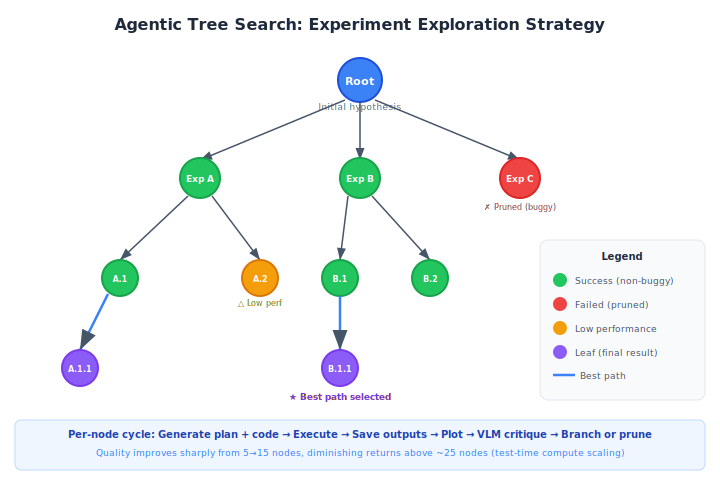

# Agentic Tree Search

**Agentic Tree Search** is an experiment exploration strategy used by [The AI Scientist](../core-concepts/the-ai-scientist.md) (template-free mode) to systematically explore a tree of experimental directions, using extra test-time compute to find better research outcomes [^1].

## Overview

Instead of running experiments sequentially (as in the template-based mode or [Autoresearch](../tools-platforms/autoresearch.md)), agentic tree search structures experimentation as a tree where each node represents an experiment. Nodes branch when an experiment suggests multiple follow-up directions, and are pruned when they fail or underperform.

## Background / Theoretical Foundations

Tree search has a long history in AI, from minimax in game-playing to Monte Carlo Tree Search (MCTS) in AlphaGo [^2]. The key insight of agentic tree search is applying this exploration strategy to *scientific experimentation* rather than game states.

The theoretical motivation comes from three sources:

- **Test-time compute scaling**: Snell et al. (2024) demonstrated that allocating more compute at inference time — through search, verification, and self-correction — can be more effective than scaling model parameters alone [^3]. Agentic tree search applies this principle to research: more experimental "thinking" (nodes explored) yields better results.
- **LLM-guided search**: Unlike classical MCTS which uses random rollouts, agentic tree search uses an LLM to propose branches. This is related to work on Language Agent Tree Search (LATS) by Zhou et al. (2024), which combines LLM reasoning with tree search for complex decision-making [^4].
- **Scientific method as search**: Research can be formalized as search over hypothesis space. Each experiment narrows the space, and branching represents the multiple directions a result might suggest. This framing connects to Langley et al.'s (1987) work on computational scientific discovery [^5].

**Learning application**: For students of AI research methodology, agentic tree search illustrates how structured exploration outperforms unstructured trial-and-error. The same principle applies to learning itself — systematically exploring subtopics (breadth) while going deep on promising areas (depth) mirrors the explore-exploit tradeoff in tree search.

## Architecture



### Node Structure

Each node in the tree contains:
- **Experiment script** -- A Python file implementing the experiment
- **High-level plan** -- Textual description of what the experiment tests
- **Error trace** -- Execution errors, if applicable
- **Runtime** -- Wall-clock execution time
- **Performance metrics** -- Training/validation metrics from the run
- **Plots** -- Generated visualizations
- **VLM feedback** -- Critique from a [vision-language model](../methodologies/vlm-integration.md)
- **Status** -- Buggy or non-buggy

### Execution Cycle Per Node

```
1. Generate plan + code     (Claude Sonnet 4)
2. Execute in Python interpreter
   ├── Error? --> Mark buggy, record error, stop
   └── Success? --> Continue
3. Save outputs to numpy files
4. Generate plots
5. VLM critique of plots    (GPT-4o)
   ├── Issues? --> Mark buggy, record feedback
   └── Clean? --> Mark non-buggy
6. Branch: propose child experiments
```

### Tree Growth Strategy

The tree grows through four stages, mirroring the scientific method:

| Stage | Purpose | Node Types |
|-------|---------|------------|
| 1. Preliminary Investigation | Establish baselines and validate approach | Initial experiments |
| 2. Hyperparameter Tuning | Optimize key parameters | Grid/random search nodes |
| 3. Research Agenda Execution | Test core hypotheses | Main experiment nodes |
| 4. Ablation Studies | Isolate component contributions | Controlled removal experiments |

### Aggregation

After tree exploration completes, the system selects the **best-performing path** through the tree. Results from this path form the basis of the manuscript. The aggregation considers:
- Validation performance
- Experimental coherence (do the experiments tell a story?)
- Figure quality (VLM-assessed)

## Performance Scaling

The AI Scientist paper shows that research quality improves with the number of experimental nodes explored:

```
Quality
  ^
  |        ___________
  |      /
  |    /
  |  /
  | /
  +-------------------> Number of nodes
  5    10   15   20   25   30
```

This demonstrates that **test-time compute** (more experiments) directly translates to better research output.

## Comparison with Linear Experimentation

| Aspect | Tree Search | Linear (Autoresearch-style) |
|--------|------------|---------------------------|
| Exploration | Breadth + depth | Depth only |
| Parallelism | Natural branching | Sequential |
| Failure handling | Prune branch, try alternatives | Reset and retry |
| Best for | Open-ended exploration | Targeted optimization |
| Overhead | Higher (tree management) | Minimal |

## Connection to MCTS

Agentic tree search draws conceptual parallels with **Monte Carlo Tree Search (MCTS)**, the algorithm behind AlphaGo:
- Both explore a tree of possibilities
- Both use evaluation feedback to guide exploration
- Both balance exploration (new directions) vs. exploitation (refining promising paths)

However, agentic tree search uses LLM-generated plans as the branching heuristic rather than random rollouts.

## Current State / Latest Developments

As of 2026, agentic tree search has moved from a research prototype to a core component of The AI Scientist v2's template-free mode [^1]. Key developments:

- **Adaptive branching**: Later iterations dynamically adjust the branching factor based on result uncertainty — high-variance results trigger more branches, while clear results proceed linearly [^1].
- **VLM-in-the-loop pruning**: Vision-language models evaluate experimental plots at each node, pruning branches with visualization artifacts before they waste compute [^6].
- **Multi-objective search**: Recent work explores balancing novelty and performance in the tree objective, rather than optimizing performance alone [^7].

## Limitations / Challenges

- **Computational cost**: Exploring a 25-node tree requires ~25x the compute of a single linear experiment, making it expensive for large-scale experiments.
- **LLM branching quality**: The quality of proposed branches depends heavily on the LLM's scientific understanding. Weak models propose redundant or trivial variations.
- **No theoretical guarantees**: Unlike MCTS (which converges to optimal play given enough rollouts), agentic tree search lacks formal convergence properties.
- **Aggregation difficulty**: Selecting the "best path" through the tree for manuscript generation is subjective and may miss important negative results on pruned branches.

## See Also

- [The AI Scientist](../core-concepts/the-ai-scientist.md)
- [Template-Free Research](../methodologies/template-free-research.md)
- [Automated Experiment Design](../methodologies/automated-experiment-design.md)
- [Vision-Language Model Integration](../methodologies/vlm-integration.md)
- [Scaling Laws for Research Automation](../frontier-topics/scaling-laws-research.md)
- [Predictive Simulation Learning](../frontier-topics/predictive-simulation-learning.md) — uses simulation to predict experimental outcomes before running them
- [Tracking AI Research](../research-sources/tracking-ai-research.md) — discovering new experiment directions from the literature

## References

[^1]: Lu, C. et al. (2026). "Towards end-to-end automation of AI research." *Nature*, 651(8107).

[^2]: Silver, D. et al. (2016). "Mastering the game of Go with deep neural networks and tree search." *Nature*, 529, 484--489. [doi:10.1038/nature16961](https://doi.org/10.1038/nature16961)

[^3]: Snell, C. et al. (2024). "Scaling LLM Test-Time Compute Optimally can be More Effective than Scaling Model Parameters." [arXiv:2408.03314](https://arxiv.org/abs/2408.03314)

[^4]: Zhou, A. et al. (2024). "Language Agent Tree Search Unifies Reasoning, Acting, and Planning in Language Models." [arXiv:2310.04406](https://arxiv.org/abs/2310.04406)

[^5]: Langley, P. et al. (1987). *Scientific Discovery: Computational Explorations of the Creative Processes.* MIT Press.

[^6]: OpenAI (2024). "GPT-4o System Card." [openai.com/research](https://openai.com/research/gpt-4o-system-card)

[^7]: Lehman, J. et al. (2020). "Abandoning Objectives: Evolution Through the Search for Novelty Alone." [arXiv:2008.08639](https://arxiv.org/abs/2008.08639)
