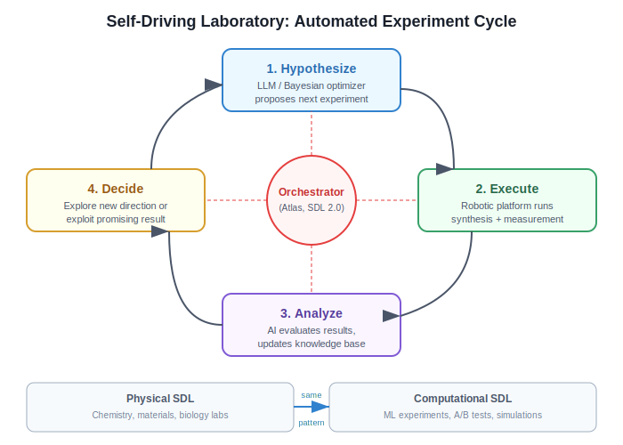

# Automated Experiment Design

**Automated Experiment Design** refers to AI systems that plan, implement, execute, and evaluate scientific experiments without human intervention. It is the operational core of systems like [The AI Scientist](../core-concepts/the-ai-scientist.md) and [Autoresearch](../tools-platforms/autoresearch.md).

## Overview

In traditional research, a human scientist designs experiments based on intuition, literature knowledge, and theoretical understanding. Automated experiment design replaces this with LLM-driven planning, where the model:

1. Identifies what hypothesis to test
2. Plans the experimental methodology
3. Writes the implementation code
4. Executes and collects results
5. Analyzes outcomes and plans next steps

## Background / Theoretical Foundations

Automated experiment design has roots in several fields:

- **Design of experiments (DoE)**: Fisher (1935) established statistical principles for efficient experimentation — randomization, replication, and blocking [^4]. Modern automated experiment design applies these principles computationally, with LLMs replacing human judgment about which experiments to run next.
- **Bayesian optimization**: Snoek et al. (2012) applied Bayesian optimization to hyperparameter tuning, using a surrogate model to predict which configurations are worth testing [^5]. This is the mathematical foundation for sequential experiment selection.
- **Active learning**: The idea that a learner should choose which data points to query next (Settles, 2009) directly parallels automated experiment design — the system chooses which experiments to run based on expected information gain [^6].
- **Autonomous scientific agents**: Boiko et al. (2023) demonstrated with Coscientist that LLM agents can design and execute chemistry experiments end-to-end, establishing the feasibility of fully autonomous experiment design beyond ML [^7].

**Learning application**: Understanding automated experiment design teaches a transferable skill: structured experimentation. Whether optimizing a machine learning model, A/B testing a product feature, or designing a research study, the same principles apply — define metrics clearly, control variables systematically, and use results to inform next steps.

## Approaches

### Sequential Loop (Autoresearch)

The simplest approach: propose one change, test it, keep or discard, repeat.

```
Baseline --> Propose --> Run (5 min) --> Evaluate --> Keep/Discard --> Repeat
```

**Strengths:** Simple, easy to track, minimal overhead
**Weaknesses:** No parallel exploration, local optima risk

### Staged Pipeline (AI Scientist, Template-Based)

Four sequential stages with different experimental objectives:

1. **Preliminary investigation** -- Validate approach, establish baselines
2. **Hyperparameter tuning** -- Systematic optimization
3. **Research execution** -- Core hypothesis testing
4. **Ablation studies** -- Component contribution analysis

**Strengths:** Structured, mirrors human research methodology
**Weaknesses:** Fixed pipeline may miss opportunities

### Tree Search (AI Scientist, Template-Free)

Branching exploration with pruning. See [Agentic Tree Search](../methodologies/agentic-tree-search.md).

**Strengths:** Explores broadly, handles failure gracefully
**Weaknesses:** Higher compute cost, complex orchestration

### Code Space Search (AIDE)

Treats the space of all possible programs as the search domain. See [AIDE](../tools-platforms/aide.md).

**Strengths:** Unconstrained solution space
**Weaknesses:** High variance, harder to interpret

## Common Design Patterns

### Fixed Time Budget
Both Autoresearch (5 minutes per run) and The AI Scientist use fixed time budgets per experiment. This enables fair comparison across experiments with different architectures or hyperparameters.

### Single Metric Optimization
Autoresearch uses `val_bpb`; The AI Scientist evaluates on task-specific metrics. Having a single, clear optimization target simplifies the keep/discard decision.

### Experimental Journal
Systems that maintain notes across experiments (The AI Scientist's journal, Autoresearch's `results.tsv`) perform better because they can learn from past failures and build on past successes.

### Git-Based Version Control
Both systems use git commits to track each experimental state, enabling clean rollback on failure and full reproducibility.

## Failure Handling

A critical aspect of automated experimentation:

| Failure Type | Detection | Response |
|-------------|-----------|----------|
| Syntax error | Immediate | Auto-fix and retry |
| Runtime crash | During execution | Log error, discard experiment |
| OOM | During execution | Reduce batch/model size, retry |
| Performance regression | After evaluation | Discard, log insight |
| Hanging process | Timeout | Kill and discard |

## Current State / Latest Developments

As of 2026, automated experiment design has matured across several dimensions:

- **Multi-modal experiments**: Systems now design experiments involving text, images, and code simultaneously, enabled by vision-language models[^8]. The AI Scientist v2 uses GPT-4o for automated figure critique as part of its experiment evaluation pipeline[^9].
- **Cost-aware design**: Recent systems balance expected information gain against compute cost, avoiding expensive experiments when cheaper ones suffice[^1]. This is particularly important as experiment budgets scale — running hundreds of experiments per paper requires careful resource allocation.
- **Cross-domain transfer**: Experiment design strategies learned in one domain (e.g., NLP) can transfer to others (e.g., computer vision), suggesting general-purpose experiment planning is feasible[^3].
- **Tree-structured exploration**: The AI Scientist v2's [Agentic Tree Search](agentic-tree-search.md) represents a major advance, allowing the system to maintain multiple experimental branches and backtrack from dead ends rather than committing to a single path[^9]. This mirrors how expert researchers maintain multiple hypotheses simultaneously.
- **MLE-bench standardization**: Chan et al. (2025) introduced MLE-bench, a standardized benchmark for evaluating ML engineering agents on Kaggle-style tasks[^10]. This provides the first rigorous comparison of automated experiment design approaches, with [AIDE](../tools-platforms/aide.md) achieving 16.9% solve rates compared to 8.7% for baselines.
- **Foundation model improvements**: The progression from GPT-4 to o3/o4-mini and Claude Sonnet 4 has qualitatively improved experiment design — reasoning models generate more creative hypotheses while coding models implement them more reliably[^9]. See [Foundation Models for Research](../core-concepts/foundation-models-for-research.md).
- **Application to real-world learning**: Automated experiment design principles are being applied to educational contexts, where AI tutors design personalized learning experiments — test a teaching approach, measure comprehension, adjust strategy[^11]. This connects experiment design to the broader goal of AI-accelerated learning.

## Self-Driving Laboratories (2025–2026)

A major frontier for automated experiment design is the **self-driving laboratory (SDL)** — physical lab systems that automate the entire scientific method from hypothesis generation through data analysis. This represents the extension of automated experiment design from computational experiments (ML training runs) to physical-world experiments (chemistry, materials science, biology).

### SDL Architecture



Self-driving laboratories integrate three components:[^12]
1. **AI decision engine** — LLM or Bayesian optimization system that plans experiments
2. **Robotic execution** — Automated synthesis, measurement, and characterization hardware
3. **Orchestration software** — Scheduling, data management, and safety protocols that connect AI to robots

### Key Systems

- **Atlas (2025):** An orchestration framework serving as a "brain" for self-driving laboratories, integrating scheduling, data management, and safety protocols for autonomous lab systems[^13]
- **SDL 2.0 (2026):** Describes the next generation of self-driving labs — flexible, scalable, collaborative discovery engines with modular hardware, AI-driven decision-making, and cross-lab orchestration[^14]
- **INS2ANE (2025):** A novelty-driven framework for autonomous experimentation that goes beyond optimization to discover entirely new phenomena using novelty scoring and strategic sampling[^15]

### Bayesian Optimization for Experiment Planning

Bayesian optimization remains the mathematical backbone of sequential experiment design. Recent advances include optimization over **problem formulation space** itself — rather than just optimizing within a fixed experimental setup, the AI identifies optimal design formulations, choosing what to measure and how[^16]. This meta-level optimization connects to [open-ended discovery](../frontier-topics/open-ended-discovery.md) principles: the system explores the space of possible experiments, not just the space within an experiment.

### AutoLabs: Multi-Agent Chemical Experimentation (2025)

AutoLabs (Patel et al., 2025) introduced a **self-correcting, multi-agent architecture** that translates natural-language experiment descriptions into executable protocols for high-throughput liquid handlers[^17]. The system:

1. Engages users in dialogue to clarify experimental goals
2. Decomposes goals into discrete tasks for specialized agents
3. Performs tool-assisted stoichiometric calculations
4. Self-validates the generated protocol before execution

Through an ablation study of 20 agent configurations, AutoLabs found that **agent reasoning capacity** is the most critical factor for success, reducing quantitative errors (nRMSE) by over 85% in complex tasks. Combined with multi-agent architecture and iterative self-correction, AutoLabs achieves near-expert procedural accuracy (F1 > 0.89) on challenging multi-step syntheses.

**Learning connection:** AutoLabs demonstrates the principle that breaking complex experimental design into specialized sub-tasks — each handled by a domain-expert agent — outperforms monolithic approaches. This mirrors effective team-based research: a statistician designs the analysis, a chemist designs the synthesis, and a coordinator ensures coherence.

### AutoResearch-RL: Perpetual Self-Evaluating Agents (2026)

AutoResearch-RL (2026) formalized automated experiment design as a **Markov Decision Process** where a reinforcement learning agent conducts open-ended neural architecture and hyperparameter research without human supervision[^18]. At each step, the agent:

1. Proposes a code modification to a target training script
2. Executes it under a fixed wall-clock time budget
3. Observes a scalar reward (validation bits-per-byte)
4. Updates its policy via Proximal Policy Optimization (PPO)

```
┌─────────────────────────────────────────────────────────────┐
│           AutoResearch-RL: EXPERIMENT AS MDP                │
│                                                             │
│  ┌──────────┐   ┌──────────┐   ┌──────────┐   ┌────────┐  │
│  │  STATE   │──▶│  ACTION  │──▶│ EXECUTE  │──▶│ REWARD │  │
│  │ past exp │   │ code edit│   │ train.py │   │val-bpb │  │
│  │ outcomes │   │ proposal │   │ w/ budget│   │ score  │  │
│  └──────────┘   └──────────┘   └──────────┘   └────────┘  │
│       ▲                                            │       │
│       └────────────── PPO policy update ───────────┘       │
│                                                             │
│  Key separation:                                            │
│  • Frozen: data pipeline, eval protocol (fair comparison)   │
│  • Mutable: train.py (agent's editable state)              │
│  • Meta: RL agent (accumulates trajectory knowledge)        │
└─────────────────────────────────────────────────────────────┘
```

The key design separates three concerns: (i) a **frozen environment** (data pipeline, evaluation protocol) guaranteeing fair comparison, (ii) a **mutable target file** representing the agent's editable state, and (iii) a **meta-learner** that accumulates experiment outcomes. On a single-GPU nanochat benchmark, AutoResearch-RL discovered configurations matching or exceeding hand-tuned baselines after ~300 overnight iterations with no human intervention. This directly extends [recursive self-improvement](../frontier-topics/recursive-self-improvement.md) principles to experiment design.

### Learning Application: From SDL to Everyday Experimentation

Self-driving lab principles transfer to any domain with structured experimentation. For [e-commerce](../frontier-topics/ai-ecommerce-learning.md), the SDL pattern maps to automated A/B testing platforms: an AI decision engine proposes test variants, the platform executes them with real users, and orchestration software manages traffic allocation and statistical analysis. The key lesson: **let the AI decide what to test next**, not just how to run the test.

## Limitations / Challenges

- **Novelty vs. exploitation**: Automated systems tend toward incremental experiments that optimize known approaches, rather than creative leaps that test fundamentally new ideas.
- **Safety in physical experiments**: For chemistry, biology, or robotics experiments, automated design must incorporate safety constraints that are difficult to formalize. SDL systems require robust emergency stops and containment protocols[^12].
- **Evaluation complexity**: When the metric is easy to game (e.g., overfitting to a validation set), automated experiment design can exploit rather than genuinely improve.
- **Hardware integration**: Self-driving labs face unique challenges in robotic reliability, instrument calibration drift, and cross-lab reproducibility that are absent in purely computational experiment design[^14].

## See Also

- [The AI Scientist](../core-concepts/the-ai-scientist.md) — primary system implementing automated experiment design
- [Automated Scientific Discovery](../core-concepts/automated-scientific-discovery.md) — the broader goal experiment design serves
- [Foundation Models for Research](../core-concepts/foundation-models-for-research.md) — models that power automated experiment design
- [Automated Peer Review](../core-concepts/automated-peer-review.md) — evaluating the output of automated experiments
- [Autoresearch](../tools-platforms/autoresearch.md) — sequential experiment loop implementation
- [AIDE](../tools-platforms/aide.md) — code-space search for ML experiments
- [Agentic Tree Search](agentic-tree-search.md) — structured tree exploration for experiments
- [Template-Free Research](template-free-research.md) — open-ended experiment design without scaffolding
- [Wiki Quality Benchmarking](wiki-quality-benchmarking.md) — the same experiment-driven approach applied to wiki articles
- [VLM Integration](vlm-integration.md) — visual evaluation in experiment pipelines
- [Predictive Simulation Learning](../frontier-topics/predictive-simulation-learning.md) — simulating experiments before running them
- [Recursive Self-Improvement](../frontier-topics/recursive-self-improvement.md) — experiment loops that improve their own design process
- [AI E-Commerce Learning](../frontier-topics/ai-ecommerce-learning.md) — A/B testing as experiment design in e-commerce
- [Scaling Laws for Research Automation](../frontier-topics/scaling-laws-research.md) — how experiment quality scales with compute
- [Tracking AI Research](../research-sources/tracking-ai-research.md) — monitoring new experiment design approaches
- [Key Papers](../research-sources/key-papers.md) — foundational papers on automated experimentation
- [Institutions and Labs](../research-sources/institutions-and-labs.md) — research groups advancing experiment automation

## References

[^1]: Lu, C. et al. (2026). "Towards end-to-end automation of AI research." *Nature*, 651(8107).

[^2]: Karpathy, A. (2025). "Autoresearch." [github.com/karpathy/autoresearch](https://github.com/karpathy/autoresearch)

[^3]: Jiang, Z. et al. (2025). "AIDE: AI-driven exploration in the space of code." [arXiv:2502.13138](https://arxiv.org/abs/2502.13138)

[^4]: Fisher, R. A. (1935). *The Design of Experiments.* Oliver & Boyd.

[^5]: Snoek, J. et al. (2012). "Practical Bayesian Optimization of Machine Learning Algorithms." [arXiv:1206.2944](https://arxiv.org/abs/1206.2944)

[^6]: Settles, B. (2009). "Active Learning Literature Survey." University of Wisconsin-Madison, CS Technical Report 1648.

[^7]: Boiko, D. et al. (2023). "Autonomous chemical research with large language models." *Nature*, 624, 570-578. [doi:10.1038/s41586-023-06792-0](https://doi.org/10.1038/s41586-023-06792-0)

[^8]: OpenAI (2024). "GPT-4o System Card." [openai.com/research](https://openai.com/research/gpt-4o-system-card)

[^9]: Yamada, Y. et al. (2025). "AI Scientist v2: Workshop-Level Automated Scientific Discovery." [arXiv:2504.08066](https://arxiv.org/abs/2504.08066)

[^10]: Chan, J. et al. (2025). "MLE-bench: Evaluating Machine Learning Agents on Machine Learning Engineering." [arXiv:2410.07095](https://arxiv.org/abs/2410.07095)

[^11]: VanLehn, K. (2025). "The Relative Effectiveness of Human Tutoring, Intelligent Tutoring Systems, and Other Tutoring Systems." *Educational Psychologist*, 46(4), 197-221. [doi:10.1080/00461520.2011.611369](https://doi.org/10.1080/00461520.2011.611369)

[^12]: Various (2025). "Autonomous 'Self-Driving' Laboratories: A Review of Technology and Policy Implications." *Royal Society Open Science*, 12(7). [doi:10.1098/rsos.250646](https://royalsocietypublishing.org/rsos/article/12/7/250646)

[^13]: Various (2025). "Atlas: A Brain for Self-Driving Laboratories." *Digital Discovery*. [doi:10.1039/D4DD00115J](https://doi.org/10.1039/D4DD00115J)

[^14]: Various (2026). "Toward Self-Driving Laboratory 2.0 for Chemistry and Materials Discovery." *Materials Horizons*. [doi:10.1039/D5MH01984B](https://doi.org/10.1039/D5MH01984B)

[^15]: Various (2025). "Beyond Optimization: Exploring Novelty Discovery in Autonomous Experiments (INS2ANE)." *ACS Nanoscience Au*. [doi:10.1021/acsnanoscienceau.5c00106](https://doi.org/10.1021/acsnanoscienceau.5c00106)

[^16]: Various (2025). "Towards Autonomous Experimentation: Bayesian Optimization over Problem Formulation Space." [arXiv:2502.05735](https://arxiv.org/abs/2502.05735)

[^17]: Patel, V. et al. (2025). "AutoLabs: Cognitive Multi-Agent Systems with Self-Correction for Autonomous Chemical Experimentation." [arXiv:2509.25651](https://arxiv.org/abs/2509.25651)

[^18]: Various (2026). "AutoResearch-RL: Perpetual Self-Evaluating Reinforcement Learning Agents for Autonomous Neural Architecture Discovery." [arXiv:2603.07300](https://arxiv.org/abs/2603.07300)
