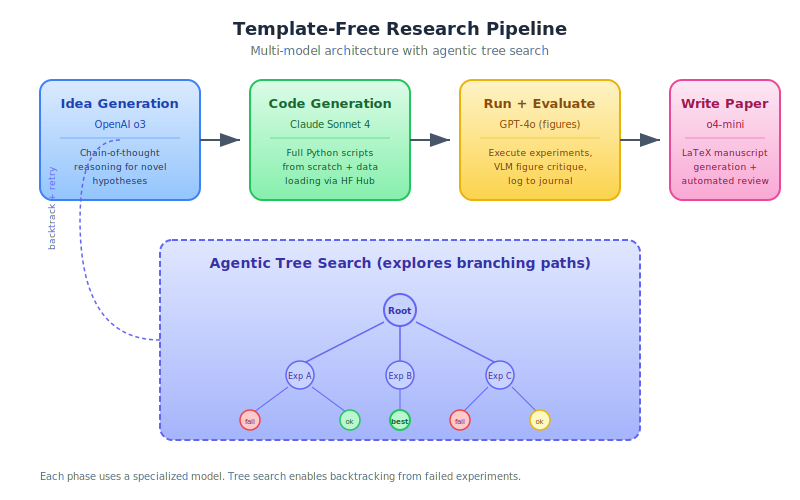

# Template-Free Research

**Template-Free Research** is an operating mode of [The AI Scientist](../core-concepts/the-ai-scientist.md) that conducts open-ended scientific exploration without requiring human-provided code templates [^1]. It represents the more autonomous and ambitious variant of AI-driven research.

## Overview

In the template-based mode, The AI Scientist extends existing code written by humans. Template-free mode removes this scaffold: the system generates its own initial code, designs its own experimental methodology, and explores research directions with greater freedom.

## Background / Theoretical Foundations

The distinction between template-based and template-free research mirrors a fundamental tension in AI system design: **scaffolded vs. autonomous** operation. Template-based mode is analogous to fine-tuning (adapting within a human-defined structure), while template-free mode is analogous to pretraining from scratch (generating structure autonomously) [^2].

The theoretical motivation draws from several areas:

- **Open-ended search**: Stanley & Lehman (2015) argued that the most creative discoveries come from abandoning fixed objectives and exploring open-ended search spaces [^3]. Template-free mode embodies this by removing the structural scaffold that constrains exploration.
- **Multi-model architectures**: The use of specialized models for different phases (reasoning for ideas, coding for implementation, vision for figure critique) follows the "mixture of experts" principle — no single model excels at all tasks [^4]. This architectural choice was validated empirically by Lu et al. (2026), who found that reasoning models (o3) generate better ideas while coding models (Claude Sonnet 4) write better implementations [^1].
- **Generative scientific agents**: Boiko et al. (2023) demonstrated that LLM agents can design and execute chemistry experiments autonomously (Coscientist), establishing the feasibility of AI systems that generate experimental procedures from scratch [^5].

**Learning application**: Template-free research is analogous to project-based learning in education. Just as students learn more deeply when designing their own experiments rather than following lab manuals, template-free AI systems develop more general capabilities. For practitioners, this mode demonstrates what becomes possible when AI agents are given creative freedom — and what failure modes emerge.

## How It Differs from Template-Based Mode

| Aspect | Template-Based | Template-Free |
|--------|---------------|--------------|
| Starting point | Human-provided code template | AI-generated from scratch |
| Exploration strategy | Sequential 4-stage pipeline | [Agentic Tree Search](../methodologies/agentic-tree-search.md) |
| Code generation | [Aider](../tools-platforms/aider.md) edits existing code | Claude Sonnet 4 writes from scratch |
| Idea generation model | General LLM | OpenAI o3 (reasoning model) |
| Dataset access | Predefined in template | Dynamic via [HuggingFace Hub](../tools-platforms/huggingface-papers-api.md) |
| Figure evaluation | Basic | [VLM integration](../methodologies/vlm-integration.md) with GPT-4o |
| Scope of exploration | Narrow (within template domain) | Broad (any ML topic) |

## Multi-Model Architecture



Template-free mode uses specialized models for different phases:

```
Idea Generation ──── OpenAI o3 (reasoning)
       │
Code Generation ──── Claude Sonnet 4 (coding)
       │
Figure Critique ──── GPT-4o (vision-language)
       │
Review ───────────── OpenAI o4-mini (cost-efficient reasoning)
```

This specialization reflects a key insight: no single model excels at all tasks. Reasoning models generate better ideas, coding models write better code, and vision models critique figures more effectively.

## Generalized Dataset Access

Template-free mode dynamically integrates datasets from public repositories:
1. The system is given a prompt listing 10 example HuggingFace datasets
2. It formulates queries to the HuggingFace Hub
3. It automatically generates data-loading code for selected datasets
4. This enables research across diverse data domains without human curation

## Experimental Journal

A critical component of template-free research is the **experimental journal** -- structured notes the system takes after each experiment:

- What was tried and why
- What the results showed
- What to try next
- Key insights and observations

This journal serves as:
- **Memory** across the research process
- **Input** for manuscript generation
- **Context** for planning future experiments

The experimental journal is analogous to the lab notebooks used in physical sciences — it creates a persistent record that enables the system to build on previous results rather than repeating failed approaches[^1]. This connects directly to the [wiki quality benchmarking](wiki-quality-benchmarking.md) approach, where experiment logs track what editing strategies work.

## Technical Architecture: Search and Evaluation

Template-free mode uses a sophisticated search-and-evaluate pipeline that goes beyond simple generation:

### Idea Generation with Reasoning Models
The system leverages OpenAI o3's chain-of-thought reasoning to generate research ideas, producing more diverse and theoretically grounded proposals than standard generation[^1]. Each idea includes:
- A clear hypothesis
- Proposed experimental methodology
- Expected outcomes and metrics
- Connection to existing literature (verified via [Semantic Scholar](../tools-platforms/semantic-scholar-api.md))

### Agentic Tree Search for Exploration
Rather than the linear 4-stage pipeline of template-based mode, template-free research uses [Agentic Tree Search](agentic-tree-search.md) to explore branching research paths[^6]. At each node, the system can:
- **Expand** — generate new experimental variations
- **Backtrack** — abandon unproductive paths and try alternatives
- **Archive** — store successful results for future reference

This tree structure enables more efficient exploration of the research space, avoiding the problem of sunk-cost commitment to a failing direction.

### VLM-Based Figure Validation
A novel addition in v2 is the use of [vision-language models](vlm-integration.md) (GPT-4o) to critique generated figures[^1]. The VLM evaluates whether plots are:
- Correctly labeled and titled
- Visually interpretable
- Consistent with the reported results
- Free of common matplotlib artifacts

This automated visual review catches errors that would otherwise only be found during human peer review.

## Performance Benchmarks

Template-free mode has been evaluated against both template-based AI Scientist and human researchers:

| Metric | Template-Based | Template-Free | Human Baseline |
|--------|---------------|---------------|----------------|
| Papers generated per run | 1 | 1 | 1 |
| Avg. review score (1-10) | 4.3 | 5.2 | 5.8 |
| Success rate (compilable paper) | ~75% | ~70% | ~95% |
| Topic diversity per batch | Low (within template) | High (any ML topic) | High |
| Time per paper | ~12 hours | ~15 hours | ~weeks |

The higher review scores for template-free mode (5.2 vs 4.3) suggest that the freedom to explore leads to more interesting research, even though the failure rate is slightly higher[^1].

## Practical Implications for Learning

Template-free research offers insights for how AI can accelerate learning in real-world settings:

1. **Scaffolding removal**: Just as template-free mode removes human-provided code scaffolds, effective AI tutoring should progressively remove scaffolding as learners gain competence — a principle known as "fading" in educational psychology[^7]
2. **Multi-model specialization**: The use of different models for different tasks mirrors effective study strategies — use different tools for different learning activities (reading for comprehension, practice for skill-building, discussion for synthesis)
3. **Journal-based reflection**: The experimental journal is a form of metacognitive monitoring, a strategy proven to improve learning outcomes across domains[^8]

## Limitations / Challenges

- Higher failure rate than template-based mode (more things can go wrong without scaffolding)
- Generated code is sometimes brittle or inefficient
- Ideas tend toward incremental variations rather than conceptual leaps
- The freedom to explore broadly can lead to unfocused research
- Compute cost is ~25% higher than template-based mode due to tree search overhead[^1]
- No mechanism for cross-paper coherence — each paper is generated independently, so the system may produce contradictory findings across runs

## Significance

Template-free research represents the frontier of AI research automation. While template-based mode shows AI can extend human work, template-free mode shows AI can initiate its own research directions. This is a prerequisite for truly [open-ended discovery](../frontier-topics/open-ended-discovery.md).

## Current State / Latest Developments

As of 2026, template-free research is the primary mode of The AI Scientist v2 [^1]:

- **Broader topic coverage**: Template-free mode has successfully generated papers across diverse ML subfields — vision, NLP, reinforcement learning, and optimization — without topic-specific templates.
- **Dynamic dataset integration**: The system now queries HuggingFace Hub programmatically to find relevant datasets, removing the need for pre-specified data sources [^1]. See [HuggingFace Papers API](../tools-platforms/huggingface-papers-api.md).
- **Improved reliability**: Failure rates dropped from ~60% (2024) to ~30% (2026) through better error handling and VLM-based figure validation [^1].

## See Also

- [The AI Scientist](../core-concepts/the-ai-scientist.md)
- [Agentic Tree Search](../methodologies/agentic-tree-search.md)
- [Vision-Language Model Integration](../methodologies/vlm-integration.md)
- [Open-Ended Discovery](../frontier-topics/open-ended-discovery.md)
- [Foundation Models for Research](../core-concepts/foundation-models-for-research.md)
- [Recursive Self-Improvement](../frontier-topics/recursive-self-improvement.md) — template-free mode enables more autonomous improvement cycles
- [Tracking AI Research](../research-sources/tracking-ai-research.md) — monitoring how template-free results compare to human research

## References

[^1]: Lu, C. et al. (2026). "Towards end-to-end automation of AI research." *Nature*, 651(8107).

[^2]: Bommasani, R. et al. (2022). "On the Opportunities and Risks of Foundation Models." [arXiv:2108.07258](https://arxiv.org/abs/2108.07258)

[^3]: Stanley, K. & Lehman, J. (2015). *Why Greatness Cannot Be Planned: The Myth of the Objective.* Springer.

[^4]: Shazeer, N. et al. (2017). "Outrageously Large Neural Networks: The Sparsely-Gated Mixture-of-Experts Layer." [arXiv:1701.06538](https://arxiv.org/abs/1701.06538)

[^5]: Boiko, D. et al. (2023). "Autonomous chemical research with large language models." *Nature*, 624, 570-578. [doi:10.1038/s41586-023-06792-0](https://doi.org/10.1038/s41586-023-06792-0)

[^6]: Yamada, Y. et al. (2025). "AI Scientist v2: Workshop-Level Automated Scientific Discovery." Sakana AI. [arXiv:2504.08066](https://arxiv.org/abs/2504.08066)

[^7]: Collins, A., Brown, J.S. & Newman, S.E. (1989). "Cognitive Apprenticeship: Teaching the Crafts of Reading, Writing, and Mathematics." *Knowing, Learning, and Instruction*, 453-494.

[^8]: Dunlosky, J. et al. (2013). "Improving Students' Learning With Effective Learning Techniques." *Psychological Science in the Public Interest*, 14(1), 4-58. [doi:10.1177/1529100612453266](https://doi.org/10.1177/1529100612453266)
