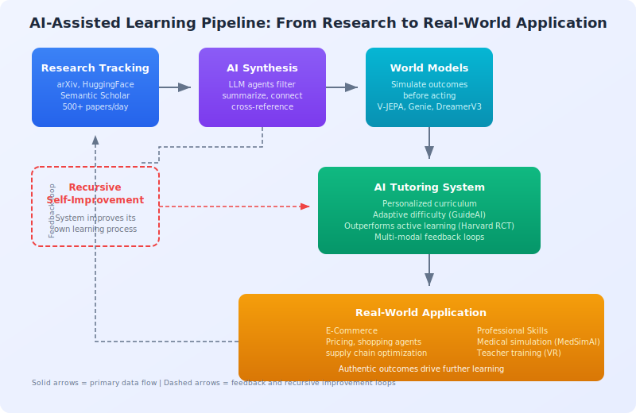

# Tracking AI Research

## Overview

Tracking AI research is the practice of systematically monitoring, filtering, and synthesizing the flood of new publications, preprints, and code releases across artificial intelligence. With over 500 AI papers published daily on arXiv alone[^1], manual tracking is infeasible -- making automated pipelines essential for researchers, practitioners, and AI systems alike. This article covers the APIs, feeds, tools, and workflows that form the infrastructure layer powering automated literature review in systems like [The AI Scientist](../core-concepts/the-ai-scientist.md) and [Autoresearch](../tools-platforms/autoresearch.md).

## Background / Theoretical Foundations

The challenge of research tracking has grown exponentially with the AI boom. Between 2019 and 2025, the annual volume of AI papers on arXiv increased roughly threefold[^2], outpacing any individual's ability to stay current. Traditional approaches -- attending conferences, subscribing to journals, following citation chains -- were designed for a slower era.

Modern research tracking draws on three foundational ideas:

1. **Information retrieval** -- Keyword, semantic, and citation-graph search over large corpora (see [Semantic Scholar API](../tools-platforms/semantic-scholar-api.md))
2. **Recommender systems** -- Personalized paper feeds that learn researcher preferences, analogous to the recommendation engines used in [AI E-Commerce Learning](../frontier-topics/ai-ecommerce-learning.md)[^3]
3. **Agentic literature review** -- LLM-based agents that autonomously search, filter, summarize, and synthesize papers as part of the research pipeline (see [Automated Scientific Discovery](../core-concepts/automated-scientific-discovery.md))

The shift from passive reading to active, agent-driven tracking is a key enabler of fully automated research workflows. Predictive simulation systems (see [Predictive Simulation Learning](../frontier-topics/predictive-simulation-learning.md)) also benefit from continuous tracking, as new world-model papers inform simulation architecture choices.

The diagram below shows how research tracking feeds into the full AI-assisted learning pipeline -- from paper discovery through synthesis and simulation to real-world application:



## APIs for Programmatic Access

### Primary APIs

| API | Best For | Auth | Rate Limit |
|-----|----------|------|------------|
| [HuggingFace Papers](../tools-platforms/huggingface-papers-api.md) | Daily curated AI/ML papers | None | None (CDN) |
| [Semantic Scholar](../tools-platforms/semantic-scholar-api.md) | Deep citation graphs, all fields | Optional | 100 req/5 min |
| arXiv API | Full arXiv access, real-time | None | Polite use |
| OpenAlex | Open bibliographic data | None | 100K/day |
| CrossRef | DOI resolution, metadata | None | Polite pool |

### Integration Patterns

**Daily monitoring pipeline:**
```
HF Papers API (daily feed)
    │
    ├── New paper detected
    │   ├── Semantic Scholar → citation context
    │   ├── arXiv API → full text / PDF
    │   └── Store in local database
    │
    └── Weekly digest generation
```

**Literature review for AI Scientist:**
```
Research idea generated
    │
    ├── Semantic Scholar search (up to 20 rounds)
    │   ├── Title + abstract matching
    │   ├── Citation graph traversal
    │   └── Citation justification generation
    │
    └── Novelty assessment: duplicate? → discard
```

## Curated Feeds and Newsletters

| Source | Format | Frequency | Focus |
|--------|--------|-----------|-------|
| HuggingFace Daily Papers | Web + API | Daily | Community-curated AI/ML |
| Papers With Code | Web + API | Daily | Papers with implementations |
| arXiv Sanity | Web | Daily | Personalized arXiv filtering |
| The Batch (deeplearning.ai) | Newsletter | Weekly | AI news and papers |
| Import AI | Newsletter | Weekly | AI research + policy |
| ML News (Weights & Biases) | Newsletter | Weekly | ML tooling + research |
| Ahead of AI (Sebastian Raschka) | Newsletter | Bi-weekly | Deep technical analysis |

## Social and Community Sources

| Platform | What to Follow |
|----------|---------------|
| X/Twitter | @_akhaliq (daily paper threads), @papers_daily |
| Reddit | r/MachineLearning, r/LocalLLaMA |
| Discord | EleutherAI, HuggingFace, ML Collective |
| YouTube | Yannic Kilcher, Two Minute Papers, 3Blue1Brown |

## Building Your Own Research Tracker

### Minimal Setup (Python)

```python
import requests
from datetime import date

def get_daily_papers():
    """Fetch today's curated papers from HuggingFace."""
    url = "https://huggingface.co/api/daily_papers"
    return requests.get(url).json()["results"]

def search_related(title, limit=5):
    """Find related work via Semantic Scholar."""
    url = "https://api.semanticscholar.org/graph/v1/paper/search"
    params = {"query": title, "limit": limit,
              "fields": "title,abstract,year,citationCount"}
    return requests.get(url, params=params).json().get("data", [])

# Daily routine
for paper in get_daily_papers():
    print(f"NEW: {paper['title']}")
    related = search_related(paper['title'])
    for r in related:
        print(f"  Related: {r['title']} ({r['year']}, {r['citationCount']} cites)")
```

### Advanced Setup

- **Vector database** (Pinecone, Weaviate, ChromaDB) for semantic paper search
- **RSS feeds** from arXiv categories (cs.AI, cs.LG, cs.CL)
- **GitHub trending** for research implementations
- **Conference calendars** for submission deadlines and proceedings

## Conference Proceedings as Sources

| Conference | When | Focus | Acceptance Rate |
|-----------|------|-------|-----------------|
| NeurIPS | December | Broad ML | ~25% |
| ICML | July | Core ML | ~25% |
| ICLR | May | Representation learning | ~32% |
| ACL/EMNLP | Varies | NLP | ~25% |
| CVPR/ICCV/ECCV | Varies | Computer vision | ~25% |
| AAAI | February | Broad AI | ~20% |

## Current State / Latest Developments

The research tracking landscape has matured significantly in 2025-2026:

- **LLM-powered paper agents** -- Tools like Elicit, Consensus, and Semantic Scholar's TLDR feature now use LLMs to summarize and compare papers automatically[^4]. The AI Scientist v2 integrates up to 20 rounds of Semantic Scholar search per paper[^5].
- **Multimodal tracking** -- Vision-language models (see [VLM Integration](../methodologies/vlm-integration.md)) enable agents to parse figures and tables from papers, not just text.
- **Real-time feeds** -- HuggingFace Daily Papers has become the de facto community-curated feed for AI/ML, with same-day coverage of trending preprints.
- **AI-assisted learning applications** -- Research tracking is increasingly integrated into educational AI tutors. A landmark 2025 Harvard RCT showed AI tutoring outperforms traditional active learning[^6], and systems like GuideAI use real-time biosensory feedback to personalize content delivery[^7]. These systems rely on up-to-date research tracking to keep curricula current.

## Limitations / Challenges

1. **Information overload** -- Even automated systems struggle with the sheer volume; filtering for relevance remains an open problem
2. **Citation lag** -- New papers take months to accumulate citations, making impact-based filtering unreliable for recent work
3. **API rate limits** -- Semantic Scholar (100 req/5 min), arXiv (polite use) and others constrain real-time monitoring
4. **Bias toward popular topics** -- Community-curated feeds (HuggingFace, Reddit) over-represent trending topics at the expense of niche but important work
5. **Reproducibility gaps** -- Tracking papers is not the same as tracking reproducible results; see [Automated Experiment Design](../methodologies/automated-experiment-design.md) for approaches to verify claims

## See Also

- [Hugging Face Papers API](../tools-platforms/huggingface-papers-api.md)
- [Semantic Scholar API](../tools-platforms/semantic-scholar-api.md)
- [Key Papers and References](../research-sources/key-papers.md)
- [Research Institutions and Labs](../research-sources/institutions-and-labs.md)
- [The AI Scientist](../core-concepts/the-ai-scientist.md)
- [VLM Integration](../methodologies/vlm-integration.md)
- [Agentic Tree Search](../methodologies/agentic-tree-search.md)
- [Predictive Simulation Learning](../frontier-topics/predictive-simulation-learning.md)
- [Recursive Self-Improvement](../frontier-topics/recursive-self-improvement.md)
- [AI E-Commerce Learning](../frontier-topics/ai-ecommerce-learning.md)

## References

1. HuggingFace Daily Papers. [huggingface.co/papers](https://huggingface.co/papers)
2. Semantic Scholar. [semanticscholar.org](https://www.semanticscholar.org/)
3. arXiv API. [arxiv.org/help/api](https://arxiv.org/help/api/)
4. Papers With Code. [paperswithcode.com](https://paperswithcode.com/)

[^1]: Approximately 500+ AI-related papers are posted daily across cs.AI, cs.LG, cs.CL, and cs.CV categories on arXiv as of 2025.
[^2]: Sevilla, J. et al. (2022). "Compute Trends Across Three Eras of Machine Learning." [arXiv:2202.05924](https://arxiv.org/abs/2202.05924). Updated estimates suggest the trend has accelerated through 2025.
[^3]: Peng, Q. et al. (2025). "A Survey on LLM-powered Agents for Recommender Systems." EMNLP 2025 Findings. [arXiv:2502.10050](https://arxiv.org/abs/2502.10050)
[^4]: Lo, K. et al. (2023). "Semantic Scholar Open Data Platform." [arXiv:2301.10140](https://arxiv.org/abs/2301.10140)
[^5]: Lu, C. et al. (2026). "Towards end-to-end automation of AI research." *Nature*, 651(8107).
[^6]: Kestin, G. et al. (2025). "AI Tutoring Outperforms Active Learning." *Scientific Reports*. [doi:10.1038/s41598-025-97652-6](https://www.nature.com/articles/s41598-025-97652-6)
[^7]: Shukla, A. et al. (2026). "GuideAI: A Real-time Personalized Learning Solution with Adaptive Interventions." [arXiv:2601.20402](https://arxiv.org/abs/2601.20402)
