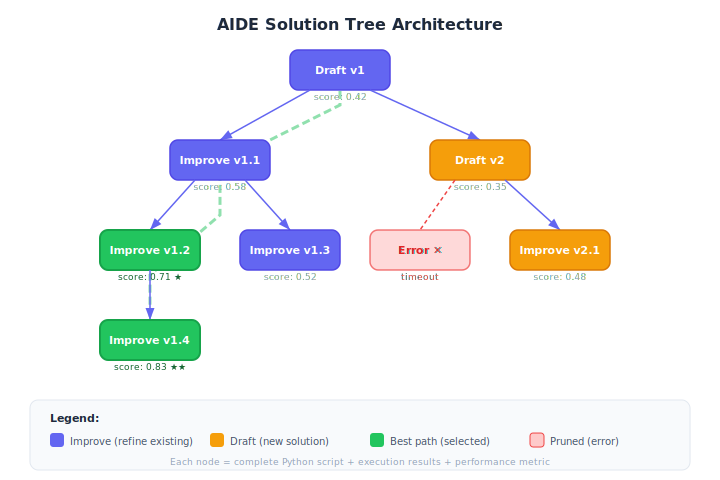

# AIDE: AI-Driven Exploration

**AIDE** (AI-Driven Exploration) is a system for automated machine learning experimentation that explores the space of possible solutions through code generation. It represents a code-centric approach to ML research automation, where the search space is defined by all possible Python programs that solve a given task.

**Paper:** Jiang, Z. et al. (2025). "AIDE: AI-driven exploration in the space of code." [arXiv:2502.13138](https://arxiv.org/abs/2502.13138)

## Overview

Unlike traditional AutoML systems that search over predefined hyperparameter spaces, AIDE treats the entire code space as its search domain. An LLM generates, modifies, and evaluates complete Python scripts, using the results of each run to inform the next iteration.

## Background / Theoretical Foundations

AIDE builds on the insight that **programs are a more expressive search space than hyperparameters** [^1]. Traditional AutoML (Feurer et al., 2015) searches over predefined configurations — architecture choices, learning rates, regularization strengths [^3]. AIDE generalizes this: any change expressible in Python is a valid search step.

This connects to program synthesis research, where the goal is generating programs that satisfy a specification [^4]. In AIDE's case, the "specification" is a performance metric, and the "synthesizer" is an LLM that understands both code and ML. The key advance is using execution feedback (actual training results) to guide synthesis, rather than relying solely on the LLM's prior knowledge.

**Learning application**: AIDE demonstrates a powerful study strategy for ML practitioners. Rather than manually tweaking hyperparameters, frame your experiments as a search problem: define a clear metric, generate candidate solutions, evaluate them, and let the results guide your next move. AIDE automates this, but the same structured approach improves manual experimentation.

## Technical Architecture

AIDE's architecture combines LLM-based code generation with a structured search process over program space[^1].

### Solution Tree

At its core, AIDE maintains a **solution tree** — a tree-structured history of all generated solutions. Each node contains a complete Python script, its execution results, and performance metrics. The tree grows through two operations:

- **Drafting**: Creating a new root-level solution from scratch (exploration)
- **Improving**: Selecting a promising existing node and generating a modified version as a child (exploitation)

The system uses a selection policy to balance drafting vs. improving, favoring improvement of high-performing nodes while maintaining diversity through occasional new drafts[^1].

### Execution Sandbox

Each generated script runs in an isolated environment with:
- **Timeout enforcement** — prevents infinite loops or excessive compute
- **Output capture** — stdout, stderr, and saved files are recorded
- **Metric extraction** — performance metrics are parsed from output for comparison

### Feedback Loop

After each execution, AIDE constructs a detailed prompt containing:
1. The task description and evaluation metric
2. The current best solution's code and score
3. Execution logs (errors, warnings, metric values)
4. Instructions to improve upon the current approach

This feedback-driven iteration mirrors how human ML engineers debug and improve their solutions, but at machine speed[^1].

### Self-Improving Coding Agents

The SICA framework (Robeyns et al., 2025) extends AIDE's iterative approach by eliminating the distinction between the meta-agent and target agent — the coding agent edits its own codebase to improve itself, achieving 17–53% performance gains on SWE-Bench Verified subsets[^6]. This demonstrates that AIDE-style iterative code refinement generalizes beyond ML experiments to software engineering tasks.

## How It Works

1. **Problem specification** -- User provides a task description and evaluation metric
2. **Initial solution generation** -- LLM generates a complete Python script as a starting point
3. **Iterative refinement** -- The system repeatedly:
   - Analyzes current results and error messages
   - Proposes modifications to the code
   - Executes the modified script
   - Evaluates performance against the metric
4. **Solution selection** -- The best-performing script is returned

## Comparison with Related Systems

| System | Search Space | Output | Human Input |
|--------|-------------|--------|-------------|
| AIDE | All Python programs | Best script | Task description |
| [Autoresearch](../tools-platforms/autoresearch.md) | Modifications to `train.py` | Improved model | `program.md` |
| [The AI Scientist](../core-concepts/the-ai-scientist.md) | Research ideas + code | Full paper | Research subfield |
| Traditional AutoML | Hyperparameter grid | Best config | Pipeline definition |

## Key Design Principles

- **Code is the search space** -- Rather than searching over configurations, AIDE searches over programs
- **LLM as the search algorithm** -- The language model's understanding of code and ML serves as the heuristic
- **Execution feedback** -- Actual run results (metrics, errors, outputs) guide the search
- **Minimal human specification** -- Users describe *what* they want, not *how* to achieve it

## Connection to MLAgentBench

AIDE was evaluated on **MLAgentBench** (Huang et al., 2024), a benchmark for evaluating language agents on ML experimentation tasks[^2]. MLAgentBench provides standardized ML tasks with defined metrics, enabling comparison of different automated research approaches.

### MLE-Bench Results

On the more recent MLE-bench (Chan et al., 2025), AIDE demonstrated strong performance across Kaggle-style ML tasks[^5]:

| Agent | Tasks Solved (%) | Median Rank |
|-------|-----------------|-------------|
| AIDE | 16.9% | Top 37% |
| OpenHands | 11.0% | Top 44% |
| MLAB baseline | 8.7% | Top 52% |

These results establish AIDE as one of the strongest automated ML engineering agents available, approaching the skill level of mid-tier Kaggle competitors.

## Significance

AIDE demonstrates that LLMs can serve as effective search algorithms in program space -- a much richer search domain than traditional hyperparameter grids. This approach complements:
- [Agentic Tree Search](../methodologies/agentic-tree-search.md) -- Used by The AI Scientist for structured exploration
- [Autoresearch](../tools-platforms/autoresearch.md) -- Similar autonomous loop but with a fixed single-file constraint

## Current State / Latest Developments

As of 2026, AIDE has evolved significantly since its initial release:

- **Kaggle competition performance**: AIDE achieved top-10% performance on multiple Kaggle competitions autonomously, demonstrating that LLM-guided code search can compete with experienced human data scientists[^1]. On the MLE-bench (Machine Learning Engineering Benchmark), AIDE solved 16.9% of tasks compared to 8.7% for baseline agents[^5].

- **Multi-model integration**: Recent versions support multiple LLM backends (GPT-4o, Claude Sonnet 4, DeepSeek-R1), allowing users to choose the best model for their compute budget and task complexity[^1].

- **Tree-structured exploration**: AIDE now implements a tree-structured search similar to [Agentic Tree Search](../methodologies/agentic-tree-search.md), maintaining multiple solution branches and selecting the most promising ones for further refinement[^5].

- **Agentic coding evolution**: The broader landscape of AI coding agents has matured rapidly. A comprehensive survey by Qian et al. (2025) categorizes LLM-based coding agents across the full software development lifecycle — planning, context management, tool integration, and execution monitoring — providing a taxonomy that situates AIDE within the larger ecosystem of autonomous code generation[^7]. SWE-EVO (2025) further reveals that current agents struggle with long-horizon software evolution: GPT-5 with OpenHands achieves only 21% on multi-file tasks averaging 21 files, compared to 65% on simpler SWE-Bench Verified tasks[^8].

- **Live self-evolution**: Live-SWE-agent (2025) introduced the first coding agent that autonomously evolves its own capabilities during runtime, achieving 77.4% on SWE-bench Verified without test-time scaling[^9]. This represents a convergence of AIDE's iterative refinement with [recursive self-improvement](../frontier-topics/recursive-self-improvement.md).

- **Context infrastructure**: Codified Context (2026) addresses a key bottleneck for AIDE-style agents: providing structured infrastructure and context engineering for AI agents operating in complex, real-world codebases[^10].

- **Application to learning**: AIDE's approach has implications for AI-powered education. By treating solution-finding as a search problem with execution feedback, it demonstrates how AI tutors could explore multiple explanation strategies for a student, evaluating each approach's effectiveness before settling on the best one. This mirrors how effective human tutors adapt their teaching style based on student responses.

## Scaling Behavior and Compute Trade-offs

AIDE's performance exhibits scaling relationships across several dimensions, connecting to broader [scaling laws for research automation](../frontier-topics/scaling-laws-research.md):

### Iteration Scaling
Performance improves log-linearly with the number of solution tree iterations. Initial drafts typically achieve baseline performance; improvements compound through the tree structure, with diminishing returns after ~50 iterations on most tasks[^1]. This mirrors inference-time scaling laws described by Snell et al. (2024), where allocating more compute at generation time yields better results up to a point[^11].

### Model Capability Scaling
AIDE's performance is bottlenecked by the underlying LLM's coding ability. Benchmarks show that switching from GPT-4 to Claude Opus 4 or o3 can improve solve rates by 20-40% on complex ML tasks, consistent with the observation that model upgrades are the biggest lever for research automation quality[^1][^5].

### Architecture-Aware Scaling
Xu et al. (2025) demonstrated that scaling laws must account for architectural factors — not just parameter count and training data — showing that inference cost and accuracy depend on key architectural choices like attention pattern, layer structure, and vocabulary size[^12]. This has direct implications for AIDE: choosing the right model architecture for code generation tasks may matter as much as choosing the right model size.

### Predictive Execution
A promising direction integrates AIDE with [predictive simulation learning](../frontier-topics/predictive-simulation-learning.md). Rather than executing every candidate script (expensive), a lightweight predictor estimates performance from code features, pruning unpromising branches before execution. This connects to work on predicting ML agent outcomes before execution (Gong et al., 2026), which found that execution priors can compress hours of runtime into seconds of predictive reasoning[^13].

## E-Commerce Applications

AIDE's code-search paradigm has direct applications in [AI e-commerce learning](../frontier-topics/ai-ecommerce-learning.md):

- **Recommendation algorithm optimization**: AIDE can explore the space of recommendation models, automatically testing different architectures (collaborative filtering, graph attention networks, transformer-based rankers) against click-through and conversion metrics[^14]
- **A/B test automation**: By treating A/B test variants as nodes in the solution tree, AIDE can generate and evaluate multiple pricing, layout, or personalization strategies simultaneously
- **Feature engineering**: AIDE generates and evaluates feature extraction pipelines for product catalogs, discovering non-obvious features that improve recommendation quality

A 2026 study on switching-based deep learning frameworks for e-commerce demonstrates the kind of multi-strategy optimization that AIDE can automate — testing different model architectures for different user segments and automatically selecting the best performer[^15].

## Limitations / Challenges

- **High variance**: Because the search space is all programs, results can vary significantly across runs — a lucky initial generation may find a great solution, while an unlucky one may explore unproductive regions.
- **Compute cost**: Each iteration requires executing a full training script. For expensive training tasks, this limits the number of search steps feasible in a given time budget.
- **Interpretability**: When AIDE finds a good solution, understanding *why* it works can be difficult if the generated code is complex or unconventional.
- **Task specification sensitivity**: Performance depends heavily on how clearly the task and metric are described — vague specifications lead to poor solutions[^1].
- **Long-horizon limitations**: SWE-EVO benchmarks reveal that even strong coding agents achieve only 21% accuracy on multi-file tasks spanning 21+ files, suggesting AIDE's single-script approach may struggle with complex, multi-module ML pipelines[^8].

## See Also

- [Autoresearch](../tools-platforms/autoresearch.md) — similar autonomous loop with single-file constraint
- [The AI Scientist](../core-concepts/the-ai-scientist.md) — full research automation pipeline
- [Automated Experiment Design](../methodologies/automated-experiment-design.md) — the methodology AIDE instantiates
- [Agentic Tree Search](../methodologies/agentic-tree-search.md) — structured exploration strategy used by The AI Scientist
- [Recursive Self-Improvement](../frontier-topics/recursive-self-improvement.md) — AIDE's iterative refinement as a form of self-improvement
- [Scaling Laws for Research Automation](../frontier-topics/scaling-laws-research.md) — how AIDE performance scales with iterations
- [Tracking AI Research](../research-sources/tracking-ai-research.md) — monitoring AIDE-style tools in the research landscape
- [AI E-Commerce Learning](../frontier-topics/ai-ecommerce-learning.md) — applying AIDE's optimization approach to e-commerce
- [Cross-Cutting Connections](../frontier-topics/cross-cutting-connections.md) — how AIDE connects research automation to practical applications
- [Wiki Quality Benchmarking](../methodologies/wiki-quality-benchmarking.md) — evaluating output quality of automated systems
- [HuggingFace Papers API](../tools-platforms/huggingface-papers-api.md) — discovering new ML papers for AIDE to work on
- [Institutions and Labs](../research-sources/institutions-and-labs.md) — labs developing AIDE-style research tools

## References

[^1]: Jiang, Z. et al. (2025). "AIDE: AI-driven exploration in the space of code." [arXiv:2502.13138](https://arxiv.org/abs/2502.13138)

[^2]: Huang, Q. et al. (2024). "MLAgentBench: evaluating language agents on machine learning experimentation." *ICML*, 235, 20271--20309.

[^3]: Feurer, M. et al. (2015). "Efficient and Robust Automated Machine Learning." *NeurIPS*, 28. [arXiv:1507.05444](https://arxiv.org/abs/1507.05444)

[^4]: Gulwani, S. et al. (2017). "Program Synthesis." *Foundations and Trends in Programming Languages*, 4(1-2), 1-119.

[^5]: Chan, J. et al. (2025). "MLE-bench: Evaluating Machine Learning Agents on Machine Learning Engineering." [arXiv:2410.07095](https://arxiv.org/abs/2410.07095)

[^6]: Robeyns, E. et al. (2025). "A Self-Improving Coding Agent." [arXiv:2504.15228](https://arxiv.org/abs/2504.15228)

[^7]: Qian, C. et al. (2025). "A Survey on Code Generation with LLM-based Agents." [arXiv:2508.00083](https://arxiv.org/abs/2508.00083)

[^8]: Fan, Z. et al. (2025). "SWE-EVO: Benchmarking Coding Agents in Long-Horizon Software Evolution Scenarios." [arXiv:2512.18470](https://arxiv.org/abs/2512.18470)

[^9]: Yang, J. et al. (2025). "Live-SWE-agent: Can Software Engineering Agents Self-Evolve on the Fly?" [arXiv:2511.13646](https://arxiv.org/abs/2511.13646)

[^10]: Tobin, J. et al. (2026). "Codified Context: Infrastructure for AI Agents in a Complex Codebase." [arXiv:2602.20478](https://arxiv.org/abs/2602.20478)

[^11]: Snell, C. et al. (2024). "Scaling LLM Test-Time Compute Optimally can be More Effective than Scaling Model Parameters." [arXiv:2408.03314](https://arxiv.org/abs/2408.03314)

[^12]: Xu, H. et al. (2025). "Scaling Laws Meet Model Architecture: Toward Inference-Efficient LLMs." [arXiv:2510.18245](https://arxiv.org/abs/2510.18245)

[^13]: Gong, Y. et al. (2026). "Can We Predict Before Executing Machine Learning Agents?" [arXiv:2601.05930](https://arxiv.org/abs/2601.05930)

[^14]: Zhang, J. et al. (2025). "Recommendation systems in e-commerce applications with machine learning methods." *EASE 2025*. [arXiv:2506.17287](https://arxiv.org/abs/2506.17287)

[^15]: Khan, A. et al. (2026). "A switching-based deep learning framework for personalized and adaptive e-commerce recommendations." *Scientific Reports*. [doi:10.1038/s41598-026-40024-5](https://doi.org/10.1038/s41598-026-40024-5)
