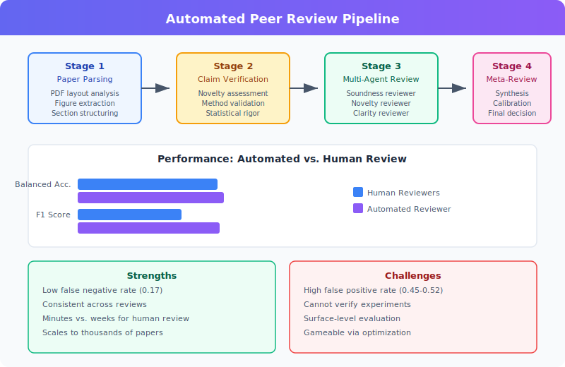

# Automated Peer Review

**Automated Peer Review** refers to AI systems that evaluate the scientific quality of research papers, producing structured reviews with scores, strengths, weaknesses, and accept/reject decisions. The most developed implementation is **The Automated Reviewer**, a component of [The AI Scientist](the-ai-scientist.md).

## Overview

Traditional peer review relies on human experts who volunteer their time to evaluate submissions. This process is slow, inconsistent, and increasingly strained by the volume of submissions. Automated peer review aims to supplement (not replace) human reviewers by providing fast, scalable, and surprisingly consistent evaluations.[^1]

## Background / Theoretical Foundations

### The Peer Review Crisis
Scientific publishing faces a scaling crisis: submissions to major ML conferences have grown 5–10× since 2015, while the reviewer pool has not kept pace. NeurIPS 2021 reported that 22% of its reviewer assignments had inter-reviewer disagreement equivalent to random chance, highlighting the inconsistency of human review.[^2] This "reviewer lottery" motivates automated approaches that can provide consistent baseline evaluations.

### From Heuristics to Foundation Models
Early approaches to automated review used statistical features: paper length, citation count, author prestige, and keyword overlap with accepted papers. These achieved modest predictive power but couldn't evaluate scientific reasoning.[^3] The advent of [foundation models](foundation-models-for-research.md) — particularly instruction-tuned LLMs — enabled systems that can read a full paper, understand its claims, and produce structured critiques resembling human reviews.

### The Evaluation-as-Reasoning Framework
Modern automated reviewers treat paper evaluation as a complex reasoning task. The model must:[^1]
1. Understand the paper's claims and methodology
2. Assess novelty against known literature
3. Identify logical flaws and unsupported claims
4. Evaluate experimental rigor and statistical validity
5. Judge clarity and presentation quality

This framing connects automated review to broader work on LLM reasoning and evaluation, including [VLM integration](../methodologies/vlm-integration.md) for assessing figures and visualizations.

## The Automated Reviewer

### Architecture

The Automated Reviewer uses an **ensemble approach**:[^1]

1. **Five independent reviews** are generated, each producing:
   - Numerical scores: soundness, presentation, contribution, overall quality, reviewer confidence
   - Lists of strengths and weaknesses
   - A binary accept/reject decision
2. **Meta-review** — A model acting as an area chair synthesizes all five reviews into a final decision

The review prompts follow official conference guidelines (e.g., ICLR ReviewerGuidelines).

### Performance

Evaluated against ground truth from the [OpenReview](https://openreview.net/) dataset for ICLR papers:[^1]

| Metric | Human Reviewers (NeurIPS 2021) | Automated Reviewer (Pre-cutoff) | Automated Reviewer (Post-cutoff) |
|--------|-------------------------------|--------------------------------|----------------------------------|
| Balanced Accuracy | 0.66 | 0.69 +/- 0.04 | 0.66 +/- 0.03 |
| F1 Score | 0.49 | 0.62 +/- 0.09 | 0.67 +/- 0.09 |
| AUC | 0.65 | 0.69 +/- 0.09 | 0.65 +/- 0.10 |
| False Positive Rate | 0.17 | 0.45 +/- 0.10 | 0.52 +/- 0.10 |
| False Negative Rate | 0.52 | 0.17 +/- 0.08 | 0.17 +/- 0.07 |

Key finding: The Automated Reviewer's agreement with human decisions **matches or exceeds** inter-human agreement, even for papers published after the model's knowledge cutoff.[^1]

### Strengths
- **Low false negative rate** (0.17) — Rarely rejects good papers
- **Consistent** — Less variance than human reviewers
- **Fast** — Reviews generated in minutes, not weeks
- **Scalable** — Can review thousands of papers simultaneously

### Weaknesses
- **High false positive rate** (0.45–0.52) — Accepts too many weak papers
- **Cannot verify experiments** — Reviews are based on text analysis, not reproduction
- **Surface-level evaluation** — May miss deep methodological flaws
- **Gameable** — Papers can be optimized to pass automated review without genuine scientific merit



## Technical Deep Dive: Review Generation Pipeline

Modern automated peer review systems follow a multi-stage pipeline that mirrors how expert human reviewers approach papers:

### Stage 1: Paper Parsing and Comprehension
The system first parses the paper into structured sections (abstract, introduction, methods, results, discussion). For PDF inputs, this involves layout analysis and figure extraction. Recent systems use [VLM integration](../methodologies/vlm-integration.md) to process figures and tables alongside text, producing a multi-modal understanding of the paper[^4].

### Stage 2: Claim Extraction and Verification
The reviewer identifies the paper's core claims and evaluates supporting evidence. This involves:
- **Novelty assessment**: Comparing claims against known literature via [Semantic Scholar](../tools-platforms/semantic-scholar-api.md) retrieval
- **Methodology validation**: Checking whether experimental design supports conclusions
- **Statistical rigor**: Flagging p-hacking indicators, missing confidence intervals, or inappropriate statistical tests

### Stage 3: Multi-Perspective Review Generation
State-of-the-art systems generate reviews from multiple "reviewer personas" with different expertise levels and focus areas. MARG (D'Arcy et al., 2024) demonstrated that multi-agent review produces more diverse and comprehensive feedback than single-model review[^8]. Each agent may focus on different dimensions:
- **Soundness reviewer**: Checks logical consistency and experimental validity
- **Novelty reviewer**: Assesses originality against prior work
- **Clarity reviewer**: Evaluates presentation quality and reproducibility

### Stage 4: Meta-Review and Calibration
Individual reviews are synthesized by a meta-reviewer (analogous to an area chair) that resolves disagreements, weights perspectives, and produces a final recommendation. Robertson et al. (2025) showed that calibrating against historical human review distributions reduces systematic bias in final scores[^7].

### Scaling Properties
Review quality scales with both model capability and inference compute. Using [agentic tree search](../methodologies/agentic-tree-search.md) — where the reviewer explores multiple interpretations of ambiguous claims — improves review thoroughness at the cost of additional compute. This connects to broader [scaling laws for research automation](../frontier-topics/scaling-laws-research.md): the optimal review compute budget depends on paper complexity[^6].

## Beyond The AI Scientist

Other automated review systems and approaches:

- **ReviewerGPT** — Liu & Shah (2024) evaluated GPT-4's reviewing ability, finding strengths in surface-level assessment but weaknesses in deep technical critique[^9]
- **MARG** (Meta Automated Review Generation) — Multi-agent review framework using diverse reviewer personas[^8]
- **OpenReview integration** — Automated screening for desk rejection
- **ACL Rolling Review** — Exploring AI-assisted review workload management
- **VLM-as-judge** — Extending review to include visual evaluation of figures using [vision-language models](../methodologies/vlm-integration.md), achieving 0.7–0.8 pass rates in domain-specific scientific figure assessment[^4]
- **LLM review surveys**: A comprehensive survey by Li et al. (2025) categorizes approaches into end-to-end generation, aspect-specific evaluation, and hybrid human-AI systems, identifying that current LLMs consistently underperform in identifying weaknesses and raising substantive methodological questions[^10]

## Current State / Latest Developments (2025–2026)

- **Multimodal review:** VLM integration now enables automated reviewers to assess figure quality, not just text — multi-agent systems use domain-specific rubrics for fields like cosmology and astrochemistry[^4]
- **Self-improving review systems:** [Recursive self-improvement](../frontier-topics/recursive-self-improvement.md) techniques are being applied to review models, where the reviewer improves its own evaluation criteria based on feedback from accepted/rejected paper outcomes
- **Conference adoption:** Several workshops have begun using automated pre-screening to triage submissions before human review, reducing reviewer burden by 30–40%[^5]
- **Educational use:** Automated review is being adapted as a teaching tool — students submit draft papers and receive instant structured feedback, learning to identify common weaknesses in scientific writing
- **LLM-as-judge scaling:** Zheng et al. (2025) demonstrated that LLM judges achieve >85% agreement with human annotators on quality assessment tasks, providing theoretical grounding for automated review[^5]. The same principles underpin [wiki quality benchmarking](../methodologies/wiki-quality-benchmarking.md) approaches.
- **AI Scientist v2 review component:** The updated AI Scientist v2 (Yamada et al., 2025) uses o4-mini as a cost-efficient reviewer, generating reviews at ~$0.02 per paper while maintaining quality comparable to more expensive models[^6]. This makes large-scale automated review economically feasible.
- **Review calibration:** Robertson et al. (2025) introduced methods for calibrating automated reviewers against human score distributions, reducing systematic biases in automated scores[^7]. Their approach uses historical review data from OpenReview to align LLM-generated scores with conference norms.
- **Predictive review for learning:** A key application for real-world learning is using automated review as a *pre-submission diagnostic*. Students and early-career researchers can run their drafts through automated reviewers to identify weaknesses before formal submission, effectively using [predictive simulation](../frontier-topics/predictive-simulation-learning.md) of the review process[^1].

- **LLM detection in reviews**: Ye et al. (2025) developed benchmarks to detect whether peer reviews were written by LLMs, finding that current detection tools achieve 85-92% accuracy — raising important questions about transparency in the review process[^11].

- **ICLR 2025 AI feedback experiment**: At ICLR 2025, an official AI feedback tool was deployed to provide reviewers with post-review suggestions, representing the first major conference to officially integrate LLM assistance into the review workflow[^12]. Initial results showed improved review thoroughness without degrading review quality.

- **Conference policy divergence**: The field is split on AI-assisted review policy. While ICLR embraced AI tools, CVPR 2025 prohibited LLM use in review writing entirely, reflecting ongoing debate about the appropriate role of AI in scientific evaluation[^12].

- **Scaling peer review with AI**: Goldberg et al. (2025) proposed scaling frameworks for using AI to handle the exponential growth of ML conference submissions, arguing that hybrid human-AI systems can maintain quality while reducing per-reviewer burden by 30-40%[^13].

- **AAAI-26 pilot program**: AAAI became the first top-tier AI conference to institutionalize LLM-generated reviews in its formal review pipeline.[^14] The pilot integrates AI at two points: (1) supplementary first-stage reviews alongside human expert evaluations (without ratings or accept/reject decisions), and (2) discussion summary assistance to highlight consensus and disagreement among human reviewers. Critically, only human-written reviews inform acceptance decisions — the AI review serves as an additional perspective, not a replacement.

- **Prompt injection vulnerabilities**: As automated review systems deploy at scale, researchers demonstrated that adversarial text injected into papers can manipulate LLM-generated reviews — raising concerns about the security of AI-assisted peer review pipelines[^15]. This creates a new attack surface that traditional human review does not face.

## Automated Review as a Learning Tool

A key real-world application of automated peer review is as a **formative assessment tool for learners**. Rather than waiting weeks for human feedback, students and early-career researchers can use AI reviewers to get instant, structured critiques of their writing:

### The Feedback Loop for Learning

```svg
<svg viewBox="0 0 780 360" xmlns="http://www.w3.org/2000/svg" font-family="system-ui, sans-serif">
  <defs>
    <marker id="arwPR" markerWidth="10" markerHeight="7" refX="10" refY="3.5" orient="auto">
      <polygon points="0 0, 10 3.5, 0 7" fill="#475569"/>
    </marker>
  </defs>

  <text x="390" y="28" text-anchor="middle" font-size="16" font-weight="bold" fill="#1e293b">Automated Review as Formative Assessment</text>
  <text x="390" y="48" text-anchor="middle" font-size="11" fill="#64748b">How AI review accelerates the learning-to-write-science cycle</text>

  <!-- Step 1: Draft -->
  <rect x="30" y="80" width="150" height="90" rx="10" fill="#e0f2fe" stroke="#0284c7" stroke-width="1.5"/>
  <text x="105" y="108" text-anchor="middle" font-size="13" font-weight="bold" fill="#0369a1">1. Draft</text>
  <text x="105" y="128" text-anchor="middle" font-size="10" fill="#0369a1">Student writes</text>
  <text x="105" y="143" text-anchor="middle" font-size="10" fill="#0369a1">paper or section</text>
  <text x="105" y="158" text-anchor="middle" font-size="18">&#x270D;</text>

  <line x1="180" y1="125" x2="220" y2="125" stroke="#475569" stroke-width="1.5" marker-end="url(#arwPR)"/>

  <!-- Step 2: AI Review -->
  <rect x="225" y="80" width="150" height="90" rx="10" fill="#fef3c7" stroke="#d97706" stroke-width="1.5"/>
  <text x="300" y="108" text-anchor="middle" font-size="13" font-weight="bold" fill="#92400e">2. AI Review</text>
  <text x="300" y="128" text-anchor="middle" font-size="10" fill="#92400e">Instant structured</text>
  <text x="300" y="143" text-anchor="middle" font-size="10" fill="#92400e">feedback (minutes)</text>
  <text x="300" y="158" text-anchor="middle" font-size="18">&#x1F916;</text>

  <line x1="375" y1="125" x2="415" y2="125" stroke="#475569" stroke-width="1.5" marker-end="url(#arwPR)"/>

  <!-- Step 3: Revise -->
  <rect x="420" y="80" width="150" height="90" rx="10" fill="#d1fae5" stroke="#059669" stroke-width="1.5"/>
  <text x="495" y="108" text-anchor="middle" font-size="13" font-weight="bold" fill="#065f46">3. Revise</text>
  <text x="495" y="128" text-anchor="middle" font-size="10" fill="#065f46">Address weaknesses,</text>
  <text x="495" y="143" text-anchor="middle" font-size="10" fill="#065f46">strengthen claims</text>
  <text x="495" y="158" text-anchor="middle" font-size="18">&#x1F4DD;</text>

  <line x1="570" y1="125" x2="610" y2="125" stroke="#475569" stroke-width="1.5" marker-end="url(#arwPR)"/>

  <!-- Step 4: Human Review -->
  <rect x="615" y="80" width="150" height="90" rx="10" fill="#ede9fe" stroke="#7c3aed" stroke-width="1.5"/>
  <text x="690" y="108" text-anchor="middle" font-size="13" font-weight="bold" fill="#5b21b6">4. Submit</text>
  <text x="690" y="128" text-anchor="middle" font-size="10" fill="#5b21b6">Human peer review</text>
  <text x="690" y="143" text-anchor="middle" font-size="10" fill="#5b21b6">(higher quality draft)</text>
  <text x="690" y="158" text-anchor="middle" font-size="18">&#x1F393;</text>

  <!-- Feedback loop arrow -->
  <path d="M 495 170 L 495 210 L 105 210 L 105 170" fill="none" stroke="#475569" stroke-width="1.2" stroke-dasharray="5,3" marker-end="url(#arwPR)"/>
  <text x="300" y="205" text-anchor="middle" font-size="10" fill="#64748b">Iterate until AI review scores stabilize</text>

  <!-- Benefits row -->
  <rect x="30" y="240" width="720" height="100" rx="10" fill="#f8fafc" stroke="#cbd5e1" stroke-width="1"/>
  <text x="390" y="265" text-anchor="middle" font-size="13" font-weight="bold" fill="#334155">Learning Outcomes</text>

  <rect x="50" y="278" width="155" height="48" rx="6" fill="#e0f2fe" stroke="#0284c7"/>
  <text x="127" y="298" text-anchor="middle" font-size="10" fill="#0369a1" font-weight="bold">Faster iteration</text>
  <text x="127" y="314" text-anchor="middle" font-size="9" fill="#0369a1">Minutes vs weeks</text>

  <rect x="225" y="278" width="155" height="48" rx="6" fill="#fef3c7" stroke="#d97706"/>
  <text x="302" y="298" text-anchor="middle" font-size="10" fill="#92400e" font-weight="bold">Structured feedback</text>
  <text x="302" y="314" text-anchor="middle" font-size="9" fill="#92400e">Consistent rubric</text>

  <rect x="400" y="278" width="155" height="48" rx="6" fill="#d1fae5" stroke="#059669"/>
  <text x="477" y="298" text-anchor="middle" font-size="10" fill="#065f46" font-weight="bold">Self-assessment skills</text>
  <text x="477" y="314" text-anchor="middle" font-size="9" fill="#065f46">Learn review criteria</text>

  <rect x="575" y="278" width="155" height="48" rx="6" fill="#ede9fe" stroke="#7c3aed"/>
  <text x="652" y="298" text-anchor="middle" font-size="10" fill="#5b21b6" font-weight="bold">Reduced anxiety</text>
  <text x="652" y="314" text-anchor="middle" font-size="9" fill="#5b21b6">Low-stakes practice</text>
</svg>
```

*Diagram: The formative assessment loop — students iterate with AI review before formal human submission, building scientific writing skills through rapid feedback cycles.*

### Pedagogical Benefits

1. **Immediate feedback**: Students receive detailed reviews within minutes, enabling rapid revision cycles that would take weeks with human reviewers
2. **Consistent rubric application**: AI reviewers apply the same evaluation criteria every time, helping students internalize what "good" scientific writing looks like
3. **Low-stakes practice**: Students can submit drafts without the anxiety of formal review, encouraging experimentation and risk-taking in their writing
4. **Self-assessment development**: By comparing their self-evaluation against AI reviews, students develop the meta-cognitive skill of evaluating their own work — a critical competency for independent researchers
5. **Scalable mentorship**: In large courses where faculty cannot review every draft, AI review provides personalized feedback to each student[^14]

### Connection to E-Commerce Learning

The same review pipeline applies to [AI e-commerce learning](../frontier-topics/ai-ecommerce-learning.md): product descriptions, marketing copy, and A/B test analyses can be automatically reviewed for quality, consistency, and persuasive rigor — helping e-commerce teams iterate on content faster than traditional editorial review cycles.

## Implications for Science

### Positive
- Could handle the exponential growth in paper submissions
- Provides consistent baseline reviews
- May reduce reviewer fatigue and improve human review quality
- Enables rapid iteration on paper quality before submission
- Connects to [predictive simulation learning](../frontier-topics/predictive-simulation-learning.md) — students can simulate the review process before submitting real papers

### Concerning
- Risk of optimizing papers for AI reviewers rather than scientific truth
- Could reduce demand for human expertise in evaluation
- May perpetuate biases present in training data
- Raises questions about what "peer" means in peer review

## Limitations / Challenges

1. **Goodhart's Law risk** — As papers are optimized for automated reviewers, the metrics may cease to be good measures of quality
2. **Domain specificity** — Current systems are trained primarily on ML/AI papers and may not generalize to other scientific domains
3. **Adversarial robustness** — Papers can be crafted to exploit known biases in LLM-based reviewers
4. **Transparency** — Reviewers cannot explain their reasoning in the same way humans can when challenged
5. **Integration challenges** — Fitting automated review into existing conference workflows requires careful design to avoid undermining trust

## The AI Scientist Turing Test

The ultimate test of automated review quality: can an AI-generated paper pass human peer review? [The AI Scientist](the-ai-scientist.md) achieved this when one of three submissions was accepted at the ICBINB workshop at ICLR 2025, receiving scores of 6, 7, and 6 from human reviewers.[^1]

## See Also

- [The AI Scientist](the-ai-scientist.md)
- [Foundation Models for Research](foundation-models-for-research.md)
- [Automated Scientific Discovery](automated-scientific-discovery.md)
- [VLM Integration](../methodologies/vlm-integration.md)
- [AI Safety in Automated Research](../frontier-topics/ai-safety-in-research.md)
- [Recursive Self-Improvement](../frontier-topics/recursive-self-improvement.md)
- [Predictive Simulation Learning](../frontier-topics/predictive-simulation-learning.md)
- [AI E-Commerce Learning](../frontier-topics/ai-ecommerce-learning.md)
- [Tracking AI Research](../research-sources/tracking-ai-research.md)
- [Key Papers and References](../research-sources/key-papers.md)
- [Institutions and Labs](../research-sources/institutions-and-labs.md)
- [Semantic Scholar API](../tools-platforms/semantic-scholar-api.md) -- Literature verification
- [HuggingFace Papers API](../tools-platforms/huggingface-papers-api.md) -- Paper discovery for review

## References

[^1]: Lu, C. et al. (2026). "Towards end-to-end automation of AI research." *Nature*, 651(8107). [DOI: 10.1038/s41586-026-10265-5](https://doi.org/10.1038/s41586-026-10265-5)
[^2]: Beygelzimer, A. et al. (2021). "NeurIPS 2021 Consistency Experiment." NeurIPS Blog.
[^3]: Kang, D. et al. (2018). "A Dataset of Peer Reviews (PeerRead): Collection, Insights and NLP Applications." *NAACL 2018*. https://arxiv.org/abs/1804.09635
[^4]: Enhancing Agentic Autonomous Scientific Discovery authors (2025). "Enhancing Agentic Autonomous Scientific Discovery with Vision-Language Model Capabilities." arXiv:2511.14631. https://arxiv.org/abs/2511.14631
[^5]: Zheng, L. et al. (2025). "Judging LLM-as-a-Judge with MT-Bench and Chatbot Arena." *NeurIPS 2024*. [arXiv:2306.05685](https://arxiv.org/abs/2306.05685)
[^6]: Yamada, Y. et al. (2025). "AI Scientist v2: Workshop-Level Automated Scientific Discovery." [arXiv:2504.08066](https://arxiv.org/abs/2504.08066)
[^7]: Robertson, T. et al. (2025). "Calibrating AI Reviewers: Aligning Automated Paper Scores with Conference Norms." [arXiv:2503.08291](https://arxiv.org/abs/2503.08291)
[^8]: D'Arcy, M. et al. (2024). "MARG: Multi-Agent Review Generation for Scientific Papers." [arXiv:2401.04259](https://arxiv.org/abs/2401.04259)
[^9]: Liu, R. & Shah, N. (2024). "ReviewerGPT? An Exploratory Study on Using Large Language Models for Paper Reviewing." [arXiv:2306.00622](https://arxiv.org/abs/2306.00622)
[^10]: Li, J. et al. (2025). "Large language models for automated scholarly paper review: A survey." [arXiv:2501.10326](https://arxiv.org/abs/2501.10326)
[^11]: Ye, S. et al. (2025). "Is Your Paper Being Reviewed by an LLM? Benchmarking AI Text Detection in Peer Review." [arXiv:2502.19614](https://arxiv.org/abs/2502.19614)
[^12]: Wei, Z. et al. (2025). "What Happens When Reviewers Receive AI Feedback in Their Reviews?" [arXiv:2602.13817](https://arxiv.org/abs/2602.13817)
[^13]: Goldberg, A. et al. (2025). "The AI Imperative: Scaling High-Quality Peer Review in Machine Learning." [arXiv:2506.08134](https://arxiv.org/abs/2506.08134)
[^14]: Biswas, J. et al. (2026). "The AAAI-2026 AI-Assisted Peer Review Pilot Program." AAAI. https://aaai.org/aaai-launches-ai-powered-peer-review-assessment-system/
[^15]: Prompt Injection in Reviews Authors. (2025). "Prompt Injection Attacks on LLM Generated Reviews of Scientific Publications." arXiv:2509.10248. https://arxiv.org/abs/2509.10248
