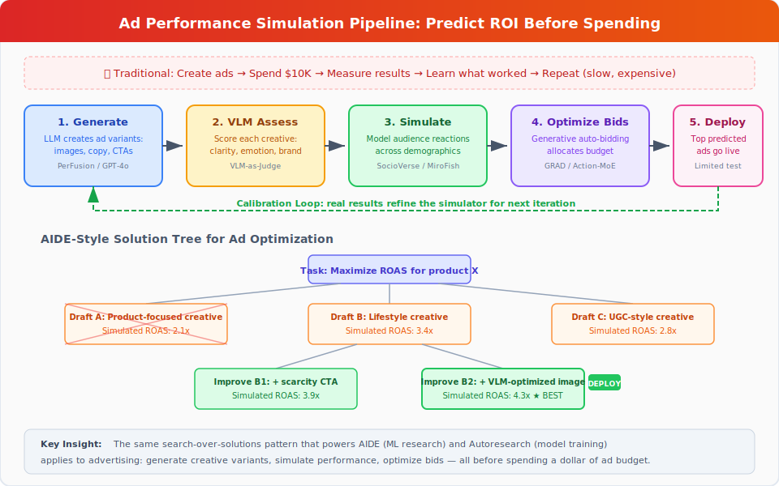
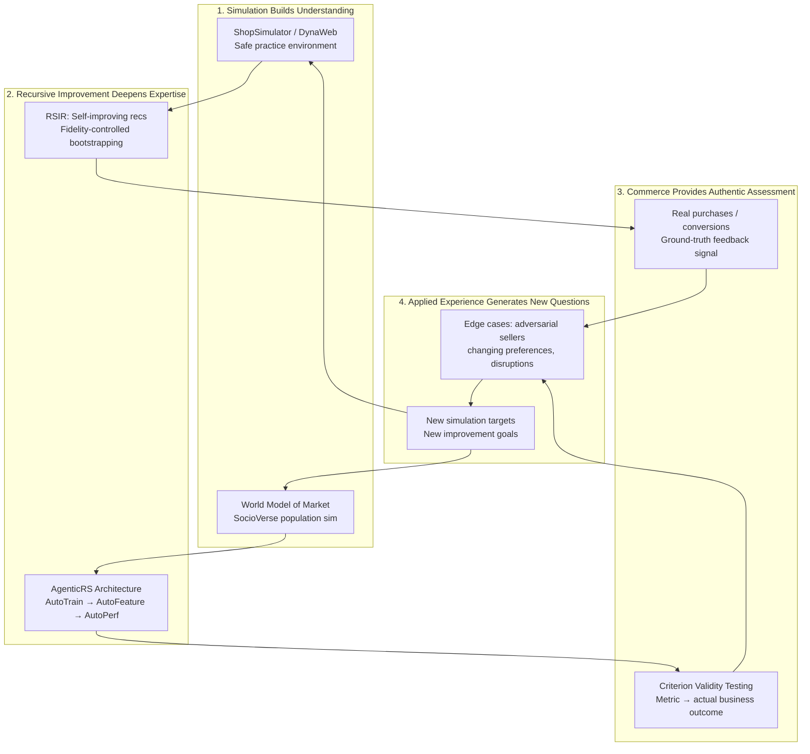

# AI for E-Commerce Learning

**AI for E-Commerce Learning** covers how artificial intelligence -- particularly LLM-powered agents -- is transforming online commerce through personalization, autonomous shopping assistance, demand prediction, and supply chain optimization. This article focuses on how these systems learn and how they can help humans learn better purchasing, business, and market skills.

## Overview

E-commerce is one of the highest-impact domains for applied AI learning: the feedback loops are fast (users click, buy, or abandon), the data is abundant, and the economic incentives are strong. Recent work has moved beyond traditional recommendation engines toward **agentic commerce** -- AI agents that can autonomously navigate, evaluate, negotiate, and transact on behalf of users.

This shift raises new questions: How do AI agents learn to shop? What biases do they bring? How can AI help consumers and businesses learn to make better decisions?

## LLM-Powered Shopping Agents

### Shopping Companion: Memory-Augmented Assistance

Yu et al. (2026) introduced Shopping Companion, a unified framework that integrates long-term user preference memory with shopping task execution.[^1] The system uses a two-stage agentic architecture with dual-reward reinforcement learning and tool-wise supervision.

Key innovation: **joint optimization of memory retrieval and task performance** -- the agent learns not just what to recommend but what to remember about each user. This creates a persistent learning relationship where the AI's understanding of the user deepens over time.

**Learning application:** Models how an ideal personal shopper would learn a client's preferences, constraints, and aspirations -- then apply that accumulated knowledge to increasingly effective recommendations.

### ACES: Auditing AI Shopping Agent Behavior

Allouah et al. (2025) built ACES (Agentic e-CommercE Simulator), a controlled sandbox for auditing AI shopping agents across six frontier models (Claude, GPT, Gemini families).[^2]

**Critical findings:**
- AI agents exhibit **strong position biases** -- preferring products listed first regardless of quality
- Market concentration is **model-dependent** -- different LLMs systematically favor different brands
- Agents demonstrate near-perfect rationality on basic price/rating comparisons
- Sellers can **strategically exploit agent biases** through description optimization

**Learning application:** Essential reading for anyone building or using AI shopping tools. Understanding these biases helps consumers critically evaluate AI recommendations and helps businesses design fairer AI-mediated marketplaces.

### Digital Twin Customers

Sun et al. (2025) investigated whether LLM-based "digital twin" agents can replicate human customer behavior when interacting with conversational shopping systems like Amazon Rufus.[^3] A study with 40 human participants was compared against simulated agents on identical tasks.

**Finding:** Agents achieved comparable task completion and aligned UX feedback on objective dimensions, but diverged in exploration patterns and preference selections.

**Learning application:** Enables scalable evaluation of conversational commerce systems, reducing the need for expensive human studies while providing insights into how AI agents differ from human shoppers.

### ProductResearch: Deep Research Agents for Shopping

Wang et al. (2026) propose ProductResearch, a multi-agent framework that synthesizes high-fidelity, long-horizon tool-use trajectories for training robust e-commerce shopping agents.[^11] The framework employs three specialized agents:
- **User Agent:** Infers nuanced shopping intents from behavioral histories
- **Supervisor Agent:** Orchestrates iterative collaboration between agents
- **Research Agent:** Generates comprehensive product research reports

A reflective internalization process refines the synthetic trajectories, and a compact mixture-of-experts model fine-tuned on this data achieves substantial improvements in response comprehensiveness, research depth, and user-perceived utility -- approaching proprietary deep research systems.

**Learning application:** ProductResearch demonstrates how multi-agent collaboration can teach AI systems complex research skills that transfer to real shopping assistance. The scaffolded approach (user intent → supervised research → reflective refinement) mirrors how human researchers learn: starting with a question, conducting structured investigation, and reflecting on findings. This framework could power educational tools that teach students research methodology through the lens of product evaluation -- a practical, engaging context for learning critical thinking and information synthesis.

### Solicit-Then-Suggest: The Economics of Agentic Purchasing

Cao & Hu (March 2026) formalize how AI shopping agents shift e-commerce from search-based to conversational purchasing.[^16] Their model analyzes agents that conduct multiple dialogue rounds to elicit customer preferences before presenting curated options. A key finding is a fundamental economic tradeoff: **inquiry depth and product variety are substitutes** in reducing uncertainty -- asking more questions compensates for less variety, and vice versa. The optimal recommendation strategy uses Voronoi partitioning and a water-filling principle to equalize posterior uncertainty across preference dimensions. In higher preference dimensions, recommendations face a "curse of dimensionality" that limits agent effectiveness.

**Learning application:** This paper provides the theoretical foundation for understanding when conversational AI tutoring is most effective. The inquiry-variety tradeoff maps directly to education: a tutor can either ask more diagnostic questions (inquiry depth) or present more diverse exercises (variety) to identify student needs. The curse of dimensionality explains why tutoring in high-dimensional subjects (e.g., creative writing with many quality dimensions) is harder to automate than narrow skills (e.g., arithmetic with few dimensions).

### MemRerank: Compact Preference Memory for Personalization

Peng et al. (March 2026) propose MemRerank, a preference memory framework for LLM-based shopping agents that distills user purchase history into concise, query-independent signals for personalized product reranking.[^17] The system trains a memory extractor using RL, achieving improvements of up to 10.61 percentage points in accuracy compared to approaches using raw history. The key insight: compact preference representations outperform feeding full purchase histories to LLMs.

**Learning application:** MemRerank demonstrates that effective personalization requires distilling experience into compact representations rather than raw replay -- the AI equivalent of forming mental models from experience rather than memorizing every interaction. An adaptive tutoring system could use this approach to build concise learner profiles that capture essential patterns rather than storing complete interaction logs.

### ShopSimulator: RL Training Ground for Shopping Agents

Wang et al. (January 2026) introduce ShopSimulator, a large-scale Chinese e-commerce simulation environment for evaluating LLM-based shopping agents.[^18] Even the best-performing models achieve less than 40% full-success rate on realistic tasks. Combining supervised fine-tuning with RL substantially enhances agent performance, while key failure modes include underutilization of personalization information and poor product search during longer interactions.

**Learning application:** ShopSimulator connects directly to [predictive simulation learning](predictive-simulation-learning.md) -- agents improve their shopping skills by practicing in simulated environments. The identified failure modes (ignoring personalization signals, degrading over long sessions) parallel common learning challenges: students often fail to apply known concepts in extended problem-solving contexts.

### AgenticRS-Architecture: Self-Improving Recommender Lifecycle

Zhang et al. (March 2026) introduce AgenticRS-Architecture, a system design that replaces traditional recommendation pipelines with interacting evolution agents possessing long-term memory and self-improvement capability.[^22] The architecture organizes around three specialized agents:

- **AutoTrain:** Automates model design and training, including paper-driven model reproduction -- parsing research papers, generating code, running large-scale training, and offline comparison
- **AutoFeature:** Manages data analysis and feature evolution
- **AutoPerf:** Oversees performance, deployment, and online experimentation

A shared coordination and knowledge layer records decisions, configurations, and outcomes, enabling locally automated yet globally aligned evolution. The system extends beyond recommendations to search and advertising.

**Learning application:** AgenticRS-Architecture demonstrates how [recursive self-improvement](recursive-self-improvement.md) can be operationalized in production commerce systems. The AutoTrain agent's ability to read research papers, implement methods, and evaluate them autonomously mirrors an ideal self-directed learner. For educational AI, this architecture suggests a model where specialized agents handle different aspects of the learning experience (content creation, assessment, personalization) while a coordination layer maintains coherent improvement across all dimensions.

### Multi-Agent Video Recommenders: Toward Self-Improving Content Discovery

Ranganathan et al. (April 2026) survey how multi-agent architectures are redefining video recommendation systems through coordinated specialized agents for understanding, reasoning, and feedback.[^23] The survey synthesizes work from early multi-agent reinforcement learning (MARL) systems through emerging LLM-powered architectures like MACRec and Agent4Rec.

**Key open challenges identified:**
- **Lifelong personalization** -- systems that continuously evolve with user interactions
- **Self-improving architectures** -- recommenders that autonomously enhance their own performance
- **Hybrid RL-LLM systems** -- combining adaptive RL with LLM reasoning capabilities

**Learning application:** The shift from static engagement metrics to dynamic, agent-based learning in video recommendation directly parallels the shift from static curricula to adaptive learning in education. The identified challenge of "lifelong personalization" is precisely the goal of adaptive tutoring -- a system that grows with the learner over months and years. The hybrid RL-LLM approach (combining experiential learning with reasoning) maps to the dual-process model of education: building procedural fluency through practice (RL) while developing conceptual understanding through explanation (LLM).

### AgenticShop: Benchmarking Agentic Product Curation

Kim et al. (WWW 2026) introduce AgenticShop, the first benchmark for evaluating agentic systems on personalized product curation in open-web environments.[^24] Unlike existing e-commerce benchmarks that focus on single-platform lookups, AgenticShop tests realistic exploratory search across the open web with diverse user profiles and a checklist-driven personalization evaluation framework.

**Key finding:** Current agentic systems remain largely insufficient for personalized product curation across modern web environments. The benchmark exposes gaps between impressive demo performance and real-world shopping complexity.

**Learning application:** AgenticShop reveals that the gap between AI agent capability and real-world shopping competence mirrors the gap between classroom knowledge and practical skill. Just as ShoppingBench showed GPT-4.1 achieves under 50% on realistic tasks, AgenticShop demonstrates that agents struggle with the open-ended, multi-platform nature of real shopping. For education, this validates the importance of authentic assessment -- testing in realistic, open environments rather than simplified sandboxes. A learning system trained only on single-platform interactions (like a student who only studies textbook problems) fails when confronted with the full complexity of real-world tasks.

### Hierarchical Memory Orchestration for Persistent Agents

Liu et al. (April 2026) propose HMO (Hierarchical Memory Orchestration), a three-tier memory management system for personalized persistent agents.[^25] The architecture maintains: (1) a compact primary cache combining recent and important memories with an evolving user profile, (2) a high-priority secondary layer, and (3) a global archive of full interaction history. The user persona drives memory redistribution, surfacing relevant knowledge precisely when needed.

**Learning application:** HMO addresses a fundamental challenge in both commerce and education: how to maintain useful long-term memory without drowning in accumulated data. A tutoring agent that remembers a student's strengths, weaknesses, and learning trajectory over months needs the same hierarchical memory management -- keeping core understanding readily accessible while archiving detailed interaction history. The persona-driven redistribution is particularly relevant: as a learner progresses, what's "important" changes, and the memory system must adapt accordingly. This connects to [Shopping Companion's](#shopping-companion-memory-augmented-assistance) preference memory and [MemRerank's](#memrerank-compact-preference-memory-for-personalization) compact representations, forming a spectrum of memory strategies from compact (MemRerank) to hierarchical (HMO).

## AI for Recommendation and Personalization

### Sustainable Recommendations: LLMGreenRec

Nguyen et al. (2026) present a multi-agent framework that integrates environmental responsibility into recommendations.[^4] Specialized agents analyze user behavior patterns to identify "green-oriented user intents" and prioritize eco-friendly product recommendations while reducing computational energy.

**Learning application:** Goes beyond pure optimization to integrate values into AI recommendations. Represents a shift toward AI that helps consumers learn to make more environmentally conscious choices -- a direct intersection of AI learning and behavioral change.

### Adaptive Switching for Cold-Start Users

Saini et al. (Scientific Reports, 2026) address the cold-start problem by classifying users into three categories (newcomers, lightweight users, heavy users) and dynamically switching between recommendation models.[^5]

**Learning application:** Mirrors how human learning itself progresses through stages -- from broad exploration (new users) to refined optimization (experienced users). The switching mechanism adapts the AI's teaching strategy to the learner's current level.

### Social Graph-Enhanced Recommendations

A 2025 study published in *Applied Artificial Intelligence* introduces a model that enhances e-commerce personalization by leveraging graph attention networks (GATs) to mine and integrate information from both user-item (U-I) score graphs and user-user (U-U) social graphs.[^12] By incorporating social connections into recommendation, the system captures influence patterns that pure behavioral data misses.

**Learning application:** Social learning -- where peers influence what and how we learn -- is one of the most powerful educational mechanisms. This research shows how AI can formalize and scale social influence in recommendations, suggesting pathways for educational platforms that recommend learning resources based not just on individual behavior but on what peers with similar goals found valuable.

## Benchmarks and Evaluation

### ShoppingBench: Grounded Shopping Tasks

Wang et al. (2025) created ShoppingBench, a comprehensive benchmark with 2.5+ million real products that evaluates LLM agents on complex shopping intents -- voucher application, budget management, multi-seller matching.[^6]

**Key finding:** Even GPT-4.1 achieves under 50% success on realistic shopping tasks, highlighting the gap between current AI capabilities and practical e-commerce assistance.

The benchmark also proposes a **trajectory distillation strategy** -- using supervised fine-tuning and RL to transfer agent capabilities from large to small models -- making capable shopping AI more accessible.

### ShoppingComp: Expert-Curated Shopping Competency

The ShoppingComp benchmark (November 2025) raises the bar further with 145 instances and 558 scenarios curated by 35 domain experts, evaluating AI shopping agents on product retrieval, comparative report generation, and safety-critical purchase decisions.[^67] The benchmark reveals a stark capability gap: even GPT-5.2 achieves only 17.76% overall accuracy, with particular failures in safety-sensitive categories (medication, electronics compatibility). This suggests that deploying AI shopping agents in high-stakes domains requires significant advances in grounded reasoning and domain knowledge.

**Learning application:** ShoppingComp's expert-curated scenarios provide a template for how educational assessments could be designed — complex, multi-step tasks that test integrated understanding rather than isolated facts. The 17.76% ceiling demonstrates that current AI excels at information retrieval but struggles with the kind of integrated judgment that effective learning applications require.

### LLM-Powered Recommendation Agents: A Taxonomy

Peng et al. (2025) provide a systematic survey identifying three paradigms for LLM-based recommendation agents [^68]:
1. **Recommender-oriented**: LLMs enhance core recommendation algorithms (embeddings, feature extraction)
2. **Interaction-oriented**: Dynamic dialogue-based suggestions where the agent actively elicits preferences
3. **Simulation-oriented**: Multi-agent frameworks modeling user-item dynamics for testing and optimization

The survey covers the full agent lifecycle — profile construction, memory management, planning, and action execution — providing a roadmap for building AI-powered commerce learning systems.

### Hybrid CF-MF-RL Framework for E-Commerce Optimization

A 2026 study in *Scientific Reports* presents a scalable hybrid framework combining Collaborative Filtering (CF), Matrix Factorisation (MF), and Reinforcement Learning (RL) to simultaneously enhance consumer experience and backend operations.[^69] The key innovation is integrating three distinct learning paradigms into a unified system:

- **CF + MF** for personalized recommendations that capture both explicit preferences and latent factors
- **RL for adaptive pricing** that responds to market demand and competitor actions in real-time, outperforming static pricing models
- **NLP-based sentiment analysis** of customer feedback to surface service issues and inform product improvements
- **AI-powered supply chain automation** for inventory forecasting, cost reduction, and fulfillment efficiency

**Learning application:** This framework demonstrates the convergence of multiple AI learning paradigms in a single e-commerce system — each component learns differently (collaborative patterns, latent representations, sequential decisions, language understanding) but contributes to a unified outcome. For professionals learning e-commerce AI, this provides a concrete architectural template showing how different AI techniques complement rather than compete. The RL pricing component is particularly instructive: unlike static rules, the agent learns pricing strategies through exploration and feedback, connecting directly to [recursive self-improvement](recursive-self-improvement.md) principles where the system continuously refines its own decision-making.

### Agentic Commerce Trends: The 2026 Landscape

Industry data from early 2026 paints a picture of rapid adoption:[^70]

- **57%** of e-commerce businesses are exploring AI agent use cases; **33%** actively preparing for deployment
- **45%** of consumers already use AI for at least part of their buying journey (IBM IBV, January 2026)
- AI shopping agents are live and completing real purchases on ChatGPT, Google Gemini, Microsoft Copilot, and Perplexity

IDC's Directions 2026 research highlights five focus areas: economic impact of AI, the agentic buyer lifecycle, expansion beyond LLMs, new AI business value frameworks, and AI agents as the new application model reshaping enterprise software.[^71]

**Learning application:** These adoption numbers mark a phase transition: AI agents in e-commerce are no longer experimental — they're production systems handling real transactions. For learners, this means understanding agentic commerce is now a practical professional skill, not an academic curiosity. The "agentic buyer lifecycle" concept suggests that consumers will need to develop new literacies around AI-mediated purchasing, just as they developed web literacy in the 2000s.

## Predictive Models for Commerce

### Purchase Behavior Prediction via Reinforcement Learning

Jain (2025) introduced a hybrid DQN-LSTM architecture for forecasting purchase intent, achieving 88% accuracy on 885,000+ user sessions.[^7] The reinforcement learning approach allows the model to adapt as customer behavior evolves.

**Learning application:** Enables businesses to learn which browsing patterns signal purchase intent, directly improving inventory management and personalized marketing. The RL component means the system continuously learns from changing behavior rather than relying on static historical patterns.

### Supply Chain Planning at Scale

Qi et al. (2025) deployed a Supply Chain Planning Agent (SCPA) at JD.com that uses LLMs for intent classification, task orchestration, execution, and iterative plan correction.[^8]

**Production results:**
- ~40% reduction in weekly planning time
- 22% increase in plan accuracy
- 2-3% improvement in stock fulfillment rates

**Learning application:** One of the few papers demonstrating production deployment of LLM agents in e-commerce operations. The results show AI can help supply chain professionals learn to make better planning decisions by providing intelligent defaults and catching errors.

### AIGQ: Generative Query Recommendation at Taobao Scale

Xu et al. (March 2026) introduce AIGQ, the first end-to-end generative framework for **pre-search query recommendation** in e-commerce — the suggestions a user sees on the homepage before they type — deployed in production at Taobao/Tmall.[^19] A full source summary is in [`research-sources/aigq-ecommerce-query-recommendation.md`](../research-sources/aigq-ecommerce-query-recommendation.md).

**Two-variant architecture (Qwen3-30B-A3B base):**
- **AIGQ-Direct** generates personalized queries from user state and runs **online** in the request path
- **AIGQ-Think** generates queries with chain-of-thought rationales from a trigger query and runs **offline**, with results cached and looked up by trigger

This **hybrid offline–online deployment** is the most reusable contribution: expensive reasoning runs in batch, the cheap personalization model handles the latency-critical path. See [inference optimization](../methodologies/inference-optimization.md) for the broader serving pattern.

**Training: IL-SFT then IL-GRPO with dual-level rewards.** The team distills (user-state, query) pairs from production logs for supervised fine-tuning, then applies [Group Relative Policy Optimization](recursive-self-improvement.md) with two reward signals: a **query-level** reward from aggregated CTR and a **token-level** reward that addresses credit assignment for short structured outputs. The reward model is **retrained daily** on fresh CTR data, instantiating the continuous learning loop e-commerce platforms are uniquely positioned to run.

**Headline results:**
- **Offline:** zero-shot frontier LLMs already beat the production embedding-based retrieval (EBR) baseline by **50%+** on relevance — a striking signal that LLM world knowledge has overtaken specialized retrieval models for query suggestion
- **Online A/B (Taobao production):** **+10.31% orders, +10.68% GMV, +3.73% LT-7 retention** — unusually large gains for a mature surface

**Prompt compression via special tokens.** Because Direct must serve at Taobao QPS, the team replaces fixed natural-language scaffolding (demographics, category history, time-of-day) with **single special tokens per schema slot**, sharply reducing prompt length without hurting comprehension. This is a concrete [prompt engineering](../methodologies/prompt-engineering.md) technique for production LLM serving.

**Learning application:** AIGQ demonstrates proactive recommendation — anticipating intent before the user articulates it. For educational platforms, this suggests AI tutors that generate study topics or questions based on a learner's trajectory, guiding exploration before the learner knows what to look for next. The dual-level reward design also generalizes: any tutoring system that emits short structured outputs (a hint, a next problem, a rubric tag) faces the same credit-assignment problem AIGQ solves.

## Predictive Models for Supply Chain Resilience

### Foresight Learning: Calibrated Disruption Forecasting

Wilczewski & Skotheim (April 2026) introduce an end-to-end framework that trains LLMs to produce calibrated probabilistic forecasts of supply chain disruptions using news as input and realized disruption outcomes as supervision.[^20] The fine-tuned model substantially outperforms strong baselines -- including GPT-5 -- on accuracy, calibration, and precision. Training induces structured probabilistic reasoning behaviors (base-rate anchoring, iterative refinement) without explicit prompting.

**Learning application:** Foresight Learning demonstrates that LLMs can develop genuine probabilistic reasoning through supervised training on forecasting tasks -- they learn to reason about uncertainty rather than just pattern-match. This connects to [predictive simulation learning](predictive-simulation-learning.md): the model builds an internal world model of supply chain dynamics from news signals. For education, this suggests that training students on forecasting tasks (with calibration feedback) could develop transferable probabilistic reasoning skills applicable across domains.

## AI-Powered Dynamic Pricing: The LM-Tree Agent

Archer, Ghili & Haghpanah (April 2026) introduce the LM-Tree, an intelligent pricing mechanism that uses language models to categorize content and set differentiated prices for AI system access to publisher content.[^26] Rather than relying on manual editorial taxonomy, the system learns value distinctions from binary purchase feedback alone, automatically discovering what makes some content more valuable than others.

**Key results:**
- 65% revenue improvement over uniform pricing
- 47% gain over simple two-tier pricing
- 40% outperformance of the publisher's existing 8-segment editorial taxonomy
- Validated on 8,939 articles with 80,451 buyer queries from a major German tech publisher

**Learning application:** The LM-Tree demonstrates a powerful principle: AI can discover pricing-relevant categories that human-designed taxonomies miss. For educational content marketplaces -- where courses, tutorials, and learning materials are sold -- this suggests that AI-discovered categorizations (based on what learners actually value) may outperform hand-crafted subject taxonomies. The system's ability to learn from purchase signals alone (no explicit feedback) mirrors how [recommendation systems](ai-ecommerce-learning.md#ai-for-recommendation-and-personalization) learn from implicit behavioral signals. This connects to the broader theme of [recursive self-improvement](recursive-self-improvement.md): the pricing model improves its own categorization through each transaction, creating a self-improving pricing agent.

## Generative AI Impact on E-Commerce Productivity

### Field Experiments in Online Retail

Fang et al. (2025) conducted rigorous field experiments across seven e-commerce business workflows -- pre-sale chatbots, search refinement, product descriptions, marketing messages -- to measure how generative AI affects firm productivity.[^9]

**Key finding:** Effectiveness varies substantially by workflow, seller characteristics, and consumer segments. **Friction reduction** was identified as the primary mechanism for AI-powered performance gains -- not creative superiority.

**Learning application:** Provides evidence-based guidance on where AI tools add most value in e-commerce, helping businesses learn where to invest in AI integration and where human expertise remains superior.

## Industry Trends and Scale (2026)

The convergence of research and deployment is accelerating rapidly:

- The global AI-enabled e-commerce market reached $8.65 billion in 2025, projected to hit $22.6 billion by 2032 (14.6% CAGR)[^13]
- 97% of commerce organizations now have AI implementation plans in place
- Companies using AI personalization generate ~40% more revenue, with leaders growing ~10 percentage points faster than laggards
- Gartner predicts (January 2026) that 60% of brands will use agentic AI for one-to-one customer interactions by 2028[^14]

A notable shift is occurring from optimization-centric AI to a more integrated discourse where **fairness, transparency, and trust** are structurally central to system design.[^15] This mirrors a broader trend in AI-assisted learning: effectiveness without trustworthiness is insufficient.

**Learning application:** These statistics provide concrete evidence that AI-commerce skills are becoming essential professional competencies. Educational programs should prepare students not just for technical AI implementation but for the governance, ethics, and strategic dimensions of AI-mediated commerce.

## From Commerce Agents to Education Agents: The Agentic Workflow Bridge

Kamalov et al. (2025, revised January 2026) systematically analyze AI agents in education through four design paradigms -- reflection, planning, tool use, and multi-agent collaboration -- that are structurally identical to the paradigms driving agentic commerce.[^21] Their multi-agent framework for automated essay scoring demonstrates that agentic architectures developed for commerce (multi-agent coordination, memory-augmented personalization, adaptive difficulty) transfer directly to educational applications.

The parallel is precise:

| Commerce Paradigm | Education Paradigm | Shared Architecture |
|---|---|---|
| Shopping agent reflects on user satisfaction | Tutoring agent reflects on student understanding | Self-evaluation loop |
| Supply chain agent plans multi-step procurement | Course agent plans learning path | Goal decomposition + sequencing |
| Product research agent uses web search tools | Research tutoring agent uses citation tools | Tool-augmented generation |
| Multi-agent shopping (user/supervisor/research) | Multi-agent tutoring (profiler/scheduler/content creator) | Specialized role coordination |

This convergence means that advances in agentic e-commerce -- Shopping Companion's preference memory, ProductResearch's reflective internalization, MemRerank's compact user profiles -- are directly applicable as educational technologies. The feedback loop that makes a shopping agent better at predicting purchases is the same loop that makes a tutoring agent better at predicting learning outcomes.

**Practical implication:** Organizations investing in agentic commerce infrastructure are simultaneously building the foundation for adaptive education systems. The same LLM agent that learns a customer's product preferences can learn a student's knowledge gaps; the same simulation that predicts purchase behavior can predict learning trajectories.

## Cross-Cutting Themes

### 1. From Recommendation to Agency

The field is shifting from passive recommendation ("you might like this") to active agency ("I'll find the best deal for you, apply the coupon, and purchase it"). This requires AI systems that can:
- Navigate complex multi-step workflows
- Maintain state across long interactions
- Learn user preferences from sparse feedback
- Handle real-world constraints (budgets, delivery windows, return policies)

### 2. Bias and Marketplace Fairness

When AI agents mediate between buyers and sellers, new fairness questions arise. The ACES findings on position bias and model-dependent market concentration suggest that AI-mediated commerce could inadvertently create winner-take-all dynamics unless carefully designed.

### 3. The Learning Feedback Loop

E-commerce AI systems create tight feedback loops: recommendation → user action → updated model → better recommendation. This is a natural form of [recursive self-improvement](recursive-self-improvement.md) applied to a commercial domain, where each interaction teaches the system something new. MemRerank's compact preference memory[^17] and GASP's guided difficulty progression (see [recursive self-improvement](recursive-self-improvement.md)) both address the same challenge: how to extract maximum learning signal from each interaction cycle.

### 5. The Information-Theoretic View

The Solicit-Then-Suggest model[^16] and the self-play evolution theory of Liu et al. (see [recursive self-improvement](recursive-self-improvement.md)) share a deep connection: both frame effective AI learning as **information gain optimization**. In commerce, the agent optimizes information about user preferences; in self-play, the system optimizes learnable information gain per iteration. The mathematical structure is identical -- what differs is the domain of uncertainty being reduced.

### 4. Simulation for Commerce

[Predictive simulation](predictive-simulation-learning.md) underpins multiple e-commerce applications:
- **Demand forecasting:** Simulating future purchase patterns to optimize inventory
- **Price optimization:** Simulating market responses to price changes
- **Customer journey modeling:** Simulating user paths to identify conversion barriers
- **A/B test simulation:** Predicting experiment outcomes before running them

## Connections to Other Topics

### To Predictive Simulation Learning
[Predictive simulation](predictive-simulation-learning.md) provides the technical foundation for demand forecasting and customer behavior modeling. World models applied to commerce could predict the effects of pricing changes, marketing campaigns, or product launches before committing resources.

### To Recursive Self-Improvement
E-commerce recommendation systems are natural examples of [recursive self-improvement](recursive-self-improvement.md): each user interaction provides feedback that refines the model. The Shopping Companion's memory-augmented architecture makes this recursive learning explicit.

### To Open-Ended Discovery
The product space is effectively unbounded -- new products, categories, and shopping patterns emerge continuously. AI systems that can [discover](open-ended-discovery.md) emerging trends and novel product combinations without predefined categories mirror open-ended search.

### To Foundation Models
[Foundation models](../core-concepts/foundation-models-for-research.md) enable the shift from narrow recommendation engines to general-purpose shopping agents. LLMs' ability to understand natural language intents, reason about trade-offs, and execute multi-step plans is what makes agentic commerce possible.

### InterruptBench: Handling Mid-Task User Changes in Shopping

Zou et al. (April 2026) introduce InterruptBench, a benchmark evaluating how LLM agents handle mid-task user interruptions -- additions, revisions, and retractions -- during web navigation including shopping tasks.[^27] Testing 6 LLM backbones reveals that handling interruptions remains challenging even for frontier models, with performance degrading sharply when users change their minds mid-flow.

**Learning application:** InterruptBench captures a critical real-world shopping skill that previous benchmarks missed: adapting to changing intent. Human shoppers routinely revise their goals ("actually, I need the blue one, not the red") and expect seamless adaptation. The finding that frontier models struggle with this exposes a gap between current AI shopping agents and real human shopping behavior. For educational simulations, this suggests that training environments must include realistic interruption patterns -- a business student learning customer service or retail management needs practice with intent changes, not just straightforward transactions. This connects to [ShopSimulator's](#shopsimulator-rl-training-ground-for-shopping-agents) finding that agents degrade during longer interactions -- interruptions compound the difficulty of extended shopping sessions.

### Omni-SimpleMem: Lifelong Memory for Persistent Commerce Agents

Liu et al. (April 2026) developed Omni-SimpleMem, an autonomous research pipeline that discovers a unified memory framework for long-running agents, improving F1 by +411% on LoCoMo and +214% on Mem-Gallery.[^28] The key finding: architectural modifications to memory systems produce far larger gains than hyperparameter tuning, and the optimal architecture was discovered through automated research rather than human design.

**Learning application:** Lifelong memory is the foundation of persistent personalization in commerce -- a shopping agent that remembers a customer's preferences, past purchases, and evolving tastes across months of interaction. Omni-SimpleMem's dramatic improvements suggest that current memory architectures for commerce agents are severely suboptimal. The automated discovery approach (the system found better memory architectures than human researchers) connects to [recursive self-improvement](recursive-self-improvement.md): the research process itself was automated, finding solutions that human designers missed. For e-commerce education, this validates that AI memory for customer relationships is still an open problem with enormous room for improvement -- a valuable area for students and practitioners to understand.

### Zero-Click Commerce and the Universal Commerce Protocol

Industry analysis in early 2026 identifies a paradigm shift toward **zero-click commerce** -- transactions where the consumer never searches, clicks, or visits a website.[^29] AI agents anticipate needs, negotiate deals, and execute purchases autonomously within user-defined guardrails. McKinsey projects $1 trillion in US B2C retail alone by 2030 from agentic commerce, with global projections reaching $3--5 trillion.[^30]

The **Universal Commerce Protocol (UCP)** is emerging as an open standard enabling AI agents to interact with commerce backends consistently across the shopping journey. This addresses a critical infrastructure gap: if product data is unstructured or inconsistent, even capable shopping agents cannot reliably include products in their candidate sets.

**Learning application:** Zero-click commerce fundamentally changes what commerce education must teach. When AI agents mediate purchases, the skills that matter shift from "finding good deals" to "configuring agent intent correctly" and "auditing agent decisions." Business students need to understand how to make their products machine-readable and agent-accessible -- a competency that didn't exist two years ago. The UCP standardization effort mirrors how web standards (HTML, HTTP) transformed commerce in the 1990s -- understanding these protocols becomes a core business literacy.

### SocioVerse: Simulating Consumer Populations at Scale

Zhang et al. (April 2026) introduced SocioVerse, a world model for social simulation powered by 10 million real-world user profiles characterized across 15 demographic dimensions.[^31] Validated on presidential election prediction, breaking news feedback, and national economic surveys, SocioVerse demonstrates that LLM-agent-driven world models can accurately simulate population-level social behaviors.

**Learning application for e-commerce:** SocioVerse provides the missing link between [predictive simulation](predictive-simulation-learning.md) and market research. Rather than conducting expensive focus groups or A/B tests, businesses could simulate consumer reactions to product launches, pricing changes, or marketing campaigns against a demographically calibrated population model. A marketing student could test "how would different income brackets respond to this promotional strategy?" against 10 million simulated consumers -- a scale impossible with human participants. This extends [ShopSimulator's](#shopsimulator-rl-training-ground-for-shopping-agents) individual-level shopping simulation to population-level market simulation.

### Empirical Evidence: AI Tutoring Outperforms Traditional Commerce Education

A landmark RCT by Kestin et al. (Scientific Reports, 2025) demonstrated that AI tutoring outperforms in-class active learning with effect sizes of 0.73--1.3 standard deviations, while simultaneously improving engagement and motivation.[^32] While conducted in physics education, the implications for commerce training are direct: the same predict-verify-adapt loop that makes AI tutoring effective in physics applies to business skill development -- sales forecasting, inventory management, and customer behavior prediction all benefit from immediate, personalized feedback loops that AI tutors provide.

### Criterion Validity of LLM-as-Judge for Conversational Commerce

Chen et al. (March 2026) investigated whether LLM-based dialogue evaluation scores actually predict business outcomes in conversational commerce.[^33] Through a two-phase empirical study on a Chinese matchmaking platform (130 conversations), they found that evaluation dimensions have **unequal predictive value**: Need Elicitation and Pacing Strategy significantly predict conversion, while Contextual Memory shows no detectable association. Equally-weighted composite scores underperformed their strongest individual dimensions. Crucially, they discovered that "AI agents execute sales behaviors without building user trust," creating an agent-type confound that initially masked the true patterns.

**Learning application:** This paper provides the first empirical evidence that conversational AI quality metrics diverge from actual outcome metrics in commerce -- a finding with direct implications for education. Just as an AI shopping agent can score high on dialogue quality while failing to convert sales, an AI tutor can score high on pedagogical rubrics while failing to produce learning gains. The authors' proposed three-layer evaluation architecture (rubric evaluation → criterion validity testing → outcome alignment) should be adopted by educational AI: measure not just tutoring quality but whether quality predicts actual student learning. The trust-building finding connects to [ACES's](#aces-auditing-ai-shopping-agent-behavior) bias research -- agents optimized for efficiency without trust-building produce systematically worse outcomes.

### CogSearch: Cognitive-Aligned Multi-Agent E-Commerce Search (Production Deployed)

Zhai et al. (March 2026) introduced CogSearch, a multi-agent framework that mimics human cognitive workflows for e-commerce search, shifting from relevance-focused retrieval to comprehensive decision support.[^35] The system was deployed in online production testing with measurable results: 5% reduced decision costs, 0.41% overall conversion rate increase, and ~30% conversion improvement on complex queries.

**Learning application:** CogSearch demonstrates that cognitive science-inspired AI architectures produce measurable business improvements in production. The shift from "find matching products" to "support the purchase decision" parallels the shift in education from "find matching content" to "support the learning process." The ~30% improvement on complex queries is particularly significant -- it shows that AI excels precisely where users struggle most, analogous to how AI tutoring shows the largest gains for difficult material ([Kestin et al.](#empirical-evidence-ai-tutoring-outperforms-traditional-commerce-education)). For commerce education, CogSearch provides a concrete case study of how cognitive science principles translate to production AI systems with measurable ROI.

### Collusive Pricing Under LLM: A Regulatory Warning

Cao & Hu (January 2026, revised March 2026) demonstrated that delegating pricing decisions to LLMs can facilitate inadvertent collusion when competing sellers use the same pre-trained model.[^36] A critical threshold in output fidelity determines outcomes: below it, competitive pricing prevails; above it, collusive pricing emerges. Infrequent retraining amplifies collusive tendencies.

**Learning application:** This paper is essential reading for anyone building or studying AI-powered commerce systems. It reveals that the same [recursive self-improvement](recursive-self-improvement.md) dynamics that make AI pricing agents effective (learning from market feedback, optimizing revenue) can produce anticompetitive outcomes without explicit intent. For business and economics education, this provides a concrete case study of how AI optimization can produce emergent harms -- students need to understand that "AI optimized my pricing" does not mean "AI priced fairly." The regulatory implications are immediate: as [zero-click commerce](#zero-click-commerce-and-the-universal-commerce-protocol) scales to McKinsey's projected $1-5 trillion, the potential for algorithmic collusion becomes a systemic risk.

### GPA: Learning GUI Process Automation from Demonstrations

Zhao et al. (April 2026) introduced GPA, a vision-based system that learns GUI automation from single demonstrations, achieving superior success rates to Gemini 3 Pro on extended GUI tasks while executing 10× faster.[^34] The system uses Sequential Monte Carlo localization for robustness, readiness calibration for deterministic performance, and runs entirely locally for privacy.

**Learning application:** GPA enables a new category of commerce learning tool: automated demonstration capture and replay for e-commerce operations. A business student could watch an expert perform complex multi-step commerce workflows (supplier negotiations across platforms, inventory management across dashboards, promotional campaign setup) and GPA could encode these as repeatable, adaptable automation scripts. This bridges [DynaWeb's](predictive-simulation-learning.md#dynaweb-dreaming-about-the-web) dreamed web environments with real-world commerce operations -- rather than simulating web interactions, GPA learns them from observation. The privacy-preserving local execution is particularly relevant for commerce applications involving sensitive pricing, inventory, or customer data.

### SalesRLAgent: Reinforcement Learning for Sales Conversion Optimization

Moradi et al. (March 2025) introduced SalesRLAgent, a reinforcement learning framework for optimizing sales conversion prediction and real-time action recommendations.[^37] The system treats each customer interaction as a sequential decision problem, learning when to recommend products, adjust pricing, or trigger follow-up actions based on browsing signals and purchase history.

**Learning application:** SalesRLAgent demonstrates how RL -- the same framework powering [DreamerV3's](predictive-simulation-learning.md) world model agents and [SkillRL's](recursive-self-improvement.md) skill discovery -- can optimize the human side of commerce. For business education, this provides a concrete case study of how abstract RL concepts (states, actions, rewards, policies) map to tangible commerce decisions. A business student could use a SalesRLAgent-style simulator to practice sales strategy optimization, learning how sequential decisions compound -- exactly the kind of long-horizon reasoning that [YC-Bench](predictive-simulation-learning.md) shows most AI agents (and most humans) find difficult.

### A4L: Architecture for AI-Augmented Learning at Scale

Goel et al. (2025) present A4L (Architecture for AI-Augmented Learning), a data architecture developed at the National AI Institute for Adult Learning and Online Education that creates feedback loops between learning analytics and AI agents.[^38] The system collects interaction data from learners, analyzes it for personalization signals, and feeds results back to teachers, learners, and AI agents simultaneously.

**Key design principle:** A4L treats the learning ecosystem as a multi-stakeholder system where data flows bidirectionally -- AI agents don't just deliver content but also generate data that improves the system and informs human educators. This dual objective of "personalized and scalable" mirrors the tension in e-commerce between individual customer attention and mass-market efficiency.

**Learning application:** A4L provides the infrastructure blueprint for translating e-commerce personalization architectures into educational systems. The data architecture mirrors what [Shopping Companion](#shopping-companion-memory-augmented-assistance) does for individual users and what [AgenticRS-Architecture](#agenticrs-architecture-self-improving-recommender-lifecycle) does for recommendation lifecycles -- but applied to learning outcomes rather than purchase behavior. The multi-stakeholder feedback loop (learner + teacher + AI) extends beyond the typical agent-user dyad in commerce, suggesting that educational AI requires richer coordination than shopping AI. For e-commerce training specifically, A4L could power platforms that teach business skills while simultaneously learning which pedagogical approaches work best for different learner profiles -- a [recursive self-improvement](recursive-self-improvement.md) loop at the institutional level.

### AgenticShop: Benchmarking Personalized Product Curation (WWW 2026)

Kim et al. (WWW 2026, Dubai) introduced AgenticShop, the first benchmark evaluating how well agentic systems curate products for personalized web shopping in open-web settings.[^39] Existing benchmarks focus on simplified single-platform searches and overlook personalization. AgenticShop uses realistic scenarios with diverse user profiles and a checklist-driven evaluation framework measuring retrieval quality, preference alignment, and cross-platform coverage.

**Key finding:** Current agentic systems remain "largely insufficient" for real-world personalized product curation, particularly in open-web environments where products span multiple platforms and formats.

**Learning application:** AgenticShop exposes the gap between current AI shopping capability and what consumers actually need: personalized curation across the open web, not just search within a single platform. For commerce education, this provides a concrete benchmark for teaching students about the limitations of AI-mediated shopping -- understanding *where agents fail* is as important as understanding where they succeed. The benchmark's emphasis on personalization connects to [MemRerank's](#memrerank-compact-preference-memory-for-personalization) compact preference memory: without effective user modeling, open-web curation degrades to generic search. For educational AI, AgenticShop's open-web evaluation framework could be adapted to measure how well AI tutors curate learning resources across diverse sources -- a skill increasingly important as educational content fragments across platforms.

### OECD 2026: AI Tutoring Design Principles Apply to Commerce Training

The OECD Digital Education Outlook 2026 reports experimental evidence with direct implications for AI-assisted commerce education.[^40] Key findings include:

- **AI-supported less-experienced tutors** saw significant improvements in tutoring quality and student mathematics mastery -- demonstrating that AI amplifies human capability most effectively for those who need it most
- **Teacher preparation time reduced by 31%** for secondary science teachers in England using AI tools
- **Critical design dependency:** A Türkiye experiment showed 127% improvement with tutoring-designed GPT-4 but 17% worse performance after removal, proving that AI tools must be designed to build independent capability, not dependency

**Learning application for commerce:** These findings directly inform how AI should be deployed for commerce skill development. New sales employees, customer service agents, or supply chain planners (the "less-experienced tutors" of commerce) would benefit most from AI-augmented training -- but only if the AI is designed to build independent decision-making rather than create reliance on AI recommendations. The 31% preparation time reduction maps to commerce operations: AI could reduce the time managers spend creating training materials, pricing analyses, or market reports. The dependency warning is critical for commerce: a sales agent trained *with* AI recommendation support who can't function *without* it is a liability, not an asset. This connects to [Skill0's](predictive-simulation-learning.md) progressive withdrawal principle -- commerce training AI should scaffold skills and then remove itself.

## Dark Patterns and LLM Shopping Agent Vulnerability

Ersoy et al. (IEEE Symposium on Security & Privacy 2026) conducted the first systematic study of how deceptive UI designs -- "dark patterns" -- manipulate LLM-based web agents in e-commerce and other web contexts.[^46] Using LiteAgent (a lightweight evaluation framework capturing comprehensive interaction logs and screen recordings) and TrickyArena (a controlled sandbox with e-commerce, streaming, and news platforms featuring realistic dark patterns), they evaluated six popular LLM-based agents across three language models.

**Critical findings:**
- Agents are susceptible to dark patterns an average of **41% of the time**
- A single dark pattern reduces Task Success Rate for all models, with GPT-4o showing the largest decline (28.9% TSR drop)
- Visual design modifications, HTML code adjustments, and combined dark patterns further increase agent susceptibility
- E-commerce dark patterns (fake urgency timers, misleading discount labels, hidden subscription opt-ins) are particularly effective against agents

**Learning application:** This research has profound implications for both AI-mediated commerce and commerce education:

1. **Consumer protection:** As agentic commerce scales toward the $1-5 trillion projected by McKinsey, the finding that AI shopping agents are systematically vulnerable to manipulation means consumers who delegate purchasing to AI agents may be *more* susceptible to exploitation than if they shopped themselves. This connects directly to [ACES's](#aces-auditing-ai-shopping-agent-behavior) findings on position bias and model-dependent brand favoritism -- agents have consistent, predictable, and exploitable weaknesses.

2. **Commerce education:** Business students need to understand both sides of this dynamic: how dark patterns work (for ethical analysis), how AI agents respond to them (for system design), and how to build AI-resistant fair marketplaces (for responsible commerce). The TrickyArena benchmark could serve as a teaching tool -- having students design shopping agents that resist manipulation would develop both AI literacy and ethical reasoning.

3. **Simulation fidelity:** This finding strengthens the case that [predictive simulation learning](predictive-simulation-learning.md#adversarial-simulation-dark-patterns-and-agent-vulnerability) environments must include adversarial elements. An agent trained in clean simulations (idealized product listings, honest pricing) will fail when encountering real-world e-commerce environments rife with dark patterns. Educational simulations for business and consumer skills should include deceptive elements to build robust judgment.

4. **Regulatory implications:** Combined with [Collusive Pricing Under LLM](#collusive-pricing-under-llm-a-regulatory-warning), this creates a dual threat: AI agents both *create* market distortions (inadvertent collusion) and are *vulnerable to* market manipulation (dark patterns). Effective commerce regulation must address both directions.

## Open TutorAI: From Commerce Personalization to Learning Platforms

El Hajji et al. (February 2026) released Open TutorAI, an open-source educational platform that demonstrates how agentic commerce architectures translate directly into learning systems.[^41] The platform integrates LLM-powered tutoring, customizable 3D avatars for multimodal interaction, and structured onboarding that captures learner goals and preferences -- mirroring how [Shopping Companion](#shopping-companion-memory-augmented-assistance) captures user purchase preferences.

**Architecture parallels to commerce:**
- **Preference capture** mirrors e-commerce onboarding: just as shopping agents profile customer tastes, Open TutorAI profiles learner goals and knowledge levels during initial interaction
- **Multi-stakeholder interfaces** (learners, educators, parents) extend beyond the typical agent-user dyad, paralleling how commerce platforms serve buyers, sellers, and platform operators
- **Embedded learning analytics** track engagement patterns and generate actionable feedback -- the educational equivalent of conversion analytics and customer behavior tracking

**Key design choice:** Open TutorAI uses a modular, open-source architecture built on OpenWebUI, enabling RAG-based content retrieval and adaptive dialogue -- the same infrastructure patterns powering [ProductResearch's](#productresearch-deep-research-agents-for-shopping) multi-agent research framework.

**Learning application:** Open TutorAI validates the thesis of [Connection 7](cross-cutting-connections.md#connection-7-from-agentic-commerce-to-agentic-education) in practice: agentic commerce architectures (memory-augmented agents, adaptive personalization, multi-stakeholder coordination) transfer to education with minimal architectural modification. The platform's avatar-based modality adds an engagement dimension that commerce agents typically lack -- suggesting that educational applications may *exceed* commerce platforms in user engagement when they incorporate immersive elements. For e-commerce training specifically, Open TutorAI could serve as the platform for teaching the commerce skills described throughout this article, creating a recursive loop where the educational platform itself embodies the agentic patterns it teaches.

## The Knowledge Creation Paradox: When AI Helps Individuals but Hurts Communities

Sun (April 2026) modeled a fundamental paradox for AI-mediated commerce and learning: **AI improves individual answers but can slow collective knowledge creation**.[^42] The paper identifies two mechanisms:

1. **Flow margin:** Users who can solve problems privately with AI stop posting questions and answers publicly, reducing the collective knowledge archive
2. **Resolution margin:** AI raises the opportunity cost of contributing to shared knowledge -- why write a detailed product review or troubleshooting guide when AI can answer individually?

These mechanisms create **self-undermining feedback loops**: as AI improves, fewer people contribute to the knowledge bases that AI itself relies on, potentially creating "low-archive traps" where both AI quality and community knowledge degrade together.

**Learning application for e-commerce:** This finding has immediate implications for the product review ecosystem that powers recommendation systems. If AI shopping agents reduce the incentive for customers to write detailed reviews (because AI can answer product questions directly), the very data that trains better shopping agents erodes. The same dynamic threatens commerce training: if new employees use AI to solve problems without documenting solutions, institutional knowledge atrophies. This creates a design requirement for [agentic commerce systems](cross-cutting-connections.md): effective AI agents must not only serve individual users but also **incentivize contributions back to collective knowledge** -- perhaps by making it easy to convert AI-assisted problem-solving into public documentation, or by rewarding review contributions within the commerce platform. The parallel to education is direct: AI tutoring that solves problems for students without requiring them to articulate solutions publicly ([study groups, forums, peer teaching](#the-illusion-of-understanding)) degrades the collaborative learning environment.

### The Illusion of Understanding: Modality Matters for Learning

Taneja, Singh & Goel (Georgia Tech, April 2026) conducted a controlled experiment (n=124) comparing three learning modalities for biology: multimodal conversational AI (text + images), text-only conversational AI, and traditional textbook search.[^43]

**Critical finding:** While multimodal AI achieved the highest post-test scores, text-only conversational AI created an **"illusion of understanding"** -- participants rated it as more engaging and helpful than textbook search, yet produced *lower* learning outcomes. The engaging conversational interface masked the absence of visual grounding, leading students to overestimate their comprehension.

**Learning application for e-commerce:** This finding directly extends the [OECD scaffolding-dependency evidence](#oecd-2026-ai-tutoring-design-principles-apply-to-commerce-training) with modality-specific nuance. For commerce training, it suggests that text-only chatbot assistants (common in customer service and sales training) may create a false sense of competency -- trainees feel they understand pricing strategy or customer psychology but perform worse than those who learned from structured visual materials. The implication is that commerce training platforms should incorporate multimodal content (visual dashboards, interactive data visualizations, video demonstrations) rather than relying on conversational AI alone. For product recommendation, it raises a parallel concern: conversational shopping agents that explain recommendations in text may feel more helpful than visual comparison tools while actually producing *worse* purchase decisions.

### RSIR: Recursive Self-Improving Recommendations Without External Data

Zhang et al. (February 2026) introduced RSIR (Recursive Self-Improving Recommendation), the first framework where a recommendation model bootstraps its own performance through recursive self-improvement without external data or teacher models.[^44] The system generates synthetic user interaction sequences, filters them for quality and consistency, and retrains on the enriched dataset -- repeating this cycle for cumulative gains.

**Key findings:**
- Recursive self-improvement is model-agnostic and overcomes data sparsity, the fundamental bottleneck in recommendation quality
- Quality control (fidelity filtering) is essential to prevent degeneration -- without it, hallucinated interactions pollute training data
- Weaker models can create effective training curricula for stronger ones

**Learning application:** RSIR demonstrates that the [recursive self-improvement](recursive-self-improvement.md) paradigm directly solves a core e-commerce problem: cold-start and sparse-data limitations in personalization. For commerce education, RSIR provides a concrete case study of how iterative self-improvement works in production settings -- students learning about recommendation systems can see the full loop from data generation through quality control to model improvement. The fidelity control mechanism is particularly instructive: it teaches that self-improvement without verification degenerates, mirroring the [Variance Inequality's](recursive-self-improvement.md#the-variance-inequality-a-unified-theory-of-self-improvement) theoretical prediction that strengthening the verifier matters more than strengthening the generator. Combined with [AgenticRS-Architecture's](#agenticrs-architecture-self-improving-recommender-lifecycle) multi-agent lifecycle, RSIR completes the recursive commerce loop: AgenticRS provides the architecture, RSIR provides the self-improvement mechanism, and [MemRerank](#memrerank-compact-preference-memory-for-personalization) provides the compact user representations that make the cycle efficient.

### IntelliCode: Centralized Learner Modeling for Commerce Training

IntelliCode (December 2025) introduces a multi-agent LLM tutoring system built around a centralized, versioned **learner state** that integrates mastery estimates, misconceptions, review schedules, and engagement signals.[^45] This centralized model enables multiple specialized agents (content delivery, assessment, scaffolding) to coordinate around a shared understanding of the learner.

**Learning application for commerce:** IntelliCode's architecture provides a blueprint for AI-powered commerce training platforms where multiple learning objectives must be coordinated. A new e-commerce employee needs to develop product knowledge, customer interaction skills, platform fluency, and analytical capability simultaneously -- these aren't independent skills but interact in complex ways. IntelliCode's centralized learner state enables coordination: if the product knowledge agent detects a gap in electronics categories, the customer interaction agent can prioritize electronics-related role-play scenarios. This mirrors how [Shopping Companion's](#shopping-companion-memory-augmented-assistance) unified preference memory coordinates across shopping tasks -- both systems benefit from maintaining a single, versioned model of the user rather than siloed per-task profiles. The versioned aspect is critical: it enables [recursive self-improvement](recursive-self-improvement.md) over the learner model itself, tracking not just current state but the trajectory of improvement.

### WWW 2026: LLM & Agents for Recommendation Systems

The WWW 2026 workshop on "LLM & Agents for Recommendation Systems" (Dubai, April 2026) brings together researchers across recommendation systems, multi-agent learning, information retrieval, and mechanism design to address the transformation of commerce through agentic AI.[^47] Key workshop themes include:

- **Agent-driven personalization** -- Moving from passive recommendation to active agent-mediated commerce
- **Transparency and responsibility** -- Designing agent systems that are auditable and fair
- **Multi-agent coordination** -- Enabling multiple specialized agents to collaborate on commerce tasks
- **Mechanism design** -- Game-theoretic approaches to marketplace fairness when agents mediate transactions

**Learning application:** The workshop's convergence of recommendation systems and multi-agent learning reflects a broader trend: commerce AI is shifting from single-model optimization to coordinated multi-agent systems. For commerce education, this creates a new competency requirement -- understanding not just individual recommendation algorithms but how multiple agents interact in marketplace settings. The mechanism design thread is particularly important: as [Collusive Pricing Under LLM](#collusive-pricing-under-llm-a-regulatory-warning) demonstrates, agent-mediated commerce can produce emergent dynamics (collusion, bias amplification) that don't arise from any individual agent's behavior but from their interaction. Students preparing for careers in AI-mediated commerce need to understand these system-level dynamics, not just component-level performance.

### Switching-Based Deep Learning: Adaptive Recommendation by User Type

Saini et al. (Scientific Reports, 2026) published a switching-based deep learning framework that dynamically transitions between integrated recommendation models based on user categorization.[^48] Users are classified into three categories based on engagement levels and interaction patterns, with the system seamlessly switching recommendation strategies to match each category's characteristics.

**Key innovation:** Rather than applying a single recommendation approach to all users, the switching mechanism recognizes that different user types (new users, active browsers, power buyers) need fundamentally different recommendation strategies -- addressing the cold-start problem for new users and the filter-bubble problem for experienced ones.

**Learning application:** The switching framework formalizes a principle that experienced educators know intuitively: different learners need different approaches. A novice shopper exploring a new product category needs broad exposure (analogous to introductory coursework), while an expert buyer needs precise optimization (analogous to advanced study). This connects to [LADDER's](recursive-self-improvement.md#ladder-recursive-problem-decomposition) scaffolded difficulty and [GASP's](recursive-self-improvement.md#gasp-guided-asymmetric-self-play-for-code) zone of proximal development: all three systems adapt their strategy based on the user's current capability level. For commerce training, this framework teaches students that personalization is not just about *what* to recommend but about *how* to recommend -- selecting the right interaction paradigm for each customer segment.

### ClawArena: Evolving Information Challenges in Commerce Domains

Ji et al. (UNC Chapel Hill, April 2026) introduced ClawArena, a benchmark testing AI agents across 8 professional domains -- including commerce-relevant finance, business, and economics scenarios -- where information *evolves during the task*.[^49] Unlike static shopping benchmarks, ClawArena presents agents with conflicting evidence across multiple sources, mid-task updates that invalidate earlier conclusions, and implicit user preferences that emerge through corrections rather than explicit statements.

**Key findings:**
- Model capability accounts for 15.4% of performance variation; framework design impacts 9.2%
- Self-evolving skill frameworks (like [SkillX](recursive-self-improvement.md#skillx-hierarchical-skill-knowledge-bases-for-agent-transfer)) partially close model capability gaps
- Agents that maintain explicit uncertainty representations outperform those that commit early to conclusions

**Learning application for commerce:** ClawArena captures a dimension of real shopping expertise that no prior benchmark tests: the ability to revise purchase decisions when information changes. A savvy consumer doesn't just compare static product listings -- they update preferences when new reviews arrive, when prices fluctuate, when a friend reports a product defect. ClawArena's finding that *update strategy* determines performance (not just update frequency) explains why [InterruptBench's](#interruptbench-handling-mid-task-user-changes-in-shopping) shopping agents degrade during longer sessions: they lack principled belief revision mechanisms. For business education, ClawArena provides a training framework for teaching students to reason under conflicting market intelligence -- a core skill for supply chain managers, financial analysts, and marketing strategists who must constantly revise forecasts as new data arrives.

### Repurchase Prediction with Genetic Algorithms and Deep Learning

Chen et al. (Scientific Reports, 2026) combine genetic algorithms with deep learning to predict e-commerce repurchase behavior and optimize marketing resource allocation.[^50] The system identifies which customers are likely to return and which marketing interventions maximize repurchase probability.

**Learning application:** This work connects [predictive simulation](predictive-simulation-learning.md) directly to marketing education. By combining evolutionary optimization (genetic algorithms select marketing strategies) with deep learning prediction (neural networks forecast customer behavior), the system demonstrates a predict-then-optimize loop that business students can study as a concrete example of [the predict-then-verify paradigm](cross-cutting-connections.md#connection-30-predict-then-verify-as-a-universal-learning-paradigm) applied to commerce. The genetic algorithm component introduces an evolutionary search over marketing strategies that mirrors [Agent0's](recursive-self-improvement.md#agent0-self-evolving-agents-from-zero-data) co-evolutionary approach: just as Agent0 co-evolves curriculum and execution agents, this system co-evolves marketing strategies and customer response predictions.

### World Models for Commerce: From Demand Simulation to Market Prediction

The convergence of [predictive simulation](predictive-simulation-learning.md) and e-commerce is producing a new category of systems that don't just react to consumer behavior but *simulate* it before it happens. Three recent advances create a complete simulation stack for commerce learning:

1. **[SocioVerse](#socioverse-simulating-consumer-populations-at-scale)** (Zhang et al., 2026) simulates population-level consumer reactions using 10 million real-world profiles -- enabling market-level prediction of product launch outcomes, pricing changes, and campaign effectiveness.[^51]
2. **[Dreamer 4](predictive-simulation-learning.md#dreamer-4-training-agents-inside-scalable-world-models)** (Hafner et al., 2025) demonstrates that complex decision-making skills can be learned entirely from observation data without real-world interaction -- implying that commerce agents could be trained on historical shopping data alone, without expensive live A/B testing.[^52]
3. **[MedSimAI](predictive-simulation-learning.md#medsim-ai-simulation-based-deliberate-practice-in-medical-education)** (Hicke et al., 2026) validates that AI-simulated practice environments produce real skill gains (Cohen's d = 0.75) in professional training -- evidence that transfers to commerce training where sales representatives, customer service agents, and supply chain managers need safe environments to practice complex decision-making.[^53]

**Learning application:** Together, these advances enable a commerce learning pipeline that didn't exist a year ago: train agents on historical data (Dreamer 4 approach), simulate market responses at population scale (SocioVerse), and validate that simulation-trained skills transfer to real performance (MedSimAI evidence). A business school could offer students a simulated market where they manage pricing, inventory, and marketing for a product -- with the simulation calibrated against real market dynamics and their performance measured against validated skill assessment rubrics.

## Ad Performance Simulation: Predicting ROI Before Spending

A convergence of world models, VLM-based creative assessment, and generative auto-bidding is enabling a new paradigm in digital advertising: **simulate ad performance before committing budget**. This section synthesizes how the simulation, multimodal assessment, and optimization techniques described throughout this wiki apply to paid advertising — one of e-commerce's highest-stakes learning problems.

### The Ad Simulation Pipeline

Traditional paid advertising operates on a costly trial-and-error loop: create ads, spend budget, measure results, iterate. The emerging simulation-first approach inverts this:



1. **Creative generation** — Generate ad variants (images, copy, CTAs) using generative AI, similar to [PerFusion's](#perfusion-sell-it-before-you-make-it----ai-generated-commerce) "sell it before you make it" approach
2. **VLM-based creative assessment** — Use [vision-language models](../methodologies/vlm-integration.md) to score each creative on visual clarity, emotional appeal, brand consistency, and text readability before any human review[^61]
3. **Audience simulation** — Model audience reactions using population-scale simulators like [SocioVerse](#socioverse-simulating-consumer-populations-at-scale), which can predict demographic-specific responses across 10 million calibrated user profiles[^31]
4. **Bid optimization** — Use generative auto-bidding models (GRAD) to optimize budget allocation across predicted-best creatives and audiences[^62]
5. **Calibration against reality** — Deploy top-predicted ads in limited live tests, then use results to calibrate the simulator for next iteration

This pipeline is the paid-advertising instantiation of the [predict-then-verify paradigm](cross-cutting-connections.md#connection-30-predict-then-verify-as-a-universal-learning-paradigm) that runs throughout this wiki.

### MiroFish: Multi-Agent Simulation for Campaign Prediction

MiroFish is an open-source multi-agent prediction engine that constructs parallel digital worlds populated by thousands of autonomous AI agents — each with unique personality, memory, and behavioral logic — to simulate complex scenarios before they happen in reality[^63]. While not purpose-built for advertising, its architecture directly addresses ad simulation needs:

- **Demographic-calibrated agents** — Each simulated consumer has personality traits, preferences, and behavioral patterns seeded from real-world data, enabling realistic modeling of how different audience segments respond to ad creatives
- **Emergent behavior** — Rather than predicting individual responses, MiroFish models how opinions propagate through social networks — critical for viral marketing campaigns and influencer advertising where second-order effects dominate
- **Scenario testing** — Marketers can test "what if" scenarios ("if we raise prices 15%, how does sentiment shift across segments?") before committing budget
- **Integration with world models** — MiroFish's simulation approach connects to [Dreamer 4's](predictive-simulation-learning.md#dreamer-4-training-agents-inside-scalable-world-models) learned world models: both systems learn dynamics from observation data and generate predictions without real-world interaction

The combination of MiroFish (population simulation) with SocioVerse (demographic calibration) and VLM creative assessment creates a full-stack ad simulation environment where creative quality, audience targeting, and budget allocation can all be optimized before a single dollar is spent.

### Agentic Multimodal AI for Hyperpersonalized Advertising

Gupta et al. (April 2026) present an AI-driven competitive advertising framework that integrates retrieval-augmented generation (RAG), multimodal reasoning, and adaptive persona-based targeting for hyperpersonalized B2B and B2C advertising[^61]. The framework uses synthetic experiments designed to mirror real-world conditions — simulating market dynamics, consumer behaviors, and competitive scenarios — to optimize ad strategies before deployment.

**Key capabilities:**
- **Multimodal ad assessment** — VLMs analyze ad creative images alongside copy text, scoring visual-verbal alignment, emotional resonance, and cultural appropriateness across target demographics
- **Persona-based simulation** — Rather than treating audiences as statistical distributions, the system creates detailed consumer personas and simulates their reactions to specific ad variants, mirroring [Shopping Companion's](#shopping-companion-memory-augmented-assistance) preference memory approach
- **Competitive dynamics** — The framework models competitor responses, preventing the optimization blind spot where an ad strategy looks optimal in isolation but fails when competitors react
- **Privacy-preserving simulation** — By training on synthetic populations rather than real user data, the system avoids the privacy concerns that constrain traditional A/B testing

**Learning application:** This framework demonstrates how the AIDE-style code-search paradigm could be applied to advertising optimization. Instead of searching over Python scripts (as AIDE does for ML tasks), an advertising AIDE would search over creative-audience-bid configurations, evaluating each combination in simulation before live deployment. A marketing student could use this framework to practice campaign optimization in a realistic simulated market — building intuition for which creative elements drive performance across different audience segments, without spending real ad budget.

### Generative Auto-Bidding: GRAD and Beyond

GRAD (Generative Reward-driven Ad-bidding with Mixture-of-Experts) represents the optimization layer of the ad simulation stack[^62]. Deployed at scale on Meituan (one of the world's largest online platforms), GRAD uses:

- **Action Mixture-of-Experts** — Dynamically generates novel bidding strategies beyond historically observed actions, exploring the bid-space through constrained generation rather than exhaustive search
- **Causal Transformer Value Estimator** — Performs counterfactual inference to evaluate the reward of *unexecuted* actions under complex advertiser constraints — predicting "what would have happened if we bid X instead of Y"
- **Production results** — 2.18% increase in GMV (Gross Merchandise Value) and 10.68% increase in ROI at Meituan scale

GRAD's counterfactual reasoning connects directly to [predictive simulation learning](predictive-simulation-learning.md): the model builds an internal world model of auction dynamics and uses it to predict outcomes of untried strategies. Combined with VLM creative assessment and population simulation, this creates a closed-loop system where:

```
Generate creative → VLM scores quality → Simulate audience response
     → GRAD optimizes bid → Predict ROI → Compare to threshold
     → Deploy or iterate
```

Related generative bidding systems (GAVE, CBD, EGDB) extend this approach with diffusion models and expert-guided planning, suggesting that the auto-bidding landscape is rapidly converging on simulation-first optimization[^64].

### LLM-Generated Ads: Persuasion at Scale

Tan et al. (2025) demonstrated that LLM-generated advertisements significantly outperform human-created content when tested across four foundational psychological principles — authority, consensus, cognition, and scarcity[^65]. The finding that AI-generated ads achieve persuasion *superiority* (not just parity) has profound implications for the simulation pipeline:

- **Creative generation becomes the cheap step** — If LLMs can generate high-quality ad copy and VLMs can assess visual creative, the bottleneck shifts from creative production to *predicting which creative will perform best for which audience*
- **Simulation becomes the expensive step** — The value of population-scale simulation (SocioVerse, MiroFish) increases when creative generation is commoditized, because selecting the right creative-audience match is what determines ROI
- **Creative ≈ 70% of campaign performance** — Industry data indicates that creative quality is now the single largest lever in advertising performance, making simulation-based creative optimization the highest-ROI investment in the ad pipeline[^66]

### The AIDE Pattern Applied to Ad Optimization

The [AIDE](../tools-platforms/aide.md) code-search paradigm maps naturally to advertising optimization. Where AIDE searches over Python scripts to maximize an ML metric, an "Ad-AIDE" would search over campaign configurations to maximize ROAS:

| AIDE (ML Research) | Ad-AIDE (Advertising) |
|---|---|
| Search space: all Python programs | Search space: all creative × audience × bid configs |
| Metric: NDCG@10, accuracy | Metric: ROAS, CTR, CPA |
| Draft: new model architecture | Draft: new creative concept + targeting strategy |
| Improve: refine best solution | Improve: optimize bids + refine audience segments |
| Execution: train model | Execution: simulate in MiroFish/SocioVerse |
| Feedback: test metrics | Feedback: simulated conversion rates |

The solution tree structure is particularly valuable for advertising: each node represents a creative-audience-bid combination, with branches representing refinements. The tree itself becomes an ablation study — revealing which elements of the ad (image style? headline framing? audience segment?) contributed most to predicted performance.

**Learning application:** This mapping provides a concrete bridge between AI research methodology and marketing practice. A business student learning both ML and marketing can see that campaign optimization and model training are structurally identical problems — both are search over a solution space guided by a metric. The [Autoresearch](../tools-platforms/autoresearch.md) pattern ("set up experiments, go to sleep, wake up to results") applies directly: configure the simulation, let it explore overnight, review the top-performing campaigns in the morning. This transforms ad optimization from an art (relying on creative intuition) into a science (systematic search with measurable outcomes) — the same transformation that [The AI Scientist](../core-concepts/the-ai-scientist.md) brought to ML research.

### Verification and Calibration: Closing the Reality Gap

The simulation pipeline above has a critical vulnerability: **simulators are only as good as their calibration against reality**. Without a systematic verification loop, the system optimizes for simulated performance that may diverge from actual market outcomes — the same pitfall that [Chen et al.'s criterion validity research](#criterion-validity-of-llm-as-judge-for-conversational-commerce) exposed for conversational commerce metrics.

The verification loop adds three phases that transform the pipeline from a one-shot predictor into a self-improving system:

```
┌─────────────────────────────────────────────────────────────────┐
│                  THE CALIBRATION LOOP                           │
│                                                                 │
│  SIMULATE          DEPLOY           COMPARE         UPDATE      │
│  ┌──────┐        ┌──────┐        ┌──────────┐    ┌──────────┐  │
│  │Predict│──top──▶│Run    │──real─▶│Predicted │───▶│Fine-tune │  │
│  │ROAS   │  ads   │limited│ data   │vs Actual │    │simulator │  │
│  │per ad │        │budget │        │gap = Δ   │    │on errors │  │
│  └──────┘        └──────┘        └──────────┘    └────┬─────┘  │
│      ▲                                                │        │
│      └────────────────────────────────────────────────┘        │
│                   (better predictions next cycle)              │
└─────────────────────────────────────────────────────────────────┘
```

**Phase 1: Limited deployment with instrumentation.** Deploy the top-predicted ads with a small budget (5-10% of total), but instrument everything: actual CTR, conversion rate, ROAS, engagement time, bounce rate, and attribution path. This creates paired data: (simulation prediction, real outcome) for every deployed ad.

**Phase 2: Error analysis — where was the simulator wrong?** The prediction gap Δ (predicted ROAS - actual ROAS) is the core learning signal. Systematic analysis of Δ reveals *which types of predictions* the simulator gets right and wrong:

| Error Pattern | What It Reveals | Calibration Action |
|---|---|---|
| Simulator overestimates CTR for video ads | VLM visual scoring doesn't capture video engagement dynamics | Add video-specific features to VLM assessment |
| Simulator underestimates performance for 18-24 demographic | SocioVerse/MiroFish agents don't accurately model younger user behavior | Recalibrate demographic agent profiles with real conversion data |
| Bids are consistently too high for weekend traffic | GRAD's auction dynamics model doesn't account for weekend competition changes | Add temporal features to the bidding model |
| Prediction accurate for cold audiences, wrong for retargeting | Simulator lacks memory of prior user exposure | Integrate frequency/recency signals into simulation |

**Phase 3: Simulator update.** The prediction errors become training data for the next iteration of the simulator. This is where the system becomes [recursively self-improving](recursive-self-improvement.md):

- **World model fine-tuning** — The audience simulation (MiroFish/SocioVerse) is updated with real behavioral data, narrowing the gap between simulated and actual consumer responses. This mirrors how [Dreamer 4](predictive-simulation-learning.md#dreamer-4-training-agents-inside-scalable-world-models) updates its world model from real environment observations after acting on imagined trajectories.
- **VLM scorer recalibration** — The creative assessment model is fine-tuned on (creative features, actual performance) pairs, so it learns which visual/textual elements *actually* predict performance rather than which elements *look* like they should perform well.
- **Bid model adjustment** — GRAD's counterfactual value estimator is updated with real auction outcomes, improving its ability to predict "what would have happened if we bid differently."
- **Fidelity control** — Following [RSIR's](#rsir-recursive-self-improving-recommendations-without-external-data) lesson, each calibration cycle includes quality filtering to prevent degeneration. If a simulator update makes predictions *worse* on a holdout set, the update is rolled back. This is the keep-or-discard pattern from [Autoresearch](../tools-platforms/autoresearch.md) applied to simulator evolution.

**The agent learns from its own mistakes.** Over successive campaigns, the simulator's prediction accuracy improves because each real deployment provides calibration data that was impossible to obtain through simulation alone. The first campaign might have a 40% prediction error; by the tenth campaign, the simulator has seen enough real data to achieve <15% error — at which point the simulation becomes a reliable proxy for reality.

This is structurally identical to how [The AI Scientist](../core-concepts/the-ai-scientist.md) learns across experiments: each paper's peer review feedback reveals what the system got wrong, which informs better idea generation in the next cycle. The difference is timescale — ad campaigns produce feedback in days rather than months.

**Connection to ACES volatility findings.** The calibration loop is especially important given [ACES's finding](#agentic-markets-are-volatile-updated-aces-findings-on-market-instability) that agentic markets are fundamentally volatile — model updates reshuffle demand patterns overnight. A simulator calibrated against last month's market conditions may be wrong for this month. Continuous calibration against live results is the only defense against this volatility.

### Learning Through Ad Simulation: The Dual-Use Pattern

Once deployed operationally, the ad simulation pipeline doubles as a **learning environment** where marketers develop real expertise. This is the same dual-use pattern validated across other domains:

- [MedSimAI](predictive-simulation-learning.md#medsim-ai-simulation-based-deliberate-practice-in-medical-education) showed that simulation-trained medical students achieve real skill gains (Cohen's d = 0.75)[^53]
- [ShopSimulator](#shopsimulator-rl-training-ground-for-shopping-agents) demonstrated that RL agents improve shopping skills through simulated practice[^18]
- [Autoresearch](../tools-platforms/autoresearch.md) compresses months of ML experimentation into overnight runs, building practitioner intuition from `results.tsv`

For paid advertising, the learning pipeline works as follows:

**1. Explore — build intuition through rapid experimentation.**
A junior marketer generates 50 ad variants and runs them through the simulator in an hour. They see instantly which creative strategies, audience segments, and bid levels the simulator predicts will win — and crucially, *why*. The VLM assessment explains "this creative scores low on clarity because the product is obscured by the lifestyle background." The AIDE solution tree shows "lifestyle images outperform product shots for 25-34 women but underperform for 45-54 men." This builds the same kind of intuition that an experienced marketer develops over years of campaigns — but compressed into hours.

**2. Hypothesize — form testable predictions.**
After exploring, the marketer forms a hypothesis: "Adding a scarcity CTA ('Only 3 left') will increase predicted CTR by 15% for impulse-buy products but not for considered purchases." This is the same hypothesis-driven approach that [The AI Scientist](../core-concepts/the-ai-scientist.md) uses for research — and it teaches a transferable skill: structured thinking about cause and effect.

**3. Verify — compare predictions to reality.**
The marketer deploys their hypothesis in a limited live test. The verification loop produces the most valuable learning signal: **where their intuition was wrong**. Maybe scarcity CTAs increased CTR by 20% (better than predicted) for impulse products, but also increased *return rates* by 8% — something the simulator didn't predict because it doesn't model post-purchase regret. This gap between prediction and reality is where deep learning happens.

**4. Calibrate — update both the simulator and the mental model.**
The prediction error feeds back into two systems simultaneously:
- The **AI simulator** updates its models (Phase 3 above)
- The **human marketer** updates their mental model of how advertising works

This parallel learning is key. The [OECD 2026 findings](#oecd-2026-ai-tutoring-design-principles-apply-to-commerce-training) warn that AI tools must build independent capability, not dependency. A marketer who blindly follows simulation recommendations learns nothing. But a marketer who *predicts what the simulation will say*, compares their prediction to the simulation's, and then compares both to reality — that marketer is developing genuine expertise through deliberate practice[^53].

**5. Transfer — apply simulation-trained skills to novel situations.**
The ultimate test: can skills learned in simulation transfer to real-world marketing decisions that the simulator has never seen? MedSimAI's evidence says yes — medical students trained in simulation perform better in real clinical settings. The prediction is that marketers trained through ad simulation will:
- Develop faster creative judgment (which ad concepts are worth pursuing)
- Build better audience intuition (which segments will respond to which messages)
- Make more efficient budget decisions (how to allocate spend across campaigns)
- Recognize when the market has shifted (when past patterns no longer apply)

**The progressive withdrawal principle.** Following [Skill0's](predictive-simulation-learning.md) approach, the learning system should gradually reduce simulation support as the marketer develops competence. Early on, the simulator provides detailed recommendations ("use this creative with this audience at this bid"). Over time, it shifts to validation-only mode ("here's how your plan would perform") and eventually to exception-only alerts ("your plan looks good except the bid for segment C is 30% above optimal"). The goal is a marketer who *could* run campaigns without the simulator but chooses to use it for efficiency — not a marketer who can't function without it.

### WWW 2026 Workshop: LLM Agents Are Reshaping Recommendation Science

The WWW 2026 workshop on "LLM & Agents for Recommendation Systems" (Dubai, April 2026) crystallizes an inflection point: recommendation systems are transitioning from passive content filtering to active agentic mediation.[^47] The workshop identifies four transformation vectors:

1. **From retrieval to conversation:** Shopping moves from "search and filter" to "describe and delegate"
2. **From single-model to multi-agent:** Specialized agents (product researcher, price tracker, preference modeler) collaborate rather than a single model doing everything
3. **From efficiency to transparency:** As agents make purchasing decisions, explainability becomes a regulatory requirement, not a nice-to-have
4. **From platform-bound to open-web:** Agents must curate across the entire web, not just within a single retailer's catalog

**Learning application:** These four vectors define the curriculum for the next generation of commerce education. Students need to understand conversational commerce design (vector 1), multi-agent system architecture (vector 2), AI transparency and compliance (vector 3), and cross-platform data integration (vector 4). Traditional commerce curricula focused on marketing, supply chain, and finance are necessary but insufficient -- understanding agent architecture and behavior is becoming a core business competency.

### Conversational Product Recommendation via Reinforcement Learning

Recent work on optimizing conversational product recommendation (2025-2026) applies reinforcement learning to enable agents that learn optimal dialogue policies for shopping conversations.[^55] Rather than following scripted product presentations, RL-trained agents discover that a few well-targeted questions can outperform presenting many product options. The agents learn when to ask clarifying questions, when to present options, and when to close, adapting their strategy based on customer response patterns.

**Learning application:** This work bridges the [Solicit-Then-Suggest](#solicit-then-suggest-the-economics-of-agentic-purchasing) theoretical framework with practical RL implementation. For commerce education, conversational RL provides a concrete case study of how abstract concepts (dialogue policies, state spaces, reward signals) map to tangible business outcomes (conversion rates, customer satisfaction). A business student could use an RL-trained shopping conversation simulator to practice customer interaction strategies, receiving feedback not just on what they recommended but on *how* they elicited preferences -- the "inquiry depth" that Cao & Hu's model identifies as substituting for product variety.

### Empowering Recommender Systems with Agentic AI

Research presented at Springer Nature (2026) demonstrates how agentic AI transforms passive recommendation systems into active personalization agents that adapt online to evolving user preferences.[^56] The key shift: rather than periodically retraining on batch data, agentic recommender systems continuously learn from each interaction, maintain persistent user models, and proactively seek information to reduce uncertainty about user preferences.

**Learning application:** The shift from batch to continuous learning in recommendation systems mirrors the shift from periodic assessment to continuous formative assessment in education. A tutoring system that operates like an agentic recommender would continuously adapt its teaching strategy based on each student response, rather than waiting for end-of-unit tests to update its model of the student. This connects to [AgenticRS-Architecture's](#agenticrs-architecture-self-improving-recommender-lifecycle) autonomous evolution agents and extends the parallel between recommendation systems and tutoring systems identified in [From Commerce Agents to Education Agents](#from-commerce-agents-to-education-agents-the-agentic-workflow-bridge).

## Challenges

1. **Trust and transparency** -- Users need to understand why an AI recommends a product and whether its incentives are aligned with theirs
2. **Adversarial manipulation** -- Sellers can optimize product descriptions to exploit AI agent biases
3. **Privacy** -- Long-term preference memory creates sensitive user profiles
4. **Evaluation difficulty** -- Real purchase satisfaction is delayed and multifactorial
5. **Generalization** -- Shopping agents trained on one platform may not transfer to others
6. **Regulatory uncertainty** -- AI-mediated commerce faces evolving legal frameworks across jurisdictions
7. **Intent volatility** -- Users change their minds mid-task; current agents handle this poorly (InterruptBench)
8. **Knowledge creation paradox** -- AI agents that serve individual users well may undermine the collective knowledge bases (reviews, forums) that improve the ecosystem ([Sun, 2026](#the-knowledge-creation-paradox-when-ai-helps-individuals-but-hurts-communities))
9. **Evolving information environments** -- Commerce information changes continuously (prices, reviews, availability); agents must revise beliefs in real time ([ClawArena](#clawarena-evolving-information-challenges-in-commerce-domains))

## Genetic Algorithms + Deep Learning for Repurchase Prediction

Chen et al. (2026) combine genetic algorithms with deep neural networks to predict e-commerce repurchase behavior and optimize marketing strategies.[^50] The genetic algorithm evolves feature selection and model hyperparameters simultaneously, while the deep learning model handles the nonlinear prediction task. Published in *Scientific Reports*, the work demonstrates that evolutionary optimization of the prediction pipeline produces significantly better results than manual tuning.

**Learning application:** This paper bridges [recursive self-improvement](recursive-self-improvement.md) and e-commerce prediction: the genetic algorithm *recursively* improves the prediction model through evolutionary search -- the same generate-evaluate-select loop that powers [DGM](#agenticrs-architecture-self-improving-recommender-lifecycle) and [A-Evolve](recursive-self-improvement.md#a-evolve-open-source-self-rewriting-agent-workflows). For educational applications, this suggests that learning assessment models could similarly evolve: a genetic algorithm could optimize which features of student behavior best predict learning outcomes, which assessment questions best discriminate understanding levels, and which intervention timings produce the greatest improvement.

## Agentic Markets Are Volatile: Updated ACES Findings on Market Instability

Allouah et al.'s expanded ACES study (revised December 2025) reveals that agentic e-commerce markets are **fundamentally more volatile** than human-centric commerce.[^54] The updated findings add three critical dimensions to the original bias and concentration results:

1. **Model updates reshuffle market shares:** When an LLM provider updates their model, agent purchasing patterns shift dramatically -- products that were favored by one model version may be ignored by the next, creating unpredictable demand fluctuations for sellers
2. **Choice homogeneity concentrates demand:** Agents converge on a few "modal" products, ignoring alternatives that human shoppers would consider -- creating winner-take-all dynamics that differ from human-driven markets
3. **Seller optimization is effective but fragile:** Sellers who optimize product descriptions for AI agents can gain significant market share, but these optimizations break when the underlying model changes

**Learning application:** These findings transform commerce education. Traditional marketing curricula assume relatively stable consumer preferences and gradual market shifts. In agentic markets, a product's competitive position can change overnight due to a model update -- a dynamic that has no historical precedent. Business students must learn to build resilient strategies that work across different AI models and model versions, not just optimize for the current dominant agent. The finding that agentic markets create winner-take-all dynamics connects directly to [Collusive Pricing Under LLM](#collusive-pricing-under-llm-a-regulatory-warning): concentrated demand from AI agents combined with AI-driven pricing creates systemic fragility. For [predictive simulation](predictive-simulation-learning.md), these volatility patterns are ideal targets for world model training -- a commerce simulation that includes model-update-driven demand shocks would teach resilience in ways that static market simulations cannot.

## PerFusion: "Sell It Before You Make It" -- AI-Generated Commerce

Chen et al. (Alibaba, March 2026; KDD 2026) introduced PerFusion, a personalized text-to-image generation system that enables a radical new business model: **generating AI-designed products, listing them for sale, and only manufacturing items that receive sufficient orders**.[^57] The system addresses a critical gap in traditional e-commerce: merchants must invest in physical prototyping, photography, and inventory before knowing whether customers want the product.

**Technical approach:**
- **PerFusion Reward Model:** Estimates user preferences using a feature-crossing-based personalized plug-in that captures how different user segments respond to visual design choices
- **PerFusion Generator:** An adaptive network that models diverse preferences across user groups, optimized via a group-level preference alignment objective that learns from comparative behavior across multiple images
- **Deployed at scale** on Alibaba's platform for fashion items, with AI-generated photorealistic images featuring digital models

**Key results:**
- **13% relative improvement** in both click-through rate and conversion rate over human-designed counterparts
- **7.9% decrease in return rate** -- AI-personalized designs better match what customers actually want
- Merchants can test market demand with zero physical inventory, dramatically reducing risk and time-to-market

**Learning application:** PerFusion represents the most concrete commercial application of [predictive simulation learning](predictive-simulation-learning.md) in e-commerce: the AI *simulates* the product before it exists, tests it against a model of customer preferences, and only the successful simulations become real products. This is the learning-commerce loop in its purest form -- simulation → prediction → market validation → production. For business education, PerFusion is a transformative case study: students learning product design, marketing, or supply chain management can see how AI collapses the traditional product development cycle from months to hours. The 7.9% return rate decrease is particularly instructive -- it demonstrates that AI-personalized products create *better matches* between customer intent and product reality, which connects directly to [Solicit-Then-Suggest's](#solicit-then-suggest-the-economics-of-agentic-purchasing) theoretical framework on preference elicitation. For the commerce training platforms described in [IntelliCode](#intellicode-centralized-learner-modeling-for-commerce-training) and [Open TutorAI](#open-tutorai-from-commerce-personalization-to-learning-platforms), PerFusion provides a real-world case study of how simulation-based decision-making outperforms traditional approaches.

## Multi-Turn RL for Customer Service Agent Training

Modecrua et al. (April 2026) demonstrate that small language models trained with carefully calibrated per-turn rewards can outperform frontier models at complex customer service tasks.[^58] Using the Tau-Bench airline benchmark -- a realistic multi-turn customer interaction scenario -- they show that reward design matters more than model scale for multi-step conversational tasks.

**Key results:**
- A 4B-parameter model trained with Iterative Reward Calibration **outperforms GPT-4.1 (49.4%) and GPT-4o (42.8%)** on realistic customer service tasks
- A 30B MoE model approaches Claude Sonnet 4.5 (70.0%) performance
- **Critical finding:** Poorly designed dense rewards *reduce* performance -- getting the feedback signal right matters more than having a larger model

**Learning application:** This paper has direct implications for AI-powered commerce training. The customer service domain is both a high-value commercial application and a natural training ground for interpersonal skills. The finding that a 4B model outperforms GPT-4.1 through better reward calibration (not more parameters) means that small, deployable models can provide expert-level customer service training when the feedback mechanism is well-designed. For commerce education, this suggests that training simulations don't need frontier-model budgets -- they need well-calibrated assessment rubrics. The Iterative Reward Calibration methodology itself is instructive: rather than hand-designing evaluation criteria, the system discovers which conversational signals predict customer satisfaction from empirical data. A commerce training platform could apply the same methodology to discover which trainee behaviors predict real-world sales success, creating data-driven assessment rather than subjective evaluation.

## The Learning-Commerce Loop: How Subject Mastery Transfers to Real-World Application



### Comparative Performance of E-Commerce AI Approaches (2025-2026)

| Approach | System | Key Metric | Result | Improvement Method |
|----------|--------|-----------|--------|-------------------|
| Memory-augmented agent | Shopping Companion[^1] | Task success rate | Outperforms GPT-5 baselines | Dual-reward RL + preference memory |
| Simulation-trained agent | ShopSimulator[^18] | Shopping task accuracy | RL agent > SFT-only agent | Reinforcement learning in simulated storefronts |
| Self-improving recommender | RSIR[^44] | Recommendation accuracy | Model-agnostic improvement | Fidelity-controlled recursive data generation |
| AI-generated products | PerFusion[^57] | Click-through rate | +13% vs human-designed | Personalized text-to-image with reward model |
| Small model + calibrated RL | Multi-Turn RL[^58] | Customer service accuracy | 4B model > GPT-4.1 | Iterative reward calibration per turn |
| Population simulation | SocioVerse[^31] | Behavioral prediction | 10M real user profiles | LLM agents + demographic calibration |
| Collaborative memory | MemRec[^59] | Recommendation quality | Cross-user knowledge transfer | Dynamic collaborative memory graph |
| World model evaluation | AlignUSER[^60] | Evaluator alignment | Counterfactual trajectory alignment | LLM agents as synthetic users |

A central theme emerging from the research in this article is the **learning-commerce loop**: the same AI techniques that help people learn subjects more effectively also help them apply that knowledge in commercial contexts. This creates a virtuous cycle:

1. **Simulation builds understanding** -- [Predictive simulation](predictive-simulation-learning.md) helps learners build mental models of domains (supply chains, markets, customer behavior)
2. **Recursive improvement deepens expertise** -- [Self-improvement loops](recursive-self-improvement.md) allow both AI systems and human learners to iteratively refine their strategies
3. **Commerce provides authentic assessment** -- Real purchasing decisions, market outcomes, and business results provide the ground-truth feedback that both validates learning and drives further improvement
4. **Applied experience generates new learning questions** -- Encountering real-world edge cases (adversarial sellers, changing preferences, supply chain disruptions) motivates new rounds of simulation and study

This loop is visible across the systems described here: [ShopSimulator](#shopsimulator-rl-training-ground-for-shopping-agents) provides the simulation layer, [AgenticRS-Architecture](#agenticrs-architecture-self-improving-recommender-lifecycle) provides the recursive improvement layer, and real e-commerce deployment provides the authentic assessment layer. The [ICLR 2026 RSI Workshop](recursive-self-improvement.md#iclr-2026-workshop-on-recursive-self-improvement-the-field-crystallizes) explicitly recognizes enterprise applications as a key deployment domain for this pattern.

## See Also

- [The AI Scientist](../core-concepts/the-ai-scientist.md) -- Research automation methodology applicable to commerce
- [Automated Peer Review](../core-concepts/automated-peer-review.md) -- Quality evaluation parallels product review
- [Foundation Models for Research](../core-concepts/foundation-models-for-research.md) -- LLMs powering agentic commerce
- [Predictive Simulation Learning](predictive-simulation-learning.md) -- Simulation for demand and behavior prediction
- [Recursive Self-Improvement](recursive-self-improvement.md) -- Self-improving recommendation systems
- [Open-Ended Discovery](open-ended-discovery.md) -- Discovering trends and patterns
- [Cross-Cutting Connections](cross-cutting-connections.md) -- How simulation, recursion, and commerce reinforce each other
- [Blockchain for AI Optimization](blockchain-ai-optimization.md) -- Decentralized commerce and verification
- [Automated Experiment Design](../methodologies/automated-experiment-design.md) -- A/B testing and experiment automation
- [VLM Integration](../methodologies/vlm-integration.md) -- Visual product understanding
- [Agentic Tree Search](../methodologies/agentic-tree-search.md) -- Search strategies for product discovery
- [Semantic Scholar API](../tools-platforms/semantic-scholar-api.md) -- Finding e-commerce AI research
- [HuggingFace Papers API](../tools-platforms/huggingface-papers-api.md) -- Discovering new papers
- [Knowledge Distillation](../core-concepts/knowledge-distillation.md) -- Compressing models for real-time commerce
- [Inference Optimization](../methodologies/inference-optimization.md) -- Fast inference for real-time recommendations
- [Prompt Engineering](../methodologies/prompt-engineering.md) -- Designing prompts for shopping agents
- [Key Papers and References](../research-sources/key-papers.md) -- E-commerce AI paper collection
- [Tracking AI Research](../research-sources/tracking-ai-research.md) -- Monitoring new research

## References

[^1]: Yu, Z. et al. (2026). "Shopping Companion: A Memory-Augmented LLM Agent for Real-World E-Commerce Tasks." [arXiv:2603.14864](https://arxiv.org/abs/2603.14864)
[^2]: Allouah, A. et al. (2025). "What Is Your AI Agent Buying? Evaluation, Biases, Model Dependence, & Emerging Implications for Agentic E-Commerce." [arXiv:2508.02630](https://arxiv.org/abs/2508.02630)
[^3]: Sun, L. et al. (2025). "LLM Agent Meets Agentic AI: Can LLM Agents Simulate Customers to Evaluate Agentic-AI-based Shopping Assistants?" [arXiv:2509.21501](https://arxiv.org/abs/2509.21501)
[^4]: Nguyen, H.N. et al. (2026). "LLMGreenRec: LLM-Based Multi-Agent Recommender System for Sustainable E-Commerce." [arXiv:2603.11025](https://arxiv.org/abs/2603.11025)
[^5]: Saini, K. et al. (2026). "A switching-based deep learning framework for personalized and adaptive E-commerce recommendations." *Scientific Reports*. [DOI: 10.1038/s41598-026-40024-5](https://www.nature.com/articles/s41598-026-40024-5)
[^6]: Wang, J. et al. (2025). "ShoppingBench: A Real-World Intent-Grounded Shopping Benchmark for LLM-based Agents." [arXiv:2508.04266](https://arxiv.org/abs/2508.04266)
[^7]: Jain, A.M. (2025). "Predicting E-commerce Purchase Behavior using a DQN-Inspired Deep Learning Model." [arXiv:2506.17543](https://arxiv.org/abs/2506.17543)
[^8]: Qi, Y. et al. (2025). "Leveraging LLM-Based Agents for Intelligent Supply Chain Planning." [arXiv:2509.03811](https://arxiv.org/abs/2509.03811)
[^9]: Fang, L. et al. (2025). "Generative AI and Firm Productivity: Field Experiments in Online Retail." [arXiv:2510.12049](https://arxiv.org/abs/2510.12049)
[^10]: GenAIECommerce 2025 Workshop. *RecSys 2025*. [genai-ecommerce.github.io](https://genai-ecommerce.github.io/GenAIECommerce2025)
[^11]: Wang, J., Xiao, K., Zhao, H., Luo, T. & Zeng, X. (2026). "ProductResearch: Training E-Commerce Deep Research Agents via Multi-Agent Synthetic Trajectory Distillation." [arXiv:2602.23716](https://arxiv.org/abs/2602.23716)
[^12]: "Personalized Recommendation System of E-Commerce in the Digital Economy Era: Enhancing Social Connections with Graph Attention Networks." *Applied Artificial Intelligence* (2025). [DOI: 10.1080/08839514.2025.2487417](https://www.tandfonline.com/doi/full/10.1080/08839514.2025.2487417)
[^13]: Envive AI (2026). "63 AI Personalization in eCommerce Lift Statistics." [envive.ai](https://www.envive.ai/post/ai-personalization-in-ecommerce-lift-statistics)
[^14]: Gartner (2026). Agentic AI prediction cited in [growth-engines.com](https://growth-engines.com/insights/ecommerce/ecommerce-personalization-strategies-how-ai-is-driving-40-revenue-lifts)
[^15]: "AI-powered personalization in e-commerce: Governance, consumer behavior, and exploratory insights from big data analytics." *Technological Forecasting and Social Change* (2025). [DOI: 10.1016/j.techfore.2025](https://www.sciencedirect.com/science/article/abs/pii/S0160791X25002234)
[^16]: Cao, S. & Hu, M. (2026). "A Solicit-Then-Suggest Model of Agentic Purchasing." [arXiv:2603.20972](https://arxiv.org/abs/2603.20972)
[^17]: Peng, Z. et al. (2026). "MemRerank: Preference Memory for Personalized Product Reranking." [arXiv:2603.29247](https://arxiv.org/abs/2603.29247)
[^18]: Wang, P. et al. (2026). "ShopSimulator: Evaluating and Exploring RL-Driven LLM Agent for Shopping Assistants." [arXiv:2601.18225](https://arxiv.org/abs/2601.18225)
[^19]: Xu, J. et al. (2026). "AIGQ: An End-to-End Hybrid Generative Architecture for E-commerce Query Recommendation." [arXiv:2603.19710](https://arxiv.org/abs/2603.19710)
[^20]: Wilczewski, P. & Skotheim, K. (2026). "Forecasting Supply Chain Disruptions with Foresight Learning." [arXiv:2604.01298](https://arxiv.org/abs/2604.01298)
[^21]: Kamalov, F. et al. (2025). "Evolution of AI in Education: Agentic Workflows." [arXiv:2504.20082](https://arxiv.org/abs/2504.20082)
[^22]: Zhang, H. et al. (2026). "AgenticRS-Architecture: System Design for Agentic Recommender Systems." [arXiv:2603.26085](https://arxiv.org/abs/2603.26085)
[^23]: Ranganathan, S., Dharmaratnakar, A., Sinha, A. & Das, D. (2026). "Multi-Agent Video Recommenders: Evolution, Patterns, and Open Challenges." [arXiv:2604.02211](https://arxiv.org/abs/2604.02211)
[^24]: Kim, S., Heo, R., Seo, Y., Yeo, J. & Lee, D. (2026). "AgenticShop: Benchmarking Agentic Product Curation for Personalized Web Shopping." *WWW 2026*. [arXiv:2602.12315](https://arxiv.org/abs/2602.12315)
[^25]: Liu, J. et al. (2026). "Hierarchical Memory Orchestration for Personalized Persistent Agents." [arXiv:2604.01670](https://arxiv.org/abs/2604.01670)
[^26]: Archer, R., Ghili, S. & Haghpanah, N. (2026). "Pay-Per-Crawl Pricing for AI: The LM-Tree Agent." [arXiv:2604.01416](https://arxiv.org/abs/2604.01416)
[^27]: Zou, H.P., Miao, C., Huang, W.-C., Chen, Y., Zhou, Y. et al. (2026). "When Users Change Their Mind: Evaluating Interruptible Agents in Long-Horizon Web Navigation." [arXiv:2604.00892](https://arxiv.org/abs/2604.00892)
[^28]: Liu, J., Ling, Z., Qiu, S., Liu, Y. et al. (2026). "Omni-SimpleMem: Autoresearch-Guided Discovery of Lifelong Multimodal Agent Memory." [arXiv:2604.01007](https://arxiv.org/abs/2604.01007)
[^29]: commercetools (2026). "7 AI Trends Shaping Agentic Commerce in 2026." [commercetools.com](https://commercetools.com/blog/ai-trends-shaping-agentic-commerce)
[^30]: McKinsey (2026). "The agentic commerce opportunity: How AI agents are ushering in a new era for consumers and merchants." [mckinsey.com](https://www.mckinsey.com/capabilities/quantumblack/our-insights/the-agentic-commerce-opportunity-how-ai-agents-are-ushering-in-a-new-era-for-consumers-and-merchants)
[^31]: Zhang, L. et al. (2026). "SocioVerse: A World Model for Social Simulation Powered by LLM Agents and A Pool of 10 Million Real-World Users." [arXiv:2504.10157](https://arxiv.org/abs/2504.10157)
[^32]: Kestin, G. et al. (2025). "AI tutoring outperforms in-class active learning." *Scientific Reports*. [DOI: 10.1038/s41598-025-97652-6](https://www.nature.com/articles/s41598-025-97652-6)
[^33]: Chen, L., Liu, Q., Lin, W. & Liang, F. (2026). "Criterion Validity of LLM-as-Judge for Business Outcomes in Conversational Commerce." [arXiv:2604.00022](https://arxiv.org/abs/2604.00022)
[^34]: Zhao, Z., Liew, J.H., Yang, Y., Yang, W., Luo, Z., Sahoo, D., Savarese, S. & Li, J. (2026). "GPA: Learning GUI Process Automation from Demonstrations." [arXiv:2604.01676](https://arxiv.org/abs/2604.01676)
[^35]: Zhai, Z., Chen, M., Xia, H., Li, J., Zhou, R. & Yang, M. (2026). "CogSearch: Cognitive-Aligned Multi-Agent Framework for E-Commerce Search." [arXiv:2603.11927](https://arxiv.org/abs/2603.11927)
[^36]: Cao, S. & Hu, M. (2026). "Collusive Pricing Under LLM." [arXiv:2601.01279](https://arxiv.org/abs/2601.01279)
[^37]: Moradi, M. et al. (2025). "SalesRLAgent: A Reinforcement Learning Approach to Sales Conversion Prediction and Optimization." [arXiv:2503.23303](https://arxiv.org/abs/2503.23303)
[^38]: Goel, A., Thajchayapong, P., Nandan, V., Sikka, H. & Rugaber, S. (2025). "A4L: An Architecture for AI-Augmented Learning." [arXiv:2505.06314](https://arxiv.org/abs/2505.06314)
[^39]: Kim, S., Heo, R., Seo, Y., Yeo, J. & Lee, D. (2026). "AgenticShop: Benchmarking Agentic Product Curation for Personalized Web Shopping." *WWW 2026*. [arXiv:2602.12315](https://arxiv.org/abs/2602.12315)
[^40]: OECD (2026). *OECD Digital Education Outlook 2026*. [oecd.org](https://www.oecd.org/en/publications/oecd-digital-education-outlook-2026_062a7394-en.html)
[^41]: El Hajji, M., Ait Baha, T., Dakir, A., Fadili, H. & Es-Saady, Y. (2026). "Open TutorAI: An Open-source Platform for Personalized and Immersive Learning with Generative AI." [arXiv:2602.07176](https://arxiv.org/abs/2602.07176)
[^42]: Sun, K. (2026). "When AI Improves Answers but Slows Knowledge Creation." [arXiv:2604.00468](https://arxiv.org/abs/2604.00468)
[^43]: Taneja, K., Singh, A. & Goel, A. (2026). "Impact of Multimodal and Conversational AI on Learning Outcomes and Experience." [arXiv:2604.02221](https://arxiv.org/abs/2604.02221)
[^44]: Zhang, L., Wang, H., Liu, Z., Yin, M., Huang, Y., Li, J., Guo, W., Liu, Y., Guo, H., Lian, D. & Chen, E. (2026). "Can Recommender Systems Teach Themselves? A Recursive Self-Improving Framework with Fidelity Control." [arXiv:2602.15659](https://arxiv.org/abs/2602.15659)
[^45]: "IntelliCode: A Multi-Agent LLM Tutoring System with Centralized Learner Modeling." (2025). [arXiv:2512.18669](https://arxiv.org/abs/2512.18669)
[^46]: Ersoy, D., Lee, B., Shreekumar, A., Arunasalam, A., Ibrahim, M., Bianchi, A. & Celik, Z.B. (2025). "Investigating the Impact of Dark Patterns on LLM-Based Web Agents." *IEEE S&P 2026*. [arXiv:2510.18113](https://arxiv.org/abs/2510.18113)
[^47]: "LLM & Agents for Recommendation Systems." *WWW 2026 Workshop*. [Workshop website](https://llmandagents4recsys.github.io/)
[^48]: Saini, K. et al. (2026). "A switching-based deep learning framework for personalized and adaptive E-commerce recommendations." *Scientific Reports*. [DOI: 10.1038/s41598-026-40024-5](https://www.nature.com/articles/s41598-026-40024-5)
[^49]: Ji, H., Xiong, K., Han, S., Xia, P. et al. (2026). "ClawArena: Benchmarking AI Agents in Evolving Information Environments." [arXiv:2604.04202](https://arxiv.org/abs/2604.04202)
[^50]: Chen, W. et al. (2026). "Predicting repurchase behavior and optimizing marketing for e-commerce users with genetic algorithms and deep learning." *Scientific Reports*. [DOI: 10.1038/s41598-026-45903-5](https://www.nature.com/articles/s41598-026-45903-5)
[^51]: Zhang, L. et al. (2026). "SocioVerse: A World Model for Social Simulation Powered by LLM Agents and A Pool of 10 Million Real-World Users." [arXiv:2504.10157](https://arxiv.org/abs/2504.10157)
[^52]: Hafner, D., Yan, W. & Lillicrap, T. (2025). "Training Agents Inside of Scalable World Models (Dreamer 4)." [arXiv:2509.24527](https://arxiv.org/abs/2509.24527)
[^53]: Hicke, Y. et al. (2026). "MedSimAI: Simulation and Formative Feedback Generation to Enhance Deliberate Practice in Medical Education." *LAK 2026*. [arXiv:2503.05793](https://arxiv.org/abs/2503.05793)
[^54]: Allouah, A., Besbes, O., Figueroa, J.D., Kanoria, Y. & Kumar, A. (2025). "What Is Your AI Agent Buying? Evaluation, Biases, Model Dependence, & Emerging Implications for Agentic E-Commerce." Revised December 2025. [arXiv:2508.02630](https://arxiv.org/abs/2508.02630)
[^55]: "Optimizing Conversational Product Recommendation via Reinforcement Learning." (2025). [arXiv:2507.01060](https://arxiv.org/abs/2507.01060)
[^56]: "Empowering Recommender Systems with Agentic AI: Towards Adaptive Online Personalization." *Springer Nature* (2026). [DOI: 10.1007/978-3-032-14107-1_23](https://link.springer.com/chapter/10.1007/978-3-032-14107-1_23)
[^57]: Chen, X. et al. (2026). "Sell It Before You Make It: Revolutionizing E-Commerce with Personalized AI-Generated Items." *KDD 2026*. [arXiv:2503.22182](https://arxiv.org/abs/2503.22182)
[^58]: Modecrua, W., Kaewtawee, K., Pachtrachai, K. & Kraisingkorn, T. (2026). "Multi-Turn Reinforcement Learning for Tool-Calling Agents with Iterative Reward Calibration." [arXiv:2604.02869](https://arxiv.org/abs/2604.02869)
[^59]: Chen, W., Zhao, Y., Huang, J., Ye, Z., Ju, C.M., Zhao, T., Shah, N., Chen, L. & Zhang, Y. (2026). "MemRec: Collaborative Memory-Augmented Agentic Recommender System." [arXiv:2601.08816](https://arxiv.org/abs/2601.08816)
[^60]: Bougie, N., Marconi, G.M., Yip, T. & Watanabe, N. (2026). "AlignUSER: Human-Aligned LLM Agents via World Models for Recommender System Evaluation." [arXiv:2601.00930](https://arxiv.org/abs/2601.00930)

[^67]: ShoppingComp benchmark (2025). "ShoppingComp: Are LLMs Really Ready for Your Shopping Cart?" [arXiv:2511.22978](https://arxiv.org/abs/2511.22978)

[^68]: Peng, Q. et al. (2025). "A Survey on LLM-powered Agents for Recommender Systems." [arXiv:2502.10050](https://arxiv.org/abs/2502.10050)

[^61]: Gupta, A. et al. (2026). "Agentic Multimodal AI for Hyperpersonalized B2B and B2C Advertising in Competitive Markets." [arXiv:2504.00338](https://arxiv.org/abs/2504.00338)

[^62]: Li, H. et al. (2025). "GRAD: Generative Reward-driven Ad-bidding with Mixture-of-Experts for Automated Ad Bidding Optimization." [arXiv:2508.02002](https://arxiv.org/abs/2508.02002)

[^63]: MiroFish: Multi-Agent AI Prediction Engine. [github.com/666ghj/MiroFish](https://github.com/666ghj/MiroFish)

[^64]: Cai, H. et al. (2025). "Generative Auto-Bidding via Diffusion Completer-Aligner in Large-Scale Competitive Auctions." [arXiv:2509.03348](https://arxiv.org/abs/2509.03348)

[^65]: Tan, Z. et al. (2025). "LLM-Generated Ads: From Personalization Parity to Persuasion Superiority." [arXiv:2512.03373](https://arxiv.org/abs/2512.03373)

[^66]: Digital Applied (2026). "AI Ad Creative Benchmarks 2026: CTR and ROAS Data." [digitalapplied.com](https://www.digitalapplied.com/blog/ai-ad-creative-benchmark-2026-ctr-roas-data)
[^69]: Anonymous (2026). "A scalable hybrid framework for boosting customer experience and operational efficiency in e-commerce." *Scientific Reports*. [DOI: 10.1038/s41598-026-37437-7](https://www.nature.com/articles/s41598-026-37437-7)
[^70]: Pattern Research (2026). "Many e-commerce brands now deploying AI powered shopping agents." [retailtechinnovationhub.com](https://retailtechinnovationhub.com/home/2026/1/21/many-e-commerce-brands-now-deploying-ai-powered-shopping-agents-pattern-research); commercetools (2026). "7 AI Trends Shaping Agentic Commerce in 2026." [commercetools.com](https://commercetools.com/blog/ai-trends-shaping-agentic-commerce)
[^71]: IDC (2026). "IDC Highlights New AI Research at Directions 2026 on Economic Impact, Agentic Buyers and the Rise of AI Agents." [financialcontent.com](https://www.financialcontent.com/article/accwirecq-2026-4-9-idc-highlights-new-ai-research-at-directions-2026-on-economic-impact-agentic-buyers-and-the-rise-of-ai-agents)
