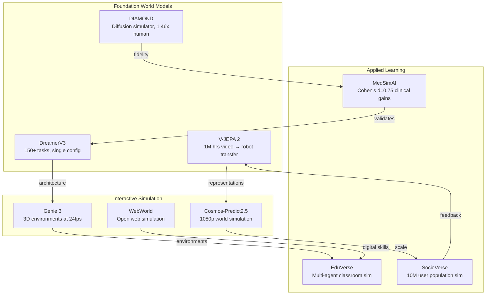
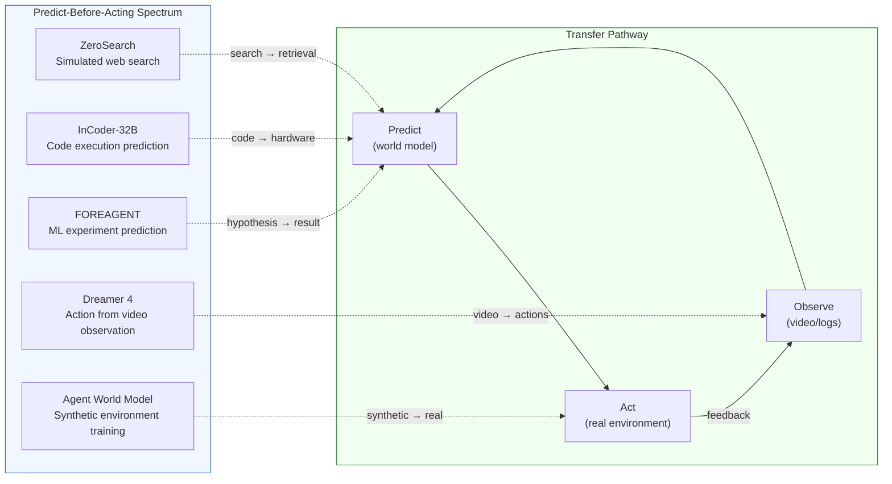

# Predictive Learning Through Simulation

**Predictive Simulation Learning** refers to AI systems that build internal models of their environment and learn by simulating outcomes before acting. Rather than learning exclusively through trial-and-error in the real world, these agents "imagine" consequences, rehearse strategies, and transfer simulation-learned skills to practical tasks.

## Overview

Humans routinely learn by mental simulation -- a chess player imagines moves ahead, a surgeon rehearses a procedure mentally, a student works through a physics problem by picturing the scenario. Predictive simulation learning formalizes this capacity in AI: the agent constructs a **world model** that predicts future states given actions, then trains policies by "dreaming" within that model.

This approach is foundational for AI systems that help people learn real-world skills, because it enables risk-free practice, accelerated iteration, and transfer from simulated to authentic environments.

## Theoretical Foundations

### World Models Are Necessary for Generalization

Richens et al. (ICML 2025) provide a formal proof that any agent capable of generalizing to multi-step, goal-directed tasks in novel environments **must** have learned a world model.[^1] This result establishes that predictive simulation is not merely one strategy among many -- it is a mathematical requirement for general-purpose intelligence.

This has direct implications for educational AI: systems that help learners generalize knowledge to new situations must internally model the domain, not just pattern-match on training data.

### Predictive Coding and the Brain

Predictive coding -- the neuroscience hypothesis that the brain continuously generates predictions and learns from prediction errors -- has been validated as an effective AI training signal. Kuo et al. (NeurIPS 2025) show that adding predictive coding modules to meta-RL agents produces interpretable, Bayes-optimal belief representations under partial observability.[^2] Only agents with predictive modules successfully learned optimal policies in tasks requiring active information-seeking.

This bridges neuroscience-inspired learning theory with practical AI, suggesting that prediction-driven learning produces more robust and interpretable outcomes for both artificial and human learners.

## Key Systems and Results

### Comparative Overview of World Model Systems (2024-2026)

| System | Scale | Key Capability | Learning Transfer Evidence | Efficiency |
|--------|-------|---------------|--------------------------|------------|
| DreamerV3[^3] | 150+ tasks | General imagination-based RL | First to get Minecraft diamonds from scratch | Single config, no per-task tuning |
| V-JEPA 2[^4] | 1M+ hrs video | Observation → manipulation transfer | Zero-shot robotic pick-and-place | 62 hrs unlabeled robot video |
| DIAMOND[^5] | Atari 100k | Diffusion world simulator | 1.46× human normalized score | Visual fidelity → better policies |
| Genie 3[^14] | Unlimited | Text → interactive 3D world | Real-time exploration at 24 fps | ~1 minute consistency window |
| Cosmos-Predict2.5[^43] | 1080p | Open-weight world simulation | Physical AI foundation | Open weights, 30s coherent video |
| LeWM[^13] | 15M params | Stable JEPA from pixels | Single-GPU training | 48× faster than foundation models |
| WebWorld[^79] | 134M pages | Open web world model | +9.2% cross-domain transfer | Digital skill simulation |
| SimDist[^49] | Sim→real | Structure transfer across domains | Short-horizon calibration suffices | Reduces real-world data needs |
| MedSimAI[^62] | Multi-institution | Medical deliberate practice | Cohen's d = 0.75 on real OSCEs | 59.5% voluntary repetition rate |
| SocioVerse[^31] | 10M profiles | Population behavioral prediction | Market response simulation | LLM agents + demographics |

### DreamerV3: General World Model Agent

Hafner et al. (Nature, 2025) introduced DreamerV3, a general algorithm that learns a world model and improves behavior by imagining future scenarios.[^3] With a single configuration (no per-task tuning), it outperforms specialized methods across 150+ tasks spanning continuous control, Atari, and Minecraft -- notably the first algorithm to collect diamonds in Minecraft from scratch without human data.

**Learning application:** DreamerV3 demonstrates that purely simulation-based learning can master complex, long-horizon tasks. An educational system built on this principle could let students practice decision-making in simulated environments (business scenarios, medical diagnosis, engineering design) with the same generality across domains.

### V-JEPA 2: Learning World Models from Video

Assran et al. (Meta AI, 2025) pre-trained V-JEPA 2 on over 1 million hours of internet video using a joint-embedding predictive architecture.[^4] The model achieves state-of-the-art performance on motion understanding and action anticipation. Critically, when post-trained as a latent action-conditioned world model using under 62 hours of unlabeled robot video, it can be deployed zero-shot on physical Franka arms for pick-and-place tasks.

**Learning application:** Shows that predictive models trained on observation (video) can transfer to real-world manipulation with minimal domain-specific data -- analogous to a student watching demonstrations before performing a hands-on task.

### DIAMOND: High-Fidelity Simulation via Diffusion

Alonso et al. (NeurIPS 2024 Spotlight) use diffusion models as environment simulators, training RL agents entirely within "dreamed" environments.[^5] DIAMOND achieves 1.46 mean human-normalized score on Atari 100k (46% above human level), demonstrating that visual detail in simulations matters -- richer predictive models yield better policies.

**Learning application:** For educational simulations, this implies that higher-fidelity virtual environments produce more transferable learning. A chemistry lab simulation with realistic visual feedback would teach more effectively than an abstract one.

### Computer-Using World Model (CUWM)

Guan et al. (2026) built a world model that predicts the next UI state given a current state and candidate action in desktop software.[^6] The model uses a two-stage factorization: first predicting textual descriptions of state changes, then rendering the visual result. This enables agents to reason about action consequences before executing them.

**Learning application:** A direct tool for learning computer skills -- students could preview what their actions would do in simulated software environments, making mistakes risk-free and accelerating skill acquisition.

### ZeroSearch: Simulated Environments for Information Retrieval

Sun et al. (Alibaba, 2025) replace real search engines with an LLM-based search simulator during RL training, reducing API costs by 88% while matching real-search performance.[^7] A curriculum of increasing difficulty mirrors effective pedagogical strategies.

**Learning application:** Demonstrates that agents can learn complex information-retrieval skills by practicing in simulated environments. The curriculum-based approach (gradually increasing difficulty) directly parallels scaffolded instruction in education.

### Agent Planning with World Knowledge Model (WKM)

Qiao et al. (NeurIPS 2024) create a parametric "mental model" that provides an LLM agent with prior task knowledge for global planning and dynamic state knowledge for local planning.[^8] The agent self-synthesizes this knowledge from expert and sampled trajectories, significantly outperforming baselines.

**Learning application:** Directly models how humans use prior knowledge plus real-time understanding to plan actions. For tutoring, this approach could power systems that simulate a student's knowledge state and predict which instructional actions will be most effective.

## Quality of Simulation: What Actually Matters

The World-in-World benchmark (Zhang et al., ICLR 2026 Oral) provides the first systematic evaluation of world models in closed-loop settings.[^9] Key findings:

1. **High visual quality does not guarantee task success** -- A visually impressive simulation that doesn't accurately model action-relevant dynamics is useless for learning.
2. **Scaling post-training with action-observation data matters more** than upgrading the visual generator.
3. **Online planning at inference time substantially improves performance** -- the agent should continue to simulate and plan during deployment, not just during training.

For educational applications, this means simulations must test transfer to actual performance, not just look impressive. A flight simulator's value comes from aerodynamic accuracy, not visual polish.

## LeWorldModel: Stable JEPA from Pixels

Maes et al. (AMI Labs / Meta FAIR, March 2026) introduced LeWorldModel (LeWM), the first Joint-Embedding Predictive Architecture (JEPA) that trains stably end-to-end from raw pixels.[^13] The key innovation is a streamlined two-term objective: a standard mean-squared error for temporal prediction and a regularizer enforcing isotropic Gaussian latent embeddings. This reduces tunable loss hyperparameters from six (in the only prior end-to-end alternative) to one.

**Key results:**
- Only ~15M parameters, trainable on a single GPU in a few hours
- Each frame encoded as a single 192-dim token (~200× fewer tokens than DINO-WM)
- Planning completes in ~1 second vs. 47 seconds for DINO-WM (48× speedup)
- Competitive across diverse 2D and 3D control tasks
- Latent space encodes meaningful physical structure; surprise evaluation confirms reliable detection of physically implausible events

**Learning application:** LeWM demonstrates that predictive world models can be made radically efficient -- small enough for a laptop, fast enough for real-time interaction. This opens the door to personalized simulation environments for learning that don't require cloud-scale compute. A student could run a physics simulation world model locally, exploring cause-and-effect relationships at interactive speeds.

LeWM also addresses a critical failure mode of JEPA architectures -- representation collapse, where the model "cheats" by producing redundant embeddings. The solution (Gaussian regularization) ensures the model learns genuinely informative predictions rather than trivial shortcuts, an important lesson for any predictive learning system.

## Genie 3: Interactive World Generation at Scale

Google DeepMind released Genie 3 (January 2026), the first general-purpose world model capable of generating interactive environments in real time at 24 fps and 720p resolution.[^14] Given a text prompt, Genie 3 creates diverse, navigable worlds -- physical phenomena, ecosystems, historical locations, fictional scenarios -- that respond dynamically to user actions.

**Technical achievements:**
- Auto-regressive frame generation conditioned on initial prompt and ongoing user interactions
- Visual memory extending ~1 minute back, enabling consistent location revisiting (emergent capability, not explicit 3D representation)
- Supports "promptable world events" -- text-based environmental modifications during interaction
- SIMA agent compatibility for embodied AI training
- Outperforms GameNGen, Genie 2, and Veo across control, resolution, and interaction latency

**Limitations:** Limited action space, difficulty with multiple independent agents, poor text rendering, maximum interaction duration of a few minutes.

**Learning application:** Genie 3 represents a paradigm shift for simulation-based learning. Instead of hand-crafting educational simulations, instructors could generate interactive learning environments from text descriptions: "Create a medieval marketplace for economics students" or "Generate a coral reef ecosystem for marine biology." The real-time interaction means learners can explore consequences of their actions immediately, embodying the predict-act-observe loop central to [predictive learning](predictive-simulation-learning.md). The current limitations (short duration, limited agents) constrain use to focused exploratory exercises rather than extended simulations.

## The JEPA Family Expands: From Pixels to Plans (March 2026)

The Joint-Embedding Predictive Architecture (JEPA) paradigm, established by V-JEPA and extended by LeWM, saw rapid proliferation in March 2026 with several systems applying predictive latent world models to embodied AI tasks.

### ThinkJEPA: Reasoning Meets Prediction

Zhang et al. (March 2026) introduced ThinkJEPA, a dual-pathway framework that integrates Vision-Language Models (VLMs) with JEPA-style latent world models.[^15] One branch handles fine-grained motion dynamics through dense frame processing, while a VLM "thinker" provides long-horizon semantic guidance via wider temporal sampling. The system achieves superior performance on hand-manipulation trajectory prediction tasks compared to either VLM-only or JEPA-only approaches.

**Learning application:** ThinkJEPA demonstrates that effective prediction requires both perceptual detail (what is physically happening) and semantic reasoning (what the goal is and why). This mirrors dual-process theory in cognitive science -- System 1 (fast, perceptual) and System 2 (slow, deliberative) working together. An educational simulation that combines detailed physics modeling with high-level conceptual reasoning would teach more effectively than either alone.

### Social-JEPA: Independently Trained Models Converge

Zhang et al. (February 2026) discovered that when separate agents independently train JEPA world models from different viewpoints of the same environment, their latent spaces spontaneously become related by approximate linear isometry.[^16] Classifiers trained on one agent transfer to another without retraining.

**Learning application:** This result has profound implications for collaborative learning AI. It suggests that agents trained independently on the same domain develop compatible internal representations -- a computational analogue of how students studying the same subject independently develop transferable understanding. This could enable federated learning systems where student models trained in isolation can share insights without sharing raw data.

### DynaWeb: Dreaming About the Web

Ding et al. (January 2026) built DynaWeb, an MBRL framework where an LLM-based web world model functions as a learned web server, allowing agents to train through "imagination" rather than live website interaction.[^17] The system blends on-policy imagined rollouts with real expert trajectories, improving WebArena success rate from 26.7% to 31.0%.

**Learning application:** DynaWeb extends the simulation-based learning paradigm to digital skills. Rather than practicing on live websites (where mistakes have consequences), learners could train in dreamed web environments that faithfully model real interfaces. This is particularly relevant for e-commerce training -- agents learning to navigate shopping platforms, apply coupons, and manage orders can practice in simulated storefronts before engaging real marketplaces (see [AI for E-Commerce Learning](ai-ecommerce-learning.md)).

## Self-Improving World Models: The WAV Framework

The World Action Verifier (WAV) framework (April 2026) bridges [predictive simulation](predictive-simulation-learning.md) and [recursive self-improvement](recursive-self-improvement.md) by enabling world models to identify their own prediction errors and self-correct.[^18] WAV decomposes action-conditioned state prediction into two verifiable components: state plausibility ("is this a realistic next state?") and action reachability ("could this action lead to this state?"). By exploiting the asymmetry between forward prediction (hard) and inverse verification (easier), WAV achieves 2× higher sample efficiency and 18% policy performance improvement across nine tasks.

**Learning application:** WAV formalizes a critical learning principle: it's often easier to verify an answer than to generate one. A student may struggle to derive a proof but can check whether a proposed proof is valid. Educational AI systems could use this asymmetry -- training students to verify before they generate, building intuition through evaluation before requiring production.

## World Action Models vs. Vision-Language-Action Policies: What Generalizes?

Zhang et al. (March 2026) conducted the first systematic robustness comparison between World Action Models (WAMs) and Vision-Language-Action policies (VLAs) for robotic manipulation.[^19] WAMs -- which predict future visual states before selecting actions -- generally demonstrate stronger robustness to noise, lighting, and layout perturbations in both single-arm and bimanual tasks. LingBot-VA achieved 74.2% success on RoboTwin 2.0-Plus; Cosmos-Policy reached 82.2% on LIBERO-Plus. This robustness is attributed to spatiotemporal priors inherited from world model pre-training.

However, VLAs like π₀.₅ can match WAM robustness on specific tasks given sufficiently diverse training data. The critical finding: **how video priors are integrated** determines generalization quality more than whether a world model exists at all.

**Learning application:** This result has direct implications for simulation-based education. It suggests that the way a learner integrates predictive mental models with perceptual input matters more than simply "having" a mental model. Training that explicitly connects predictions to observations (as WAMs do) produces more robust transfer than training that treats them independently. An educational simulation should interleave prediction ("what will happen next?") with observation ("what actually happened?") to build the kind of robust understanding WAMs exhibit.

## Practical World Model RL for Embodied Agents: VLA-MBPO

Zhang et al. (March 2026) address the practical barriers to deploying world-model-based reinforcement learning with their VLA-MBPO framework.[^20] The system tackles three key challenges: pixel-level world modeling from limited data, multi-view consistency, and compounding errors under sparse rewards. Three innovations make this practical:

1. **Unified Multimodal Models (UMMs)** adapted for efficient world modeling with limited data
2. **Interleaved View Decoding** enforcing consistency across multiple camera viewpoints
3. **Chunk-level Branched Rollout** mitigating error accumulation during long-horizon planning

VLA-MBPO demonstrates significantly improved policy performance and sample efficiency across both simulated and real-world robotic tasks.

**Learning application:** VLA-MBPO shows that world models can be made practical for real-world training even with limited interaction data -- a constraint shared by educational settings where student practice time is scarce. The branched rollout technique (exploring multiple prediction paths and pruning bad ones) directly parallels pedagogical scaffolding: a tutor explores multiple explanatory approaches and keeps the one that best matches the student's trajectory.

## Code World Models: Predicting Execution Before Running

InCoder-32B-Thinking (Yang et al., April 2026) introduces the Industrial Code World Model (ICWM), a system trained on domain-specific execution traces from Verilog simulation and GPU profiling that learns the causal dynamics of how code affects hardware behavior.[^21] The model generates reasoning traces for hardware-related code tasks via Error-driven Chain-of-Thought synthesis, achieving 81.3% on LiveCodeBench v5, 84.0% on CAD-Coder, and 38.0% on KernelBench.

The key innovation is **predictive compilation**: the model forecasts execution outcomes before actual compilation, enabling self-verification through internal simulation rather than external feedback. This extends the world model paradigm from physical environments (DreamerV3, V-JEPA 2) into the domain of software execution -- the model "imagines" what running the code will do.

**Learning application:** Code world models represent a direct tool for learning programming and hardware design. A student writing Verilog or CUDA code could receive instant predictive feedback ("this code will likely produce a timing violation because...") without waiting for lengthy compilation cycles. The predict-then-verify loop teaches causal reasoning about code behavior -- understanding *why* code produces certain outcomes, not just *what* it produces. This is particularly valuable in industrial domains (chip design, GPU optimization) where compilation cycles are expensive and mistakes costly.

## Reinforcement World Model Learning (RWML): Self-Supervised Environment Understanding

Yu et al. (February 2026) developed RWML, a self-supervised method that trains LLM-based agents to build action-conditioned world models from textual environment states.[^22] Rather than learning from expert demonstrations, the agent learns by comparing its predicted next states with actual observed states, using semantic similarity in a pre-trained embedding space as the reward signal.

**Key results:**
- ALFWorld benchmark: 6.9-point improvement over direct reward RL
- τ² Bench: 5.7-point improvement over direct reward RL
- Matches expert-data training performance through pure self-supervised learning

**Learning application:** RWML demonstrates that agents can develop accurate environment understanding without any human supervision -- purely through the predict-observe-correct loop. This has direct implications for educational AI: a tutoring agent could build a model of how students respond to different instructional strategies, predict which approach will work best, observe the actual outcome, and self-correct. The semantic (rather than token-level) similarity metric is crucial -- it evaluates whether predictions capture the right *meaning*, not exact wording, which mirrors how human learning assessment should focus on conceptual understanding rather than rote reproduction.

## Curiosity-Driven Predictive Learning

Santana, Costa & Colombini (2025) build world models for intrinsically motivated agents using cognitive elements -- curiosity and prediction.[^10] Agents learn complex behaviors in 18 Atari games without any externally designed reward, driven purely by predictive error signals.

This models **inquiry-based learning** in education: students learn best when they encounter and resolve gaps in their own understanding. An AI tutor could identify where a student's mental model diverges from reality and create exercises targeting those specific prediction errors.

## PiJEPA: Policy-Guided World Model Planning

Chahe & Zhou (March 2026) introduced PiJEPA, a two-stage framework combining learned navigation policies with latent JEPA world model planning for instruction-conditioned visual navigation.[^52] In stage one, an Octo-based policy is fine-tuned with frozen vision encoders (DINOv2 or V-JEPA-2) on navigation data. In stage two, the policy-derived action distribution warm-starts Model Predictive Path Integral (MPPI) planning over a separately trained JEPA world model.

**Key insight:** By initializing planning from an informed policy prior rather than an uninformed Gaussian, the planner converges faster to effective action sequences. PiJEPA significantly outperforms both standalone policy execution and uninformed world model planning on real-world navigation tasks.

**Learning application:** PiJEPA demonstrates a principle central to effective learning: *guided exploration outperforms undirected search*. A student who has rough intuitions about a problem domain (the "policy prior") explores the solution space more efficiently than one starting from scratch. This mirrors the pedagogical strategy of activating prior knowledge before new instruction -- even imperfect prior knowledge accelerates learning. For simulation-based training, PiJEPA suggests that learners should first develop basic competence through guided instruction (policy learning) before being placed in open-ended simulations (world model planning), rather than being thrown into full simulation from the start. This connects to [Skill0's](recursive-self-improvement.md#skill0-progressive-skill-internalization-as-recursive-withdrawal) progressive scaffolding withdrawal: the policy prior provides initial scaffolding that the planner gradually supersedes.

## Value-Guided Action Planning with JEPA World Models

Destrade, Bounou, Le Lidec, Ponce & LeCun (World Modeling Workshop 2026) propose shaping JEPA representation spaces so that the negative goal-conditioned value function is approximated by a distance between state embeddings.[^53] By training the state encoder with an implicit Q-learning (IQL) loss, distances in embedding space directly encode task-relevant "closeness to goal," enabling more effective planning without reconstructing pixel observations.

**Key insight:** Standard JEPA world models learn representations optimized for prediction accuracy, but these representations may not be geometrically organized for planning. Value-guided training restructures the latent space so that "nearby" embeddings correspond to states that are actionably close -- not just visually similar.

**Learning application:** This result has a direct analogue in education: the mental representations students build while learning determine how effectively they can solve new problems. A student who organizes their knowledge by *goal relevance* (which concepts help solve which types of problems) navigates the solution space more efficiently than one who organizes by *surface similarity* (which concepts look similar). Value-guided JEPA suggests that educational AI should help students build goal-structured mental models -- organizing knowledge around "what helps me solve problems" rather than "what looks similar to what." Combined with [LeWM's](#leworldmodel-stable-jepa-from-pixels) efficient training and [PiJEPA's](#pijepa-policy-guided-world-model-planning) guided exploration, this extends the JEPA family into a complete framework for simulation-based learning: efficient prediction (LeWM) + goal-structured representations (Value-Guided) + guided exploration (PiJEPA).

## Adversarial Simulation: Dark Patterns and Agent Vulnerability

Ersoy et al. (IEEE S&P 2026) provide the first systematic study of how deceptive UI designs ("dark patterns") manipulate LLM-based web agents.[^54] Using LiteAgent (a lightweight evaluation framework) and TrickyArena (a controlled environment with e-commerce, streaming, and news platforms), they found that agents are susceptible to dark patterns an average of 41% of the time, with GPT-4o showing a 28.9% TSR drop from a single dark pattern. Combining multiple dark patterns or modifying HTML elements further increases susceptibility.

**Learning application:** This research reveals a critical blind spot in simulation-based learning: **agents trained in clean simulations fail when deployed in adversarial environments**. The 41% susceptibility rate means that shopping agents, web navigation agents, and similar systems trained in standard simulated environments will frequently make errors when encountering real-world deceptive designs. For educational simulation, this creates both a warning and an opportunity: training simulations should include adversarial elements (misleading UI patterns, deceptive information) to build robust decision-making skills. A business student practicing in a simulation that includes dark patterns would develop better critical evaluation skills than one trained in an idealized environment. This connects to the [World-in-World benchmark's](#quality-of-simulation-what-actually-matters) finding that simulation quality requires fidelity to real-world dynamics -- and real-world dynamics include adversarial actors.

## OpenWorldLib: A Unified Definition and Framework for World Models

Zeng et al. (Kling Team, April 2026) propose the first unified definition of advanced world models: "a model or framework centered on perception, equipped with interaction and long-term memory capabilities, for understanding and predicting the complex world."[^58] OpenWorldLib provides a standardized inference framework that integrates models across different tasks, enabling efficient code reuse and collaborative inference. The paper systematically categorizes the essential capabilities required for world models and reflects on future research directions.

**Learning application:** OpenWorldLib addresses a growing fragmentation problem in world model research: each team defines "world model" differently, making comparison and transfer difficult. For educational simulation, a unified definition clarifies what capabilities a learning environment must have: perception (understanding the current state), interaction (responding to learner actions), and long-term memory (maintaining context across sessions). This framework connects [DreamerV3's](#dreamerv3-general-world-model-agent) generality, [Genie 3's](#genie-3-interactive-world-generation-at-scale) interactivity, and [V-JEPA 2's](#v-jepa-2-learning-world-models-from-video) perceptual grounding as complementary aspects of a unified world model architecture for learning.

## Self-Execution Simulation for Code Learning

Maimon et al. (April 2026) train coding models to trace through program execution step-by-step using natural language descriptions aligned with actual outputs.[^73] The approach combines supervised training on execution traces with reinforcement learning powered by verifiable rewards. This enables models to verify multiple solution candidates and iteratively self-correct by simulating test execution.

**Learning application:** Self-execution simulation extends the world model paradigm into programming education with a direct pedagogical mechanism. Rather than simply predicting whether code is correct, the model *simulates running it* -- tracing through each step and predicting intermediate states. This mirrors the "trace through" exercise that programming instructors use: asking students to manually execute code on paper. An AI tutor built on this approach could generate step-by-step execution traces for student code, highlighting exactly where the student's mental model diverges from actual execution. Combined with [InCoder-32B-Thinking's](#code-world-models-predicting-execution-before-running) industrial code world model, this establishes two complementary code simulation paradigms: InCoder predicts hardware-level execution outcomes, while self-execution simulation traces program logic step-by-step.

## Meta-TTL: Learning How to Learn at Test Time

Lou et al. (NUS, April 2026) introduce Meta-TTL, a framework that formulates the discovery of effective test-time adaptation policies as a bi-level optimization problem.[^74] The inner loop executes standard test-time learning (updating the agent based on new observations), while the outer loop uses evolutionary search to refine adaptation policies across diverse training tasks. Meta-TTL outperforms hand-crafted test-time adaptation baselines on both Jericho text games and WebArena-Lite web navigation, in both in-distribution and out-of-distribution scenarios.

**Learning application:** Meta-TTL represents a breakthrough for simulation-based learning: rather than designing adaptation strategies by hand, the system *learns how to adapt*. For educational simulations, this means the simulation itself could learn how to adjust its difficulty, pacing, and feedback based on learner behavior -- not through hand-coded rules but through optimized adaptation policies discovered by evolutionary search. The bi-level structure maps to educational design: the inner loop is a single learning session (the student adapts to new material), while the outer loop is curriculum design (the educator optimizes how sessions are structured). Meta-TTL automates the outer loop, potentially discovering pedagogical strategies that human designers wouldn't think of. This bridges [predictive simulation](predictive-simulation-learning.md) with [recursive self-improvement](recursive-self-improvement.md): the agent's adaptation policy recursively improves through evolutionary search over simulated learning episodes.

## AI-Agent School: Dual Memory for Educational Simulation

Jin et al. (EMNLP 2025) construct Agent-based Learning Simulation (AAS) to simulate teaching and learning processes, featuring a "Zero-Exp strategy" and a continuous "experience-reflection-optimization" cycle supported by dual memory (experience and knowledge bases with short/long-term components).[^75] Multi-agents autonomously evolve via interactions within simulated school scenarios, producing high-fidelity behavioral and interaction data.

**Learning application:** AI-Agent School directly addresses the gap between world models for physical environments and world models for educational environments. While [DreamerV3](#dreamerv3-general-world-model-agent) simulates physics and [SocioVerse](#socioverse-world-model-for-social-simulation-at-scale) simulates populations, AI-Agent School simulates the classroom itself -- teacher-student interactions, learning dynamics, and pedagogical strategies. The dual memory architecture (separate experience and knowledge stores) mirrors how effective teachers maintain both episodic recall (specific student interactions) and pedagogical knowledge (teaching strategies). For educational AI design, this provides a testing ground: new tutoring strategies can be evaluated against simulated classrooms before deploying with real students, just as [RISE](#rise-imagination-driven-robot-self-improvement) tests robot policies in imagined scenarios before physical execution.

## FOREAGENT: Predicting Before Executing ML Experiments

Zheng et al. (ACL 2026) address a fundamental bottleneck in scientific discovery agents: the **execution bottleneck**, where every hypothesis must be physically run to evaluate it.[^86] Drawing from world model theory, FOREAGENT internalizes execution priors to substitute costly experiment runs with instantaneous predictive reasoning through a Predict-then-Verify loop.

**Key results:**
- 61.5% prediction accuracy with robust confidence calibration on 18,438 pairwise comparisons
- 6× acceleration in convergence compared to traditional generate-execute-feedback loops
- +6% performance over execution-based baselines

**Learning application:** FOREAGENT demonstrates that the predict-before-acting principle central to world models extends beyond physical environments into the domain of scientific experimentation. A student learning to design ML experiments could use a FOREAGENT-style system to preview likely outcomes of different hyperparameter choices or architectural decisions before committing compute. This builds the kind of experimental intuition that expert researchers develop over years -- the ability to predict roughly what will happen before running the experiment. The framework connects to [ZeroSearch's](#zerosearch-simulated-environments-for-information-retrieval) simulation of search environments and [InCoder-32B-Thinking's](#code-world-models-predicting-execution-before-running) prediction of code execution, forming a spectrum of "predict before executing" approaches: web search (ZeroSearch) → code compilation (InCoder) → ML experiments (FOREAGENT).

## Agent World Model: Synthetic Environments at Scale

Wang et al. (February 2026) introduce Agent World Model (AWM), a fully synthetic environment generation pipeline that creates code-driven, database-backed environments for training agentic RL agents.[^87] Unlike LLM-simulated environments (which suffer from hallucination and inconsistency), AWM generates executable environments with reliable state transitions.

**Scale:**
- 1,000 diverse synthetic environments covering everyday scenarios
- 35,062 tools (35 per environment average)
- 10,000 tasks with verification code
- Largest open-source environment synthesis effort to date

**Key finding:** Training exclusively in synthetic environments yields strong out-of-distribution generalization across three independent benchmarks -- agents don't need benchmark-specific environments to learn transferable skills.

**Learning application:** AWM addresses a scaling bottleneck for simulation-based education: creating realistic practice environments is expensive and slow. By synthesizing thousands of diverse environments automatically, AWM enables an approach where learners can practice in an effectively unlimited variety of simulated contexts -- each with different tools, databases, and tasks. The out-of-distribution generalization result is particularly significant for education: it suggests that practicing across *many diverse simulations* transfers better than practicing in a single high-fidelity simulation. This connects to [curriculum learning](../methodologies/curriculum-learning.md) -- diversity of practice contexts may matter more than depth in any single context.

## Simia: LLM-Simulated Environments Replace Bespoke Testbeds

Li et al. (November 2025) address the brittleness of agent training by demonstrating that LLMs themselves can serve as environment simulators, eliminating the need for handcrafted testbed infrastructure.[^89] Simia introduces two complementary training pipelines:

- **Simia-SFT:** Amplifies small seed sets of expert trajectories into diverse training data through LLM-simulated environment feedback, in an environment-agnostic manner
- **Simia-RL:** Enables RL-based agent training entirely through LLM-simulated feedback, with no actual environment implementation required

**Key results:**
- Fine-tuned open models consistently improve across multiple benchmarks
- Performance exceeds GPT-4o and approaches o1-mini on τ²-Bench
- Eliminates dependency on bespoke testbed engineering

**Learning application:** Simia represents a paradigm shift for simulation-based education: instead of building expensive, domain-specific training environments, the LLM *becomes* the environment. A medical education system wouldn't need a custom patient simulator -- the LLM simulates patient responses. A business school wouldn't need purpose-built market simulations -- the LLM simulates market dynamics. This dramatically lowers the cost of creating diverse practice environments, connecting to [AWM's](#agent-world-model-synthetic-environments-at-scale) finding that training across many diverse simulated contexts produces better transfer than a single high-fidelity simulation. The key tradeoff is fidelity: LLM-simulated environments may hallucinate implausible states, requiring the same verification mechanisms that [WAV](#self-improving-world-models-the-wav-framework) applies to world model predictions.

## Dreamer 4: Offline Learning from Video Alone

Hafner, Yan & Lillicrap (2025) introduce Dreamer 4, a scalable world model that achieves a landmark result: the first agent to obtain diamonds in Minecraft purely from offline data, without any environment interaction.[^88] The agent selects 20,000+ sequential actions from raw pixels using only a world model trained on pre-recorded video.

**Key achievements:**
- Real-time interactive inference on a single GPU
- Accurately predicts object interactions and game mechanics in Minecraft
- Learns general action conditioning from a small amount of data
- Enables knowledge extraction from diverse unlabeled video

**Learning application:** Dreamer 4 shows that AI agents can learn complex, long-horizon skills purely by watching -- without ever practicing in the real environment. This has profound implications for education: a learner could build substantial competence by observing expert demonstrations before any hands-on practice, analogous to surgical residents watching procedures before scrubbing in. The offline-only result challenges the assumption that interactive practice is always necessary for skill acquisition. Combined with [V-JEPA 2's](#v-jepa-2-learning-world-models-from-video) video-based world model and [DreamerV3's](#dreamerv3-general-world-model-agent) generality, Dreamer 4 establishes that *observation alone* can produce robust action policies when mediated by a sufficiently capable world model.

## SpatialEvo: Self-Evolving Spatial Intelligence via Deterministic Environments

Li et al. (April 2026) address a critical bottleneck in spatial reasoning: expensive geometric annotation.[^90] SpatialEvo leverages a unique property of 3D reasoning -- ground truth is a deterministic consequence of geometry, computable exactly from point clouds and camera poses -- to create zero-noise interactive oracles from unannotated 3D scenes.

**Key innovations:**
- **Deterministic Geometric Environment (DGE):** Formalizes 16 spatial reasoning task categories with explicit validation rules, converting raw 3D scenes into objective feedback oracles
- **Co-evolving dual roles:** A shared-parameter policy simultaneously generates spatially valid questions (questioner) and derives answers against verified ground truth (solver)
- **Task-Adaptive Scheduler:** Dynamically concentrates training on the model's weakest areas without manual intervention

**Results:** Highest average scores at both 3B and 7B parameter scales across nine spatial reasoning benchmarks, while maintaining general visual understanding.

**Learning application:** SpatialEvo demonstrates a powerful paradigm for self-supervised simulation-based learning: when the domain has deterministic ground truth, the environment itself becomes an inexhaustible teacher. The co-evolving questioner-solver architecture generates an organic curriculum -- the system asks itself progressively harder questions in areas where it struggles. For spatial learning in education (architecture, engineering, surgery), SpatialEvo suggests that AI systems could generate unlimited practice problems with guaranteed-correct answers from raw 3D scans of real environments. The task-adaptive scheduler implements what educational psychologists call "desirable difficulty" -- focusing practice on weak areas rather than reinforcing strengths. This connects to [LADDER's](recursive-self-improvement.md#ladder-recursive-problem-decomposition) recursive problem decomposition and [Agent0's](recursive-self-improvement.md#agent0-self-evolving-agents-from-zero-data) co-evolutionary curriculum -- all three generate training curricula without human annotation, but SpatialEvo uniquely leverages geometric determinism to guarantee correctness.

## Connections to Other Topics

### To Recursive Self-Improvement
World models can be recursively refined: an agent simulates, acts, observes the real outcome, updates its model, and simulates better next time. This creates a [recursive improvement loop](recursive-self-improvement.md) where prediction quality compounds over time. LeWM's efficiency (48× faster planning) makes this loop practical for rapid iteration -- a self-improving agent can test modifications through fast simulation rather than expensive real-world rollouts. The WAV framework[^18] makes this connection explicit: world models that can verify their own predictions and self-correct are performing recursive self-improvement at the representation level.

### To E-Commerce Applications
Predictive simulation underpins demand forecasting, customer behavior prediction, and supply chain optimization in [AI for e-commerce](ai-ecommerce-learning.md). The JD.com supply chain agent (Qi et al., 2025) uses LLM-based prediction to achieve 22% better plan accuracy.[^11] Genie 3's text-prompted world generation could enable virtual storefront prototyping -- retailers simulating customer navigation patterns before building physical or digital stores. DynaWeb's approach of training agents through "dreamed" web interactions directly applies to e-commerce agent training -- shopping agents can practice in simulated storefronts before engaging real marketplaces, reducing costs and avoiding real-world mistakes.

### To Open-Ended Discovery
[Open-ended discovery](open-ended-discovery.md) systems like the AI Scientist can be viewed as performing predictive simulation over the space of research ideas -- internally modeling which experiments are likely to yield interesting results before committing compute.

### To Automated Experiment Design
[Automated experiment design](../methodologies/automated-experiment-design.md) benefits from world models that predict experimental outcomes before running expensive compute. The tree search approach in the AI Scientist implicitly builds a model of which research directions are promising.

## RISE: Imagination-Driven Robot Self-Improvement

Yang et al. (February 2026) introduced RISE (Self-Improving Robot Policy with Compositional World Model), a framework that uses world-model "imagination" to improve robot policies without extensive physical interaction.[^23] The Compositional World Model has two modules: (i) a controllable dynamics model that predicts multi-view future states, and (ii) a progress value model that evaluates imagined outcomes, producing informative advantage signals for policy improvement.

**Key results:**
- +35% absolute performance on dynamic brick sorting
- +45% on backpack packing
- +35% on box closing
- All gains achieved through imagined rollouts, not additional physical trials

**Learning application:** RISE demonstrates the most direct application of "learning by imagining" to real-world skill acquisition. A student learning a surgical technique or mechanical repair could practice in an imagination-augmented simulator that generates diverse scenarios and evaluates predicted outcomes -- building skill through mental rehearsal before physical execution. The compositional design (separate dynamics and value models) mirrors how expert practitioners separate "what will happen" from "is the outcome good" in their decision-making.

## AutoWorld: Self-Supervised World Models at Scale

Pourkeshavatz, Liu & Rhinehart (March 2026) introduced AutoWorld, a framework that scales multi-agent traffic simulation using world models learned from unlabeled LiDAR data.[^24] The system uses a motion-aware latent supervision objective for fully self-supervised training and a cascaded Determinantal Point Process framework for diverse multi-agent sampling. AutoWorld ranks first on the WOSAC benchmark's Realism Meta Metric and scales consistently with additional unlabeled data.

**Learning application:** AutoWorld shows that world models can be trained entirely from raw sensor data without human labeling, a critical breakthrough for democratizing simulation-based learning. Educational simulations for domains like urban planning, traffic engineering, or logistics could be bootstrapped from real-world observation data rather than requiring expensive manual environment construction. The self-supervised approach means the simulation improves automatically as more observational data becomes available -- a natural recursive improvement loop (see [Recursive Self-Improvement](recursive-self-improvement.md)).

## Agent World Model (AWM): Infinite Synthetic Environments for Agent Training

Wang et al. (February 2026) propose Agent World Model (AWM), a pipeline for generating fully synthetic, code-driven training environments at scale.[^25] The system produced 1,000 diverse environments with everyday scenarios featuring rich toolsets (averaging 35 tools per environment, 35,062 total), backed by databases that provide reliable state transitions -- unlike environments simulated by LLMs, which suffer from inconsistency and hallucination.

**Key results:**
- Agents trained exclusively in synthetic environments achieve robust out-of-distribution generalization across three benchmarks
- Code-driven environments with accessible database states enable dependable reward function design
- Large-scale multi-turn tool-use RL training more efficiently than collecting real-world trajectories

**Learning application:** AWM represents the logical next step from DynaWeb and ShopSimulator: rather than hand-crafting or LLM-hallucinating training environments, the system *generates* reliable simulations programmatically. For education, this means personalized learning environments could be synthesized on demand -- a teacher could request "create a simulated restaurant management environment for business students" and receive a fully functional, database-backed simulation for practice. The code-driven approach ensures consistent state transitions (unlike pure LLM simulation), which is critical for domains where learners need to understand cause-and-effect relationships. Combined with [DynaWeb's](predictive-simulation-learning.md#dynaweb-dreaming-about-the-web) dreamed web environments and [ShopSimulator's](ai-ecommerce-learning.md#shopsimulator-rl-training-ground-for-shopping-agents) e-commerce simulations, AWM suggests a future where the simulation layer for any learning domain can be auto-generated.

## Skill0: Progressive Skill Internalization via Curriculum

Lu et al. (April 2026) introduced Skill0, a framework for embedding procedural knowledge into LLM agent parameters through a training-time curriculum that begins with full skill context and progressively withdraws it.[^26] Skills are organized by category and rendered as visual context to teach tool use and multi-turn task completion. A Dynamic Curriculum component evaluates skill helpfulness on-policy and retains only beneficial skills within a linearly decaying budget.

**Key results:**
- ALFWorld: +9.7% over standard RL baseline
- Search-QA: +6.6% over standard RL baseline
- Maintains efficiency with fewer than 0.5k tokens per step
- Achieves zero-shot autonomous behavior without runtime skill retrieval

**Learning application:** Skill0 formalizes a well-established educational principle: scaffolded withdrawal. Just as a good tutor initially provides heavy support and gradually removes it as the student gains competence, Skill0 starts with full skill descriptions and progressively withdraws them until the agent operates independently. The dynamic evaluation of which skills are still needed mirrors formative assessment -- checking what the learner has internalized vs. what still requires support. This connects directly to [LADDER's](recursive-self-improvement.md) progressive difficulty and [GASP's](recursive-self-improvement.md) zone of proximal development, forming a trio of systems that computationally implement scaffolded learning theory.

## EgoSim: First-Person World Simulation for Embodied Interaction

Hao et al. (April 2026) introduced EgoSim, a closed-loop egocentric world simulator that generates interaction videos from a first-person perspective while maintaining spatial consistency across multi-stage interactions.[^27] The system treats scenes as mutable 3D states that evolve through agent actions, and includes EgoCap, a low-cost smartphone capture system for collecting real-world training data.

**Key innovation:** Unlike prior world models that operate from third-person or abstract state representations, EgoSim generates predictions from the agent's own viewpoint -- the perspective from which humans actually experience and learn from the world.

**Learning application:** EgoSim enables first-person simulation of physical interactions, directly supporting experiential learning. A student learning surgical techniques, laboratory procedures, or mechanical repair could practice through first-person simulated interactions that preserve the spatial relationships of real-world manipulation. The low-cost data collection (smartphone capture) means domain-specific training environments can be built without expensive motion capture or specialized equipment, democratizing simulation-based training. This extends [V-JEPA 2's](#v-jepa-2-learning-world-models-from-video) demonstration-to-execution pipeline into fully interactive first-person simulation.

## YC-Bench: Long-Horizon Business Simulation for Agent Planning

He et al. (April 2026) created YC-Bench, a benchmark where AI agents run a simulated startup over a one-year horizon with hundreds of decision turns, managing employees, contracts, and finances under uncertainty.[^28] Only 3 of 12 frontier models consistently exceeded initial capital. Claude Opus 4.6 scored highest ($1.27M average), revealing that most current AI agents struggle with the compounding consequences of sequential business decisions.

**Learning application:** YC-Bench tests exactly the kind of long-horizon, consequence-laden decision-making that business education aims to develop. The finding that most frontier models fail at sustained business planning highlights a critical gap: AI agents (and by extension, AI tutors for business skills) cannot yet model the cascading effects of decisions over extended timeframes. For educational simulation, this establishes a concrete benchmark for measuring whether a business simulation environment is teaching transferable planning skills. The year-long horizon also pushes beyond [Genie 3's](#genie-3-interactive-world-generation-at-scale) minute-scale consistency, suggesting that text-based simulation (rather than visual world models) may be more practical for long-horizon learning scenarios.

## DriveDreamer-Policy: Unified Geometry-Grounded World-Action Model

Zhou et al. (April 2026) unified depth generation, future video prediction, and motion planning in a single architecture for autonomous driving, achieving 89.2 PDMS on Navsim v1.[^29] The key insight: explicit geometric grounding (depth prediction) complements video imagination for better action planning. The model "imagines" future driving scenarios while maintaining accurate spatial understanding.

**Learning application:** DriveDreamer-Policy demonstrates that effective predictive learning requires grounding imagination in physical reality. A world model that merely generates plausible-looking futures is insufficient -- it must also understand the geometry underlying those futures. For educational simulations, this means that effective learning environments must combine visual fidelity with structural accuracy. A physics simulation that produces beautiful but geometrically incorrect trajectories would teach wrong intuitions. This validates the [World-in-World benchmark's](#quality-of-simulation-what-actually-matters) finding that action-relevant dynamics matter more than visual quality.

## Dreamer 4: Scaling World Models to Offline Data

Hafner & Yan (September 2025) introduced Dreamer 4, the first agent to obtain diamonds in Minecraft purely from offline data -- without any environment interaction -- using 100× less data than previous keyboard and mouse agents.[^30] The key innovations are a shortcut forcing objective and an efficient transformer architecture that achieve real-time interactive inference (≥20 FPS) on a single GPU.

**Key results:**
- Obtains diamonds in Minecraft from 2,541 hours of contractor gameplay (vs. hundreds of thousands of hours for prior methods)
- Learns general action conditioning from a small amount of labeled data, extracting the majority of knowledge from diverse unlabeled videos
- World model accurately predicts object interactions and game mechanics, outperforming previous world models by a large margin

**Learning application:** Dreamer 4 demonstrates that world models can learn complex, long-horizon skills (20,000+ sequential actions) from *watching* rather than *doing*. This is the computational equivalent of observational learning -- a student watching expert demonstrations and building a mental model before attempting the task. The 100× data efficiency gain means educational simulations could be bootstrapped from far less demonstration data than previously assumed. Combined with [V-JEPA 2's](#v-jepa-2-learning-world-models-from-video) video-based pretraining, this suggests a path toward learning environments that acquire domain knowledge primarily from observing experts.

## SocioVerse: World Model for Social Simulation at Scale

Zhang et al. (April 2026) introduced SocioVerse, an LLM-agent-driven world model for social simulation powered by a pool of 10 million real-world users characterized across 15 demographic dimensions.[^31] The framework addresses alignment challenges through four components: a Social Environment (injecting real-world information), a User Engine (reconstructing realistic user context), a Scenario Engine (orchestrating simulation), and a Behavior Engine (reproducing human behaviors).

**Validation:** Large-scale experiments across presidential election prediction, breaking news feedback, and national economic surveys demonstrate that simulated results closely match real-world outcomes.

**Learning application:** SocioVerse extends world models from physical environments into *social* environments -- predicting how populations of people respond to events, policies, and market changes. For education, this enables a new class of learning simulation: students studying economics, political science, or marketing could test hypotheses against a world model calibrated on millions of real behavioral profiles. A business student could simulate "what happens if we launch this product at this price point?" against demographically accurate consumer populations. This bridges [predictive simulation](predictive-simulation-learning.md) and [AI for e-commerce](ai-ecommerce-learning.md) by providing the social prediction layer that demand forecasting and customer behavior modeling require.

**From SocioVerse to MiroFish:** While SocioVerse provides the demographic backbone, **MiroFish** (2026) builds a complete prediction pipeline on top of OASIS -- the CAMEL-AI social interaction engine that scales to one million agents with 23 social actions.[^80] MiroFish's key innovation is *bootstrapping agent personas from a knowledge graph* derived from the input scenario, rather than requiring manually designed personas. Agents interact on simulated social platforms with persistent memory, and collective dynamics (opinion formation, polarization, herd effects) emerge from individual interactions rather than being prescribed. For a detailed architectural breakdown, see [Multi-Agent Systems](multi-agent-systems.md#swarm-scale-social-simulation-mirofish-and-oasis). The MiroFish/OASIS stack represents the most complete implementation of social world models for predictive simulation to date, though quantitative calibration against real-world outcomes remains an open challenge.[^85]

## DreamerAD: Latent World Models for Autonomous Driving

Yang et al. (March 2026) introduced DreamerAD, the first latent world model framework for autonomous driving RL that compresses diffusion sampling from 100 steps to 1, achieving an 80× speedup while maintaining visual interpretability.[^32] Three innovations make this practical: shortcut forcing for recursive multi-resolution step compression, an autoregressive dense reward model on latent representations, and Gaussian vocabulary sampling for physically plausible trajectory exploration.

**Key result:** 87.7 EPDMS on NavSim v2, establishing state-of-the-art performance for imagination-based driving policy learning.

**Learning application:** DreamerAD demonstrates that the simulation-based learning paradigm can be made fast enough for safety-critical real-time applications. The 80× speedup over pixel-level world models means driving instruction simulations could run at interactive speeds -- a student learning hazard perception or defensive driving could practice in a world model that generates realistic driving scenarios in real time. Combined with [DriveDreamer-Policy's](#drivedreamer-policy-unified-geometry-grounded-world-action-model) geometric grounding, this establishes a complete stack for simulation-based driving education: fast latent dynamics (DreamerAD) + geometric accuracy (DriveDreamer-Policy).

## Empirical Validation: AI Tutoring Outperforms Active Learning

Kestin et al. (Scientific Reports, 2025) conducted a randomized controlled trial with 194 undergraduate physics students comparing a custom AI tutor (PS2 Pal) with in-class active learning sessions.[^33] The AI tutor was designed using the same pedagogical best practices as the classroom instruction.

**Key results:**
- Students learned significantly more in less time with the AI tutor (effect size 0.73--1.3 standard deviations)
- Students reported feeling more engaged and more motivated
- Completion rates improved by 70%; dropout rates fell by 15%

**Limitation:** The intervention lasted only two weeks; longer-term retention and skill transfer were not assessed.

**Learning application:** This is the strongest causal evidence to date that AI-powered simulation-based tutoring can outperform traditional active learning in a controlled educational setting. The effect size (0.73--1.3 SD) is remarkably large by educational research standards. Critically, the AI tutor used the *same* pedagogical principles as the classroom -- the advantage came from personalized pacing, immediate feedback, and the predict-then-verify loop inherent in interactive tutoring. This validates the core thesis of this article: systems that help learners build predictive mental models and immediately test them against reality produce superior learning outcomes. The finding that engagement and motivation also improved addresses a common concern that AI tutoring might be effective but demotivating.

## V-JEPA 2.1: Dense Features Unlock Robotic Transfer

Mur-Labadia et al. (Meta FAIR, March 2026) extended V-JEPA 2 with dense predictive loss, deep self-supervision across encoder layers, and multi-modal tokenizers for unified image-video training.[^37] V-JEPA 2.1 produces representations that are spatially structured, semantically coherent, and temporally consistent -- achieving 7.71 mAP on Ego4D, 40.8 Recall@5 on EPIC-KITCHENS, and a **20-point improvement in real-robot grasping** success rate over V-JEPA 2.

**Learning application:** V-JEPA 2.1 demonstrates that predictive video models are now directly useful for real-world robotic skill transfer. The 20-point grasping improvement over V-JEPA 2 shows that dense spatial features -- not just semantic understanding -- are critical for manipulation tasks. For educational simulation, this means that world models trained on video of expert performance can now produce representations detailed enough for fine motor skill learning, from surgical techniques to laboratory procedures.

## SWIRL: Self-Improving World Models Without Action Labels

Qiu et al. (February 2026) introduced SWIRL, a framework where world models improve by discovering latent actions from state sequences alone.[^38] SWIRL alternates between forward world modeling (predicting future states) and inverse dynamics modeling (inferring what actions caused observed transitions), trained via GRPO reinforcement learning. Results span 14-28% gains across visual dynamics (AURORABench), state transformation (ByteMorph), and world prediction (WorldPredictionBench).

**Learning application:** SWIRL removes a key bottleneck in building educational simulations: the need for labeled action data. A simulation of, say, cooking techniques could be bootstrapped from unlabeled video of expert chefs -- the system would discover the latent actions (chopping motions, temperature adjustments, timing decisions) without human annotation. This dramatically reduces the cost of creating domain-specific educational simulations. The self-improvement loop (forward prediction refines action discovery, which refines prediction) is a direct instance of [recursive self-improvement](recursive-self-improvement.md) applied to world model learning.

## The Dreamer-JEPA Convergence (March 2026)

Three independent March 2026 papers reveal a striking convergence between the Dreamer and JEPA families of world models, with both moving toward reconstruction-free embedding prediction:

- **Dreamer-CDP** (Hauri & Zenke, 2026) adds a JEPA-style predictor to DreamerV3, matching reconstruction-based performance on Crafter while outperforming all prior reconstruction-free methods.[^39]
- **R2-Dreamer** (Honda/UTokyo, ICLR 2026) uses a Barlow Twins-inspired redundancy reduction objective, eliminating decoders entirely while training 1.59× faster than DreamerV3.[^40]
- **NE-Dreamer** (Bredis et al., 2026) uses a temporal transformer to predict next-step encoder embeddings, matching DreamerV3 on DeepMind Control while gaining substantially on memory-dependent DMLab tasks.[^41]

**Learning application:** This convergence has direct implications for educational simulation efficiency. Reconstruction-free world models focus compute on understanding *dynamics* rather than recreating *pixels* -- meaning more of the computational budget goes toward learning how the world works rather than what it looks like. For educational applications where understanding cause-and-effect matters more than visual fidelity (physics simulations, economic models, circuit design), this family of methods offers better learning-relevant modeling at lower cost. Combined with [LeWM's](#leworldmodel-stable-jepa-from-pixels) single-GPU training, the Dreamer-JEPA convergence makes simulation-based learning accessible on commodity hardware.

## LOME: Egocentric World Models for Human-Object Manipulation

Gao et al. (March 2026) introduced LOME, an egocentric world model that generates realistic human-object interactions as videos conditioned on an input image, text prompt, and per-frame human actions.[^34] Rather than relying on traditional physics simulation, LOME learns manipulation dynamics directly from observation, producing physically authentic outcomes such as liquid flowing from a bottle into a mug after executing a "pouring" action. The system incorporates both body poses and hand gestures for fine-grained control.

**Learning application:** LOME bridges simulation and embodied learning by showing that world models can predict the physical consequences of manipulation actions from a first-person viewpoint -- without needing an explicit physics engine. Combined with [EgoSim's](#egosim-first-person-world-simulation-for-embodied-interaction) spatial consistency and [V-JEPA 2's](#v-jepa-2-learning-world-models-from-video) video-based pretraining, LOME completes a pipeline for learning physical skills through observation and mental rehearsal: watch demonstrations (V-JEPA 2), imagine interactions from first person (EgoSim), and predict manipulation outcomes (LOME). For vocational training -- surgery, cooking, repair work -- this means a learner could observe an expert, then practice in a simulation that predicts realistic physical consequences of their actions before attempting the real task.

## Video Models Reason Early: Plan Commitment in Diffusion

Newman, Zhu & Russakovsky (March 2026) discovered that video diffusion models commit to high-level motion plans within the first few denoising steps, with subsequent iterations only refining visual details.[^35] Path length -- not obstacle density -- determines difficulty, with a failure threshold at 12 steps. Their Chaining with Early Planning (ChEaP) method allocates compute to promising initial plans and chains them, improving maze-solving accuracy from 7% to 67% on extended mazes.

**Learning application:** This result reveals that generative models develop planning capabilities that resemble human cognitive strategies -- committing to a high-level approach early, then filling in details. For educational simulation, this suggests that world models may naturally develop the ability to "plan ahead" when predicting future states, a capacity that could be harnessed for tutoring systems that help students learn strategic planning. The failure threshold at 12 steps also illuminates a limitation: current models handle short planning horizons well but struggle with extended sequences, mirroring how novice learners can plan one or two steps ahead but fail at long-horizon reasoning until they develop [chunked strategies](recursive-self-improvement.md#skillrl-recursive-skill-discovery-and-evolution).

## From Multi-Agent to Single-Agent: When Is Skill Distillation Beneficial?

Xu et al. (April 2026) reveal that distilling multi-agent expertise into single-agent skills produces wildly variable outcomes -- from 28% improvement to 2% degradation on identical tasks.[^36] The critical insight: **skill utility is governed not by the task, but by the evaluation metric**. They introduce Metric Freedom (F), a predictor measuring the rigidity of a metric's scoring landscape. Their adaptive distillation framework achieves up to 8× cost reduction and 15× latency improvement while matching multi-agent performance.

**Learning application:** This paper formalizes when and how to compress multi-agent simulation into efficient single-agent skills -- directly relevant to educational deployment. A tutoring system might use multiple specialized agents during development (one for content generation, one for assessment, one for scaffolding) but deploy a distilled single agent for efficient student interaction. The Metric Freedom concept also applies to education: some learning outcomes (e.g., procedural accuracy) are "rigid" metrics where distilled skills work well, while others (e.g., creative problem-solving) are "free" metrics where the full multi-agent exploration is needed.

## ForeAgent: Predict-Then-Verify for ML Agents

Zheng et al. (January 2026) introduced ForeAgent, a framework that breaks the "Generate-Execute-Feedback" bottleneck constraining autonomous ML agents.[^42] Traditional ML agents must physically execute every candidate solution (run training, evaluate metrics) to learn -- an expensive process analogous to a chemistry student who must perform every experiment rather than predicting which will succeed. ForeAgent internalizes execution priors into a world-model-inspired predict-then-verify loop: the agent first *predicts* which data-centric solution will perform better (using a 18,438-pair comparison corpus), then only *executes* the predicted winner for verification.

**Key results:**
- 6× acceleration in convergence over execution-based baselines
- +6% performance over execution-only approaches
- LLMs achieve 61.5% prediction accuracy with robust confidence calibration when primed with verified data analysis reports

**Learning application:** ForeAgent formalizes a critical study skill: learning to predict outcomes before investing effort. A student studying for an exam who can predict which practice problems will be most informative (and verify selectively) learns faster than one who works through every problem sequentially. The predict-then-verify loop is the computational equivalent of "study smarter, not harder." This connects to [ZeroSearch's](#zerosearch-simulated-environments-for-information-retrieval) curriculum approach and the [WAV framework's](#self-improving-world-models-the-wav-framework) forward-inverse asymmetry -- all exploit the insight that prediction is cheaper than execution, and selective verification preserves accuracy while dramatically reducing cost. For educational AI, a tutoring system built on ForeAgent principles could predict which exercises will maximize learning gain for a specific student, then verify with only the highest-value activities.

## Cosmos-Predict2.5: Unified World Simulation for Physical AI

NVIDIA Research (2025-2026) released Cosmos-Predict2.5, the first model to unify Text2World, Image2World, and Video2World generation in a single architecture.[^43] Trained on 200 million curated video clips with reinforcement learning-based post-training, the model generates physically grounded world simulations across modalities -- from text descriptions to visual continuations.

**Learning application:** Cosmos-Predict2.5 represents the industrial maturation of the world model paradigm established by [DreamerV3](#dreamerv3-general-world-model-agent) and [Genie 3](#genie-3-interactive-world-generation-at-scale). The multimodal unification means a single system can generate training environments from text descriptions ("simulate a warehouse loading dock"), continue from images ("extend this lab setup into a working simulation"), or predict video futures ("what happens next in this assembly line?"). For vocational and professional training, this flexibility means simulation-based learning can be bootstrapped from whatever input is most readily available in a given domain. The RL-based post-training also connects to [recursive self-improvement](recursive-self-improvement.md) -- the world model's quality is refined through reward-driven iteration.

## WildWorld: Large-Scale Action-Conditioned World Modeling from Games

Li et al. (Shanda AI, March 2026) released WildWorld, the largest action-conditioned world modeling dataset to date: over 108 million frames from *Monster Hunter: Wilds* with 450+ distinct actions and synchronized per-frame annotations (character skeletons, world states, camera poses, depth maps).[^44] The accompanying WildBench evaluation framework measures Action Following and State Alignment in closed-loop settings.

**Key findings:**
- Current models struggle with semantically rich actions and long-horizon state consistency
- State-aware video generation significantly outperforms pure pixel prediction
- The gap between action diversity in games (~450 actions) and current model capabilities reveals how far world models must advance for complex interactive environments

**Learning application:** WildWorld addresses a critical bottleneck for educational simulations: the lack of diverse, high-quality training data with explicit state annotations. Games provide naturally complex environments where actions have clear consequences -- a student practicing strategic decision-making in a game-like simulation benefits from the same action diversity. The explicit state annotations (not just pixels) enable world models that understand *why* things happen, not just *what* happens visually. Combined with [Dreamer 4's](#dreamer-4-scaling-world-models-to-offline-data) ability to learn from observation alone, WildWorld suggests a pipeline where game data bootstraps educational simulations: collect rich game trajectories → train state-aware world models → deploy as interactive learning environments for decision-making, resource management, or strategic planning.

## GigaWorld-Policy: Efficient Action-Centered World-Action Models for Robotics

GigaAI (March 2026) introduced GigaWorld-Policy, an action-centered World-Action Model (WAM) that decouples visual representation from action dynamics, learning 2D pixel-action dynamics while enabling efficient action decoding with optional video generation.[^45] On real-world robotic platforms, GigaWorld-Policy runs 9× faster than the leading WAM baseline (Motus) while improving task success rates by 7%.

**Learning application:** GigaWorld-Policy's 9× speed advantage makes interactive simulation-based training practical for robotic skill learning. Where previous approaches required offline batch processing, GigaWorld-Policy supports real-time "try before you do" workflows -- a student or worker learning manipulation tasks can iterate at interactive speeds. The decoupled visual-action architecture also means the same world model can generate either quick action predictions (for learning) or full video visualizations (for review), adapting to the learner's needs. This complements [DreamerAD's](#dreamerad-latent-world-models-for-autonomous-driving) latent speedup and [V-JEPA 2.1's](#v-jepa-21-dense-features-unlock-robotic-transfer) dense features: GigaWorld-Policy provides the fast inference, V-JEPA 2.1 provides the rich representations, and together they enable interactive robotic training simulations.

## OECD Evidence: Pedagogical Design Determines Whether AI Simulation Helps or Harms

The OECD Digital Education Outlook 2026 synthesizes international experimental evidence on AI in education with a finding directly relevant to simulation-based learning.[^46] A field experiment in Türkiye found that access to GPT-4 improved student performance by 48% during use, and a *tutoring-designed* version improved it by 127% -- but students performed **17% worse** once access was removed, demonstrating that poorly designed AI tools create dependency rather than learning.

Conversely, in England, secondary science teachers using AI-supported tools reduced lesson preparation time by 31%, and less-experienced tutors assisted by GenAI saw significant improvements in student mathematics mastery.

**Learning application:** This is the most important policy-level finding for the simulation-based learning paradigm. The Türkiye result proves that *how* AI interacts with the learner matters more than *whether* it does. A simulation that simply gives answers (standard GPT-4) creates dependency; a simulation designed with pedagogical scaffolding (tutoring version, analogous to [Skill0's](#skill0-progressive-skill-internalization-as-recursive-withdrawal) progressive withdrawal) produces genuine learning. The 127% vs. -17% gap is the difference between a world model that lets students *predict then verify* and one that simply *provides answers*. This validates the entire predict-then-verify architecture described throughout this article: learners who build predictive mental models retain capability; those who outsource prediction to AI lose it.

## Self-Bootstrapping World Model Curricula: Agent0 Meets Simulation

The Agent0 framework (Zhang et al., 2025; ICLR 2026 RSI Workshop Oral) introduces a co-evolutionary approach where a curriculum agent and an executor agent bootstrap capability from zero data.[^47] While Agent0 was demonstrated on reasoning tasks, the architecture has direct implications for world model training:

A curriculum agent could generate increasingly complex simulation scenarios (environments, initial conditions, goal states) while an executor learns to navigate them. Combined with [SWIRL's](#swirl-self-improving-world-models-without-action-labels) label-free world modeling and [AWM's](#agent-world-model-awm-infinite-synthetic-environments-for-agent-training) code-driven environment generation, this suggests a fully self-bootstrapping simulation pipeline: the system generates both the training environments *and* the training curricula, requiring no human-designed scenarios or labeled demonstrations.

**Learning application:** For educational simulations, this means a domain-specific training environment could be bootstrapped by simply specifying the domain -- a co-evolutionary process would generate progressively challenging scenarios and learn to navigate them, building a curriculum and a world model simultaneously. A medical training simulator could evolve from simple vital-sign monitoring to complex multi-system diagnostic scenarios through pure self-play, without any manually designed cases. This extends the [scaffolded withdrawal principle](recursive-self-improvement.md) from a single session to an entire curriculum: the system doesn't just withdraw support within a lesson but generates the entire difficulty progression from scratch.

## ClawArena: Belief Revision in Evolving Information Environments

Ji et al. (April 2026) introduced ClawArena, a benchmark with 64 scenarios across 8 professional domains (medicine, law, finance, science, education, engineering, social science, humanities) that tests AI agents' ability to reason under **multi-source information conflict, dynamic belief revision, and implicit personalization**.[^48] Unlike static benchmarks, ClawArena's information environment *evolves during the task* -- mimicking how real-world knowledge changes.

**Key findings:**
- Model capability accounts for ~15% of performance variation; framework design impacts ~9%
- Belief revision difficulty depends on **update strategy** (how the agent integrates new information), not merely the presence of conflicting updates
- Agents that maintain explicit uncertainty representations outperform those that commit early

**Learning application:** ClawArena formalizes a critical skill for real-world learning: updating beliefs when new evidence contradicts prior understanding. A medical student who learns a drug interaction in year one and encounters contradicting research in year three must revise -- not simply add -- knowledge. ClawArena's finding that *update strategy* matters more than update frequency connects directly to [V-JEPA 2's](#v-jepa-2-learning-world-models-from-video) predictive coding: effective world models don't just predict -- they know *how* to revise predictions when surprised. Combined with the [World Action Verifier's](#world-action-verifier-self-improving-world-models) forward-inverse asymmetry and the [OECD evidence](#oecd-evidence-pedagogical-design-determines-whether-ai-simulation-helps-or-harms) on scaffolding dependency, ClawArena adds a third design requirement for educational simulation: systems must teach not just prediction and verification, but **principled belief revision** -- the skill of changing one's mind correctly.

## Simulation Distillation: Bridging Sim-to-Real for World Models

Levy et al. (March 2026) introduced SimDist (Simulation Distillation), a framework that distills structural priors from a simulator into a latent world model, then enables rapid real-world adaptation via online planning and supervised dynamics finetuning.[^49] The key insight: rather than training world models from scratch on expensive real-world data, SimDist transfers reward and value models directly from simulation, reducing real-world adaptation to short-horizon system identification.

**Key results:**
- Substantially outperforms prior sim-to-real methods in data efficiency, stability, and final performance
- Avoids exploration challenges and long-horizon credit assignment problems typical of low-data robotic settings
- Reward and value models transfer directly, providing planning signals without requiring value learning during deployment

**Learning application:** SimDist formalizes a principle that effective educators have always known: *practice in a simplified environment first, then adapt quickly to the real thing*. A medical student trains on cadavers and simulators (the "sim" phase), then adapts rapidly during clinical rotations (the "real" phase). SimDist's contribution is showing that world model *structure* transfers even when surface details don't -- the student doesn't need to relearn anatomy, only calibrate their hands-on technique. For educational simulations, this means a world model trained on idealized physics simulations could be rapidly adapted to predict real laboratory outcomes, reducing the cost of creating domain-specific training environments. Combined with [SWIRL's](#swirl-self-improving-world-models-without-action-labels) label-free training and [LeWM's](#leworldmodel-stable-jepa-from-pixels) single-GPU efficiency, SimDist completes a pipeline: train cheaply in simulation (LeWM), discover actions without labels (SWIRL), and transfer to reality efficiently (SimDist).

## Valid Student Simulation: The Competence Paradox

Yuan et al. (January 2026) identified a fundamental challenge for using world models to simulate learners: the **competence paradox** -- broadly capable LLMs asked to emulate partially knowledgeable students produce unrealistic error patterns and learning dynamics.[^50] The paper reframes student simulation as a constrained generation problem governed by an **Epistemic State Specification (ESS)**, which defines:

1. What knowledge the simulated learner can access
2. How errors should be structured (systematic misconceptions, not random noise)
3. How the learner's understanding evolves over time

The ESS framework argues for **epistemic fidelity over surface realism** -- a simulated student that makes the *right kinds of mistakes* is more valuable than one that merely *sounds like* a student.

**Learning application:** This paper addresses a critical gap in the simulation-based learning pipeline. While [DreamerV3](#dreamerv3-general-world-model-agent) and [Cosmos-Predict2.5](#cosmos-predict25-unified-world-simulation-for-physical-ai) simulate physical environments, Valid Student Simulation asks: *can we simulate the learner themselves?* If so, a tutoring system could predict how a specific student will respond to instruction before delivering it -- a world model of the student's mind. The ESS framework provides design constraints: the simulation must model not just what the student knows, but how they *fail* -- systematic misconceptions, affective states, and evolving competence. This connects to [ClawArena's](#clawarena-belief-revision-in-evolving-information-environments) dynamic belief revision: a valid student simulation must model how learners update (and sometimes fail to update) their beliefs when confronted with new evidence. For [e-commerce learning](ai-ecommerce-learning.md), simulating consumer decision-making requires the same epistemic fidelity -- a simulated shopper that makes systematically biased decisions (position bias, brand anchoring) is more useful for agent testing than one that behaves rationally, as [ACES](#aces-auditing-ai-shopping-agent-behavior) demonstrates.

## RWML: Reinforcement Learning for World Model Training

Peng et al. (February 2026) proposed RWML (Reinforcement World Model Learning), a self-supervised method that trains LLM-based agents to build action-conditioned world models using sim-to-real gap rewards, requiring no expert data, stronger LLMs, or task-success signals.[^51]

**Key results:**
- 19.6 and 6.9 point improvements on ALFWorld and τ²Bench over base models
- Invalid actions reduced from 59.3% to 39.5% on household tasks
- RL-based training causes significantly less catastrophic forgetting than supervised fine-tuning
- Training on "hard" samples (filtering easy cases) further improves performance

**Learning application:** RWML shows that world model learning can be framed as a pure reinforcement signal -- the agent learns to predict what happens next by minimizing the gap between imagined and actual outcomes, using embedding similarity rather than token-level matching. This is directly analogous to how humans learn causal reasoning: we predict, observe the actual outcome, and update our mental model based on the *meaningful* discrepancy (not surface details). The finding that RL outperforms supervised learning for world model training suggests that prediction-error-driven learning (active hypothesis testing) produces more robust understanding than passive observation (reading textbook examples) -- a result consistent with [the OECD evidence](#oecd-evidence-pedagogical-design-determines-whether-ai-simulation-helps-or-harms) that tutoring-designed interaction outperforms passive AI access. For [recursive self-improvement](recursive-self-improvement.md), RWML's "mid-training" approach bridges pretraining and agentic deployment, suggesting that world model capacity should be trained *before* task-specific skills.

## Video Generation as World Simulation: An Efficiency Survey

He et al. (University of Hong Kong, March 2026) published the first comprehensive survey dedicated to the intersection of efficiency and video-based world models.[^55] The survey introduces a three-dimensional taxonomy:

1. **Efficient Modeling Paradigms** -- Diffusion model distillation (reducing 48 steps to 6 while maintaining quality) and long-horizon interactive approaches (autoregressive + diffusion hybrids)
2. **Efficient Network Architectures** -- Hierarchical VAEs achieving 64× spatial compression, memory mechanisms for long-context generation, and linear-complexity attention alternatives
3. **Efficient Inference Algorithms** -- Parallelism, caching (WorldCache achieves 3.7× speedup), token pruning, and quantization down to FP4

**Key finding:** Efficiency is not merely an engineering concern but a **fundamental prerequisite** for practical world simulation. Without it, world models remain laboratory curiosities rather than tools for real-time learning.

**Learning application:** This survey directly addresses the computational barrier to simulation-based learning. The techniques catalogued -- particularly WorldCache's heterogeneous token handling and linear attention mechanisms achieving O(N) complexity -- make interactive educational simulations feasible on commodity hardware. Combined with [LeWM's](#leworldmodel-stable-jepa-from-pixels) 15M-parameter efficiency and [GigaWorld-Policy's](#gigaworld-policy-efficient-action-centered-world-action-models-for-robotics) 9× inference speedup, the efficiency frontier is advancing rapidly enough that classroom-scale deployment of simulation-based learning is becoming practical. The long-horizon interactive approaches (streaming causal diffusion enabling real-time multi-minute generation) are particularly relevant for extended learning sessions that require sustained engagement.

## Grounding World Models in Real Cities

Li et al. (Tsinghua/SenseTime, March 2026) introduced a framework for grounding world simulation models in real-world metropolitan environments, using Shanghai as the test case.[^56] The system generates physically accurate simulations of actual urban environments -- real streets, real traffic patterns, real weather conditions -- validated against ground-truth sensor data.

**Learning application:** This represents a qualitative shift from *generic* simulation to *grounded* simulation -- world models that predict what will happen in a specific real place, not just a plausible synthetic environment. For applied learning, this means an urban planning student could simulate the effects of a new traffic policy on *their actual city*, not an abstract proxy. A delivery logistics trainee could practice route optimization in a simulation calibrated to real-world conditions. This grounding principle extends to any domain where local specificity matters: a medical student learning radiology in a simulation calibrated to their hospital's specific patient demographics and equipment would learn more transferable skills than one trained on generic cases. Combined with [SocioVerse's](#socioverse-world-model-for-social-simulation-at-scale) population modeling, grounded simulation enables end-to-end urban simulation: physical environment (this paper) + social behavior (SocioVerse) + economic dynamics ([e-commerce simulation](ai-ecommerce-learning.md)).

## AgentTutor: Multi-Turn Interactive Teaching

Liu et al. (January 2026) introduced AgentTutor, a multi-agent framework that moves beyond single-turn Q&A to deliver sustained adaptive instruction through five modules: curriculum decomposition, learner assessment, dynamic strategy adjustment, teaching reflection, and knowledge memory.[^57]

**Key contribution:** AgentTutor dynamically optimizes teaching strategies based on real-time assessment of the learner's cognitive level and preferences. The multi-turn interaction design means the system adjusts not just *what* it teaches but *how* it teaches across extended sessions.

**Learning application:** AgentTutor demonstrates how the predict-verify loop central to simulation-based learning can be implemented in a tutoring context. The teaching reflection module is a form of [recursive self-improvement](recursive-self-improvement.md) applied to pedagogy -- the tutor evaluates its own effectiveness and adjusts strategies accordingly. The five-module architecture maps onto the simulation learning pipeline: decompose the domain (curriculum), assess the learner's state (world model of the student, cf. [Valid Student Simulation](#valid-student-simulation-the-competence-paradox)), adapt instruction (policy adjustment), reflect on outcomes (prediction error), and maintain long-term context (persistent memory, cf. [Shopping Companion](ai-ecommerce-learning.md#shopping-companion-memory-augmented-assistance)). This bridges the gap between domain simulation (predicting what happens in the world) and learner simulation (predicting what happens in the student's mind).

## EduVerse: Multi-Agent Classroom Simulation with Human-in-the-Loop

Ma et al. (October 2025; AAAI 2026 AI for Education Workshop) introduced EduVerse, the first user-defined multi-agent simulation space for educational scenarios.[^64] Built on a three-layer Cognition-Interaction-Evolution (CIE) architecture, EduVerse simulates realistic classroom dynamics where AI student and teacher agents exhibit individual consistency, authentic interaction patterns, and longitudinal adaptation across sessions.

**Key innovations:**
- **User-defined configuration:** Customizable environments (classroom layouts, seating, interaction networks), agents (personality, knowledge level, learning style), and session parameters
- **Human-in-the-loop:** Real users can join the simulation as participants, enabling hybrid human-AI classroom studies
- **CIE architecture:** Three cognitive layers ensure agents maintain consistent personalities (Cognition), produce realistic social interaction patterns (Interaction), and develop over time (Evolution)

**Validation results:**
- Simulated Initiation-Response-Feedback (IRF) rates (0.28-0.64) closely match real classrooms (0.37-0.49)
- Network density (0.27-0.40) with approximately one-third of peer links realized
- Positive transition rates increased 11.7% on average across sessions, capturing longitudinal behavioral and emotional development

**Learning application:** EduVerse enables a fundamentally new type of educational research: testing pedagogical interventions in simulated classrooms before deploying them with real students. A teacher could test whether a new discussion format produces better engagement by running it in EduVerse with AI students calibrated to their actual class demographics. This connects the [predictive simulation paradigm](#theoretical-foundations) to education research methodology itself -- rather than simulating physics or commerce, EduVerse simulates the *learning process*. Combined with [Valid Student Simulation's](#valid-student-simulation-the-competence-paradox) epistemic fidelity framework and [SocioVerse's](#socioverse-world-model-for-social-simulation-at-scale) population modeling, EduVerse fills a critical gap: SocioVerse simulates market-level behavior, Valid Student Simulation defines what constitutes a realistic learner, and EduVerse provides the interactive classroom environment where simulated learners interact with each other and with instruction. The open-source release enables the educational AI community to build shared benchmarks for tutoring and classroom management strategies.

## Situated Learning Through Simulation: Bridging Virtual and Real-World Contexts

A growing body of 2026 research frames AI-powered simulation as a catalyst for *situated learning* -- the educational theory that meaningful learning occurs in authentic contexts rather than abstracted settings.[^65] This perspective reframes the world model paradigm: the goal is not just accurate prediction but *contextual authenticity* -- creating simulations that are recognizably connected to the learner's real-world environment.

**Key evidence (2026):**
- Students learning through AI-powered simulations develop stronger conceptual understanding and problem-solving skills than those taught through lecture alone
- Generative AI-enhanced VR simulations for pre-service teacher training produced significant improvements in problem-solving skills, with students reporting heightened realism from dynamic AI interactions[^66]
- In rural Brazil, AI tools running offline on mobile devices provided meaningful personalized feedback even with intermittent connectivity, demonstrating that situated simulation-based learning can work in low-resource environments

**Learning application:** Situated learning theory provides the pedagogical justification for the entire world model research program described in this article. A physics simulation that lets students manipulate variables and observe outcomes ([Genie 3](#genie-3-interactive-world-generation-at-scale)) is more effective than a textbook because it situates learning in a context where knowledge is *used*, not just *stated*. The practical implication: educational simulations should be designed to mirror the real contexts where skills will be applied. A nursing student practicing in a simulation of their actual hospital ward (cf. [grounded simulation](#grounding-world-models-in-real-cities)) learns more transferable skills than one trained in a generic environment. This connects to [EduVerse's](#eduverse-multi-agent-classroom-simulation-with-human-in-the-loop) classroom simulation and the [OECD evidence](#oecd-evidence-pedagogical-design-determines-whether-ai-simulation-helps-or-harms) that pedagogical design determines whether AI helps or harms learning.

## OpenWorldLib: A Unified Definition and Codebase for World Models

Zeng et al. (Peking University / Kuaishou / HKUST / Tsinghua / NUS, April 2026) introduce OpenWorldLib, the first unified inference framework and standardized definition of world models.[^58] The paper defines a world model as "a model centered on perception, equipped with interaction and long-term memory capabilities, for understanding and predicting the complex world" -- and critically distinguishes what *qualifies* as a world model from what does not:

**Qualifies:** Interactive video generation (action-conditioned next-frame prediction), multimodal reasoning (spatial, causal, temporal), Vision-Language-Action (robot manipulation, autonomous driving), and 3D generation with geometric grounding.

**Does NOT qualify:** Text-to-video generation (e.g., Sora) -- lacks multimodal perception; code/web generation -- not grounded in physical world understanding; avatar video generation -- entertainment-focused, not physics-grounded.

OpenWorldLib provides six composable modules: Operator (input preprocessing), Reasoning (multimodal understanding), Synthesis (visual/audio/VLA generation), Representation (3D structures), Memory (long-term context), and Pipeline (orchestration with streaming multi-turn interaction).

**Key findings:**
- Best interactive video quality: Hunyuan-WorldPlay; best quality-consistency tradeoff: Hunyuan-GameCraft vs. YUME-1.5
- 3D generation suffers geometric inconsistency with significant camera movement and texture blurring in complex areas
- VLA paradigms range from direct action prediction to full video generation, each with distinct strengths

**Learning application:** OpenWorldLib's taxonomy clarifies a confusion that has plagued educational simulation design: not every AI video system is a world model. A system that generates impressive videos from text prompts (Sora-style) is *not* a world model because it lacks action conditioning and perception -- you can't interact with it, so you can't learn from it through predict-then-verify loops. OpenWorldLib's six-module architecture provides a blueprint for building educational simulations: the Operator handles student input, Reasoning interprets the learning context, Synthesis generates the simulated environment response, Representation models domain-specific 3D structures (chemistry molecules, engineering assemblies), Memory maintains session-long learner state, and Pipeline orchestrates multi-turn interactive lessons. This framework unifies the disparate approaches described throughout this article -- [DreamerV3](#dreamerv3-general-world-model-agent), [Genie 3](#genie-3-interactive-world-generation-at-scale), [LOME](#lome-egocentric-world-models-for-human-object-manipulation) -- under a shared API, making it practical to compose educational simulations from best-of-breed components.

## World Models Survey: Understanding vs. Predicting

The ACM Computing Surveys (2026, Vol. 58 No. 4) published the first comprehensive survey distinguishing two fundamental functions of world models: *understanding the present state* vs. *predicting future dynamics*.[^60] This dual framing resolves confusion in the field by recognizing that some world models (e.g., multimodal LLMs) excel at interpreting the current world state but cannot predict how actions change it, while others (e.g., DreamerV3) excel at action-conditioned prediction but lack broad scene understanding.

**Key insight for education:** The understanding-prediction distinction maps directly onto two types of learning: *conceptual understanding* (what is happening and why) vs. *procedural skill* (what happens if I do X). A chemistry world model that can explain molecular structure (understanding) but not predict reaction outcomes (prediction) supports conceptual learning but not laboratory skill development. The ideal educational world model needs both -- and this survey provides the first systematic framework for evaluating which capabilities a given model actually has. Combined with [OpenWorldLib's](#openworldlib-a-unified-definition-and-codebase-for-world-models) taxonomy, educators now have tools to assess whether a given AI simulation system actually supports the type of learning they intend.

## Dreamer 4: Training Agents Inside Scalable World Models

Hafner, Yan & Lillicrap (DeepMind, 2025) introduced Dreamer 4, the most scalable world model agent to date, which learns to solve control tasks by reinforcement learning entirely within an imagined environment.[^61] Two core innovations enable this:

1. **Shortcut forcing objective:** A novel training objective (building on flow matching) that predicts the final clean state directly (x-prediction) rather than update vectors (v-prediction), enabling real-time interactive inference at 21 FPS on a single GPU.
2. **Efficient transformer architecture:** Pushes context length 6× beyond previous world models while maintaining real-time performance.

**Key result:** Dreamer 4 is the first agent to obtain diamonds in Minecraft purely from offline data -- over 20,000 sequential actions from raw pixels without any environment interaction. The world model learns general action conditioning from only a small amount of labeled data, extracting the majority of its knowledge from diverse unlabeled videos.

**Learning application:** Dreamer 4 represents a qualitative leap for simulation-based learning because it demonstrates that agents can develop complex, long-horizon skills purely from *observation* -- no trial-and-error in the real environment. This directly models how students learn from watching demonstrations before practicing: a surgery student watches hundreds of procedures (unlabeled video), learns action-conditioning from a few supervised examples (labeled data), then practices strategies entirely in mental rehearsal (imagined RL). The single-GPU, real-time inference makes this accessible for educational deployment: a student could interact with a Dreamer 4-style world model at conversational speed, receiving immediate feedback on simulated actions. Combined with [LeWM's](#leworldmodel-stable-jepa-from-pixels) 15M-parameter efficiency and the [Dreamer-JEPA convergence](#the-dreamer-jepa-convergence-march-2026), this suggests that the next generation of educational simulators will run locally on students' machines rather than requiring cloud infrastructure.

## MedSimAI: Simulation-Based Deliberate Practice in Medical Education

Hicke et al. (Cornell/Yale/UCSF, 2026; LAK 2026) introduced MedSimAI, the first multi-institutional trial of AI-simulated patient encounters for medical education.[^62] The system uses LLMs to create realistic clinical interactions where students practice history-taking and communication skills, receiving immediate structured feedback aligned with established evaluation frameworks (Master Interview Rating Scale).

**Key results (410 students across 3 medical schools):**
- 59.5% engaged in repeated practice sessions voluntarily
- OSCE history-taking scores improved from 82.8 to 88.8 at one institution (p < 0.001, Cohen's d = 0.75)
- Automated scoring achieved 87% accuracy identifying proficiency thresholds
- A second site's pilot showed no significant change, revealing deployment sensitivity

**Learning application:** MedSimAI provides the strongest domain-specific evidence that predictive simulation can improve real-world professional skills. The Cohen's d of 0.75 is in the same range as [Kestin et al.'s](#kestin-et-al-ai-tutoring-outperforms-active-learning) physics tutoring result, suggesting that simulation-based learning achieves consistent large effect sizes across very different domains when the simulation is pedagogically designed. The voluntary repeat engagement (59.5%) addresses a common concern: students *choose* to practice more when simulation reduces the stakes and social anxiety of real clinical encounters. The divergent results across institutions, however, validate the [OECD evidence](#oecd-evidence-pedagogical-design-determines-whether-ai-simulation-helps-or-harms) that deployment context matters -- the same tool produces different outcomes in different institutional environments. For the broader simulation-based learning paradigm, MedSimAI demonstrates the predict-then-verify loop in a high-stakes professional context: students predict what questions to ask, the simulated patient responds, and structured feedback verifies the approach -- the same loop that [ForeAgent](#foreagent-predict-then-verify-for-ml-agents) formalizes for ML agents.

## Comprehensive ITS Review: What 15 Years of Intelligent Tutoring Reveals

Zerkouk, Mihoubi & Chikhaoui (2025) published the most comprehensive systematic review of AI-based Intelligent Tutoring Systems (ITS), analyzing qualified studies from 2010-2025 across pedagogical strategies, NLP, adaptive learning, student modeling, and domain-specific applications.[^63]

**Key findings relevant to simulation-based learning:**
- ITS effectiveness varies significantly by domain, with STEM subjects showing the most consistent positive outcomes
- Adaptive feedback timing and quality matter more than feedback quantity
- Student modeling remains the weakest component -- most systems use shallow representations that miss affective and metacognitive states
- The integration of simulation environments within ITS is an emerging trend but lacks standardized evaluation

**Learning application:** This review contextualizes the specific systems described throughout this article within the broader 15-year trajectory of intelligent tutoring. The finding that student modeling is the weakest link validates the importance of [Valid Student Simulation](#valid-student-simulation-the-competence-paradox) and the [SLOW framework](recursive-self-improvement.md#slow-strategic-logical-inference-workspace-for-cognitive-adaptation-in-ai-tutoring) -- both address this gap by modeling cognitive and affective states explicitly. The gap between simulation integration and evaluation echoes [OpenWorldLib's](#openworldlib-a-unified-definition-and-codebase-for-world-models) contribution: without standardized definitions and evaluation frameworks, it's impossible to compare simulation-based tutoring approaches rigorously. For practitioners, this review provides a sobering complement to the optimistic results of individual systems: the field as a whole still needs greater experimental rigor.

## Cosmos-Predict2.5: Unified World Simulation at Foundation Scale

NVIDIA's Cosmos-Predict2.5 (2026) represents the industrialization of world simulation, unifying Text2World, Image2World, and Video2World generation in a single flow-based model trained on 200 million curated video clips with reinforcement learning post-training.[^67] Released at 2B and 14B parameter scales under an open license, it generates up to 30-second coherent videos with multi-view output support.

The companion Cosmos-Transfer2.5 framework enables Sim2Real and Real2Real world translation -- converting simulated environments into photorealistic renders and vice versa -- at 3.5× smaller model size than its predecessor while delivering higher fidelity.

**Key results:**
- Substantial improvements over Cosmos-Predict1 in video quality and instruction alignment
- Multi-view generation enables richer spatial simulation
- Cosmos-Reason1 VLM integration provides physics-grounded text conditioning
- Open weights, code, and benchmarks released for community adaptation

**Learning application:** Cosmos-Predict2.5 bridges the gap between the research-grade world models described above (DreamerV3, Genie 3) and deployment-ready simulation infrastructure. For educational applications, this means instructors could generate photorealistic simulations of physical processes -- chemistry reactions, engineering stress tests, ecological dynamics -- directly from text descriptions, with multi-view support enabling spatial understanding. The Sim2Real capability of Transfer2.5 addresses the persistent [sim-to-real gap](#simulation-distillation-bridging-sim-to-real-for-world-models): educational simulations can be automatically grounded in real visual styles, increasing transfer to authentic settings. The open licensing makes this accessible to educational institutions without enterprise AI budgets.

## Agentic AI Workflows in Education: From Observation to Orchestration

Kamalov et al. (2026) provide the first systematic analysis of how agentic AI design patterns -- reflection, planning, tool use, and multi-agent collaboration -- apply to educational contexts.[^68] Their framework examines each pattern's benefits, limitations, and practical applications in teaching and assessment.

The practical demonstration is a multi-agent system for automated essay evaluation, where specialized agents handle different aspects of assessment (grammar, argumentation, coherence) while a coordinator produces holistic feedback. The authors report that "this agentic approach may offer improved consistency compared to stand-alone LLMs."

**Learning application:** This work connects the theoretical simulation frameworks described in this article with practical educational deployment patterns. The four agentic patterns map directly to the learning paradigms explored throughout this wiki:

| Agentic Pattern | Educational Application | Wiki Connection |
|----------------|------------------------|-----------------|
| **Reflection** | Self-assessment and metacognition | [TRT](recursive-self-improvement.md#test-time-recursive-thinking-trt), [SLOW](recursive-self-improvement.md#slow-strategic-logical-inference-workspace-for-cognitive-adaptation-in-ai-tutoring) |
| **Planning** | Curriculum design and learning path optimization | [WKM](#agent-planning-with-world-knowledge-model-wkm), [PiJEPA](#pijepa-policy-guided-world-model-planning) |
| **Tool Use** | Interactive simulation and lab environments | [Genie 3](#genie-3-interactive-world-generation-at-scale), [CUWM](#computer-using-world-model-cuwm) |
| **Multi-Agent** | Collaborative learning and peer tutoring | [EduVerse](cross-cutting-connections.md#connection-52-classroom-simulation-completes-the-educational-simulation-stack), [Social-JEPA](#social-jepa-independently-trained-models-converge) |

The finding that multi-agent coordination produces more consistent evaluation than single-model approaches reinforces the value of the [educational simulation stack](cross-cutting-connections.md#connection-52-classroom-simulation-completes-the-educational-simulation-stack) -- complex educational tasks require multiple specialized components, not a single monolithic model.

## World-Gymnast: RL Training Inside Learned World Models

Sharma et al. (February 2026) introduced World-Gymnast, which trains robot policies by performing reinforcement learning *inside* an action-conditioned video world model rather than in physical environments or hand-built simulators.[^69] The system uses a vision-language model (VLM) to automatically generate reward signals from the dreamed trajectories, eliminating the need for hand-crafted reward functions.

**Key results:**
- Outperforms supervised fine-tuning (SFT) by up to **18×** on the Bridge robot setup
- Outperforms software simulation by up to **2×**
- Supports training on diverse natural language instructions, novel scenes, and online iterative improvement of both the world model and policy simultaneously

**Learning application:** World-Gymnast demonstrates a paradigm shift: the world model *is* the training environment. Rather than building expensive physical simulators or collecting vast demonstration datasets, learners and agents can practice skills by imagining and acting within a learned model of the world. For vocational training, this means a logistics worker could train manipulation skills inside a world model learned from warehouse video -- no physical robot or simulator required. The VLM-based reward generation is equally significant for education: rather than hand-designing assessment rubrics, the system learns what "good performance" looks like from observation. Combined with [Dreamer 4's](#dreamer-4-training-agents-inside-scalable-world-models) offline observation-based learning and [SimDist's](#simulation-distillation-bridging-sim-to-real-for-world-models) sim-to-real transfer, World-Gymnast completes a three-stage pipeline: learn a world model from video (Dreamer 4), train policies inside it via RL (World-Gymnast), and transfer those policies to reality efficiently (SimDist).

## RLVR-World: Training World Models with Verifiable Rewards

Wu et al. (NeurIPS 2025) introduced RLVR-World, a framework that uses reinforcement learning with verifiable rewards to train world models -- replacing traditional maximum likelihood estimation with direct optimization for task-specific prediction accuracy and visual quality.[^70] The framework works across both language-based and video-based world models.

**Key results:**
- Substantial improvements across text games, web navigation, and robot control tasks
- World models trained with RL produce better downstream agent performance than those trained with standard supervised objectives
- The verifiable reward approach generalizes across modalities (text, video, multimodal)

**Learning application:** RLVR-World addresses a fundamental question for educational simulation: *what should world models be optimized for?* Traditional training maximizes likelihood (predict what happened), but RLVR-World optimizes for task performance (predict what matters for action). For education, this distinction is critical: a chemistry simulation optimized for visual accuracy (likelihood) might render beautiful molecules but poorly predict reaction dynamics, while one optimized for decision-relevant prediction (verifiable rewards) would prioritize getting the causal structure right even if visual details are approximate. This connects to the [World-in-World benchmark's](#quality-of-simulation-what-actually-matters) finding that visual quality doesn't guarantee task success -- RLVR-World provides the training methodology to optimize for the metrics that matter. Combined with [RWML's](#rwml-reinforcement-learning-for-world-model-training) sim-to-real gap rewards, this creates a coherent RL-based training stack for educational world models.

## Simia: LLM-Simulated Environments Replace Real Testbeds

Li et al. (November 2025) demonstrated with Simia that large language models can generate realistic environment feedback for agent training *without any access to actual testbed data or APIs*.[^71] Two approaches are introduced: **Simia-SFT** amplifies small seed datasets into diverse agent trajectories in an environment-agnostic manner, and **Simia-RL** enables reinforcement learning through LLM-generated feedback, eliminating the need for real environment implementations entirely.

**Key results:**
- Fine-tuning Qwen3-8B and Qwen2.5-32B on Simia-generated data matches GPT-4o performance and approaches o4-mini on τ²-Bench
- The LLM simulator generates both environment feedback (tool outputs, error messages) and reward signals (trajectory completion assessment) from pure language understanding
- Environment-agnostic: the same approach works across diverse domains without domain-specific engineering

**Learning application:** Simia has profound implications for democratizing simulation-based learning. Currently, building educational simulations requires expensive environment engineering -- someone must code the physics engine, the patient simulator, the market model. Simia shows that an LLM can *be* the simulator: describe the domain in natural language, and the LLM generates plausible environmental responses to student actions. A teacher who wants a "negotiations simulation" or "supply chain disruption scenario" need not build custom software -- they describe the scenario, and the LLM simulates it. The quality is sufficient for meaningful training (matching frontier models on benchmarks), though it lacks the ground-truth accuracy of engineered simulators. This creates a spectrum: LLM-simulated environments for broad exploration and skill development → engineered simulators for precision training → real-world deployment. Combined with [ZeroSearch's](#zerosearch-simulated-environments-for-information-retrieval) curriculum approach and [EduVerse's](#eduverse-multi-agent-classroom-simulation-with-human-in-the-loop) classroom simulation, Simia suggests that the barrier to creating educational simulations is collapsing from "months of engineering" to "minutes of description."

## WebWorld: Large-Scale Open-Web World Model

Xiao et al. (February 2026) introduced WebWorld, the first open-web simulator trained at scale using over 1 million web interactions -- orders of magnitude more than prior web simulation work.[^79] Built on Qwen3-14B, WebWorld supports reasoning tasks, multiple data formats, and long-horizon simulations exceeding 30 steps, enabling agents to train via synthetic trajectories rather than live internet access.

**Key results:**
- Agents trained on WebWorld-synthesized trajectories improved +9.2% on WebArena, reaching GPT-4o-comparable performance
- Cross-domain transfer demonstrated to code, GUI, and gaming environments
- Supports both single-step observation prediction and multi-step rollouts

**Learning application:** WebWorld extends the simulation-based learning paradigm from physical environments to *information environments*. While [DreamerV3](#dreamerv3-general-world-model-agent) and [Genie 3](#genie-3-interactive-world-generation-at-scale) simulate physical worlds, WebWorld simulates the digital world of websites, forms, and information navigation -- skills equally critical for modern learners. A student learning research skills could practice navigating academic databases, evaluating search results, and synthesizing information from multiple web sources, all within a simulated web environment that provides structured feedback. The cross-domain transfer finding suggests that skills learned in web simulation generalize to other digital interfaces, making WebWorld training valuable beyond any single platform. Combined with [DynaWeb's](#dynaweb-dreamed-web-environments-for-agent-training) dreamed web environments, this establishes a comprehensive stack for training digital literacy through simulation.

## GuideAI: Biosensory Feedback Closes the Learner State Gap

Shukla et al. (IUI 2026, January 2026) introduced GuideAI, a multi-modal framework that combines LLM-driven tutoring with real-time biosensory feedback -- eye gaze tracking, heart rate variability, posture detection, and digital note-taking behavior -- to dynamically adjust learning material complexity and provide physiological guidance.[^72]

**Key innovations:**
- **Attention tracking:** Eye gaze data detects when a learner's attention drifts; the system refocuses them with targeted prompts
- **Cognitive load monitoring:** Heart rate variability signals excessive cognitive load; material complexity is reduced dynamically
- **Physiological scaffolding:** Breathing exercises and posture corrections are offered alongside academic content
- **Multi-format support:** Works across text, video, and interactive content in multiple subjects

**Preliminary results (25 participants):** Statistically significant gains in problem-solving and knowledge retention, reduced cognitive load measures, and improved perceived performance outcomes.

**Learning application:** GuideAI addresses the biggest limitation identified in the [comprehensive ITS review](#comprehensive-its-review-what-15-years-of-intelligent-tutoring-reveals): student modeling remains the weakest component of intelligent tutoring, with most systems using shallow cognitive representations. GuideAI adds a physiological dimension that no prior system in this wiki captures -- the learner's *body* as a signal source. This is the missing modality in the predict-verify loop: current simulation-based learning systems predict task outcomes but not learner states. A student who is anxious (elevated heart rate), distracted (wandering gaze), or fatigued (slumped posture) will learn poorly regardless of content quality. GuideAI's biosensory signals enable world models of the *learner's cognitive and physiological state*, complementing [Valid Student Simulation's](#valid-student-simulation-the-competence-paradox) epistemic modeling. For e-commerce training, physiological signals during simulated customer interactions could reveal which scenarios induce stress (complex negotiations, angry customers) and calibrate training difficulty accordingly. This connects to [PRISM's](recursive-self-improvement.md#prism-personalized-skill-mastery-through-generative-ai) emotion-aware instruction -- but GuideAI uses direct measurement rather than inference, providing ground-truth affective data.

## LLM-Guided Curriculum Learning for Simulated Agents

Alasti et al. (DAI 2025 Oral; April 2026) demonstrate that large language models can dynamically generate training curricula for reinforcement learning agents, progressively introducing complex actions in simulated environments.[^76] Tested on 8-deck Blackjack, an LLM designs a multi-stage training path that sequences action introduction (hit/stand → double down → split → insurance) based on the agent's current proficiency.

**Key results:**
- DQN agent win rate increased from 43.97% to 47.41%
- Bust rate decreased from 32.9% to 28.0%
- Training workflow accelerated by over 74% -- the curriculum-trained agent completes full training faster than the baseline's evaluation phase alone
- The LLM acts as a "curriculum designer" that observes agent performance and dynamically adjusts the training plan

**Learning application:** This paper provides the first direct evidence that LLMs can serve as *adaptive instructional designers* for simulation-based learning. The 74% acceleration is remarkable: by sequencing the introduction of concepts (actions), the LLM-designed curriculum achieves superior outcomes in a fraction of the time. This directly parallels scaffolded instruction in education -- a biology teacher doesn't introduce cellular respiration before photosynthesis, and a flight instructor doesn't start with emergency procedures. The key insight is that the LLM doesn't need domain expertise; it infers effective curricula from observing the agent's learning trajectory. For educational applications, this means an LLM could watch a student interact with any simulation -- [Genie 3](#genie-3-interactive-world-generation-at-scale), [EduVerse](#eduverse-multi-agent-classroom-simulation-with-human-in-the-loop), or [ShopSimulator](ai-ecommerce-learning.md#shopsimulator-rl-training-ground-for-shopping-agents) -- and dynamically restructure the learning sequence to maximize progress. Combined with [SKILL0's](recursive-self-improvement.md#skill0-in-context-agentic-rl-for-skill-internalization) progressive withdrawal and [LADDER's](recursive-self-improvement.md#ladder-recursive-problem-decomposition) difficulty decomposition, LLM-guided curricula complete a trio of automated pedagogical strategies: sequence concepts (this paper), withdraw support (SKILL0), and decompose difficulty (LADDER).

## CODE-GEN: Agentic Educational Content Generation with Human-in-the-Loop

Duan, Nwanganga & Wang (April 2026) introduced CODE-GEN, a RAG-based agentic AI system for generating pedagogically validated multiple-choice questions using a two-agent architecture.[^77] A Generator agent creates context-aligned questions using retrieval-augmented generation, while an independent Validator agent assesses quality across seven pedagogical dimensions.

**Key results (evaluated by 6 subject-matter experts on 288 questions, 2,016 rating pairs):**
- Human-validated success rates ranging from 79.9% to 98.6% across seven pedagogical dimensions
- Highest performance on computational verification and explicit criteria matching (clarity, code validity)
- Lowest performance on dimensions requiring deeper instructional judgment (distractor design, feedback quality)
- The system excels where simulation can verify correctness but still requires human expertise for pedagogical subtlety

**Learning application:** CODE-GEN demonstrates a concrete interface between predictive simulation and educational assessment. The Generator agent simulates student understanding by predicting what questions will test specific learning objectives, while the Validator simulates expert review by predicting which questions meet pedagogical standards. The finding that AI achieves 98.6% on verifiable dimensions (code correctness) but only 79.9% on judgment-intensive dimensions (distractor quality) reveals a fundamental boundary: simulation-based approaches excel where outcomes can be verified mechanically but struggle where evaluation requires modeling *how students think*. This connects to [Valid Student Simulation's](#valid-student-simulation-the-competence-paradox) competence paradox -- generating effective distractors requires simulating common misconceptions, which requires a model of the learner's cognitive state. For the broader simulation-learning paradigm, CODE-GEN suggests that human-in-the-loop is not a temporary crutch but a permanent design principle for educational simulation: automate what's verifiable, involve humans where judgment matters.

## Generative World Renderer: AAA Game Data for World Model Training

Shanda AI Research (April 2026) released a large-scale dynamic dataset extracted from AAA games featuring high-resolution RGB and G-buffer data for training generative inverse and forward rendering models.[^78] The dataset includes physically-based material properties, dynamic lighting, and complex scene interactions that surpass existing synthetic datasets in realism and diversity.

**Learning application:** This dataset addresses a practical bottleneck for simulation-based education: where do world models get high-fidelity training data? AAA game engines already solve many of the rendering challenges that educational simulations face -- realistic physics, diverse environments, dynamic lighting. By extracting structured data from game engines, this approach provides a bridge between entertainment-grade visual fidelity and educational world models. Combined with [Cosmos-Predict2.5's](#cosmos-predict25-unified-world-simulation-at-foundation-scale) open foundation models and [OpenWorldLib's](#openworldlib-a-unified-definition-and-codebase-for-world-models) standardized architecture, game-derived datasets could power a new generation of visually compelling educational simulations built on entertainment infrastructure.

## Current State / Latest Developments

As of April 2026, predictive simulation learning has reached an inflection point where foundational research is becoming practically deployable. Key developments include:

- **Foundation-scale world models are now open**: Cosmos-Predict2.5 (NVIDIA) provides open-weight world simulation at 1080p, and LeWM achieves stable JEPA training on a single GPU with just 15M parameters, democratizing access beyond large labs.
- **Interactive simulation is real-time**: Genie 3 (Google DeepMind) generates navigable 3D environments at 24 fps from text prompts, enabling real-time simulation-based learning for the first time.
- **The JEPA family has expanded into planning**: PiJEPA and Value-Guided JEPA demonstrate that learned world models can be combined with policy priors for efficient planning, not just prediction.
- **Sim-to-real transfer is being systematized**: SimDist shows that world model *structure* transfers even when surface details differ, reducing real-world adaptation to short-horizon calibration.
- **Educational validation is emerging**: RCTs (Kestin et al., Harvard) show AI tutoring outperforming active learning in university physics, and the OECD Digital Education Outlook 2026 confirms that pedagogically designed AI simulation improves learning outcomes while poorly designed AI creates dependency.
- **Multi-agent and social simulation are maturing**: SocioVerse simulates 10M+ user profiles for population-level behavioral prediction, and EduVerse provides multi-agent classroom simulation with human-in-the-loop.
- **Game-derived data is emerging as a major training source**: WildWorld (108M frames from Monster Hunter: Wilds) and Generative World Renderer (AAA game G-buffer data) leverage entertainment-grade assets for world model training.
- **RLVR for world models**: Wu et al. (NeurIPS 2025) introduced RLVR-World, a framework that directly optimizes world models for task-specific metrics using reinforcement learning with verifiable rewards, demonstrating gains across text games, web navigation, and robot manipulation -- bridging the gap between prediction accuracy and task utility.[^70]
- **AI-assisted learning validated at scale**: Multiple RCTs in 2025-2026 confirm AI tutoring's effectiveness. Beyond the Harvard study, a UK classroom RCT showed AI-generated hints are as effective as human-generated ones for mathematics learning[^80], and Scarlatos et al. trained LLM-based tutors via direct preference optimization to maximize student correctness while maintaining pedagogical quality[^81].
- **Symbolic world model generation**: Hu et al. (2025) introduced Agent2World, a multi-agent framework for generating symbolic world models through knowledge synthesis, model development, and adaptive testing, achieving state-of-the-art on PDDL and code-based world model benchmarks [^82].
- **Comprehensive world model taxonomy**: Li et al. (2025) proposed a three-axis taxonomy (functionality, temporal modeling, spatial representation) unifying decision-coupled and general-purpose world models as internal simulators for forward and counterfactual rollouts [^83].
- **Embodied AI convergence**: Feng et al. (2025) surveyed the convergence of LLM-driven and world-model-driven approaches for embodied AI, proposing a joint MLLM-WM architecture for physical-world grounding and prediction [^84].

The field is converging on a shared understanding that effective world models require both state understanding and action-conditioned prediction, as formalized by OpenWorldLib's unified taxonomy. The remaining gaps -- long-horizon consistency, adversarial robustness, and cross-domain generalization -- are active research frontiers.

## Challenges

1. **Sim-to-real gap** -- Simulated environments inevitably differ from reality; managing this gap is critical for transfer learning (though [SimDist](#simulation-distillation-bridging-sim-to-real-for-world-models) shows this gap can be systematically reduced)
2. **Computational cost** -- Building and running high-fidelity world models is expensive, though LeWM's 15M-parameter approach and the [efficiency survey's](#video-generation-as-world-simulation-an-efficiency-survey) catalogued techniques show this barrier is falling rapidly; Cosmos-Predict2.5's open weights further reduce barriers
3. **Compounding errors** -- Predictions degrade over long horizons as small errors accumulate (Genie 3's consistency limit of ~minutes illustrates this)
4. **Domain specificity** -- World models often don't generalize across very different domains, though [grounded simulation](#grounding-world-models-in-real-cities) shows they can be calibrated to specific real-world contexts
5. **Evaluation** -- Measuring whether a simulation is "good enough" for learning remains an open problem; [OpenWorldLib](#openworldlib-a-unified-definition-and-codebase-for-world-models) provides a first standardized evaluation framework
6. **Representation collapse** -- JEPA-style predictive models can learn trivial shortcuts; LeWM's Gaussian regularization is one solution but the problem is not fully solved
7. **Interaction duration** -- Even state-of-the-art models like Genie 3 maintain consistency for minutes, not hours, limiting extended learning sessions
8. **Understanding vs. prediction gap** -- Most models excel at one function but not both; educational applications need integrated understanding and prediction capabilities
9. **LLM-simulated fidelity ceiling** -- Simia shows LLMs can simulate environments from description alone, but the accuracy ceiling for safety-critical domains (medicine, engineering) remains uncharacterized

## See Also

- [The AI Scientist](../core-concepts/the-ai-scientist.md) -- End-to-end research automation using simulation
- [Automated Scientific Discovery](../core-concepts/automated-scientific-discovery.md) -- Broader discovery landscape
- [Foundation Models for Research](../core-concepts/foundation-models-for-research.md) -- Models powering simulation
- [Cross-Cutting Connections](cross-cutting-connections.md) -- How simulation, recursion, and commerce reinforce each other
- [Recursive Self-Improvement](recursive-self-improvement.md) -- Self-improving learning loops
- [AI for E-Commerce Learning](ai-ecommerce-learning.md) -- Predictive models in commerce
- [Open-Ended Discovery](open-ended-discovery.md) -- Unbounded exploration systems
- [Automated Experiment Design](../methodologies/automated-experiment-design.md) -- Planning experiments via simulation
- [VLM Integration](../methodologies/vlm-integration.md) -- Visual simulation validation
- [Scaling Laws for Research Automation](scaling-laws-research.md) -- How prediction quality scales
- [HuggingFace Papers API](../tools-platforms/huggingface-papers-api.md) -- Discovering world model papers
- [Autoresearch](../tools-platforms/autoresearch.md) -- Automated experimentation
- [Inference Optimization](../methodologies/inference-optimization.md) -- Making real-time simulation affordable
- [Knowledge Distillation](../core-concepts/knowledge-distillation.md) -- Compressing world models for deployment
- [Prompt Engineering](../methodologies/prompt-engineering.md) -- Designing prompts for simulation agents
- [Key Papers and References](../research-sources/key-papers.md) -- World model paper collection
- [Tracking AI Research](../research-sources/tracking-ai-research.md) -- Finding new simulation research

## References

[^1]: Richens, J., Abel, D., Bellot, A. & Everitt, T. (2025). "General Agents Need World Models." *ICML 2025*. [arXiv:2506.01622](https://arxiv.org/abs/2506.01622)
[^2]: Kuo, P.-C., Hou, H., Dabney, W. & Walker, E.Y. (2025). "Predictive Coding Enhances Meta-RL To Achieve Interpretable Bayes-Optimal Belief Representation Under Partial Observability." *NeurIPS 2025*. [arXiv:2510.22039](https://arxiv.org/abs/2510.22039)
[^3]: Hafner, D., Pasukonis, J., Ba, J. & Lillicrap, T. (2025). "Mastering Diverse Control Tasks Through World Models." *Nature*. [DOI: 10.1038/s41586-025-08744-2](https://www.nature.com/articles/s41586-025-08744-2)
[^4]: Assran, M. et al. (2025). "V-JEPA 2: Self-Supervised Video Models Enable Understanding, Prediction and Planning." [arXiv:2506.09985](https://arxiv.org/abs/2506.09985)
[^5]: Alonso, E. et al. (2024). "Diffusion for World Modeling: Visual Details Matter in Atari." *NeurIPS 2024 Spotlight*. [arXiv:2405.12399](https://arxiv.org/abs/2405.12399)
[^6]: Guan, Y. et al. (2026). "Computer-Using World Model." [arXiv:2602.17365](https://arxiv.org/abs/2602.17365)
[^7]: Sun, H. et al. (2025). "ZeroSearch: Incentivize the Search Capability of LLMs without Searching." [arXiv:2505.04588](https://arxiv.org/abs/2505.04588)
[^8]: Qiao, S. et al. (2024). "Agent Planning with World Knowledge Model." *NeurIPS 2024*. [arXiv:2405.14205](https://arxiv.org/abs/2405.14205)
[^9]: Zhang, Z. et al. (2025). "World-in-World: World Models in a Closed-Loop World." *ICLR 2026 (Oral)*. [arXiv:2510.18135](https://arxiv.org/abs/2510.18135)
[^10]: Santana, A., Costa, P.P. & Colombini, E.L. (2025). "Learning To Explore With Predictive World Model Via Self-Supervised Learning." [arXiv:2502.13200](https://arxiv.org/abs/2502.13200)
[^11]: Qi, Y. et al. (2025). "Leveraging LLM-Based Agents for Intelligent Supply Chain Planning." [arXiv:2509.03811](https://arxiv.org/abs/2509.03811)
[^12]: Ding, W. et al. (2025). "Understanding World or Predicting Future? A Comprehensive Survey of World Models." *ACM Computing Surveys*. [DOI: 10.1145/3746449](https://dl.acm.org/doi/10.1145/3746449)
[^13]: Maes, L., Le Lidec, Q., Scieur, D., LeCun, Y. & Balestriero, R. (2026). "LeWorldModel: Stable End-to-End Joint-Embedding Predictive Architecture from Pixels." [arXiv:2603.19312](https://arxiv.org/abs/2603.19312)
[^14]: Google DeepMind (2026). "Genie 3: A New Frontier for World Models." [deepmind.google/blog/genie-3](https://deepmind.google/blog/genie-3-a-new-frontier-for-world-models/)
[^15]: Zhang, H. et al. (2026). "ThinkJEPA: Empowering Latent World Models with Large Vision-Language Reasoning Model." [arXiv:2603.22281](https://arxiv.org/abs/2603.22281)
[^16]: Zhang, H. et al. (2026). "Social-JEPA: Emergent Geometric Isomorphism in Independently Trained World Models." [arXiv:2603.02263](https://arxiv.org/abs/2603.02263)
[^17]: Ding, H. et al. (2026). "DynaWeb: Model-Based Reinforcement Learning of Web Agents." [arXiv:2601.22149](https://arxiv.org/abs/2601.22149)
[^18]: "World Action Verifier: Self-Improving World Models via Forward-Inverse Asymmetry." (2026). [arXiv:2604.01985](https://arxiv.org/abs/2604.01985)
[^19]: Zhang, Z. et al. (2026). "Do World Action Models Generalize Better than VLAs? A Robustness Study." [arXiv:2603.22078](https://arxiv.org/abs/2603.22078)
[^20]: Zhang, Z. et al. (2026). "Towards Practical World Model-based Reinforcement Learning for Vision-Language-Action Models." [arXiv:2603.20607](https://arxiv.org/abs/2603.20607)
[^21]: Yang, J. et al. (2026). "InCoder-32B-Thinking: Industrial Code World Model for Thinking." [arXiv:2604.03144](https://arxiv.org/abs/2604.03144)
[^22]: Yu, X. et al. (2026). "Reinforcement World Model Learning for LLM-based Agents." [arXiv:2602.05842](https://arxiv.org/abs/2602.05842)
[^23]: Yang, J. et al. (2026). "RISE: Self-Improving Robot Policy with Compositional World Model." [arXiv:2602.11075](https://arxiv.org/abs/2602.11075)
[^24]: Pourkeshavatz, M., Liu, T. & Rhinehart, N. (2026). "AutoWorld: Scaling Multi-Agent Traffic Simulation with Self-Supervised World Models." [arXiv:2603.28963](https://arxiv.org/abs/2603.28963)
[^25]: Wang, Z., Xu, C., Liu, B., Wang, Y., Han, S., Yao, Z., Yao, H. & He, Y. (2026). "Agent World Model: Infinity Synthetic Environments for Agentic Reinforcement Learning." [arXiv:2602.10090](https://arxiv.org/abs/2602.10090)
[^26]: Lu, Z., Yao, Z., Wu, J., Han, C., Gu, Q., Cai, X., Lu, W., Xiao, J., Zhuang, Y. & Shen, Y. (2026). "Skill0: In-Context Agentic Reinforcement Learning for Skill Internalization." [arXiv:2604.02268](https://arxiv.org/abs/2604.02268)
[^27]: Hao, J., Jia, M., Wang, R., Liu, X., Yi, R., Ma, L., Pang, J. & Xu, X. (2026). "EgoSim: Egocentric World Simulator for Embodied Interaction Generation." [arXiv:2604.01001](https://arxiv.org/abs/2604.01001)
[^28]: He, M., Jain, A., Kumar, A., Tu, V., Bakshi, S., Patro, S. & Rajani, N. (2026). "YC-Bench: Benchmarking AI Agents for Long-Term Planning and Consistent Execution." [arXiv:2604.01212](https://arxiv.org/abs/2604.01212)
[^29]: Zhou, Y., Wang, X., Shao, H., Wang, L., Zhao, G. et al. (2026). "DriveDreamer-Policy: A Geometry-Grounded World-Action Model for Unified Generation and Planning." [arXiv:2604.01765](https://arxiv.org/abs/2604.01765)
[^30]: Hafner, D. & Yan, W. (2025). "Training Agents Inside of Scalable World Models." [arXiv:2509.24527](https://arxiv.org/abs/2509.24527)
[^31]: Zhang, L. et al. (2026). "SocioVerse: A World Model for Social Simulation Powered by LLM Agents and A Pool of 10 Million Real-World Users." [arXiv:2504.10157](https://arxiv.org/abs/2504.10157)
[^32]: Yang, P., Zheng, Y. et al. (2026). "DreamerAD: Efficient Reinforcement Learning via Latent World Model for Autonomous Driving." [arXiv:2603.24587](https://arxiv.org/abs/2603.24587)
[^33]: Kestin, G. et al. (2025). "AI tutoring outperforms in-class active learning: an RCT introducing a novel research-based design in an authentic educational setting." *Scientific Reports*. [DOI: 10.1038/s41598-025-97652-6](https://www.nature.com/articles/s41598-025-97652-6)
[^34]: Gao, Q., Yang, J., Xu, Q., Chen, L. & Wang, Y. (2026). "LOME: Learning Human-Object Manipulation with Action-Conditioned Egocentric World Model." [arXiv:2603.27449](https://arxiv.org/abs/2603.27449)
[^35]: Newman, K., Zhu, T. & Russakovsky, O. (2026). "Video Models Reason Early: Exploiting Plan Commitment for Maze Solving." [arXiv:2603.30043](https://arxiv.org/abs/2603.30043)
[^36]: Xu, B., Fang, D., Li, H. & Zhang, K. (2026). "From Multi-Agent to Single-Agent: When Is Skill Distillation Beneficial?" [arXiv:2604.01608](https://arxiv.org/abs/2604.01608)
[^37]: Mur-Labadia, L., Muckley, M., Bar, A., Assran, M., Sinha, K., Rabbat, M., LeCun, Y., Ballas, N. & Bardes, A. (2026). "V-JEPA 2.1: Unlocking Dense Features in Video Self-Supervised Learning." [arXiv:2603.14482](https://arxiv.org/abs/2603.14482)
[^38]: Qiu, Y., Zhao, Z., Li, W., Ziser, Y., Korhonen, A., Cohen, S.B. & Ponti, E.M. (2026). "Self-Improving World Modelling with Latent Actions." [arXiv:2602.06130](https://arxiv.org/abs/2602.06130)
[^39]: Hauri, M. & Zenke, F. (2026). "Dreamer-CDP: Reconstruction-Free World Models for Reinforcement Learning." [arXiv:2603.07083](https://arxiv.org/abs/2603.07083)
[^40]: "R2-Dreamer: Redundancy-Reduced World Models without Decoders or Augmentation." *ICLR 2026*. [arXiv:2603.18202](https://arxiv.org/abs/2603.18202)
[^41]: Bredis, G., Balagansky, N., Gavrilov, D. & Rakhimov, R. (2026). "NE-Dreamer: Next Embedding Prediction Makes World Models Stronger." [arXiv:2603.02765](https://arxiv.org/abs/2603.02765)
[^42]: Zheng, J., Zhang, J., Luo, Y., Mao, Y., Gao, Y., Du, L., Chen, H. & Zhang, N. (2026). "Can We Predict Before Executing Machine Learning Agents?" [arXiv:2601.05930](https://arxiv.org/abs/2601.05930)
[^43]: NVIDIA Research (2026). "Cosmos-Predict2.5: World Simulation with Video Foundation Models for Physical AI." [arXiv:2511.00062](https://arxiv.org/abs/2511.00062)
[^44]: Li, Z., Meng, Z., Shi, S., Peng, W., Wu, Y., Zheng, B., Li, C. & Zhang, K. (2026). "WildWorld: A Large-Scale Dataset for Dynamic World Modeling with Actions and Explicit State toward Generative ARPG." [arXiv:2603.23497](https://arxiv.org/abs/2603.23497)
[^45]: GigaAI (2026). "GigaWorld-Policy: An Efficient Action-Centered World-Action Model." [arXiv:2603.17240](https://arxiv.org/abs/2603.17240)
[^46]: OECD (2026). *OECD Digital Education Outlook 2026*. [oecd.org](https://www.oecd.org/en/publications/oecd-digital-education-outlook-2026_062a7394-en.html)
[^47]: Zhang, J., Hu, S., Lu, C., Lange, R. & Clune, J. (2025). "Agent0: Unleashing Self-Evolving Agents from Zero Data via Tool-Integrated Reasoning." *ICLR 2026 RSI Workshop (Oral)*. [arXiv:2511.16043](https://arxiv.org/abs/2511.16043)
[^48]: Ji, H., Xiong, K., Han, S., Xia, P. et al. (2026). "ClawArena: Benchmarking AI Agents in Evolving Information Environments." [arXiv:2604.04202](https://arxiv.org/abs/2604.04202)
[^49]: Levy, J., Westenbroek, T., Huang, K., Palafox, F., Yin, P., Omidshafiei, S., Kim, D.-K., Gupta, A. & Fridovich-Keil, D. (2026). "Simulation Distillation: Pretraining World Models in Simulation for Rapid Real-World Adaptation." [arXiv:2603.15759](https://arxiv.org/abs/2603.15759)
[^50]: Yuan, Z., Xiao, Y., Li, M., Xuan, W., Tong, R., Diab, M. & Mitchell, T. (2026). "Towards Valid Student Simulation with Large Language Models." [arXiv:2601.05473](https://arxiv.org/abs/2601.05473)
[^51]: Peng, B., Xu, R., Shen, Y., He, P., Nath, S., Singh, N., Gao, J. & Yu, Z. (2026). "Reinforcement World Model Learning for LLM-based Agents." [arXiv:2602.05842](https://arxiv.org/abs/2602.05842)
[^52]: Chahe, A. & Zhou, L. (2026). "PiJEPA: Policy-Guided World Model Planning for Language-Conditioned Visual Navigation." [arXiv:2603.25981](https://arxiv.org/abs/2603.25981)
[^53]: Destrade, M., Bounou, O., Le Lidec, Q., Ponce, J. & LeCun, Y. (2026). "Value-guided action planning with JEPA world models." *World Modeling Workshop 2026*. [arXiv:2601.00844](https://arxiv.org/abs/2601.00844)
[^54]: Ersoy, D., Lee, B., Shreekumar, A., Arunasalam, A., Ibrahim, M., Bianchi, A. & Celik, Z.B. (2025). "Investigating the Impact of Dark Patterns on LLM-Based Web Agents." *IEEE S&P 2026*. [arXiv:2510.18113](https://arxiv.org/abs/2510.18113)
[^55]: He, M., Guo, H., Lin, J. & Yu, Y. (2026). "Video Generation Models as World Models: Efficient Paradigms, Architectures and Algorithms." [arXiv:2603.28489](https://arxiv.org/abs/2603.28489)
[^56]: Li, J. et al. (2026). "Grounding World Simulation Models in a Real-World Metropolis." [arXiv:2603.15583](https://arxiv.org/abs/2603.15583)
[^57]: Liu, Y., Song, Z., Lou, J., Wu, C. & Li, J. (2026). "AgentTutor: Empowering Personalized Learning with Multi-Turn Interactive Teaching in Intelligent Education Systems." [arXiv:2601.04219](https://arxiv.org/abs/2601.04219)
[^58]: Zeng, B. et al. (2026). "OpenWorldLib: A Unified Codebase and Definition of Advanced World Models." [arXiv:2604.04707](https://arxiv.org/abs/2604.04707)
[^59]: Google DeepMind (2026). "Genie 3: A New Frontier for World Models." [deepmind.google/blog/genie-3](https://deepmind.google/blog/genie-3-a-new-frontier-for-world-models/)
[^60]: "Understanding World or Predicting Future? A Comprehensive Survey of World Models." *ACM Computing Surveys*, 58(4), 2026. [DOI: 10.1145/3746449](https://dl.acm.org/doi/10.1145/3746449)
[^61]: Hafner, D., Yan, W. & Lillicrap, T. (2025). "Training Agents Inside of Scalable World Models (Dreamer 4)." [arXiv:2509.24527](https://arxiv.org/abs/2509.24527)
[^62]: Hicke, Y., Geathers, J., Vu, K., Sewell, J., Cardie, C., Talwalkar, J., Shung, D., Jack, A.G., Cornes, S., Preston, M. & Kizilcec, R. (2026). "MedSimAI: Simulation and Formative Feedback Generation to Enhance Deliberate Practice in Medical Education." *LAK 2026*. [arXiv:2503.05793](https://arxiv.org/abs/2503.05793)
[^63]: Zerkouk, M., Mihoubi, M. & Chikhaoui, B. (2025). "A Comprehensive Review of AI-based Intelligent Tutoring Systems: Applications and Challenges." [arXiv:2507.18882](https://arxiv.org/abs/2507.18882)
[^64]: Ma, Y., Hu, S., Zhu, B., Wang, Y., Kang, Y., Liu, S. & Cheong, K.H. (2025). "EduVerse: A User-Defined Multi-Agent Simulation Space for Education Scenario." [arXiv:2510.05650](https://arxiv.org/abs/2510.05650)
[^65]: "Connecting Education with Reality: AI as a Catalyst for Situated Learning." *Education* (2026). [DOI: 10.1080/00131725.2025.2596001](https://www.tandfonline.com/doi/full/10.1080/00131725.2025.2596001)
[^66]: "Generative AI-Enhanced Virtual Reality Simulation for Pre-Service Teacher Education." *Education Sciences* 15(8), 997 (2025). [DOI: 10.3390/educsci15080997](https://www.mdpi.com/2227-7102/15/8/997)
[^67]: NVIDIA Research (2026). "Cosmos-Predict2.5: World Simulation with Video Foundation Models for Physical AI." [GitHub](https://github.com/nvidia-cosmos/cosmos-predict2.5); [arXiv:2511.00062](https://arxiv.org/abs/2511.00062); [HuggingFace Blog](https://huggingface.co/blog/nvidia/cosmos-predict-and-transfer2-5)
[^68]: Kamalov, F., Santandreu Calonge, D., Smail, L., Azizov, D., Thadani, D.R., Kwong, T. & Atif, A. (2026). "Evolution of AI in Education: Agentic Workflows." [arXiv:2504.20082](https://arxiv.org/abs/2504.20082)
[^69]: Sharma, A.K., Sun, Y., Lu, N., Zhang, Y., Liu, J. & Yang, S. (2026). "World-Gymnast: Training Robots with Reinforcement Learning in a World Model." [arXiv:2602.02454](https://arxiv.org/abs/2602.02454)
[^70]: Wu, J., Yin, S., Feng, N. & Long, M. (2025). "RLVR-World: Training World Models with Reinforcement Learning." *NeurIPS 2025*. [arXiv:2505.13934](https://arxiv.org/abs/2505.13934)
[^71]: Li, Y., Inan, H.A., Yue, X., Chen, W.-N., Wutschitz, L., Kulkarni, J., Poovendran, R., Sim, R. & Rajmohan, S. (2025). "Simulating Environments with Reasoning Models for Agent Training." [arXiv:2511.01824](https://arxiv.org/abs/2511.01824)
[^72]: Shukla, A., Modi, C., Bajpai, S. & Siddharth, S. (2026). "GuideAI: A Real-time Personalized Learning Solution with Adaptive Interventions." *IUI 2026*. [arXiv:2601.20402](https://arxiv.org/abs/2601.20402)
[^73]: Maimon, G., Yoran, O., Kreuk, F., Hassid, M., Cohen, G., Chambon, P. & Adi, Y. (2026). "Self-Execution Simulation Improves Coding Models." [arXiv:2604.03253](https://arxiv.org/abs/2604.03253)
[^74]: Lou, Z., Chen, H., Li, Y., Wang, Q. & Hooi, B. (2026). "Learning to Learn-at-Test-Time: Language Agents with Learnable Adaptation Policies." [arXiv:2604.00830](https://arxiv.org/abs/2604.00830)
[^75]: Jin, S., Wang, H., Gao, Z., Yang, Y., Bao, C. & Wang, C. (2025). "Evolution in Simulation: AI-Agent School with Dual Memory for High-Fidelity Educational Dynamics." *EMNLP 2025*. [arXiv:2510.11290](https://arxiv.org/abs/2510.11290)
[^76]: Alasti, A., Erdal, E., Celik, Y. & Eimer, T. (2026). "Learning to Play Blackjack: A Curriculum Learning Perspective." *DAI 2025 (Oral)*. [arXiv:2604.00076](https://arxiv.org/abs/2604.00076)
[^77]: Duan, X., Nwanganga, F. & Wang, C. (2026). "CODE-GEN: A Human-in-the-Loop RAG-Based Agentic AI System for Multiple-Choice Question Generation." [arXiv:2604.03926](https://arxiv.org/abs/2604.03926)
[^78]: Shanda AI Research Tokyo (2026). "Generative World Renderer." [arXiv:2604.02329](https://arxiv.org/abs/2604.02329)
[^79]: Xiao, Z. et al. (2026). "WebWorld: A Large-Scale World Model for Web Agent Training." [arXiv:2602.14721](https://arxiv.org/abs/2602.14721)
[^80]: AI Tutoring UK RCT (2025). "AI Tutoring Can Safely and Effectively Support Students: An Exploratory RCT in UK Classrooms." [arXiv:2512.23633](https://arxiv.org/html/2512.23633v1)
[^81]: Scarlatos, A., Liu, N., Lee, J., Baraniuk, R. & Lan, A. (2025). "Training LLM-based Tutors to Improve Student Learning Outcomes in Dialogues." *AIED 2025*. [arXiv:2503.06424](https://arxiv.org/abs/2503.06424)
[^82]: Hu, M. et al. (2025). "Agent2World: Learning to Generate Symbolic World Models via Adaptive Multi-Agent Feedback." [arXiv:2512.22336](https://arxiv.org/abs/2512.22336)
[^83]: Li, X. et al. (2025). "A Comprehensive Survey on World Models for Embodied AI." [arXiv:2510.16732](https://arxiv.org/abs/2510.16732)
[^84]: Feng, T. et al. (2025). "Embodied AI: From LLMs to World Models." [arXiv:2509.20021](https://arxiv.org/abs/2509.20021)
[^85]: Yang, Z. et al. (2024). "OASIS: Open Agent Social Interaction Simulations with One Million Agents." [arXiv:2411.11581](https://arxiv.org/abs/2411.11581); MiroFish Contributors. (2026). "MiroFish: A Simple and Universal Swarm Intelligence Engine." https://github.com/666ghj/MiroFish
[^86]: Zheng, J., Zhang, J., Luo, Y., Mao, Y., Gao, Y., Du, L., Chen, H. & Zhang, N. (2026). "Can We Predict Before Executing Machine Learning Agents?" *ACL 2026*. [arXiv:2601.05930](https://arxiv.org/abs/2601.05930)
[^87]: Wang, Z., Xu, C., Liu, B., Wang, Y., Han, S., Yao, Z., Yao, H. & He, Y. (2026). "Agent World Model: Infinity Synthetic Environments for Agentic Reinforcement Learning." [arXiv:2602.10090](https://arxiv.org/abs/2602.10090)
[^88]: Hafner, D., Yan, W. & Lillicrap, T. (2025). "Training Agents Inside of Scalable World Models (Dreamer 4)." [danijar.com/dreamer4](https://danijar.com/dreamer4/); [arXiv:2509.24527](https://arxiv.org/abs/2509.24527)
[^89]: Li, Y., Inan, H. A., Yue, X., Chen, W.-N., Wutschitz, L., Kulkarni, J., Poovendran, R., Sim, R. & Rajmohan, S. (2025). "Simulating Environments with Reasoning Models for Agent Training." [arXiv:2511.01824](https://arxiv.org/abs/2511.01824)
[^90]: Li, D. et al. (2026). "SpatialEvo: Self-Evolving Spatial Intelligence via Deterministic Geometric Environments." [arXiv:2604.14144](https://arxiv.org/abs/2604.14144)
