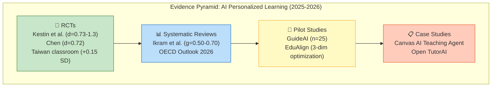

# Applications for Real-World Learning

## Overview

**Applications for real-world learning** encompasses the design and deployment of AI systems that help humans learn skills, concepts, and competencies applicable to real-life contexts — from professional training and scientific literacy to practical decision-making. Unlike traditional educational technology that delivers static content, modern AI learning systems adapt in real time to learner state, provide personalized scaffolding, and bridge the gap between theoretical knowledge and practical application. The convergence of large language models, biosensors, simulation environments, and adaptive curricula is creating a new generation of learning tools that function more like expert mentors than textbooks.

## Background / Theoretical Foundations

### The Transfer Problem

The central challenge in real-world learning is **transfer** — ensuring that knowledge acquired in one context (classroom, tutorial, online course) can be applied in different, often unpredictable real-world situations.[^1] Traditional education struggles with transfer because:

- **Context dependence**: Knowledge learned in one setting may not activate in another
- **Inert knowledge**: Students can recall facts on tests but fail to apply them in practice
- **Skill-knowledge gap**: Understanding a concept theoretically differs from applying it under pressure

AI-powered learning systems address transfer through **situated learning** — embedding instruction in realistic contexts, simulated environments, and practical tasks. This connects to [predictive simulation learning](../frontier-topics/predictive-simulation-learning.md), where AI models create environments for experiential learning.

### Adaptive Learning Theory

Effective real-world learning requires adaptation across multiple dimensions:

| Dimension | What Adapts | AI Mechanism |
|-----------|-------------|-------------|
| **Cognitive** | Difficulty, complexity | [Curriculum learning](curriculum-learning.md) algorithms |
| **Temporal** | Pace, spacing | Spaced repetition with memory models |
| **Affective** | Engagement, motivation | Biosensor feedback, sentiment analysis |
| **Social** | Collaboration, competition | [Multi-agent systems](../frontier-topics/multi-agent-systems.md) for peer learning |
| **Contextual** | Examples, analogies | Domain-specific [prompt engineering](prompt-engineering.md) |

## Technical Details / Key Systems

### GuideAI: Biosensor-Augmented Adaptive Learning (2026)

GuideAI represents a paradigm shift in AI tutoring — a context-aware, biosensor-augmented LLM framework that performs continuous learner-state inference and adaptive intervention at multiple temporal and cognitive scales.[^2]

Key innovations:
- **Physiological sensing**: Monitors heart rate variability, galvanic skin response, and eye tracking to infer cognitive load, frustration, and engagement in real time
- **Multi-scale adaptation**: Adjusts at three levels — micro (next sentence), meso (current topic), and macro (learning path)
- **Intervention timing**: Uses predictive models to intervene *before* the learner disengages, not after
- **Grounded explanations**: Integrates [retrieval-augmented generation](../core-concepts/retrieval-augmented-generation.md) to provide source-backed explanations

```svg
<svg viewBox="0 0 720 400" xmlns="http://www.w3.org/2000/svg" font-family="monospace" font-size="12">
  <text x="360" y="25" text-anchor="middle" font-size="15" font-weight="bold" fill="#1a1a2e">GuideAI: Adaptive Real-World Learning Pipeline</text>

  <!-- Learner -->
  <rect x="20" y="55" width="130" height="100" rx="10" fill="#E3F2FD" stroke="#1565C0" stroke-width="2"/>
  <text x="85" y="78" text-anchor="middle" font-size="11" font-weight="bold" fill="#1565C0">Learner</text>
  <text x="85" y="98" text-anchor="middle" font-size="9">Interactions</text>
  <text x="85" y="112" text-anchor="middle" font-size="9">Biosensor data</text>
  <text x="85" y="126" text-anchor="middle" font-size="9">Eye tracking</text>
  <text x="85" y="140" text-anchor="middle" font-size="9">Response patterns</text>

  <!-- Arrow -->
  <line x1="155" y1="105" x2="195" y2="105" stroke="#333" stroke-width="1.5"/>
  <polygon points="193,100 203,105 193,110" fill="#333"/>

  <!-- State Inference -->
  <rect x="205" y="45" width="150" height="120" rx="10" fill="#FFF3E0" stroke="#FF9800" stroke-width="2"/>
  <text x="280" y="68" text-anchor="middle" font-size="11" font-weight="bold" fill="#E65100">State Inference</text>
  <text x="280" y="88" text-anchor="middle" font-size="9">Cognitive load: 0.7</text>
  <text x="280" y="102" text-anchor="middle" font-size="9">Engagement: 0.4 ↓</text>
  <text x="280" y="116" text-anchor="middle" font-size="9">Frustration: 0.6 ↑</text>
  <text x="280" y="130" text-anchor="middle" font-size="9">Comprehension: 0.5</text>
  <text x="280" y="150" text-anchor="middle" font-size="8" fill="#E65100">⚠ Intervention needed</text>

  <!-- Arrow -->
  <line x1="360" y1="105" x2="400" y2="105" stroke="#333" stroke-width="1.5"/>
  <polygon points="398,100 408,105 398,110" fill="#333"/>

  <!-- Adaptive LLM -->
  <rect x="410" y="45" width="150" height="120" rx="10" fill="#E8F5E9" stroke="#2E7D32" stroke-width="2"/>
  <text x="485" y="68" text-anchor="middle" font-size="11" font-weight="bold" fill="#2E7D32">Adaptive LLM</text>
  <text x="485" y="88" text-anchor="middle" font-size="9">Simplify explanation</text>
  <text x="485" y="102" text-anchor="middle" font-size="9">Add concrete example</text>
  <text x="485" y="116" text-anchor="middle" font-size="9">Switch to analogy</text>
  <text x="485" y="130" text-anchor="middle" font-size="9">Offer encouragement</text>
  <text x="485" y="150" text-anchor="middle" font-size="8" fill="#2E7D32">Grounded in RAG sources</text>

  <!-- Arrow -->
  <line x1="565" y1="105" x2="605" y2="105" stroke="#333" stroke-width="1.5"/>
  <polygon points="603,100 613,105 603,110" fill="#333"/>

  <!-- Output -->
  <rect x="615" y="55" width="90" height="100" rx="10" fill="#F3E5F5" stroke="#7B1FA2" stroke-width="2"/>
  <text x="660" y="78" text-anchor="middle" font-size="11" font-weight="bold" fill="#7B1FA2">Response</text>
  <text x="660" y="98" text-anchor="middle" font-size="9">Adapted</text>
  <text x="660" y="112" text-anchor="middle" font-size="9">content +</text>
  <text x="660" y="126" text-anchor="middle" font-size="9">scaffolding</text>
  <text x="660" y="140" text-anchor="middle" font-size="9">+ sources</text>

  <!-- Feedback loop -->
  <path d="M 660 160 L 660 185 L 85 185 L 85 160" stroke="#7B1FA2" stroke-width="2" fill="none" stroke-dasharray="5,5"/>
  <polygon points="80,162 85,152 90,162" fill="#7B1FA2"/>
  <text x="370" y="200" text-anchor="middle" font-size="9" fill="#7B1FA2">Continuous feedback loop — learner state updates every interaction</text>

  <!-- Three scale boxes -->
  <rect x="20" y="220" width="220" height="70" rx="8" fill="#E0F7FA" stroke="#00838F" stroke-width="1.5"/>
  <text x="130" y="240" text-anchor="middle" font-size="10" font-weight="bold" fill="#00838F">Micro Scale</text>
  <text x="130" y="256" text-anchor="middle" font-size="9">Next sentence/response</text>
  <text x="130" y="270" text-anchor="middle" font-size="9">Adjust wording, add hints</text>
  <text x="130" y="284" text-anchor="middle" font-size="8" fill="#888">~seconds</text>

  <rect x="250" y="220" width="220" height="70" rx="8" fill="#FFF8E1" stroke="#F57F17" stroke-width="1.5"/>
  <text x="360" y="240" text-anchor="middle" font-size="10" font-weight="bold" fill="#F57F17">Meso Scale</text>
  <text x="360" y="256" text-anchor="middle" font-size="9">Current topic/concept</text>
  <text x="360" y="270" text-anchor="middle" font-size="9">Switch approach, add examples</text>
  <text x="360" y="284" text-anchor="middle" font-size="8" fill="#888">~minutes</text>

  <rect x="480" y="220" width="220" height="70" rx="8" fill="#FCE4EC" stroke="#C62828" stroke-width="1.5"/>
  <text x="590" y="240" text-anchor="middle" font-size="10" font-weight="bold" fill="#C62828">Macro Scale</text>
  <text x="590" y="256" text-anchor="middle" font-size="9">Learning path/curriculum</text>
  <text x="590" y="270" text-anchor="middle" font-size="9">Reorder topics, add remediation</text>
  <text x="590" y="284" text-anchor="middle" font-size="8" fill="#888">~hours/days</text>

  <!-- Application domains -->
  <rect x="20" y="305" width="680" height="80" rx="8" fill="#F1F8E9" stroke="#558B2F" stroke-width="1.5"/>
  <text x="360" y="327" text-anchor="middle" font-size="12" font-weight="bold" fill="#558B2F">Real-World Application Domains</text>
  <text x="150" y="350" text-anchor="middle" font-size="10">🏥 Medical training</text>
  <text x="310" y="350" text-anchor="middle" font-size="10">🔬 Scientific literacy</text>
  <text x="470" y="350" text-anchor="middle" font-size="10">💼 Professional skills</text>
  <text x="630" y="350" text-anchor="middle" font-size="10">🛒 E-commerce</text>
  <text x="150" y="370" text-anchor="middle" font-size="10">📊 Data analysis</text>
  <text x="310" y="370" text-anchor="middle" font-size="10">⚖️ Legal reasoning</text>
  <text x="470" y="370" text-anchor="middle" font-size="10">🔧 Engineering</text>
  <text x="630" y="370" text-anchor="middle" font-size="10">💻 Programming</text>
</svg>
```

### Open TutorAI: Open-Source Personalized Learning (2026)

Open TutorAI is an open-source platform that captures learner goals and preferences to configure a learner-specific AI assistant with both text-based and avatar-driven interfaces.[^3] Key features:

- **Goal elicitation**: Structured onboarding that identifies what the learner wants to achieve (pass an exam, build a project, understand a concept for work)
- **Multi-modal interaction**: Text chat, voice, and animated avatar interfaces — the avatar uses [VLM integration](vlm-integration.md) for visual explanations
- **Open-source architecture**: Enables educators and institutions to customize and extend the platform, connecting to [code generation](../tools-platforms/code-generation.md) for technical learning paths

### Pedagogically Controlled AI Tutoring

Curriculum-constrained AI tutoring combines a modular, semantically tagged knowledge base with engineered prompts for safe, personalized, curriculum-aligned tutoring — without custom model training.[^4] This approach:

- Prevents the AI from teaching content outside the approved curriculum
- Uses [prompt engineering](prompt-engineering.md) to enforce Socratic questioning rather than direct answers
- Maintains learner profiles that track mastery across curriculum standards
- Connects to [evaluation methodology](evaluation-methodology.md) for assessing learning outcomes

### Simulation-Based Experiential Learning

AI-powered simulations create environments where learners practice skills in realistic but safe contexts. This connects to several wiki topics:

- **[Predictive simulation learning](../frontier-topics/predictive-simulation-learning.md)**: World models that simulate domain environments for practice
- **Digital twins for training** (2026): AI-integrated digital twins enable learners to experiment with complex systems (factories, cities, ecosystems) without real-world consequences[^5]
- **[World models](world-models.md)**: Internal representations that enable AI to predict outcomes, giving learners a "what-if" sandbox

### E-Commerce Learning Applications

Real-world learning for e-commerce professionals involves AI systems that teach:

- **Product analysis**: Understanding market positioning through AI-powered competitive analysis — connecting to [AI e-commerce learning](../frontier-topics/ai-ecommerce-learning.md)
- **Customer behavior modeling**: Simulation environments where learners practice segmentation and targeting using [synthetic data generation](synthetic-data-generation.md)
- **Conversational commerce skills**: Training with AI customers that simulate different shopping intents, powered by [multi-agent systems](../frontier-topics/multi-agent-systems.md)

### Conversational AI Tutors: A Framework for the Next Generation (2026)

Vanacore et al. (2026) synthesize decades of human tutoring research, legacy intelligent tutoring system (ITS) lessons, and generative AI capabilities to propose a comprehensive framework for conversational AI tutors.[^6] The framework identifies three critical capabilities that current systems lack:

1. **Knowledge tracing with dialogue**: Maintaining a dynamic model of what the student knows based on conversational cues, not just quiz answers
2. **Socratic scaffolding**: Using questioning strategies that guide students to discover answers rather than providing them directly
3. **Dynamic content generation**: Creating explanations, examples, and analogies tailored to the individual learner's background and current understanding

The key insight: legacy ITS systems excelled at knowledge tracing but lacked natural language; LLMs excel at natural language but lack persistent student models. The next generation must combine both.

### LLM-Based Tutor Training via Preference Optimization (2025-2026)

Scarlatos et al. (2025) demonstrate that open-source LLMs can be trained as effective tutors using direct preference optimization (DPO) on tutoring dialogues.[^7] Their system:

- Trains Llama 3.1 8B on preference pairs where "good" responses use Socratic questioning and "bad" responses give away answers
- Produces tutor responses that **significantly increase correct student answers** compared to untrained models
- Matches GPT-4o teaching quality at a fraction of the inference cost, enabling deployment in resource-constrained educational settings

This connects to [domain specificity](domain-specificity.md) — the same DPO approach can be applied to train subject-specific tutors.

### EduAlign: Multi-Dimensional Pedagogical Fine-Tuning (2025)

Song et al. (2025) introduce EduAlign, a framework that optimizes LLM tutors along three orthogonal pedagogical dimensions simultaneously:[^8]

- **Helpfulness**: Does the response move the student toward understanding?
- **Personalization**: Does the response adapt to this specific student's level and learning style?
- **Creativity**: Does the response use novel analogies, examples, or explanations to engage the student?

Using 8,000 annotated educational interactions and reinforcement learning from human feedback, EduAlign demonstrates that optimizing all three dimensions jointly produces better learning outcomes than optimizing any single dimension alone.

### AI-Driven Personalized Learning for Medical Students (2025)

Chen (2025) conducted a prospective randomized controlled trial evaluating an AI-driven personalized learning platform (built on the Coze platform) for undergraduate clinical medicine students over 12 weeks.[^10] The platform integrated dynamic learning path optimization via reinforcement learning, emotional sentiment analysis with motivational feedback, intelligent resource recommendations via BERT models (drawing from a 2,800-case database), and clinical simulation with AI mentoring.

**Key results (n=40, experimental vs. control):**
- **Academic performance:** 84.47 ± 3.48 vs. 81.72 ± 4.37 (p=0.034, Cohen's d=0.72)
- **Weak-baseline students:** 3.6-point greater improvement in experimental group (p<0.001)
- **Daily study time:** +41.5% (49.25 vs. 34.80 min, p=0.048)
- **Classroom participation:** 16.05 vs. 7.40 questions per session (p=0.026, d=2.46)
- **Literature reading:** +48.3% (25.95 vs. 17.50 articles, p=0.008, d=1.14)
- **In-depth discussion:** 58% vs. 32% of interactions

The most striking finding is the equity effect: students with weak baseline performance showed disproportionately larger gains, suggesting AI personalization is most valuable for struggling learners. The behavioral changes (more study time, more participation, more reading) indicate the platform changed *how* students learned, not just *what* they scored.

**Learning application:** This RCT provides rigorous evidence that AI-driven personalization produces statistically significant improvements across cognitive, behavioral, and affective dimensions simultaneously. The combination of RL-optimized learning paths with sentiment-aware feedback connects [curriculum learning](curriculum-learning.md) (adaptive difficulty) with [predictive simulation learning](../frontier-topics/predictive-simulation-learning.md) (clinical simulation). The equity effect validates a core promise of AI tutoring: closing achievement gaps by providing personalized support that would be impossible for a single human instructor to deliver at scale.

### Deployed AI Tutors: Real Classroom Evidence (2026)

Chung et al. (2026) provide some of the strongest real-world evidence for AI tutoring effectiveness by deploying an LLM-based adaptive tutoring platform across ten Taiwan high schools.[^9] Key findings:

- **Adaptive sequencing**: The system uses reinforcement learning to determine which problem to present next, optimizing for long-term retention rather than immediate performance
- **Measurable impact**: Students using the AI tutor showed a **0.15 standard deviation improvement** on unassisted final exams — a meaningful effect size for an educational intervention
- **Equity effect**: The largest gains were among students who started with the lowest scores, suggesting AI tutoring can narrow achievement gaps

This represents a shift from lab-based evaluations to production deployments with rigorous experimental controls.

```svg
<svg viewBox="0 0 720 320" xmlns="http://www.w3.org/2000/svg" font-family="monospace" font-size="12">
  <text x="360" y="25" text-anchor="middle" font-size="15" font-weight="bold" fill="#1a1a2e">AI Tutoring Evidence Hierarchy (2024-2026)</text>

  <!-- Evidence pyramid -->
  <polygon points="360,50 560,280 160,280" fill="none" stroke="#333" stroke-width="2"/>

  <!-- Level 1: Lab studies -->
  <rect x="240" y="220" width="240" height="50" rx="6" fill="#FFF3E0" stroke="#FF9800" stroke-width="1.5"/>
  <text x="360" y="242" text-anchor="middle" font-size="10" font-weight="bold" fill="#E65100">Lab Studies (2024-2025)</text>
  <text x="360" y="258" text-anchor="middle" font-size="9">Controlled settings, volunteer participants</text>
  <text x="360" y="270" text-anchor="middle" font-size="8" fill="#888">GuideAI, Open TutorAI, curriculum-constrained tutor</text>

  <!-- Level 2: Classroom pilots -->
  <rect x="260" y="155" width="200" height="55" rx="6" fill="#E8F5E9" stroke="#2E7D32" stroke-width="1.5"/>
  <text x="360" y="175" text-anchor="middle" font-size="10" font-weight="bold" fill="#2E7D32">Classroom Pilots (2025-2026)</text>
  <text x="360" y="191" text-anchor="middle" font-size="9">Real schools, randomized control</text>
  <text x="360" y="203" text-anchor="middle" font-size="8" fill="#2E7D32">+0.15 SD on unassisted exams [9]</text>

  <!-- Level 3: Frameworks -->
  <rect x="290" y="90" width="140" height="55" rx="6" fill="#E3F2FD" stroke="#1565C0" stroke-width="1.5"/>
  <text x="360" y="110" text-anchor="middle" font-size="10" font-weight="bold" fill="#1565C0">Synthesis (2026)</text>
  <text x="360" y="126" text-anchor="middle" font-size="9">Frameworks unifying</text>
  <text x="360" y="138" text-anchor="middle" font-size="9">ITS + LLM capabilities [6]</text>

  <!-- Key insight -->
  <rect x="575" y="100" width="135" height="80" rx="8" fill="#F3E5F5" stroke="#7B1FA2" stroke-width="1.5"/>
  <text x="642" y="120" text-anchor="middle" font-size="10" font-weight="bold" fill="#7B1FA2">Key Trend</text>
  <text x="642" y="138" text-anchor="middle" font-size="9">Moving from</text>
  <text x="642" y="152" text-anchor="middle" font-size="9">"can AI teach?"</text>
  <text x="642" y="166" text-anchor="middle" font-size="9">to "how well?"</text>

  <!-- Arrow -->
  <line x1="560" y1="140" x2="578" y2="140" stroke="#7B1FA2" stroke-width="1.5"/>
  <polygon points="576,135 586,140 576,145" fill="#7B1FA2"/>

  <!-- Bottom context -->
  <text x="360" y="305" text-anchor="middle" font-size="10" fill="#666">Evidence quality increasing: lab demos (2024) -> classroom RCTs (2025-2026) -> longitudinal studies (emerging)</text>
</svg>
```

### AI Adaptive Learning Platforms: The 2026 Meta-Landscape

Multiple systematic reviews published in early 2026 converge on the state of AI-enabled adaptive learning platforms (ALPs):[^11]

**What works:**
- ALPs that dynamically adjust instructional content and pathways produce measurably better learning outcomes than static delivery
- Real-time analysis of learning behaviors enables precise resource recommendation and pathway optimization
- Platforms emphasizing real-world application (connecting abstract ideas with practical scenarios) show the strongest engagement and transfer
- Corporate training deployments report faster completion with superior mastery and better on-the-job application

**What doesn't (yet):**
- Clinical judgment and complex decision-making skills resist improvement from AI tutoring alone — foundational knowledge responds best
- 22% skill retention drop at follow-up in the Chen (2025) RCT suggests durability remains a challenge
- 15% of AI-generated path adjustments in the Coze platform were unexplainable, raising transparency concerns

**The OECD signal:** The 2026 Digital Education Outlook recommends moving beyond general-purpose AI tools toward **purpose-built educational AI** designed specifically to produce durable learning gains — not just repurposed chatbots with educational prompts.[^12]

```svg
<svg viewBox="0 0 720 340" xmlns="http://www.w3.org/2000/svg" font-family="system-ui, sans-serif">
  <text x="360" y="25" text-anchor="middle" font-size="15" font-weight="bold" fill="#1a1a2e">From Simulation to Real-World Skill: The AI Learning Pipeline</text>

  <!-- Stage 1: Simulation -->
  <rect x="20" y="50" width="160" height="120" rx="10" fill="#e3f2fd" stroke="#1565C0" stroke-width="2"/>
  <text x="100" y="75" text-anchor="middle" font-size="12" font-weight="bold" fill="#1565C0">1. Simulate</text>
  <text x="100" y="95" text-anchor="middle" font-size="9" fill="#333">World models predict</text>
  <text x="100" y="109" text-anchor="middle" font-size="9" fill="#333">outcomes before acting</text>
  <line x1="40" y1="125" x2="160" y2="125" stroke="#1565C0" stroke-width="0.5"/>
  <text x="100" y="142" text-anchor="middle" font-size="8" fill="#1565C0">Simia, AWM, Genie 3</text>
  <text x="100" y="158" text-anchor="middle" font-size="8" fill="#1565C0">SpatialEvo, DreamerV3</text>

  <!-- Arrow 1-2 -->
  <line x1="185" y1="110" x2="210" y2="110" stroke="#475569" stroke-width="2"/>
  <polygon points="208,105 218,110 208,115" fill="#475569"/>

  <!-- Stage 2: Recurse -->
  <rect x="220" y="50" width="160" height="120" rx="10" fill="#fff3e0" stroke="#FF9800" stroke-width="2"/>
  <text x="300" y="75" text-anchor="middle" font-size="12" font-weight="bold" fill="#E65100">2. Self-Improve</text>
  <text x="300" y="95" text-anchor="middle" font-size="9" fill="#333">Recursive refinement</text>
  <text x="300" y="109" text-anchor="middle" font-size="9" fill="#333">of skills &amp; strategies</text>
  <line x1="240" y1="125" x2="360" y2="125" stroke="#FF9800" stroke-width="0.5"/>
  <text x="300" y="142" text-anchor="middle" font-size="8" fill="#E65100">TRT, LADDER, SkillClaw</text>
  <text x="300" y="158" text-anchor="middle" font-size="8" fill="#E65100">HiLL, Skill0, GASP</text>

  <!-- Arrow 2-3 -->
  <line x1="385" y1="110" x2="410" y2="110" stroke="#475569" stroke-width="2"/>
  <polygon points="408,105 418,110 408,115" fill="#475569"/>

  <!-- Stage 3: Personalize -->
  <rect x="420" y="50" width="160" height="120" rx="10" fill="#e8f5e9" stroke="#2E7D32" stroke-width="2"/>
  <text x="500" y="75" text-anchor="middle" font-size="12" font-weight="bold" fill="#2E7D32">3. Personalize</text>
  <text x="500" y="95" text-anchor="middle" font-size="9" fill="#333">Adapt to individual</text>
  <text x="500" y="109" text-anchor="middle" font-size="9" fill="#333">learner needs</text>
  <line x1="440" y1="125" x2="560" y2="125" stroke="#2E7D32" stroke-width="0.5"/>
  <text x="500" y="142" text-anchor="middle" font-size="8" fill="#2E7D32">GuideAI, EduAlign</text>
  <text x="500" y="158" text-anchor="middle" font-size="8" fill="#2E7D32">Coze platform, SLOW</text>

  <!-- Arrow 3-4 -->
  <line x1="585" y1="110" x2="610" y2="110" stroke="#475569" stroke-width="2"/>
  <polygon points="608,105 618,110 608,115" fill="#475569"/>

  <!-- Stage 4: Apply -->
  <rect x="620" y="50" width="85" height="120" rx="10" fill="#fce4ec" stroke="#C62828" stroke-width="2"/>
  <text x="662" y="75" text-anchor="middle" font-size="12" font-weight="bold" fill="#C62828">4. Apply</text>
  <text x="662" y="95" text-anchor="middle" font-size="9" fill="#333">Real-world</text>
  <text x="662" y="109" text-anchor="middle" font-size="9" fill="#333">skill transfer</text>
  <line x1="632" y1="125" x2="692" y2="125" stroke="#C62828" stroke-width="0.5"/>
  <text x="662" y="142" text-anchor="middle" font-size="8" fill="#C62828">Medicine</text>
  <text x="662" y="158" text-anchor="middle" font-size="8" fill="#C62828">Commerce</text>

  <!-- Feedback loop -->
  <path d="M 662 175 L 662 200 Q 662 210 652 210 L 110 210 Q 100 210 100 200 L 100 175" stroke="#7B1FA2" stroke-width="1.5" fill="none" stroke-dasharray="5,3"/>
  <polygon points="95,177 100,167 105,177" fill="#7B1FA2"/>
  <text x="380" y="228" text-anchor="middle" font-size="9" fill="#7B1FA2">Performance data feeds back to improve simulation fidelity and self-improvement strategies</text>

  <!-- Evidence boxes -->
  <rect x="20" y="250" width="220" height="75" rx="8" fill="#f5f5f5" stroke="#999" stroke-width="1"/>
  <text x="130" y="270" text-anchor="middle" font-size="10" font-weight="bold" fill="#333">Evidence: RCTs</text>
  <text x="130" y="288" text-anchor="middle" font-size="9">Medical AI: d=0.72 (Chen 2025)</text>
  <text x="130" y="302" text-anchor="middle" font-size="9">Taiwan schools: +0.15 SD</text>
  <text x="130" y="316" text-anchor="middle" font-size="9">Equity: largest gains for weakest</text>

  <rect x="260" y="250" width="200" height="75" rx="8" fill="#f5f5f5" stroke="#999" stroke-width="1"/>
  <text x="360" y="270" text-anchor="middle" font-size="10" font-weight="bold" fill="#333">Challenge: Durability</text>
  <text x="360" y="288" text-anchor="middle" font-size="9">22% retention drop at follow-up</text>
  <text x="360" y="302" text-anchor="middle" font-size="9">OECD: 17% worse after removal</text>
  <text x="360" y="316" text-anchor="middle" font-size="9">Scaffolding withdrawal is key</text>

  <rect x="480" y="250" width="220" height="75" rx="8" fill="#f5f5f5" stroke="#999" stroke-width="1"/>
  <text x="590" y="270" text-anchor="middle" font-size="10" font-weight="bold" fill="#333">Frontier: Collective</text>
  <text x="590" y="288" text-anchor="middle" font-size="9">SkillClaw: cross-user evolution</text>
  <text x="590" y="302" text-anchor="middle" font-size="9">Simia: LLM-as-environment</text>
  <text x="590" y="316" text-anchor="middle" font-size="9">Ecosystem-level improvement</text>
</svg>
```

*Diagram: The AI learning pipeline proceeds from simulation (building predictive models) through recursive self-improvement (refining strategies) to personalization (adapting to individual learners) and finally real-world application — with performance data feeding back to improve every stage.*

## Current State / Latest Developments

### 2026 Landscape

The field is converging around several key trends:

1. **Biosensor integration**: Systems like GuideAI demonstrate that physiological data significantly improves adaptation quality — cognitive load detection enables preemptive intervention[^2]
2. **Open-source platforms**: Open TutorAI and similar projects democratize access to AI tutoring, enabling customization for specific curricula and domains[^3]
3. **Simulation-first pedagogy**: Digital twin environments (January 2026) enable four-stage learning: modeling → mirroring → intervening → autonomous management[^5]
4. **Hallucination safeguards**: All serious educational AI systems now integrate [hallucination detection](../core-concepts/hallucination-detection.md) to prevent teaching incorrect information
5. **Transfer measurement**: New evaluation frameworks specifically measure whether AI-assisted learning transfers to real-world performance, not just test scores
6. **Preference-optimized tutors**: DPO training on tutoring dialogues produces open-source models that match GPT-4o teaching quality, enabling scalable deployment[^7]
7. **Real classroom evidence**: Deployed AI tutors show measurable learning gains (+0.15 SD) in randomized controlled trials across multiple schools[^9]
8. **Multi-dimensional optimization**: Frameworks like EduAlign show that tutoring quality requires joint optimization of helpfulness, personalization, and creativity — not just factual accuracy[^8]
9. **LLM-as-environment**: Simia shows LLMs can replace bespoke training environments entirely, drastically lowering the cost of creating diverse practice simulations[^11]
10. **Collective skill evolution**: SkillClaw demonstrates that user-discovered improvements can propagate across an entire platform instantly, enabling ecosystem-level learning[^13]

### Key Metrics

| System | Year | Key Result |
|--------|------|-----------|
| GuideAI | 2026 | Real-time cognitive load inference enables preemptive scaffolding |
| Open TutorAI | 2026 | Open-source platform with text + avatar interfaces |
| Curriculum-Constrained Tutor | 2025 | Safe, aligned tutoring without custom training |
| Digital Twin Learning | 2026 | Four-stage framework from modeling to autonomous management |
| LLM Tutor (DPO) | 2025 | Open-source Llama 8B matches GPT-4o tutoring quality[^7] |
| Taiwan Classroom RCT | 2026 | +0.15 SD on unassisted exams across 10 high schools[^9] |
| EduAlign | 2025 | 3-dimension pedagogical optimization outperforms single-dimension[^8] |
| Ikram et al. Systematic Review | 2026 | g=0.50-0.70 effect sizes across 31 studies (PRISMA)[^14] |

### Systematic Review: AI for Personalized Learning (Ikram et al., Frontiers in Education, 2026)

Ikram et al. (2026) conducted a PRISMA-guided systematic review of 31 studies (2013-2025) on AI in personalized education, providing the most comprehensive meta-analysis of the field to date.[^14]

**Key findings:**
- **Medium to large positive effects** on learner cognitive outcomes (effect sizes g = 0.50 to 0.70)
- Improved vocabulary retention, syntax accuracy, and conceptual understanding across diverse subjects
- Enhanced student motivation and engagement compared to traditional instruction
- AI techniques covered include ML-based adaptive content sequencing, NLP-driven feedback generation, collaborative filtering recommenders, and generative AI for personalized content creation

**Critical gaps identified:**
- **Teacher readiness** is a major bottleneck: effectiveness depends heavily on pedagogical alignment and teacher digital competence
- **Ethical governance** remains underdeveloped: data privacy, algorithmic bias, and equitable access are persistent concerns
- **Methodological heterogeneity**: 45% qualitative, 42% quantitative, 13% mixed-methods -- making cross-study comparison difficult
- **Geographic concentration**: China (6 papers), India (4), USA (2) -- limited cross-cultural validation



**Learning application:** This systematic review provides the strongest aggregate evidence yet that AI-personalized learning produces real outcomes -- not just engagement metrics. The g = 0.50-0.70 effect sizes are educationally meaningful (comparable to moving from the 50th to the 69th-73rd percentile). However, the teacher readiness finding is critical: AI tools deployed without teacher buy-in and competence may fail to deliver these gains. Combined with the individual RCTs already tracked in this wiki (Kestin et al., Chen), the evidence base now spans multiple countries, subjects, and age groups -- strengthening the case for pedagogically designed AI learning systems while highlighting that implementation quality matters as much as technology capability.

## Limitations / Challenges

1. **Privacy concerns**: Biosensor data collection raises significant ethical questions about student surveillance and data ownership
2. **Digital divide**: Advanced AI tutoring systems require hardware and connectivity that many learners lack
3. **Assessment validity**: It remains difficult to measure whether AI-assisted learning truly transfers to real-world competence or just optimizes for measurable proxies
4. **Over-reliance**: Learners may become dependent on AI scaffolding and struggle without it — the "training wheels" problem
5. **Domain coverage**: Current systems work best for well-structured domains (STEM, programming) and struggle with ambiguous, creative, or deeply contextual fields
6. **Cultural adaptation**: Most AI tutoring systems are trained on English-language, Western educational norms and may not transfer well to other cultural contexts

## See Also / Connections

**Core Concepts:**
- [Hallucination Detection](../core-concepts/hallucination-detection.md) — ensuring AI tutors don't teach errors
- [Retrieval-Augmented Generation](../core-concepts/retrieval-augmented-generation.md) — grounding explanations in sources
- [Transfer Learning](../core-concepts/transfer-learning.md) — knowledge transfer between domains
- [Foundation Models for Research](../core-concepts/foundation-models-for-research.md) — base models powering learning systems

**Tools & Platforms:**
- [Code Generation](../tools-platforms/code-generation.md) — AI-assisted programming education
- [Aider](../tools-platforms/aider.md) — practical AI coding assistant for learning
- [HuggingFace Papers API](../tools-platforms/huggingface-papers-api.md) — tracking educational AI research

**Methodologies:**
- [Curriculum Learning](curriculum-learning.md) — progressive skill building
- [Prompt Engineering](prompt-engineering.md) — designing effective tutoring prompts
- [Evaluation Methodology](evaluation-methodology.md) — measuring learning outcomes
- [VLM Integration](vlm-integration.md) — visual explanations and avatar interfaces
- [Active Learning](active-learning.md) — query strategies for efficient learning

**Frontier Topics:**
- [Predictive Simulation Learning](../frontier-topics/predictive-simulation-learning.md) — simulation environments for practice
- [AI E-Commerce Learning](../frontier-topics/ai-ecommerce-learning.md) — commercial applications
- [Multi-Agent Systems](../frontier-topics/multi-agent-systems.md) — peer learning simulations
- [Recursive Self-Improvement](../frontier-topics/recursive-self-improvement.md) — self-improving tutoring systems
- [Cross-Cutting Connections](../frontier-topics/cross-cutting-connections.md) — integrating learning across domains

**Research Sources:**
- [Key Papers](../research-sources/key-papers.md) — foundational educational AI papers
- [Tracking AI Research](../research-sources/tracking-ai-research.md) — monitoring learning research

## References

[^1]: Bransford, J. D., Brown, A. L., & Cocking, R. R. (2000). *How People Learn: Brain, Mind, Experience, and School*. National Academy Press.

[^2]: Anonymous. (2026). "GuideAI: A Real-time Personalized Learning Solution with Adaptive Interventions." arXiv:2601.20402. https://arxiv.org/abs/2601.20402

[^3]: Anonymous. (2026). "Open TutorAI: An Open-source Platform for Personalized and Immersive Learning with Generative AI." arXiv:2602.07176. https://arxiv.org/abs/2602.07176

[^4]: Anonymous. (2025). "Pedagogically Controlled, Curriculum-Constrained AI Tutor for SE Education." arXiv:2512.11882. https://arxiv.org/abs/2512.11882

[^5]: Anonymous. (2026). "Digital Twin AI: Opportunities and Challenges from Large Language Models to World Models." arXiv:2601.01321. https://arxiv.org/abs/2601.01321

[^6]: Vanacore, K., Baker, R. S., Closser, A. H., & Roschelle, J. (2026). "The Path to Conversational AI Tutors." arXiv:2602.19303. https://arxiv.org/abs/2602.19303

[^7]: Scarlatos, A., Liu, N., Lee, J., Baraniuk, R., & Lan, A. (2025). "Training LLM-based Tutors to Improve Student Learning Outcomes in Dialogues." arXiv:2503.06424. https://arxiv.org/abs/2503.06424

[^8]: Song, S., Liu, W., Lu, Y., Zhang, R., Liu, T., et al. (2025). "Cultivating Helpful, Personalized, and Creative AI Tutors: EduAlign." arXiv:2507.20335. https://arxiv.org/abs/2507.20335

[^9]: Chung, A. T.-H., Zhang, B., Kung, L.-C., Bastani, H., & Bastani, O. (2026). "Effective Personalized AI Tutors via LLM-Guided Reinforcement Learning." SSRN 6423358. https://papers.ssrn.com/sol3/papers.cfm?abstract_id=6423358

[^10]: Chen, Y. (2025). "Evaluation of the impact of AI-driven personalized learning platform on medical students' learning performance." *Frontiers in Medicine*. [PMC12465117](https://pmc.ncbi.nlm.nih.gov/articles/PMC12465117/)

[^11]: Multiple systematic reviews (2026): Rasool, A. et al. "AI in personalized learning: A global systematic review." *ScienceDirect*; Shaik, T. et al. "AI-based personalised learning in education: A systematic literature review." *Discover AI*, Springer Nature; Zafari, M. et al. "AI-enabled adaptive learning platforms: A review." *ScienceDirect*.

[^12]: OECD (2026). *Digital Education Outlook 2026*. Organisation for Economic Co-operation and Development.

[^13]: Ma, Z. et al. (2026). "SkillClaw: Let Skills Evolve Collectively with Agentic Evolver." [arXiv:2604.08377](https://arxiv.org/abs/2604.08377)
[^14]: Ikram, M., Hanefar, S.B.M., Saleem, S.M.U. & Zulfiqar, F. (2026). "Artificial intelligence in education: a systematic review of personalized learning trends and future directions." *Frontiers in Education*, 11, 1782626. [DOI: 10.3389/feduc.2026.1782626](https://www.frontiersin.org/journals/education/articles/10.3389/feduc.2026.1782626/full)
