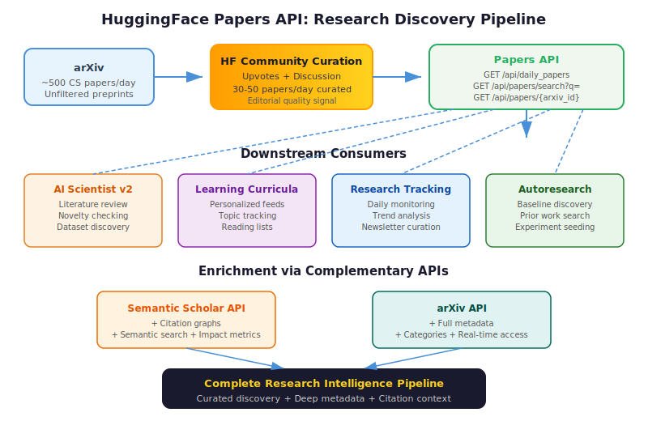

# Hugging Face Papers API

The **Hugging Face Papers API** provides free, public, no-authentication-required access to AI/ML research papers curated daily on [huggingface.co](https://huggingface.co). It powers the **Daily Papers** feature and serves as a programmatic gateway to track the latest AI research from arXiv.

**API Docs:** [github.com/0x0is1/hf-papers-api-docs](https://github.com/0x0is1/hf-papers-api-docs)
**Base URL:** `https://huggingface.co`

## Overview

The API provides three endpoints for discovering, searching, and retrieving AI research papers. All responses are JSON, may be CDN-cached, and require no API keys. It is used internally by HuggingFace's SvelteKit frontend and freely available for external consumption.

## Background / Theoretical Foundations

The challenge of research discovery — finding relevant papers among thousands published daily — has driven the development of programmatic research APIs. ArXiv, the primary preprint server for AI/ML, publishes ~500 papers per day in computer science alone [^1]. Without curation, researchers face information overload.

HuggingFace's Daily Papers feature addresses this through **community-driven curation**: researchers upvote and discuss papers on the platform, and an editorial process surfaces the most significant work each day [^2]. The Papers API exposes this curation layer programmatically, enabling automated research tracking pipelines.

The API fills a specific niche in the research tooling ecosystem:

- **ArXiv API**: Provides raw access to all preprints but no quality signal — you get everything, unfiltered [^1].
- **Semantic Scholar API**: Provides citation graphs and semantic search but lags real-time by days to weeks [^3]. See [Semantic Scholar API](../tools-platforms/semantic-scholar-api.md) for details.
- **HF Papers API**: Provides curated, same-day access to the most discussed papers with zero authentication overhead.

For AI learning research specifically, the API enables a key workflow: monitoring daily papers for new developments in [automated scientific discovery](../core-concepts/automated-scientific-discovery.md), [foundation models](../core-concepts/foundation-models-for-research.md), and related topics, then feeding those discoveries into knowledge bases like this wiki.

**Practical learning application**: Students and researchers can build personalized paper feeds using this API — filtering by topic, tracking citation patterns over time, and generating weekly reading lists. This transforms passive paper consumption into an active, structured learning process.



## Endpoints

### 1. Daily Papers Feed
```
GET /api/daily_papers
```
Returns a paginated list of papers curated for a specific date.

| Parameter | Type | Default | Description |
|-----------|------|---------|-------------|
| `date` | string (YYYY-MM-DD) | today | Date to fetch papers for |
| `page` | integer | 1 | Page number |
| `limit` | integer | ~10-20 | Results per page |

**Response:**
```json
{
  "date": "2026-04-06",
  "count": 42,
  "next": "/api/daily_papers?date=2026-04-06&page=2",
  "previous": null,
  "results": [
    {
      "arxiv_id": "2604.01234",
      "title": "Paper Title",
      "authors": ["Author One", "Author Two"],
      "summary": "Abstract text...",
      "published_date": "2026-04-05",
      "link": "https://arxiv.org/abs/2604.01234"
    }
  ]
}
```

### 2. Paper Search
```
GET /api/papers/search?q=<query>
```
Searches across titles, abstracts, and author names. Returns ~20-25 results.

| Parameter | Type | Required | Description |
|-----------|------|----------|-------------|
| `q` | string | Yes | Search query |

### 3. Single Paper Detail
```
GET /api/papers/{arxiv_id}
```
Returns enriched metadata for a single paper, including additional fields:
- `pdf_url` -- Direct link to PDF
- `doi` -- Digital Object Identifier
- `categories` -- arXiv categories (e.g., `["cs.CL", "cs.LG"]`)

## Use Cases for AI Learning Research

### Daily Monitoring
Poll `/api/daily_papers` daily to build a curated feed of new AI research. This is how research tracking tools and newsletters source their content.

### Topic Tracking
Use `/api/papers/search` to monitor specific areas:
- `q=automated+research` -- Track AI research automation
- `q=foundation+models` -- Track LLM developments
- `q=reinforcement+learning` -- Track RL advances

### Building Research Indexes
Combine with [Semantic Scholar API](../tools-platforms/semantic-scholar-api.md) to build rich citation graphs and research landscapes.

### Feeding AI Research Agents
Systems like [The AI Scientist](../core-concepts/the-ai-scientist.md) can use this API to discover new papers for literature review and novelty checking.

## Integration Example

```python
import requests
from datetime import date

# Get today's papers
response = requests.get("https://huggingface.co/api/daily_papers")
papers = response.json()["results"]

for paper in papers:
    print(f"[{paper['arxiv_id']}] {paper['title']}")
    print(f"  Authors: {', '.join(paper['authors'])}")
    print(f"  {paper['summary'][:200]}...")
    print()
```

## Companion Tools

- **[hf-papers-app](https://github.com/0x0is1/hf-papers-app)** -- User-facing application wrapping this API
- **OpenAPI spec** -- Available at `docs/api/openapi.yaml` in the docs repo for client generation

## Comparison with Other Research APIs

| Feature | HF Papers API | Semantic Scholar | arXiv API |
|---------|--------------|-----------------|-----------|
| Auth required | No | No (rate-limited) | No |
| Curated feed | Yes (daily) | No | No |
| Search | Basic keyword | Advanced semantic | Basic |
| Citation data | No | Yes (full graph) | No |
| Categories | Via arXiv ID | Yes | Yes |
| Real-time | ~daily | ~weekly lag | Real-time |

## Current State / Latest Developments (2025–2026)

The HuggingFace ecosystem has evolved rapidly, transforming the Papers API from a simple discovery tool into a central node in the AI research infrastructure:

- **Ecosystem analysis at scale**: Laufer et al. (NeurIPS 2025) analyzed 1.86 million models on HuggingFace Hub using an evolutionary biology lens, studying fine-tuning lineages as "family trees" and finding that models exhibit genetic family resemblance across traits[^6]. This analysis was enabled by the Papers API's discovery capabilities.

- **Data-centric open-source models**: HuggingFace's own SmolLM2 (Ben Allal et al., 2025) exemplifies the platform's philosophy — training compact LMs (135M–1.7B params) on ~11T tokens and releasing all code, data, and configs openly, with the accompanying paper surfaced through Daily Papers[^7].

- **License ecosystem challenges**: Jewitt et al. (2025) conducted the first end-to-end audit of licenses across 364K datasets, 1.6M models, and 140K GitHub projects linked through HuggingFace, finding that 35.5% of model-to-application transitions eliminate restrictive license clauses — a critical finding for research reproducibility[^8].

- **Agentic research integration**: The AI Scientist v2 (Lu et al., 2026) uses HuggingFace Hub programmatically in its template-free mode to discover datasets and related work, demonstrating the API's role in autonomous research pipelines[^9]. [Autoresearch](autoresearch.md)-style systems can use the search endpoint to identify baseline models before launching experiment loops.

- **Community-driven curation at scale**: By early 2026, HF Daily Papers curates 30–50 papers per day (up from ~15–20 in 2024), with community upvotes and discussion threads providing a quality signal that purely algorithmic recommendation systems lack[^2]. This human-in-the-loop curation makes the API particularly valuable for tracking fast-moving fields like [VLM integration](../methodologies/vlm-integration.md) and [recursive self-improvement](../frontier-topics/recursive-self-improvement.md).

- **AI for personalized learning**: Researchers are building adaptive paper recommendation systems on top of the HF Papers API, combining it with user reading history and [Semantic Scholar](semantic-scholar-api.md) citation data to generate personalized learning curricula[^10]. The "LLM Agents for Education" survey (Chu et al., 2025) identifies paper discovery APIs as a key infrastructure layer for AI-assisted education[^11].

- **E-commerce applications**: Product understanding models and recommendation system papers are increasingly published through HF Daily Papers, enabling discovery of [AI e-commerce learning](../frontier-topics/ai-ecommerce-learning.md) research including multimodal product search, visual catalog enrichment, and LLM-based pricing models[^12].

## Limitations / Challenges

- **Curation bias**: The Daily Papers feed reflects HuggingFace community interests, which skew toward NLP, generative AI, and open-source models. Papers in robotics, formal verification, or theoretical CS may be underrepresented.
- **No citation data**: Unlike Semantic Scholar, the API does not provide citation counts or citation graphs, limiting bibliometric analysis.
- **Rate limiting**: While no API key is required, aggressive polling may be throttled by CDN-level rate limits (undocumented).
- **Search limitations**: The search endpoint uses basic keyword matching rather than semantic search, so queries must be specific.
- **Recency bias**: The daily curation model inherently favors new papers over important older work, which can be problematic for comprehensive literature reviews.
- **License opacity**: As Jewitt et al. (2025) documented, license information flows imperfectly through the HF ecosystem — papers and models discovered through the API may have non-obvious licensing constraints[^8].

## See Also

- [Semantic Scholar API](../tools-platforms/semantic-scholar-api.md) — citation graph and semantic search complement to HF Papers
- [Tracking AI Research](../research-sources/tracking-ai-research.md) — broader strategies for monitoring research output
- [The AI Scientist](../core-concepts/the-ai-scientist.md) — AI research system that can use this API for literature discovery
- [Predictive Simulation Learning](../frontier-topics/predictive-simulation-learning.md) — frontier topic frequently surfaced in HF daily papers
- [Recursive Self-Improvement](../frontier-topics/recursive-self-improvement.md) — research direction tracked via this API
- [Template-Free Research](../methodologies/template-free-research.md) — template-free mode uses HuggingFace Hub for dataset discovery
- [Agentic Tree Search](../methodologies/agentic-tree-search.md) — experiment methodology that benefits from automated paper discovery
- [Autoresearch](autoresearch.md) — autonomous experiment loop using HF for baseline discovery
- [AI E-Commerce Learning](../frontier-topics/ai-ecommerce-learning.md) — e-commerce research tracked via Daily Papers
- [Scaling Laws for Research Automation](../frontier-topics/scaling-laws-research.md) — scaling papers frequently surfaced through HF
- [Foundation Models for Research](../core-concepts/foundation-models-for-research.md) — models discovered and shared via HF Hub
- [Automated Experiment Design](../methodologies/automated-experiment-design.md) — experiment design informed by paper discovery
- [Key Papers and References](../research-sources/key-papers.md) — curated key papers sourced from HF Daily Papers

## References

[^1]: ArXiv submission statistics. [arxiv.org/stats](https://arxiv.org/stats/monthly_submissions) — Over 20,000 CS papers per month as of 2025.

[^2]: Hugging Face Daily Papers. [huggingface.co/papers](https://huggingface.co/papers) — Community-curated daily research feed.

[^3]: Kinney, R. et al. (2023). "The Semantic Scholar Open Data Platform." [arXiv:2301.10140](https://arxiv.org/abs/2301.10140)

[^4]: HF Papers API Documentation. [github.com/0x0is1/hf-papers-api-docs](https://github.com/0x0is1/hf-papers-api-docs)

[^5]: Wolf, T. et al. (2020). "Transformers: State-of-the-Art Natural Language Processing." [arXiv:1910.03771](https://arxiv.org/abs/1910.03771) — HuggingFace platform foundation.

[^6]: Laufer, B., Oderinwale, H. & Kleinberg, J. (2025). "Anatomy of a Machine Learning Ecosystem: 2 Million Models on Hugging Face." NeurIPS 2025. [arXiv:2508.06811](https://arxiv.org/abs/2508.06811)

[^7]: Ben Allal, L., Lozhkov, A. et al. (2025). "SmolLM2: When Smol Goes Big — Data-Centric Training of a Small Language Model." [arXiv:2502.02737](https://arxiv.org/abs/2502.02737)

[^8]: Jewitt, J. et al. (2025). "From Hugging Face to GitHub: Tracing License Drift in the Open-Source AI Ecosystem." [arXiv:2509.09873](https://arxiv.org/abs/2509.09873)

[^9]: Lu, C. et al. (2026). "Towards end-to-end automation of AI research." *Nature*, 651(8107).

[^10]: Chen, Z. et al. (2025). "Agentic AI for Scientific Discovery: A Survey of Progress, Challenges, and Future Directions." [arXiv:2503.08979](https://arxiv.org/abs/2503.08979)

[^11]: Chu, Z. et al. (2025). "LLM Agents for Education: Advances and Applications." [arXiv:2503.11733](https://arxiv.org/abs/2503.11733)

[^12]: Wang, H. et al. (2025). "LLP: LLM-based Product Pricing in E-commerce." [arXiv:2510.09347](https://arxiv.org/abs/2510.09347)
